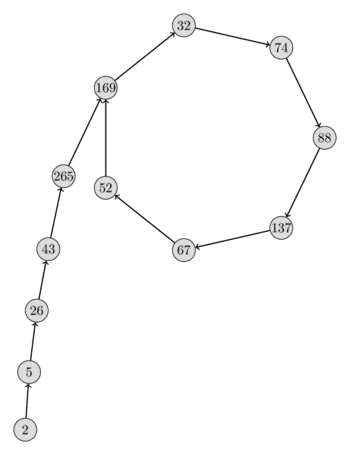

# Butun sonlarni faktorizatsiya qilish

Ushbu maqolada butun sonlarni faktorizatsiya qilishning bir nechta algoritmlari keltiriladi; ularning har biri kirishga qarab tez yoki turli darajada sekin ishlashi mumkin.
Faktorizatsiya qilmoqchi bo‘lgan son aslida tub bo‘lsa, algoritmlarning aksariyati juda sekin ishlashiga e’tibor bering. Bu ayniqsa Fermat, Pollardning $p-1$ va Pollardning rho faktorizatsiya algoritmlariga tegishli.
Shuning uchun sonni faktorizatsiya qilishga urinishdan oldin ehtimollik (yoki tez deterministik) [tub sonlik testi](primality_tests.md) ni bajarish maqsadga muvofiq.

## Sinov tariqasida bo‘lish

Bu tub ko‘paytuvchilarga ajratishni topishning eng sodda algoritmidir.
Biz har bir mumkin bo‘lgan $d$ bo‘luvchiga bo‘lib ko‘ramiz.
Murakkab $n$ sonining barcha tub ko‘paytuvchilari $\sqrt{n}$ dan katta bo‘lishi mumkin emasligini kuzatish mumkin.
Shuning uchun faqat $2 \le d \le \sqrt{n}$ bo‘luvchilarini tekshirish kifoya; bu faktorizatsiyani $O(\sqrt{n})$ vaqtda beradi.
(Bu [psevdo-polinomial vaqt](https://en.wikipedia.org/wiki/Pseudo-polynomial_time), ya’ni kirish qiymatiga nisbatan polinomial, ammo kirishdagi bitlar soniga nisbatan eksponensial vaqt.)
Eng kichik bo‘luvchi tub son bo‘lishi shart.
Topilgan ko‘paytuvchini sondan ajratamiz va jarayonni davom ettiramiz.
Agar $[2; \sqrt{n}]$ oraliqda hech qanday bo‘luvchi topa olmasak, sonning o‘zi tub bo‘lishi kerak.

```{.cpp file=factorization_trial_division1}
vector<long long> trial_division1(long long n) {
    vector<long long> factorization;
    for (long long d = 2; d * d <= n; d++) {
        while (n % d == 0) {
            factorization.push_back(d);
            n /= d;
        }
    }
    if (n > 1)
        factorization.push_back(n);
    return factorization;
}
```

### G‘ildirak faktorizatsiyasi

Bu sinov tariqasida bo‘lish usulining optimallashtirilgan ko‘rinishi.
Son 2 ga bo‘linmasligini bilganimizdan keyin boshqa juft sonlarni tekshirish shart emas.
Shunda tekshiriladigan sonlarning faqat $50\%$ qismi qoladi.
2 ko‘paytuvchini ajratib, toq son olganimizdan so‘ng 3 dan boshlash va faqat boshqa toq sonlarni sanash mumkin.

```{.cpp file=factorization_trial_division2}
vector<long long> trial_division2(long long n) {
    vector<long long> factorization;
    while (n % 2 == 0) {
        factorization.push_back(2);
        n /= 2;
    }
    for (long long d = 3; d * d <= n; d += 2) {
        while (n % d == 0) {
            factorization.push_back(d);
            n /= d;
        }
    }
    if (n > 1)
        factorization.push_back(n);
    return factorization;
}
```

Bu usulni yanada kengaytirish mumkin.
Agar son 3 ga bo‘linmasa, keyingi hisoblashlarda 3 ning barcha boshqa karralilarini ham e’tiborsiz qoldirish mumkin.
Demak, faqat $5, 7, 11, 13, 17, 19, 23, \dots$ sonlarini tekshirish kerak.
Qolgan sonlarda muayyan naqsh borligini ko‘rish mumkin.
$d \bmod 6 = 1$ va $d \bmod 6 = 5$ bo‘lgan barcha sonlarni tekshirish kerak.
Shunda sonlarning atigi $33.3\%$ qismi tekshiriladi.
Buni avval 2 va 3 tub ko‘paytuvchilarini ajratib, so‘ng 5 dan boshlash va $6$ modul bo‘yicha faqat $1$ hamda $5$ qoldiqlarini sanash orqali implementatsiya qilish mumkin.
Quyida 2, 3 va 5 tub sonlari hisobga olingan implementatsiya keltirilgan.
O‘tkazib yuborish qadamlarini massivda saqlash qulay.

```{.cpp file=factorization_trial_division3}
vector<long long> trial_division3(long long n) {
    vector<long long> factorization;
    for (int d : {2, 3, 5}) {
        while (n % d == 0) {
            factorization.push_back(d);
            n /= d;
        }
    }
    static array<int, 8> increments = {4, 2, 4, 2, 4, 6, 2, 6};
    int i = 0;
    for (long long d = 7; d * d <= n; d += increments[i++]) {
        while (n % d == 0) {
            factorization.push_back(d);
            n /= d;
        }
        if (i == 8)
            i = 0;
    }
    if (n > 1)
        factorization.push_back(n);
    return factorization;
}
```

Usulni yanada ko‘proq tub sonlarni qamrab oladigan qilib kengaytirsak, tekshiriladigan sonlar ulushi yanada kamayadi, ammo o‘tkazib yuborish ro‘yxatlari kattalashadi.

### Avvaldan hisoblangan tub sonlar

G‘ildirak faktorizatsiyasi usulini cheksiz kengaytirsak, tekshirish uchun faqat tub sonlar qoladi.
Buning yaxshi usuli — [Eratosfen elagi](sieve-of-eratosthenes.md) yordamida $\sqrt{n}$ gacha bo‘lgan barcha tub sonlarni avvaldan hisoblab, ularning har birini alohida tekshirish.

```{.cpp file=factorization_trial_division4}
vector<long long> primes;
vector<long long> trial_division4(long long n) {
    vector<long long> factorization;
    for (long long d : primes) {
        if (d * d > n)
            break;
        while (n % d == 0) {
            factorization.push_back(d);
            n /= d;
        }
    }
    if (n > 1)
        factorization.push_back(n);
    return factorization;
}
```

## Fermat faktorizatsiya usuli

Toq murakkab $n = p \cdot q$ sonini ikki kvadrat ayirmasi $n = a^2 - b^2$ ko‘rinishida yozish mumkin:

$$n = \left(\frac{p + q}{2}\right)^2 - \left(\frac{p - q}{2}\right)^2$$

Fermat faktorizatsiya usuli birinchi $a^2$ kvadratni taxmin qilib, qolgan $b^2 = a^2 - n$ qism ham kvadrat son ekanini tekshirish orqali bu faktdan foydalanishga urinadi.
Agar u kvadrat bo‘lsa, $n$ ning $a-b$ va $a+b$ ko‘paytuvchilarini topgan bo‘lamiz.

```cpp
int fermat(int n) {
    int a = ceil(sqrt(n));
    int b2 = a*a - n;
    int b = round(sqrt(b2));
    while (b * b != b2) {
        a = a + 1;
        b2 = a*a - n;
        b = round(sqrt(b2));
    }
    return a - b;
}
```

Agar $p$ va $q$ ko‘paytuvchilari orasidagi farq kichik bo‘lsa, bu faktorizatsiya usuli juda tez ishlashi mumkin.
Algoritm $O(|p-q|)$ vaqtda ishlaydi.
Ammo amalda bu usul kamdan-kam qo‘llanadi. Ko‘paytuvchilar bir-biridan uzoqlashgan sari u nihoyatda sekinlashadi.
Shunga qaramay, bu yondashuvni optimallashtirishning ko‘plab usullari mavjud.
$a^2$ kvadratlarni kichik o‘zgarmas son modul bo‘yicha ko‘rib, ayrim $a$ qiymatlarini tekshirish shart emasligini aniqlash mumkin, chunki ular $a^2-n$ ning kvadrat son bo‘lishiga olib kela olmaydi.

## Pollardning $p - 1$ usuli { data-toc-label="Pollardning <script type='math/tex'>p - 1</script> usuli" }

$n$ sonida kamida bitta shunday $p$ tub ko‘paytuvchi bo‘lish ehtimoli yuqoriki, kichik $\mathrm{B}$ uchun $p-1$ soni $\mathrm{B}$-**daraja-silliq** bo‘ladi. Agar $m$ ni bo‘ladigan har bir tub son darajasi $\mathrm{B}$ dan oshmasa, $m$ butun soni $\mathrm{B}$-daraja-silliq deyiladi. Rasmiy ravishda, $\mathrm{B} \geqslant 1$ va $m$ ixtiyoriy musbat butun son bo‘lsin. $m$ ning tub ko‘paytuvchilarga ajratilishi $m = \prod {q_i}^{e_i}$ bo‘lsin, bunda har bir $q_i$ tub va $e_i \geqslant 1$.
U holda barcha $i$ uchun ${q_i}^{e_i} \leqslant \mathrm{B}$ bo‘lsa, $m$ soni $\mathrm{B}$-daraja-silliq deyiladi.
Masalan, $4817191$ ning tub ko‘paytuvchilarga ajratilishi $1303 \cdot 3697$.
$1303-1$ va $3697-1$ qiymatlari mos ravishda $31$-daraja-silliq va $16$-daraja-silliq, chunki $1303 - 1 = 2 \cdot 3 \cdot 7 \cdot 31$ va $3697 - 1 = 2^4 \cdot 3 \cdot 7 \cdot 11$.
1974-yilda John Pollard murakkab sondan $p-1$ soni $\mathrm{B}$-daraja-silliq bo‘lgan $p$ ko‘paytuvchilarni ajratish usulini ixtiro qilgan.
G‘oya [Fermatning kichik teoremasi](phi-function.md#application) dan kelib chiqadi.
$n$ ning faktorizatsiyasi $n = p \cdot q$ bo‘lsin.
Teoremaga ko‘ra, agar $a$ soni $p$ bilan o‘zaro tub bo‘lsa, quyidagi tasdiq o‘rinli:

$$a^{p - 1} \equiv 1 \pmod{p}$$

Bu shuni ham anglatadiki,

$${\left(a^{(p - 1)}\right)}^k \equiv a^{k \cdot (p - 1)} \equiv 1 \pmod{p}.$$

Demak, $p-1 ~|~ M$ bo‘lgan istalgan $M$ uchun $a^M \equiv 1$ ekanini bilamiz.
Bu $a^M - 1 = p \cdot r$ ekanini va natijada $p ~|~ \gcd(a^M - 1, n)$ bo‘lishini anglatadi.
Shuning uchun, agar $n$ ning biror $p$ ko‘paytuvchisi uchun $p-1$ soni $M$ ni bo‘lsa, [Evklid algoritmi](euclid-algorithm.md) yordamida ko‘paytuvchini ajratib olish mumkin.

Har bir $\mathrm{B}$-daraja-silliq songa karrali eng kichik $M$ soni $\text{lcm}(1,~2~,3~,4~,~\dots,~B)$ ekanligi ravshan.
Yoki boshqacha:

$$M = \prod_{\text{prime } q \le B} q^{\lfloor \log_q B \rfloor}$$

Agar $n$ ning barcha $p$ tub ko‘paytuvchilari uchun $p-1$ soni $M$ ni bo‘lsa, $\gcd(a^M - 1, n)$ shunchaki $n$ ga teng bo‘lishiga e’tibor bering.
Bu holatda ko‘paytuvchi olmaymiz.
Shu sababli $M$ ni hisoblash davomida $\gcd$ ni bir necha marta bajarishga harakat qilamiz.
Ayrim murakkab sonlarda kichik $\mathrm{B}$ uchun $p-1$ soni $\mathrm{B}$-daraja-silliq bo‘lgan $p$ ko‘paytuvchi yo‘q.
Masalan, $100~000~000~000~000~493 = 763~013 \cdot 131~059~365~961$ murakkab soni uchun $p-1$ qiymatlari mos ravishda $190~753$-daraja-silliq va $1~092~161~383$-daraja-silliq.
Bu sonni faktorizatsiya qilish uchun $B \geq 190~753$ tanlashimiz kerak.

Quyidagi implementatsiyada $\mathrm{B} = 10$ dan boshlaymiz va har bir iteratsiyadan so‘ng $\mathrm{B}$ ni oshiramiz.

```{.cpp file=factorization_p_minus_1}
long long pollards_p_minus_1(long long n) {
    int B = 10;
    long long g = 1;
    while (B <= 1000000 && g < n) {
        long long a = 2 + rand() %  (n - 3);
        g = gcd(a, n);
        if (g > 1)
            return g;

        // compute a^M
        for (int p : primes) {
            if (p >= B)
                continue;
            long long p_power = 1;
            while (p_power * p <= B)
                p_power *= p;
            a = power(a, p_power, n);
            g = gcd(a - 1, n);
            if (g > 1 && g < n)
                return g;
        }
        B *= 2;
    }
    return 1;
}

```

Bu ehtimollik algoritmi ekanini kuzating.
Buning oqibati shuki, algoritm umuman ko‘paytuvchi topa olmasligi ham mumkin.

Har bir iteratsiyaning murakkabligi $O(B \log B \log^2 n)$.

## Pollardning rho algoritmi

Pollardning rho algoritmi — John Pollardning yana bir faktorizatsiya algoritmi.

Sonning tub ko‘paytuvchilarga ajratilishi $n = p q$ bo‘lsin.
Algoritm $\{x_i\} = \{x_0,~f(x_0),~f(f(x_0)),~\dots\}$ psevdo-tasodifiy ketma-ketlikni ko‘rib chiqadi, bunda $f$ polinom funksiya; odatda $c = 1$ bilan $f(x) = (x^2 + c) \bmod n$ tanlanadi.
Bu yerda biz $\{x_i\}$ ketma-ketligining o‘zi bilan qiziqmaymiz.
Bizni ko‘proq $\{x_i \bmod p\}$ ketma-ketligi qiziqtiradi.
$f$ polinom funksiya va barcha qiymatlar $[0;~p)$ oraliqda bo‘lgani sababli, bu ketma-ketlik oxir-oqibat siklga kiradi.
**Tug‘ilgan kun paradoksi** takrorlanish boshlanguncha kutiladigan elementlar soni $O(\sqrt{p})$ ekanini ko‘rsatadi.
Agar $p$ soni $\sqrt{n}$ dan kichik bo‘lsa, takrorlanish ehtimol $O(\sqrt[4]{n})$ ichida boshlanadi.
Quyida $n = 2206637$, $p = 317$, $x_0 = 2$ va $f(x) = x^2 + 1$ bo‘lgan $\{x_i \bmod p\}$ ketma-ketlik tasvirlangan.
Ketma-ketlik shaklidan algoritm nega Pollardning $\rho$ algoritmi deb atalishini juda aniq ko‘rish mumkin.

<div style="text-align: center;">
  
</div>

Biroq hali bir ochiq savol qoladi.
$p$ sonining o‘zini bilmasdan turib $\{x_i \bmod p\}$ ketma-ketligi xossalaridan qanday foydalanish mumkin?
Aslida bu juda oson.
$\{x_i \bmod p\}_{i \le j}$ ketma-ketlikda sikl bo‘lishi faqat va faqat $x_s \equiv x_t \bmod p$ bo‘lgan ikkita $s,t \le j$ indeks mavjud bo‘lganda yuz beradi.
Bu tenglamani $x_s - x_t \equiv 0 \bmod p$ ko‘rinishida yozish mumkin; bu esa $p ~|~ \gcd(x_s - x_t, n)$ bilan bir xil.
Demak, $g = \gcd(x_s - x_t, n) > 1$ bo‘lgan ikkita $s$ va $t$ indeksini topsak, siklni ham, $n$ ning $g$ ko‘paytuvchisini ham topgan bo‘lamiz.
$g = n$ bo‘lishi ham mumkin.
Bu holatda xos ko‘paytuvchi topmaganmiz, shuning uchun algoritmni boshqa parametrlar bilan (boshqa $x_0$ boshlang‘ich qiymati, $f$ polinomdagi boshqa $c$ o‘zgarmasi) takrorlash kerak.

Siklni topish uchun istalgan odatiy sikl aniqlash algoritmidan foydalanish mumkin.

### Floydning sikl topish algoritmi

Bu algoritm ketma-ketlik bo‘ylab turli tezliklarda harakatlanadigan ikkita ko‘rsatkich yordamida siklni topadi.
Har bir iteratsiyada birinchi ko‘rsatkich bir element oldinga, ikkinchi ko‘rsatkich esa ikki element oldinga siljiydi.
Bu g‘oyadan sikl mavjud bo‘lsa, bir payt ikkinchi ko‘rsatkich aylanib kelib, birinchi ko‘rsatkich bilan uchrashishini oson ko‘rish mumkin.
Agar sikl uzunligi $\lambda$, sikl boshlanadigan birinchi indeks esa $\mu$ bo‘lsa, algoritm $O(\lambda + \mu)$ vaqtda ishlaydi.
Bu algoritm toshbaqa (sekin ko‘rsatkich) va quyon (tez ko‘rsatkich) poygasi haqidagi ertakka asoslanib, [Toshbaqa va quyon algoritmi](../others/tortoise_and_hare.md) nomi bilan ham tanilgan.
Aslida bu algoritm yordamida $\lambda$ va $\mu$ parametrlarini ham ($O(\lambda + \mu)$ vaqt va $O(1)$ xotirada) aniqlash mumkin.
Sikl aniqlanganda algoritm `True` qaytaradi.
Agar ketma-ketlikda sikl bo‘lmasa, funksiya cheksiz ishlaydi.
Biroq Pollardning rho algoritmida buning oldini olish mumkin.

```text
function floyd(f, x0):
    tortoise = x0
    hare = f(x0)
    while tortoise != hare:
        tortoise = f(tortoise)
        hare = f(f(hare))
    return true
```

### Implementatsiya

Avval **Floydning sikl topish algoritmi** dan foydalanadigan implementatsiyani keltiramiz.
Algoritm odatda $O(\sqrt[4]{n} \log(n))$ vaqtda ishlaydi.

```{.cpp file=pollard_rho}
long long mult(long long a, long long b, long long mod) {
    return (__int128)a * b % mod;
}

long long f(long long x, long long c, long long mod) {
    return (mult(x, x, mod) + c) % mod;
}
long long rho(long long n, long long x0=2, long long c=1) {
    long long x = x0;
    long long y = x0;
    long long g = 1;
    while (g == 1) {
        x = f(x, c, n);
        y = f(y, c, n);
        y = f(y, c, n);
        g = gcd(abs(x - y), n);
    }
    return g;
}
```

Quyidagi jadval $n = 2206637$, $x_0 = 2$ va $c = 1$ uchun algoritm davomida $x$ va $y$ qiymatlarini ko‘rsatadi.

$$
\newcommand\T{\Rule{0pt}{1em}{.3em}}
\begin{array}{|l|l|l|l|l|l|}
\hline
i & x_i \bmod n & x_{2i} \bmod n & x_i \bmod 317 & x_{2i} \bmod 317 & \gcd(x_i - x_{2i}, n) \\
\hline
0   & 2       & 2       & 2       & 2       & -   \\
1   & 5       & 26      & 5       & 26      & 1   \\
2   & 26      & 458330  & 26      & 265     & 1   \\
3   & 677     & 1671573 & 43      & 32      & 1   \\
4   & 458330  & 641379  & 265     & 88      & 1   \\
5   & 1166412 & 351937  & 169     & 67      & 1   \\
6   & 1671573 & 1264682 & 32      & 169     & 1   \\
7   & 2193080 & 2088470 & 74      & 74      & 317 \\
\hline
\end{array}$$

Implementatsiyadagi `mult` funksiyasi GCC ning 128-bitli `__int128` butun turidan foydalanib, $\le 10^{18}$ bo‘lgan ikkita butun sonni toshib ketmasdan ko‘paytiradi.
Agar GCC mavjud bo‘lmasa, [ikkilik darajaga oshirish](binary-exp.md) dagiga o‘xshash g‘oyadan foydalanish mumkin.

```{.cpp file=pollard_rho_mult2}
long long mult(long long a, long long b, long long mod) {
    long long result = 0;
    while (b) {
        if (b & 1)
            result = (result + a) % mod;
        a = (a + a) % mod;
        b >>= 1;
    }
    return result;
}
```

Muqobil ravishda [Montgomery ko‘paytirishi](montgomery_multiplication.md) ni ham implementatsiya qilish mumkin.
Avval aytilganidek, agar $n$ murakkab bo‘lsa va algoritm ko‘paytuvchi sifatida $n$ ning o‘zini qaytarsa, jarayonni boshqa $x_0$ va $c$ parametrlari bilan takrorlash kerak.
Masalan, $x_0 = c = 1$ tanlovi $25 = 5 \cdot 5$ ni faktorizatsiya qilmaydi.
Algoritm $25$ ni qaytaradi.
Ammo $x_0 = 1$, $c = 2$ tanlovi uni faktorizatsiya qiladi.

### Brent algoritmi

Brent ham Floydga o‘xshash, ikkita ko‘rsatkichli usulni qo‘llaydi.
Farqi shundaki, ko‘rsatkichlar mos ravishda bir va ikki o‘rin emas, 2 ning darajalari miqdorida siljitiladi.
$2^i$ qiymati $\lambda$ va $\mu$ dan katta bo‘lishi bilan siklni topamiz.

```text
function floyd(f, x0):
    tortoise = x0
    hare = f(x0)
    l = 1
    while tortoise != hare:
        tortoise = hare
        repeat l times:
            hare = f(hare)
            if tortoise == hare:
                return true
        l *= 2
    return true
```

Brent algoritmi ham chiziqli vaqtda ishlaydi, ammo odatda Floyd algoritmidan tezroq, chunki $f$ funksiyasini kamroq hisoblaydi.

### Implementatsiya

Brent algoritmining to‘g‘ridan-to‘g‘ri implementatsiyasini $k < \frac{3 \cdot l}{2}$ bo‘lganda $x_l - x_k$ hadlarini tashlab yuborish orqali tezlashtirish mumkin.
Bundan tashqari, har qadamda $\gcd$ hisoblash o‘rniga hadlarni ko‘paytiramiz, $\gcd$ ni faqat bir necha qadamda bir marta tekshiramiz va chegaradan o‘tib ketgan bo‘lsak, orqaga qaytamiz.

```{.cpp file=pollard_rho_brent}
long long brent(long long n, long long x0=2, long long c=1) {
    long long x = x0;
    long long g = 1;
    long long q = 1;
    long long xs, y;
    int m = 128;
    int l = 1;
    while (g == 1) {
        y = x;
        for (int i = 1; i < l; i++)
            x = f(x, c, n);
        int k = 0;
        while (k < l && g == 1) {
            xs = x;
            for (int i = 0; i < m && i < l - k; i++) {
                x = f(x, c, n);
                q = mult(q, abs(y - x), n);
            }
            g = gcd(q, n);
            k += m;
        }
        l *= 2;
    }
    if (g == n) {
        do {
            xs = f(xs, c, n);
            g = gcd(abs(xs - y), n);
        } while (g == 1);
    }
    return g;
}
```

Kichik tub sonlar bilan sinov tariqasida bo‘lish va Pollard rho algoritmining Brent ko‘rinishini birlashtirish juda kuchli faktorizatsiya algoritmini beradi.

## Mashq masalalari

- [SPOJ — FACT0](https://www.spoj.com/problems/FACT0/)
- [SPOJ — FACT1](https://www.spoj.com/problems/FACT1/)
- [SPOJ — FACT2](https://www.spoj.com/problems/FACT2/)
- [GCPC 15 — Bo‘lishlar](https://codeforces.com/gym/100753)
