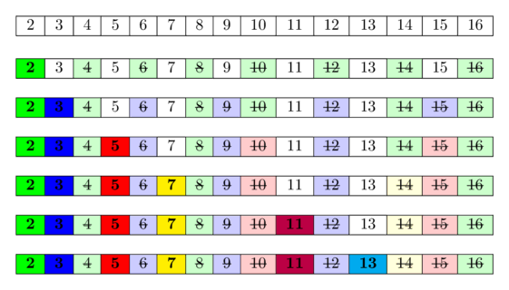

# Eratosfen elagi

Eratosfen elagi — $[1;n]$ kesmadagi barcha tub sonlarni $O(n \log \log n)$ amal yordamida topish algoritmi.
Algoritm juda sodda:
avval 2 dan $n$ gacha bo‘lgan barcha sonlarni yozib chiqamiz.
2 ning barcha xos karralilarini (2 eng kichik tub son bo‘lgani uchun) murakkab deb belgilaymiz.
$x$ sonining xos karralisi — $x$ dan katta va $x$ ga bo‘linadigan son.
So‘ng murakkab deb belgilanmagan navbatdagi sonni topamiz; bu holatda u 3.
Demak, 3 tub son va biz 3 ning barcha xos karralilarini murakkab deb belgilaymiz.
Navbatdagi belgilanmagan son 5 bo‘lib, u keyingi tub son; uning ham barcha xos karralilarini belgilaymiz.
Qatordagi barcha sonlarga ishlov berilguncha shu jarayonni davom ettiramiz.
Quyidagi rasmda $[1; 16]$ oraliqdagi barcha tub sonlarni hisoblash algoritmi tasvirlangan. Undan ayrim sonlarni murakkab deb bir necha marta belgilashimizni ko‘rish mumkin.

<div style="text-align: center;">
  
</div>

Algoritmning asosiy g‘oyasi quyidagicha:
agar son kichikroq tub sonlarning hech biriga bo‘linmasa, u tub bo‘ladi.
Tub sonlarni o‘sish tartibida ko‘rib chiqayotganimiz sababli, kamida bitta tub songa bo‘linadigan barcha sonlarni avvalroq murakkab deb belgilagan bo‘lamiz.
Demak, biror katakka kelganimizda u belgilanmagan bo‘lsa, u hech qanday kichikroq tub songa bo‘linmaydi va shuning uchun tub bo‘lishi shart.

## Implementatsiya

```cpp
int n;
vector<bool> is_prime(n+1, true);
is_prime[0] = is_prime[1] = false;
for (int i = 2; i <= n; i++) {
    if (is_prime[i] && (long long)i * i <= n) {
        for (int j = i * i; j <= n; j += i)
            is_prime[j] = false;
    }
}
```

Bu kod avval nol va birdan tashqari barcha sonlarni tub bo‘lishi mumkin deb belgilaydi, so‘ng murakkab sonlarni elash jarayonini boshlaydi.
Buning uchun u $2$ dan $n$ gacha bo‘lgan barcha sonlarni ko‘rib chiqadi.
Agar joriy $i$ soni tub bo‘lsa, $i^2$ dan boshlab $i$ ga karrali barcha sonlarni murakkab deb belgilaydi.
Bu sodda implementatsiyaga nisbatan optimallashtirishdir. Chunki $i$ ga karrali bo‘lgan barcha kichikroq sonlarda $i$ dan kichik tub ko‘paytuvchi ham bo‘lishi shart, demak ularning barchasi avvalroq elangan.
$i^2$ qiymati `int` turidan oson chiqib ketishi mumkinligi sababli, ikkinchi ichki sikldan oldingi qo‘shimcha tekshiruv `long long` turi yordamida bajariladi.
Bunday implementatsiyada algoritm $O(n)$ xotira sarflaydi va $O(n \log \log n)$ amal bajaradi (keyingi bo‘limga qarang).

## Asimptotik tahlil

Tub sonlarning taqsimoti haqida hech narsa bilmasdan ham $O(n \log n)$ ishlash vaqtini oson isbotlash mumkin: `is_prime` tekshiruvini e’tiborga olmasak, ichki sikl $i = 2, 3, 4, \dots$ uchun (ko‘pi bilan) $n/i$ marta bajariladi. Shunda ichki sikldagi jami amallar soni $n(1/2 + 1/3 + 1/4 + \cdots)$ kabi garmonik yig‘indiga teng bo‘lib, u $O(n \log n)$ bilan chegaralanadi.
Endi algoritmning ishlash vaqti $O(n \log \log n)$ ekanini isbotlaymiz.
Algoritm har bir $p \le n$ tub soni uchun ichki siklda $\frac{n}{p}$ ta amal bajaradi.
Demak, quyidagi ifodani baholashimiz kerak:

$$\sum_{\substack{p \le n, \\\ p \text{ tub}}} \frac n p = n \cdot \sum_{\substack{p \le n, \\\ p \text{ tub}}} \frac 1 p.$$

Ikki mashhur faktni eslaylik:

- $n$ dan kichik yoki unga teng tub sonlar soni taxminan $\frac n {\ln n}$ ga teng.
- $k$-tub son taxminan $k \ln k$ ga teng (bu oldingi faktdan kelib chiqadi).

Shunday qilib, yig‘indini quyidagicha yozish mumkin:

$$\sum_{\substack{p \le n, \\\ p \text{ tub}}} \frac 1 p \approx \frac 1 2 + \sum_{k = 2}^{\frac n {\ln n}} \frac 1 {k \ln k}.$$

Bu yerda yig‘indidan birinchi tub son — 2 ni alohida ajratdik, chunki $k \ln k$ yaqinlashuvida $k = 1$ bo‘lsa, qiymat $0$ chiqib, nolga bo‘lish yuz beradi.

Endi bu yig‘indini xuddi shu funksiyaning $2$ dan $\frac n {\ln n}$ gacha integrali yordamida baholaymiz (bunday yaqinlashtirish mumkin, chunki aslida yig‘indi to‘g‘ri to‘rtburchaklar usuli bilan integralning yaqinlashuvi hisoblanadi):

$$\sum_{k = 2}^{\frac n {\ln n}} \frac 1 {k \ln k} \approx \int_2^{\frac n {\ln n}} \frac 1 {k \ln k} dk.$$

Integral ostidagi funksiyaning boshlang‘ich funksiyasi $\ln \ln k$. Almashtirish kiritib, kichik tartibli hadlarni tashlasak, quyidagi natijani olamiz:

$$\int_2^{\frac n {\ln n}} \frac 1 {k \ln k} dk = \ln \ln \frac n {\ln n} - \ln \ln 2 = \ln(\ln n - \ln \ln n) - \ln \ln 2 \approx \ln \ln n.$$

Endi dastlabki yig‘indiga qaytsak, uning taxminiy bahosi quyidagicha bo‘ladi:

$$\sum_{\substack{p \le n, \\\ p\ is\ prime}} \frac n p \approx n \ln \ln n + o(n).$$

Bundan qat’iyroq isbotni (doimiy ko‘paytuvchilar aniqligigacha yetadigan yanada aniq bahoni) Hardy va Wrightning “An Introduction to the Theory of Numbers” kitobidan (349-bet) topish mumkin.

## Eratosfen elagining turli optimallashtirishlari

Algoritmning eng katta kamchiligi shuki, u xotira bo‘ylab ko‘p marta “yuradi” va har safar alohida elementlar bilan ishlaydi.
Bu kesh nuqtayi nazaridan unchalik qulay emas.
Shu sababli $O(n \log \log n)$ ichida yashiringan doimiy koeffitsiyent nisbatan katta.

Bundan tashqari, katta $n$ uchun sarflanadigan xotira ham cheklovchi omil bo‘ladi.
Quyida keltirilgan usullar bajariladigan amallar sonini ham, sarflanadigan xotirani ham sezilarli kamaytirish imkonini beradi.

### Faqat ildizgacha elash

Ko‘rinib turibdiki, $n$ gacha bo‘lgan barcha tub sonlarni topish uchun elashni faqat $\sqrt n$ dan oshmaydigan tub sonlar yordamida bajarish kifoya.

```cpp
int n;
vector<bool> is_prime(n+1, true);
is_prime[0] = is_prime[1] = false;
for (int i = 2; i * i <= n; i++) {
    if (is_prime[i]) {
        for (int j = i * i; j <= n; j += i)
            is_prime[j] = false;
    }
}
```

Bu optimallashtirish murakkablikka ta’sir qilmaydi (haqiqatan, yuqoridagi isbotni takrorlasak, $n \ln \ln \sqrt n + o(n)$ bahoni olamiz; logarifm xossalariga ko‘ra u asimptotik jihatdan avvalgisi bilan bir xil), ammo amallar soni sezilarli kamayadi.

### Faqat toq sonlar bilan elash

Barcha juft sonlar (2 dan tashqari) murakkab bo‘lgani uchun, juft sonlarni umuman tekshirmasligimiz mumkin. Buning o‘rniga faqat toq sonlar bilan ishlaymiz.

Birinchidan, bu kerakli xotirani ikki baravar kamaytiradi. Ikkinchidan, algoritm bajaradigan amallar sonini ham taxminan ikki baravar kamaytiradi.

### Xotira sarfi va amallar tezligi

Shuni ta’kidlash kerakki, Eratosfen elagining yuqoridagi ikkala implementatsiyasi ham `vector<bool>` ma’lumotlar tuzilmasidan foydalangani sababli $n$ bit xotira ishlatadi.
`vector<bool>` oddiy `bool` qiymatlar ketma-ketligini saqlaydigan odatiy konteyner emas (aksariyat kompyuter arxitekturalarida bitta `bool` bir bayt xotira egallaydi).
U `vector<T>` ning xotirani tejashga mo‘ljallangan maxsus ko‘rinishi bo‘lib, atigi $\frac{N}{8}$ bayt xotira sarflaydi.
Zamonaviy protsessor arxitekturalari bitlarga ko‘pincha bevosita murojaat qila olmagani sababli, baytlar bilan bitlarga qaraganda ancha samarali ishlaydi.
Shu bois `vector<bool>` ichkarida bitlarni katta uzluksiz xotira bo‘lagida saqlaydi, xotiraga bir necha baytli bloklar bilan murojaat qiladi va alohida bitlarni bit niqobi hamda bit siljitish kabi amallar yordamida ajratadi yoki o‘rnatadi.
Shu sababli `vector<bool>` bilan bitlarni o‘qish yoki yozishda ma’lum qo‘shimcha xarajat paydo bo‘ladi va ko‘pincha `vector<char>` dan foydalanish (har bir element uchun 1 bayt, ya’ni 8 baravar ko‘p xotira) tezroq bo‘ladi.
Biroq Eratosfen elagining oddiy implementatsiyalarida `vector<bool>` tezroq ishlaydi.
Bu yerda tezlik ma’lumotlarni keshga qanchalik tez yuklash mumkinligi bilan cheklanadi, shuning uchun kamroq xotira ishlatish katta ustunlik beradi.
[Sinov](https://gist.github.com/jakobkogler/e6359ea9ced24fe304f1a8af3c9bee0e) natijasiga ko‘ra, `vector<bool>` dan foydalanish `vector<char>` ga qaraganda 1.4–1.7 baravar tezroq.
Xuddi shu mulohazalar `bitset` uchun ham o‘rinli.
U ham `vector<bool>` ga o‘xshash bitlarni samarali saqlash usuli bo‘lib, atigi $\frac{N}{8}$ bayt xotira egallaydi, ammo elementlarga murojaat qilish biroz sekinroq.
Yuqoridagi sinovda `bitset` `vector<bool>` dan biroz yomonroq natija ko‘rsatadi.
`bitset` ning yana bir kamchiligi — uning o‘lchamini kompilyatsiya vaqtida bilish kerak.

### Segmentlangan elak { #segmented-sieve }

“Faqat ildizgacha elash” optimallashtirishidan `is_prime[1...n]` massivini doimo to‘liq xotirada saqlash shart emasligi kelib chiqadi.
Elash uchun faqat $\sqrt n$ gacha bo‘lgan tub sonlarni, ya’ni `prime[1... sqrt(n)]` ni saqlash, butun oraliqni bloklarga bo‘lish va har bir blokni alohida elash kifoya.
$s$ blok o‘lchamini belgilovchi o‘zgarmas bo‘lsin. U holda jami $\lceil {\frac n s} \rceil$ ta blok bo‘ladi va $k$-blok ($k = 0 ... \lfloor {\frac n s} \rfloor$) $[ks; ks + s - 1]$ kesmadagi sonlarni o‘z ichiga oladi.
Bloklar bilan navbatma-navbat ishlash mumkin: har bir $k$ blok uchun $1$ dan $\sqrt n$ gacha bo‘lgan barcha tub sonlarni ko‘rib chiqib, ular yordamida elaymiz.
Dastlabki sonlarga ishlov berishda strategiyani biroz o‘zgartirish kerakligini unutmaslik lozim: birinchidan, $[1; \sqrt n]$ dagi tub sonlar o‘zlarini o‘chirib yubormasligi kerak; ikkinchidan, $0$ va $1$ sonlari tub emas deb belgilanishi kerak.
Oxirgi blok bilan ishlaganda kerakli oxirgi $n$ soni blok oxirida joylashishi shart emasligini ham unutmaslik kerak.
Avval aytilganidek, Eratosfen elagining odatiy implementatsiyasi ma’lumotlarni protsessor keshiga yuklash tezligi bilan cheklanadi.
Tub bo‘lishi mumkin bo‘lgan $[1; n]$ oraliqni kichikroq bloklarga bo‘lsak, bir vaqtning o‘zida xotirada bir nechta blokni saqlashimiz shart bo‘lmaydi va barcha amallar kesh uchun ancha qulaylashadi.
Endi kesh tezligi bilan cheklanmaganimiz sababli, `vector<bool>` ni `vector<char>` bilan almashtirib, qo‘shimcha tezlikka erishishimiz mumkin: protsessor baytlarni bevosita o‘qib-yoza oladi va alohida bitlarni ajratish uchun bit amallariga tayanish shart emas.
[Sinov](https://gist.github.com/jakobkogler/e6359ea9ced24fe304f1a8af3c9bee0e) natijasiga ko‘ra, bu holatda `vector<char>` dan foydalanish `vector<bool>` ga qaraganda taxminan 3 baravar tezroq.
Ogohlantirish: bu sonlar arxitektura, kompilyator va optimallashtirish darajalariga qarab farq qilishi mumkin.
Quyidagi implementatsiya blokli elash yordamida $n$ dan kichik yoki unga teng tub sonlar sonini hisoblaydi.

```cpp
int count_primes(int n) {
    const int S = 10000;

    vector<int> primes;
    int nsqrt = sqrt(n);
    vector<char> is_prime(nsqrt + 2, true);
    for (int i = 2; i <= nsqrt; i++) {
        if (is_prime[i]) {
            primes.push_back(i);
            for (int j = i * i; j <= nsqrt; j += i)
                is_prime[j] = false;
        }
    }
    int result = 0;
    vector<char> block(S);
    for (int k = 0; k * S <= n; k++) {
        fill(block.begin(), block.end(), true);
        int start = k * S;
        for (int p : primes) {
            int start_idx = (start + p - 1) / p;
            int j = max(start_idx, p) * p - start;
            for (; j < S; j += p)
                block[j] = false;
        }
        if (k == 0)
            block[0] = block[1] = false;
        for (int i = 0; i < S && start + i <= n; i++) {
            if (block[i])
                result++;
        }
    }
    return result;
}
```

Blokli elashning ishlash vaqti oddiy Eratosfen elaginiki bilan bir xil (bloklar juda kichik bo‘lmasa), ammo kerakli xotira $O(\sqrt{n} + S)$ gacha kamayadi va kesh samaradorligi yaxshilanadi.
Boshqa tomondan, har bir blok va $[1; \sqrt{n}]$ dagi har bir tub son juftligi uchun bittadan bo‘lish amali bajariladi; blok o‘lchami kichik bo‘lsa, bu juda yomon ta’sir qiladi.
Shuning uchun $S$ o‘zgarmasini tanlashda muvozanatni saqlash zarur.
Eng yaxshi natijalar $10^4$ dan $10^5$ gacha bo‘lgan blok o‘lchamlarida kuzatilgan.

## Oraliqdagi tub sonlarni topish

Ba’zan uzunligi kichik bo‘lgan $[L,R]$ oraliqdagi (masalan, $R - L + 1 \approx 1e7$), ammo $R$ juda katta (masalan, $1e12$) bo‘lishi mumkin bo‘lgan barcha tub sonlarni topish kerak.

Bunday masalani yechish uchun segmentlangan elak g‘oyasidan foydalanish mumkin.
Avval $\sqrt R$ gacha bo‘lgan barcha tub sonlarni hosil qilamiz va ular yordamida $[L, R]$ segmentdagi barcha murakkab sonlarni belgilaymiz.

```cpp
vector<char> segmentedSieve(long long L, long long R) {
    // generate all primes up to sqrt(R)
    long long lim = sqrt(R);
    vector<char> mark(lim + 1, false);
    vector<long long> primes;
    for (long long i = 2; i <= lim; ++i) {
        if (!mark[i]) {
            primes.emplace_back(i);
            for (long long j = i * i; j <= lim; j += i)
                mark[j] = true;
        }
    }
    vector<char> isPrime(R - L + 1, true);
    for (long long i : primes)
        for (long long j = max(i * i, (L + i - 1) / i * i); j <= R; j += i)
            isPrime[j - L] = false;
    if (L == 1)
        isPrime[0] = false;
    return isPrime;
}
```

Bu yondashuvning vaqt murakkabligi $O((R - L + 1) \log \log (R) + \sqrt R \log \log \sqrt R)$.

Barcha tub sonlarni avvaldan hosil qilmaslik ham mumkin:

```cpp
vector<char> segmentedSieveNoPreGen(long long L, long long R) {
    vector<char> isPrime(R - L + 1, true);
    long long lim = sqrt(R);
    for (long long i = 2; i <= lim; ++i)
        for (long long j = max(i * i, (L + i - 1) / i * i); j <= R; j += i)
            isPrime[j - L] = false;
    if (L == 1)
        isPrime[0] = false;
    return isPrime;
}
```

Albatta, bu usulning murakkabligi yomonroq: $O((R - L + 1) \log (R) + \sqrt R)$. Shunga qaramay, u amalda juda tez ishlaydi.

## Chiziqli vaqtli modifikatsiya

Algoritmni shunday o‘zgartirish mumkinki, uning vaqt murakkabligi chiziqli bo‘ladi.
Bu yondashuv [Chiziqli elak](prime-sieve-linear.md) maqolasida tasvirlangan.
Biroq bu algoritmning ham o‘z kamchiliklari bor.

## Mashq masalalari

* [Leetcode — To‘rtta bo‘luvchi](https://leetcode.com/problems/four-divisors/)
* [Leetcode — Tub sonlarni sanash](https://leetcode.com/problems/count-primes/)
* [SPOJ — Ayrim tub sonlarni chop etish](http://www.spoj.com/problems/TDPRIMES/)
* [SPOJ — Paul Erdős gipotezasi](http://www.spoj.com/problems/HS08PAUL/)
* [SPOJ — Tub sonlardan qo‘rqish](http://www.spoj.com/problems/VECTAR8/)
* [SPOJ — Tub sonlar uchburchagi (I)](http://www.spoj.com/problems/PTRI/)
* [Codeforces — Deyarli tub](http://codeforces.com/contest/26/problem/A)
* [Codeforces — Sherlock va uning sevgilisi](http://codeforces.com/contest/776/problem/B)
* [SPOJ — Namit muammoga duch keldi](http://www.spoj.com/problems/NGIRL/)
* [SPOJ — Bazinga!](http://www.spoj.com/problems/DCEPC505/)
* [Project Euler — Tub sonlar juftligini ulash](https://www.hackerrank.com/contests/projecteuler/challenges/euler134)
* [SPOJ — N-Factorful](http://www.spoj.com/problems/NFACTOR/)
* [SPOJ — Tub sonlarning ikkilik ketma-ketligi](http://www.spoj.com/problems/BSPRIME/)
* [UVA 11353 — Boshqacha saralash](https://uva.onlinejudge.org/index.php?option=com_onlinejudge&Itemid=8&page=show_problem&problem=2338)
* [SPOJ — Tub sonlar generatori](http://www.spoj.com/problems/PRIME1/)
* [SPOJ — Ayrim tub sonlarni chop etish (qiyin)](http://www.spoj.com/problems/PRIMES2/)
* [Codeforces — Nodbach masalasi](https://codeforces.com/problemset/problem/17/A)
* [Codeforces — Kollayderlar](https://codeforces.com/problemset/problem/154/B)
