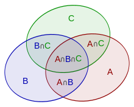

# Kiritish–chiqarish prinsipi

Kiritish–chiqarish prinsipi — to‘plam o‘lchamini yoki murakkab hodisalar ehtimolini hisoblashning muhim kombinatorik usuli. U alohida to‘plamlarning o‘lchamlarini ularning birlashmasi o‘lchami bilan bog‘laydi.

## Ta’rif

### Og‘zaki formula

Kiritish–chiqarish prinsipini quyidagicha ifodalash mumkin:

Bir nechta to‘plam birlashmasining o‘lchamini hisoblash uchun avval barcha to‘plamlarning o‘lchamlarini **alohida-alohida qo‘shish**, so‘ng barcha **juft** kesishmalar o‘lchamlarini ayirish, barcha **uchtalik** kesishmalar o‘lchamlarini yana qo‘shish, barcha **to‘rttalik** kesishmalar o‘lchamlarini ayirish va shu tarzda **barcha** to‘plamlar kesishmasigacha davom etish kerak.

### To‘plamlar orqali ifoda

Yuqoridagi ta’rifni matematik ko‘rinishda quyidagicha yozish mumkin:

$$\left|\bigcup_{i=1}^n A_i\right|=\sum_{i=1}^n|A_i|-\sum_{1\le i<j\le n}|A_i\cap A_j|+\sum_{1\le i<j<k\le n}|A_i\cap A_j\cap A_k|-\cdots+(-1)^{n-1}|A_1\cap\cdots\cap A_n|$$

Yanada ixcham ko‘rinishi:

$$\left|\bigcup_{i=1}^n A_i\right|=\sum_{\emptyset\ne J\subseteq\{1,2,\ldots,n\}}(-1)^{|J|-1}{\Biggl|}\bigcap_{j\in J}A_j{\Biggr|}$$

### Venn diagrammasi orqali ifoda

Diagrammada uchta $A$, $B$ va $C$ to‘plam ko‘rsatilgan bo‘lsin:



Ularning $A\cup B\cup C$ birlashmasi yuzi $A$, $B$ va $C$ yuzlari yig‘indisidan ikki marta qoplangan $A\cap B$, $A\cap C$ va $B\cap C$ yuzlarini ayirib, uchala to‘plam qoplaydigan $A\cap B\cap C$ yuzini qayta qo‘shishga teng:

$$S(A\cup B\cup C)=S(A)+S(B)+S(C)-S(A\cap B)-S(A\cap C)-S(B\cap C)+S(A\cap B\cap C)$$

Bu formula $n$ ta to‘plam birlashmasiga ham umumlashtiriladi.

### Ehtimollar nazariyasi orqali ifoda

$A_i$ ($i=1,2,\ldots,n$) hodisalar, ${\cal P}(A_i)$ esa $A_i$ hodisaning yuz berish ehtimoli bo‘lsin. Ularning birlashmasi ehtimoli, ya’ni kamida bitta hodisa yuz berish ehtimoli:

$$\begin{aligned}
{\cal P}\left(\bigcup_{i=1}^n A_i\right)&=&\sum_{i=1}^n{\cal P}(A_i)-\sum_{1\le i<j\le n}{\cal P}(A_i\cap A_j)+\\
&+&\sum_{1\le i<j<k\le n}{\cal P}(A_i\cap A_j\cap A_k)-\cdots+(-1)^{n-1}{\cal P}(A_1\cap\cdots\cap A_n)
\end{aligned}$$

Ixcham ko‘rinishi:

$${\cal P}\left(\bigcup_{i=1}^n A_i\right)=\sum_{\emptyset\ne J\subseteq\{1,2,\ldots,n\}}(-1)^{|J|-1}\,{\cal P}{\Biggl(}\bigcap_{j\in J}A_j{\Biggr)}$$

## Isbot

Isbot uchun to‘plamlar nazariyasidagi matematik ifodadan foydalanish qulay:

$$\left|\bigcup_{i=1}^n A_i\right|=\sum_{\emptyset\ne J\subseteq\{1,2,\ldots,n\}}(-1)^{|J|-1}{\Biggl|}\bigcap_{j\in J}A_j{\Biggr|}$$

Kamida bitta $A_i$ to‘plamga tegishli har qanday element formulada aynan bir marta hisoblanishini isbotlamoqchimiz. Hech bir $A_i$ to‘plamga kirmaydigan elementlar formulaning o‘ng tomonida umuman ko‘rilmaydi.

$x$ elementi $k\ge1$ ta $A_i$ to‘plamga tegishli bo‘lsin. U formulada aynan bir marta hisoblanishini ko‘rsatamiz:

- $|J|=1$ bo‘lgan hadlarda $x$ elementi **$+k$** marta hisoblanadi;
- $|J|=2$ bo‘lgan hadlarda $x$ elementi **$-\binom{k}{2}$** marta hisoblanadi, chunki $x$ ni o‘z ichiga olgan $k$ ta to‘plamdan ikkitasini tanlagan hadlarda qatnashadi;
- $|J|=3$ bo‘lgan hadlarda $x$ elementi **$+\binom{k}{3}$** marta hisoblanadi;
- va hokazo;
- $|J|=k$ bo‘lgan hadlarda $x$ elementi **$(-1)^{k-1}\binom{k}{k}$** marta hisoblanadi;
- $|J|>k$ bo‘lgan hadlarda $x$ elementi **nol** marta hisoblanadi.

Natijada [binomial koeffitsiyentlar](binomial-coefficients.md) yig‘indisini olamiz:

$$T=\binom{k}{1}-\binom{k}{2}+\binom{k}{3}-\cdots+(-1)^{i-1}\binom{k}{i}+\cdots+(-1)^{k-1}\binom{k}{k}$$

Bu ifoda $(1-x)^k$ binomial yoyilmasiga juda o‘xshaydi:

$$(1-x)^k=\binom{k}{0}-\binom{k}{1}x+\binom{k}{2}x^2-\binom{k}{3}x^3+\cdots+(-1)^k\binom{k}{k}x^k$$

$x=1$ bo‘lganda bu ifoda $T$ ga deyarli teng. Faqat unda qo‘shimcha $\binom{k}{0}=1$ hadi bor va qolgan qism $-1$ ga ko‘paytirilgan. Demak,

$$(1-1)^k=1-T.$$

Shundan

$$T=1-(1-1)^k=1$$

kelib chiqadi. Isbot talab qilinganidek, element aynan bir marta hisoblandi.

## Aynan $r$ ta to‘plamga tegishli elementlar sonini hisoblashga umumlashtirish {data-toc-label="Aynan r ta to‘plamga tegishli elementlar soni"}

Kiritish–chiqarish prinsipini hech bir to‘plamga tegishli bo‘lmagan elementlar sonini hisoblash uchun quyidagicha yozish mumkin:

$$\left|\bigcap_{i=1}^n\overline{A_i}\right|=\sum_{m=0}^n(-1)^m\sum_{|X|=m}\left|\bigcap_{i\in X}A_i\right|$$

Endi aynan $r$ ta to‘plamga tegishli elementlar sonini hisoblash uchun umumlashmani ko‘rib chiqamiz:

$$\left|\bigcup_{|B|=r}\left[\bigcap_{i\in B}A_i\cap\bigcap_{j\notin B}\overline{A_j}\right]\right|=\sum_{m=r}^n(-1)^{m-r}\dbinom mr\sum_{|X|=m}\left|\bigcap_{i\in X}A_i\right|$$

Formulani isbotlash uchun biror aniq $B$ ni ko‘rib chiqamiz. Oddiy kiritish–chiqarish prinsipiga ko‘ra:

$$\left|\bigcap_{i\in B}A_i\cap\bigcap_{j\notin B}\overline{A_j}\right|=\sum_{m=r}^n(-1)^{m-r}\sum_{\substack{|X|=m\\B\subset X}}\left|\bigcap_{i\in X}A_i\right|$$

Chap tomondagi to‘plamlar turli $B$ lar uchun kesishmaydi, shuning uchun ularni bevosita qo‘shish mumkin. Bundan tashqari, har qanday $X$ to‘plam qatnashganida doimo $(-1)^{m-r}$ koeffitsiyentiga ega bo‘ladi va u aynan $\dbinom mr$ ta $B$ to‘plam uchun qatnashadi.

## Masalalarni yechishda qo‘llanishi

Kiritish–chiqarish prinsipini uning qo‘llanishlarini o‘rganmasdan tushunish qiyin.

Avval prinsipning qo‘llanishini ko‘rsatadigan qog‘ozda yechiladigan uchta sodda masalani ko‘ramiz. So‘ng kiritish–chiqarishsiz yechish qiyin bo‘lgan amaliyroq masalalarga o‘tamiz.

“Usullar **sonini** toping” turidagi masalalarga alohida e’tibor berish kerak: ular har doim ham eksponensial emas, ba’zan polinomial yechimga olib keladi.

### Permutatsiyalarga oid sodda masala

**Masala.** $0$ dan $9$ gacha bo‘lgan sonlarning birinchi elementi $1$ dan katta va oxirgi elementi $8$ dan kichik bo‘lgan permutatsiyalari sonini toping.

“Yomon” permutatsiyalarni, ya’ni birinchi elementi $\le1$ va/yoki oxirgi elementi $\ge8$ bo‘lgan permutatsiyalarni sanaymiz.

Birinchi elementi $\le1$ bo‘lgan permutatsiyalar to‘plamini $X$, oxirgi elementi $\ge8$ bo‘lgan permutatsiyalar to‘plamini $Y$ bilan belgilaymiz. Kiritish–chiqarish formulasiga ko‘ra “yomon” permutatsiyalar soni:

$$|X\cup Y|=|X|+|Y|-|X\cap Y|$$

Sodda kombinatorik hisobdan so‘ng:

$$2\cdot9!+2\cdot9!-2\cdot2\cdot8!$$

ni olamiz. “Yaxshi” permutatsiyalar sonini topish uchun bu qiymatni jami $10!$ dan ayirish qoladi.

### $(0,1,2)$ ketma-ketliklariga oid sodda masala

**Masala.** Faqat $0$, $1$, $2$ sonlaridan tuzilgan, har bir son **kamida bir marta** qatnashadigan uzunligi $n$ bo‘lgan ketma-ketliklar sonini toping.

Yana teskari masalaga o‘tamiz: sonlardan **kamida bittasi qatnashmaydigan** ketma-ketliklar sonini hisoblaymiz.

$i$ raqami qatnashmaydigan ketma-ketliklar to‘plamini $A_i$ ($i=0,1,2$) bilan belgilaymiz. “Yomon” ketma-ketliklar uchun kiritish–chiqarish formulasi:

$$|A_0\cup A_1\cup A_2|=|A_0|+|A_1|+|A_2|-|A_0\cap A_1|-|A_0\cap A_2|-|A_1\cap A_2|+|A_0\cap A_1\cap A_2|$$

- Har bir $A_i$ o‘lchami $2^n$, chunki ketma-ketlikda faqat qolgan ikkita raqam qatnashishi mumkin.
- Har bir juft kesishma $A_i\cap A_j$ o‘lchami $1$, chunki ketma-ketlikni tuzish uchun faqat bitta raqam qoladi.
- Uchala to‘plam kesishmasi o‘lchami $0$, chunki ketma-ketlikni tuzadigan raqam qolmaydi.

Teskari masalani yechganimiz sababli natijani jami $3^n$ ta ketma-ketlikdan ayiramiz:

$$3^n-(3\cdot2^n-3\cdot1+0)$$

<div id="the-number-of-integer-solutions-to-the-equation"></div>

### Yuqori chegarali butun sonlar yig‘indisi {#number-of-upper-bound-integer-sums}

Quyidagi tenglamani ko‘rib chiqamiz:

$$x_1+x_2+x_3+x_4+x_5+x_6=20,$$

bu yerda

$$0\le x_i\le8\qquad(i=1,2,\ldots,6).$$

**Masala.** Tenglama yechimlari sonini toping.

Bir muddat $x_i$ lar uchun yuqori chegara mavjudligini unutib, tenglamaning barcha manfiy bo‘lmagan yechimlarini sanaymiz. Buni [Stars and Bars](stars_and_bars.md) usuli bilan oson bajarish mumkin: $20$ ta birlik ketma-ketligini $6$ ta guruhga ajratishimiz kerak, bu esa $5$ ta chiziq va $20$ ta yulduzni joylashtirishga teng:

$$N_0=\binom{25}{5}$$

Endi kiritish–chiqarish prinsipi yordamida “yomon” yechimlar sonini hisoblaymiz. Bir yoki bir nechta $x_i\ge9$ bo‘lgan yechimlar “yomon” hisoblanadi.

$x_k\ge9$ va qolgan barcha $x_i\ge0$ ($i\ne k$) bo‘lgan yechimlar to‘plamini $A_k$ ($k=1,2,\ldots,6$) bilan belgilaymiz. Qolgan o‘zgaruvchilar ham $9$ yoki undan katta bo‘lishi mumkin.

$|A_k|$ ni hisoblashda yuqoridagi masalaga juda o‘xshash masala hosil bo‘ladi. Faqat $9$ ta birlik joylashtiriladigan birliklardan olib tashlangan va aniq $k$-guruhga tegishli. Shuning uchun:

$$|A_k|=\binom{16}{5}$$

Xuddi shunday, $k\ne p$ uchun ikki to‘plam kesishmasining o‘lchami:

$$|A_k\cap A_p|=\binom75$$

Uchta to‘plamning har qanday kesishmasi bo‘sh, chunki $20$ ta birlik uchta yoki undan ko‘p o‘zgaruvchini $9$ dan kam bo‘lmagan qilishga yetmaydi.

Bularni kiritish–chiqarish formulasiga qo‘yib va teskari masalani yechganimizni hisobga olib, yakuniy javobni olamiz:

$$\binom{25}{5}-\left(\binom61\cdot\binom{16}{5}-\binom62\cdot\binom75\right)$$

Bu natija yig‘indisi $s$ ga teng bo‘lgan va $0\le x_i\le b$ shartini qanoatlantiradigan $d$ ta son uchun osongina umumlashtiriladi:

$$\sum_{i=0}^d(-1)^i\binom di\binom{s+d-1-(b+1)i}{d-1}$$

Yuqoridagidek, yuqori indeksi manfiy bo‘lgan binomial koeffitsiyentlarni nol deb qaraymiz.

Bu masalani dinamik dasturlash yoki hosil qiluvchi funksiyalar bilan ham yechish mumkin. Binomial koeffitsiyent kabi matematik amallar $O(1)$ deb olinsa, kiritish–chiqarish javobi $O(d)$ vaqtda hisoblanadi, sodda dinamik dasturlash esa $O(ds)$ vaqt oladi.

### Berilgan oraliqdagi o‘zaro tub sonlar soni

**Masala.** $n$ va $r$ sonlari berilgan. $[1,r]$ oraliqda $n$ bilan o‘zaro tub, ya’ni eng katta umumiy bo‘luvchisi $1$ bo‘lgan butun sonlar sonini toping.

Teskari masalani yechamiz: $n$ bilan o‘zaro tub bo‘lmagan sonlar sonini hisoblaymiz.

$n$ ning turli tub bo‘luvchilarini $p_i$ ($i=1,\ldots,k$) bilan belgilaymiz.

$[1,r]$ oraliqdagi nechta son $p_i$ ga bo‘linadi? Javob:

$$\left\lfloor\frac r{p_i}\right\rfloor$$

Biroq bu qiymatlarni shunchaki qo‘shsak, bir nechta $p_i$ ni bo‘luvchi sifatida o‘z ichiga olgan sonlar bir necha marta sanaladi. Shuning uchun kiritish–chiqarish prinsipini qo‘llash kerak.

$p_i$ lar to‘plamining barcha $2^k$ ta qism to‘plamini ko‘rib chiqamiz, tanlangan tub sonlar ko‘paytmasini hisoblaymiz va shu ko‘paytmaga karrali sonlar miqdorini qism to‘plam o‘lchamining toq yoki juftligiga qarab qo‘shamiz yoki ayiramiz.

C++ implementatsiyasi:

```cpp
int solve (int n, int r) {
	vector<int> p;
	for (int i=2; i*i<=n; ++i)
		if (n % i == 0) {
			p.push_back (i);
			while (n % i == 0)
				n /= i;
		}
	if (n > 1)
		p.push_back (n);

	int sum = 0;
	for (int msk=1; msk<(1<<p.size()); ++msk) {
		int mult = 1,
			bits = 0;
		for (int i=0; i<(int)p.size(); ++i)
			if (msk & (1<<i)) {
				++bits;
				mult *= p[i];
			}

		int cur = r / mult;
		if (bits % 2 == 1)
			sum += cur;
		else
			sum -= cur;
	}

	return r - sum;
}
```

Yechimning asimptotik murakkabligi $O(\sqrt n)$.

### Berilgan oraliqda berilgan sonlardan kamida bittasiga karrali sonlar miqdori

$n$ ta $a_i$ son va $r$ soni berilgan. $[1,r]$ oraliqda $a_i$ lardan kamida bittasiga karrali bo‘lgan butun sonlar sonini topish kerak.

Yechim algoritmi oldingi masaladagiga deyarli bir xil: $a_i$ sonlar uchun kiritish–chiqarish formulasini tuzamiz. Formuladagi har bir had $a_i$ larning biror qism to‘plamidagi barcha sonlarga bo‘linadigan, boshqacha aytganda ularning [eng kichik umumiy karralisiga](../algebra/euclid-algorithm.md) bo‘linadigan sonlar miqdoridir.

$a_i$ sonlarning barcha $2^n$ ta qism to‘plamini ko‘rib chiqamiz. Har biri uchun $O(n\log r)$ amal bilan EKUKni topib, oraliqdagi shu EKUKka karrali sonlar miqdorini qo‘shamiz yoki ayiramiz. Umumiy murakkablik:

$$O(2^n\cdot n\cdot\log r).$$

### Berilgan andozalarni qanoatlantiradigan satrlar soni

Bir xil uzunlikdagi $n$ ta satr andozasi berilgan. Har bir andoza faqat harflar (`a...z`) va savol belgilaridan iborat. Bundan tashqari, $k$ soni berilgan.

Satr andozaga mos keladi, agar uning uzunligi andoza uzunligiga teng bo‘lsa va har bir o‘rinda mos belgilar teng yoki andozadagi belgi savol belgisi bo‘lsa.

Ikki masalani ko‘rib chiqamiz:

1. aynan $k$ ta andozaga mos keladigan satrlar sonini topish;
2. kamida $k$ ta andozaga mos keladigan satrlar sonini topish.

Avval berilgan barcha andozalarni bir vaqtda qanoatlantiradigan satrlar sonini oson hisoblash mumkinligiga e’tibor bering. Buning uchun andozalarni “ustma-ust qo‘yamiz”: barcha o‘rinlarni ko‘rib, har bir o‘rindagi belgilarni barcha andozalarda tekshiramiz. Agar shu o‘rinda barcha andozalarda savol belgisi bo‘lsa, belgi `a` dan `z` gacha istalgan harf bo‘lishi mumkin. Aks holda ushbu o‘rindagi belgi savol belgisi bo‘lmagan andozalar tomonidan yagona aniqlanadi. Agar ular turli majburiy harflarni talab qilsa, mos satrlar soni nol bo‘ladi.

Avval satr aynan $k$ ta andozani qanoatlantirishi kerak bo‘lgan birinchi masalani yechamiz.

Andozalar to‘plamidan $k$ ta andozali aniq $X$ qism to‘plamni tanlaymiz. Endi aynan shu andozalarni qanoatlantirib, boshqa hech qaysi andozaga mos kelmaydigan satrlar sonini hisoblash kerak. Kiritish–chiqarish prinsipini biroz boshqacha ko‘rinishda qo‘llaymiz: $X$ ni o‘z ichiga olgan barcha $Y$ ustto‘plamlar bo‘yicha yig‘ib, satrlar sonini javobga qo‘shamiz yoki undan ayiramiz:

$$ans(X)=\sum_{Y\supseteq X}(-1)^{|Y|-k}\cdot f(Y)$$

Bu yerda $f(Y)$ — $Y$ dagi barcha andozalarga mos keladigan satrlar soni.

Bu formula tushunarsiz tuyulsa, Venn diagrammalarini chizib ko‘rish yordam berishi mumkin.

Barcha $ans(X)$ larni qo‘shsak, yakuniy javobni olamiz:

$$ans=\sum_{X:\,|X|=k}ans(X)$$

Biroq bu yechimning murakkabligi $O(3^k\cdot k)$. Uni yaxshilash uchun turli $ans(X)$ hisoblarida bir xil $Y$ to‘plamlar juda ko‘p marta qatnashishiga e’tibor beramiz.

Kiritish–chiqarish yig‘indilarining tartibini almashtirib, $Y$ lar bo‘yicha yig‘amiz. Bir xil $Y$ to‘plam bir xil $(-1)^{|Y|-k}$ ishora bilan $\binom{|Y|}{k}$ ta turli $ans(X)$ hisobida qatnashishi ravshan bo‘ladi:

$$ans=\sum_{Y:\,|Y|\ge k}(-1)^{|Y|-k}\binom{|Y|}{k}f(Y)$$

Endi yechimning murakkabligi $O(2^k\cdot k)$.

Ikkinchi masalani — kamida $k$ ta andozaga mos keladigan satrlar sonini — yechamiz.

Albatta, birinchi masala yechimidan foydalanib, aynan $k$, $k+1$ va undan ko‘p andozaga mos keladigan holatlar javoblarini qo‘shish mumkin. Biroq bu masalada biror $Y$ to‘plam formulada $Y$ ichidagi o‘lchami kamida $k$ bo‘lgan barcha qism to‘plamlar uchun hisobga olinadi. Shuning uchun $f(Y)$ ga ko‘paytiriladigan qismni quyidagicha yozish mumkin:

$$(-1)^{|Y|-k}\binom{|Y|}{k}+(-1)^{|Y|-k-1}\binom{|Y|}{k+1}+(-1)^{|Y|-k-2}\binom{|Y|}{k+2}+\cdots+(-1)^{|Y|-|Y|}\binom{|Y|}{|Y|}$$

Graham, Knuth va Patashnikning *Concrete Mathematics* (1998) kitobidagi [binomial koeffitsiyentlar](binomial-coefficients.md) uchun mashhur formulani ishlatamiz:

$$\sum_{k=0}^m(-1)^k\binom nk=(-1)^m\binom{n-1}m$$

Uni qo‘llab, yuqoridagi binomial koeffitsiyentlar yig‘indisini quyidagicha qisqartiramiz:

$$(-1)^{|Y|-k}\binom{|Y|-1}{|Y|-k}$$

Demak, bu masala uchun ham $O(2^k\cdot k)$ murakkablikdagi yechim olamiz:

$$ans=\sum_{Y:\,|Y|\ge k}(-1)^{|Y|-k}\binom{|Y|-1}{|Y|-k}f(Y)$$

### Bir katakdan boshqasiga borish usullari soni

$n\times m$ maydon berilgan va uning $k$ ta katagi o‘tib bo‘lmaydigan devor. Robot dastlab pastki chapdagi $(1,1)$ katakda turadi. U faqat o‘ngga yoki yuqoriga harakatlana oladi va barcha to‘siqlardan qochib, $(n,m)$ katakka yetishi kerak. Buni bajarish usullari sonini topish talab qilinadi.

$n$ va $m$ juda katta, masalan $10^9$, to‘siqlar soni $k$ esa kichik, taxminan $100$ deb faraz qilamiz.

To‘siqlarni avval $x$ koordinatasi bo‘yicha, teng bo‘lsa $y$ koordinatasi bo‘yicha saralaymiz.

Avval to‘siqsiz masalani, ya’ni bir katakdan boshqasiga borish usullari sonini hisoblashni o‘rganamiz. Bir o‘q bo‘yicha $x$ ta, ikkinchi o‘q bo‘yicha $y$ ta qadam yurish kerak. Sodda kombinatorika va [binomial koeffitsiyentlar](binomial-coefficients.md) yordamida:

$$\binom{x+y}{x}$$

formulasini olamiz.

Endi to‘siqlardan qochgan holda bir katakdan boshqasiga borish usullari sonini hisoblash uchun kiritish–chiqarish orqali teskari masalani yechish mumkin: to‘siqlarning biror qism to‘plamidagi kataklarni bosib o‘tadigan yo‘llarni sanab, jami yo‘llardan ayiramiz.

Bosib o‘tiladigan to‘siqlar qism to‘plamini tanlaganda, bunday yo‘llar sonini hisoblash uchun boshlang‘ich katakdan tanlangan birinchi to‘siqqacha, birinchi to‘siqdan ikkinchisigacha va hokazo yo‘llar sonlarini ko‘paytirish kifoya. So‘ng standart kiritish–chiqarish formulasiga ko‘ra bu sonni javobga qo‘shamiz yoki ayiramiz.

Biroq bu usul yana polinomial bo‘lmagan $O(2^k\cdot k)$ murakkablikka ega.

Polinomial yechim quyidagicha.

Dinamik dasturlashdan foydalanamiz. Qulaylik uchun $(1,1)$ ni to‘siqlar massivining boshiga, $(n,m)$ ni oxiriga qo‘shamiz. $d[i]$ — boshlang‘ich, ya’ni `0`-nuqtadan `i`-nuqtaga boshqa hech bir to‘siqni bosmasdan borish usullari soni bo‘lsin; `i`-nuqtaning o‘zini bosish mumkin. Bu sonni barcha to‘siq kataklar va yakuniy nuqta uchun hisoblaymiz.

Bir muddat to‘siqlarni unutib, `0`-katakdan `i`-katakka boradigan barcha yo‘llarni sanaymiz. So‘ng to‘siqlardan o‘tadigan “yomon” yo‘llarni hisobga olib, ularni umumiy sondan ayirishimiz kerak.

`0` va `i` orasidagi bosish mumkin bo‘lgan $t$ to‘siqni ($0<t<i$) ko‘rib chiqamiz. `0` dan `i` gacha borib, yo‘ldagi **birinchi to‘siq sifatida $t$ ni bosadigan** yo‘llar soni $d[t]$ ning $t$ dan $i$ gacha bo‘lgan ixtiyoriy yo‘llar soniga ko‘paytmasiga teng. Barcha $0<t<i$ uchun shu qiymatlarni qo‘shib, “yomon” yo‘llar sonini olamiz.

$O(k)$ ta to‘siqning har biri uchun $d[i]$ ni $O(k)$ vaqtda hisoblash mumkin. Demak, yechimning umumiy murakkabligi $O(k^2)$.

### O‘zaro tub to‘rttaliklar soni

$n$ ta $a_1,a_2,\ldots,a_n$ son berilgan. Umumiy eng katta bo‘luvchisi $1$ ga teng bo‘ladigan to‘rtta sonni tanlash usullari sonini topish kerak.

Teskari masalani yechamiz: barcha sonlari biror $d>1$ ga bo‘linadigan “yomon” to‘rttaliklar sonini hisoblaymiz.

$d$ bo‘luvchiga bo‘linadigan barcha mumkin bo‘lgan to‘rttaliklar bo‘yicha yig‘ishda kiritish–chiqarish prinsipidan foydalanamiz:

$$ans=\sum_{d\ge2}(-1)^{deg(d)-1}\cdot f(d)$$

Bu yerda $deg(d)$ — $d$ ning tub ko‘paytuvchilarga ajratilishidagi turli tub sonlar miqdori, $f(d)$ esa barcha elementlari $d$ ga bo‘linadigan to‘rttaliklar soni.

$f(d)$ ni hisoblash uchun $d$ ga karrali elementlar sonini topish va ulardan to‘rttasini tanlash usullari sonini [binomial koeffitsiyentlar](binomial-coefficients.md) yordamida hisoblash kifoya.

Shunday qilib, kiritish–chiqarish formulasida avval bir tub songa bo‘linadigan to‘rttaliklar sonini qo‘shamiz, ikki tub son ko‘paytmasiga bo‘linadiganlarini ayiramiz, uchta tub son ko‘paytmasiga bo‘linadiganlarini qo‘shamiz va hokazo.

### Garmonik uchliklar soni

$n\le10^6$ soni berilgan. Quyidagi shartlardan birini qanoatlantiradigan

$$2\le a<b<c\le n$$

uchliklar sonini topish kerak:

- ${\rm gcd}(a,b)={\rm gcd}(a,c)={\rm gcd}(b,c)=1$;
- yoki ${\rm gcd}(a,b)>1$, ${\rm gcd}(a,c)>1$, ${\rm gcd}(b,c)>1$.

Avval teskari masalaga o‘tamiz, ya’ni garmonik bo‘lmagan uchliklar sonini sanaymiz.

Har qanday garmonik bo‘lmagan uchlik o‘zaro tub bo‘lgan bir juft va shu juftdagi kamida bitta songa o‘zaro tub bo‘lmagan uchinchi sondan tuzilishiga e’tibor bering.

Shuning uchun $i$ ni o‘z ichiga olgan garmonik bo‘lmagan uchliklar soni $2$ dan $n$ gacha $i$ bilan o‘zaro tub sonlar miqdorining $i$ bilan o‘zaro tub bo‘lmagan sonlar miqdoriga ko‘paytmasiga teng.

Ikki mumkin holat bor:

$$gcd(a,b)=1\wedge gcd(a,c)>1\wedge gcd(b,c)>1,$$

 yoki

$$gcd(a,b)=1\wedge gcd(a,c)=1\wedge gcd(b,c)>1.$$

Har ikkala holatda ham uchlik ikki marta hisoblanadi. Birinchi holat $i=a$ va $i=b$ bo‘lganda, ikkinchi holat esa $i=b$ va $i=c$ bo‘lganda sanaladi. Demak, garmonik bo‘lmagan uchliklar sonini topish uchun $i=2$ dan $n$ gacha barcha hisoblarni qo‘shib, $2$ ga bo‘lamiz.

Endi $[2,n]$ oraliqda $i$ bilan o‘zaro tub sonlar miqdorini tez hisoblash qoladi. Bu masala yuqorida ko‘rilgan bo‘lsa-da, o‘sha yechim bu yerda mos emas: $2$ dan $n$ gacha har bir sonni tub ko‘paytuvchilarga ajratish va bu tub sonlarning barcha qism to‘plamlarini ko‘rish talab qilinardi.

Eratosthen elagini quyidagicha o‘zgartirish orqali tezroq yechim olish mumkin:

1. Avval $[2,n]$ oraliqdagi tub ko‘paytuvchilarga ajratilishida hech bir tub ko‘paytuvchi ikki marta qatnashmaydigan barcha sonlarni topamiz. Bu sonlar nechta tub ko‘paytuvchiga ega ekanini ham bilishimiz kerak.
   - $deg[i]$ massivida $i$ ning tub ko‘paytuvchilari sonini saqlaymiz. $good[i]$ esa har bir tub ko‘paytuvchi ko‘pi bilan bir marta qatnashsa `1`, aks holda `0` bo‘ladi. $2$ dan $n$ gacha yurishda $deg=0$ bo‘lgan songa yetib kelsak, u tub son va uning $deg$ qiymati $1$.
   - Eratosthen elagida $i=2$ dan $n$ gacha yuramiz. Tub sonni qayta ishlaganda uning barcha karralilariga o‘tib, ularning `deg[]` qiymatini oshiramiz. Karralilardan biri $i^2$ ga ham karrali bo‘lsa, uning `good` qiymatini `false` qilamiz.
2. So‘ng $i=2$ dan $n$ gacha barcha sonlar uchun javobni, ya’ni $i$ bilan o‘zaro tub bo‘lmagan sonlar miqdorini bildiruvchi `cnt[]` massivini hisoblaymiz.
   - Kiritish–chiqarish formulasi qanday ishlashini eslaymiz. Bu yerda o‘sha g‘oyani teskari yo‘nalishda amalga oshiramiz: tub ko‘paytuvchilar ko‘paytmasidan iborat komponent bo‘yicha yurib, uning har bir karralisi uchun kiritish–chiqarish formulasidagi hadni qo‘shamiz yoki ayiramiz.
   - $good[i]=true$ bo‘lgan, ya’ni kiritish–chiqarish formulasida qatnashadigan $i$ sonni qayta ishlayapmiz deb olaylik. $i$ ning barcha karralilarini ko‘rib, ularning `cnt[]` qiymatiga $\lfloor N/i\rfloor$ ni qo‘shamiz yoki ayiramiz. Ishora $deg[i]$ ga bog‘liq: $deg[i]$ toq bo‘lsa qo‘shamiz, juft bo‘lsa ayiramiz.

C++ implementatsiyasi:

```cpp
int n;
bool good[MAXN];
int deg[MAXN], cnt[MAXN];

long long solve() {
	memset (good, 1, sizeof good);
	memset (deg, 0, sizeof deg);
	memset (cnt, 0, sizeof cnt);
	long long ans_bad = 0;
	for (int i=2; i<=n; ++i) {
		if (good[i]) {
			if (deg[i] == 0)  deg[i] = 1;
			for (int j=1; i*j<=n; ++j) {
				if (j > 1 && deg[i] == 1)
					if (j % i == 0)
						good[i*j] = false;
					else
						++deg[i*j];
				cnt[i*j] += (n / i) * (deg[i]%2==1 ? +1 : -1);
			}
		}
		ans_bad += (cnt[i] - 1) * 1ll * (n-1 - cnt[i]);
	}

	return (n-1) * 1ll * (n-2) * (n-3) / 6 - ans_bad / 2;
}
```

Deyarli har bir $i\le n$ uchun ichki siklda $n/i$ ta iteratsiya bajarilganligi sababli yechimning asimptotik murakkabligi $O(n\log n)$.

### Qo‘zg‘almas nuqtasiz permutatsiyalar soni — derangementlar

Uzunligi $n$ bo‘lgan, hech bir $i$ soni $i$-o‘rinda turmaydigan, ya’ni qo‘zg‘almas nuqtasi bo‘lmagan permutatsiyalar soni quyidagiga tengligini isbotlaymiz:

$$n!-\binom n1(n-1)!+\binom n2(n-2)!-\binom n3(n-3)!+\cdots\pm\binom nn(n-n)!$$

Bu son taxminan:

$$\frac{n!}{e}$$

ga teng. Ushbu ifodani eng yaqin butun songa yaxlitlasak, qo‘zg‘almas nuqtasiz permutatsiyalar sonining aynan o‘zini olamiz.

$A_k$ bilan $k$-o‘rinda qo‘zg‘almas nuqtaga ega, ya’ni $k$ elementi $k$-o‘rinda turgan uzunligi $n$ bo‘lgan permutatsiyalar to‘plamini belgilaymiz ($1\le k\le n$).

Kamida bitta qo‘zg‘almas nuqtali permutatsiyalar sonini hisoblash uchun kiritish–chiqarish formulasidan foydalanamiz. Buning uchun $A_i$ to‘plamlar kesishmalarining o‘lchamlarini hisoblaymiz:

$$\begin{aligned}
|A_p|&=&(n-1)!,\\
|A_p\cap A_q|&=&(n-2)!,\\
|A_p\cap A_q\cap A_r|&=&(n-3)!,\\
&\cdots&
\end{aligned}$$

Haqiqatan ham, qo‘zg‘almas nuqtalar soni $x$ bo‘lsa, permutatsiyaning $x$ ta elementi qayerda turishi ma’lum, qolgan $n-x$ ta elementni esa istalgan tartibda joylashtirish mumkin.

Bu qiymatlarni kiritish–chiqarish formulasiga qo‘yib va $n$ elementli to‘plamdan $x$ elementli qism to‘plam tanlash usullari soni $\binom nx$ ekanini hisobga olib, kamida bitta qo‘zg‘almas nuqtali permutatsiyalar sonini olamiz:

$$\binom n1(n-1)!-\binom n2(n-2)!+\binom n3(n-3)!-\cdots\pm\binom nn(n-n)!$$

Demak, qo‘zg‘almas nuqtasiz permutatsiyalar soni:

$$n!-\binom n1(n-1)!+\binom n2(n-2)!-\binom n3(n-3)!+\cdots\pm\binom nn(n-n)!$$

Ifodani soddalashtirib, **qo‘zg‘almas nuqtasiz permutatsiyalar soni uchun aniq va taqribiy formulalarni** olamiz:

$$n!\left(1-\frac1{1!}+\frac1{2!}-\frac1{3!}+\cdots\pm\frac1{n!}\right)\approx\frac{n!}{e}$$

Qavs ichidagi yig‘indi $e^{-1}$ ning Taylor qatoridagi dastlabki $n+1$ ta haddan iborat.

Shunga o‘xshash masalani ham shu usul bilan yechish mumkin: qo‘zg‘almas nuqtalar permutatsiyaning barcha elementlari orasida emas, faqat dastlabki $m$ ta element orasida bo‘lmasligi talab qilinsin. Hosil bo‘ladigan formula yuqoridagi aniq formulaga o‘xshaydi, ammo yig‘indi $n$ gacha emas, $m$ gacha davom etadi.

## Amaliy masalalar

Kiritish–chiqarish prinsipi yordamida yechiladigan masalalar:

- [UVA #10325 “The Lottery” — qiyinlik: oson](http://uva.onlinejudge.org/index.php?option=onlinejudge&page=show_problem&problem=1266)
- [UVA #11806 “Cheerleaders” — qiyinlik: oson](http://uva.onlinejudge.org/index.php?option=com_onlinejudge&Itemid=8&page=show_problem&problem=2906)
- [TopCoder SRM 477 “CarelessSecretary” — qiyinlik: oson](http://www.topcoder.com/stat?c=problem_statement&pm=10875)
- [TopCoder TCHS 16 “Divisibility” — qiyinlik: oson](http://community.topcoder.com/stat?c=problem_statement&pm=6658&rd=10068)
- [SPOJ #6285 NGM2 “Another Game With Numbers” — qiyinlik: oson](http://www.spoj.com/problems/NGM2/)
- [TopCoder SRM 382 “CharmingTicketsEasy” — qiyinlik: o‘rta](http://community.topcoder.com/stat?c=problem_statement&pm=8470)
- [TopCoder SRM 390 “SetOfPatterns” — qiyinlik: o‘rta](http://www.topcoder.com/stat?c=problem_statement&pm=8307)
- [TopCoder SRM 176 “Deranged” — qiyinlik: o‘rta](http://community.topcoder.com/stat?c=problem_statement&pm=2013)
- [TopCoder SRM 457 “TheHexagonsDivOne” — qiyinlik: o‘rta](http://community.topcoder.com/stat?c=problem_statement&pm=10702&rd=14144&rm=303184&cr=22697599)
- [SPOJ #4191 MSKYCODE “Sky Code” — qiyinlik: o‘rta](http://www.spoj.com/problems/MSKYCODE/)
- [SPOJ #4168 SQFREE “Square-free integers” — qiyinlik: o‘rta](http://www.spoj.com/problems/SQFREE/)
- [CodeChef “Count Relations” — qiyinlik: o‘rta](http://www.codechef.com/JAN11/problems/COUNTREL/)
- [SPOJ — Almost Prime Numbers Again](http://www.spoj.com/problems/KPRIMESB/)
- [SPOJ — Find number of Pair of Friends](http://www.spoj.com/problems/IITKWPCH/)
- [SPOJ — Balanced Cow Subsets](http://www.spoj.com/problems/SUBSET/)
- [SPOJ — EASY MATH — qiyinlik: o‘rta](http://www.spoj.com/problems/EASYMATH/)
- [SPOJ — MOMOS — FEASTOFPIGS — qiyinlik: oson](https://www.spoj.com/problems/MOMOS/)
- [AtCoder — Grid 2 — qiyinlik: oson](https://atcoder.jp/contests/dp/tasks/dp_y/)
- [Codeforces — Count GCD](https://codeforces.com/contest/1750/problem/D)

