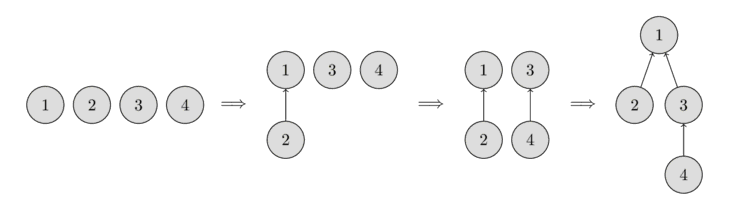
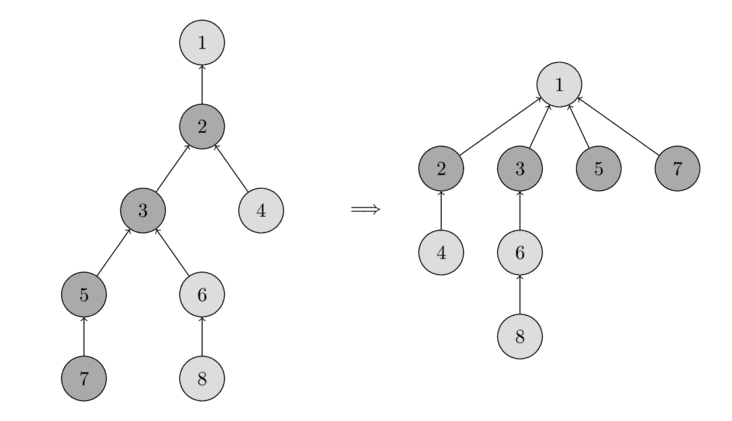

# Kesishmaydigan to‘plamlar birlashmasi (DSU)

Ushbu maqolada **Disjoint Set Union**, qisqacha **DSU** — kesishmaydigan to‘plamlar birlashmasi ma’lumotlar tuzilmasi ko‘rib chiqiladi. Ikki asosiy amali sababli u ko‘pincha **Union-Find** deb ham ataladi.

Tuzilma quyidagi imkoniyatlarni beradi. Dastlab bir nechta element berilgan va ularning har biri alohida to‘plamni tashkil qiladi. DSU istalgan ikkita to‘plamni birlashtira oladi hamda muayyan element qaysi to‘plamda ekanini aniqlaydi. Klassik variant yana bitta amalni — yangi elementdan yangi to‘plam yaratishni — ham o‘z ichiga oladi.

Demak, asosiy interfeys faqat uchta amaldan iborat:

- `make_set(v)` — yangi `v` elementining o‘zidan iborat yangi to‘plam yaratadi;
- `union_sets(a, b)` — `a` joylashgan to‘plam bilan `b` joylashgan to‘plamni birlashtiradi;
- `find_set(v)` — `v` elementini o‘z ichiga olgan to‘plamning vakilini, ya’ni liderini qaytaradi.

Vakil shu to‘plamning elementlaridan biri bo‘ladi. Uni ma’lumotlar tuzilmasining o‘zi tanlaydi va u vaqt o‘tishi bilan, xususan `union_sets` chaqiruvlaridan keyin, o‘zgarishi mumkin.

Ikki element bir to‘plamga tegishli yoki yo‘qligini vakillar orqali tekshirish mumkin. `find_set(a) == find_set(b)` bo‘lsa, `a` va `b` aynan bitta to‘plamda; aks holda ular turli to‘plamlarda.

Quyida batafsil ko‘rsatilganidek, ushbu tuzilma har bir asosiy amalni o‘rtacha deyarli $O(1)$ vaqtda bajaradi.

Maqolaning keyingi bo‘limlaridan birida DSUning muqobil ko‘rinishi ham tushuntiriladi. U sekinroq — o‘rtacha $O(\log n)$ — murakkablikka ega, ammo ayrim vazifalarda odatiy DSUdan kuchliroq bo‘lishi mumkin.

## Samarali ma’lumotlar tuzilmasini qurish

To‘plamlarni **daraxtlar** ko‘rinishida saqlaymiz: har bir daraxt bitta to‘plamga mos keladi, daraxt ildizi esa shu to‘plamning vakili yoki lideri bo‘ladi.

Quyidagi rasmda to‘plamlarning daraxtlar bilan ifodalanishi ko‘rsatilgan.



Dastlab har bir element alohida to‘plam bo‘lgani uchun har bir tugun o‘zining alohida daraxtidir. Keyin 1-elementli va 2-elementli to‘plamlar birlashtiriladi. So‘ng 3-elementli va 4-elementli to‘plamlar birlashtiriladi. Oxirgi qadamda esa 1-element joylashgan to‘plam bilan 3-element joylashgan to‘plam qo‘shiladi.

Implementatsiyada har bir tugunning daraxtdagi bevosita ajdodiga ko‘rsatkichni saqlaydigan `parent` massivi kerak bo‘ladi.

### Sodda implementatsiya

DSUning birinchi implementatsiyasini yozishimiz mumkin. Dastlab u ancha samarasiz bo‘ladi, lekin keyin ikkita optimallashtirish yordamida har bir funksiya chaqiruvini deyarli o‘zgarmas vaqtga tushiramiz.

Elementlar to‘plamlari haqidagi barcha axborot `parent` massivida saqlanadi.

Yangi to‘plam yaratishda (`make_set(v)`) ildizi `v` bo‘lgan daraxt yaratamiz, ya’ni `v` o‘zining ajdodi bo‘ladi.

Ikki to‘plamni birlashtirishda (`union_sets(a, b)`) avval `a` va `b` joylashgan to‘plamlarning vakillarini topamiz. Vakillar bir xil bo‘lsa, hech narsa qilish shart emas: to‘plamlar allaqachon birlashtirilgan. Aks holda vakillardan birini ikkinchisining ota tuguni qilib belgilaymiz va shu bilan ikki daraxtni qo‘shamiz.

Vakilni topishda (`find_set(v)`) `v` tugundan ajdodlar bo‘ylab ildizgacha ko‘tarilamiz. Ildiz — ota ko‘rsatkichi o‘ziga olib boradigan tugun. Bu amal rekursiv tarzda oson implementatsiya qilinadi.

```cpp
void make_set(int v) {
    parent[v] = v;
}

int find_set(int v) {
    if (v == parent[v])
        return v;
    return find_set(parent[v]);
}

void union_sets(int a, int b) {
    a = find_set(a);
    b = find_set(b);
    if (a != b)
        parent[b] = a;
}
```

Biroq bu implementatsiya samarasiz. Daraxtlar uzun zanjirlarga aylanib qoladigan misolni oson qurish mumkin. Bunday holatda har bir `find_set(v)` chaqiruvi $O(n)$ vaqt oladi. Bu biz istagan deyarli o‘zgarmas murakkablikdan juda uzoq.

Shuning uchun tuzilmani sezilarli tezlashtiradigan ikkita optimallashtirishni ko‘rib chiqamiz.

### Yo‘lni siqish optimallashtirishi

Bu optimallashtirish `find_set` amalini tezlashtiradi.

Muayyan `v` tugun uchun `find_set(v)` chaqirilganda, aslida `v` dan haqiqiy vakil `p` gacha bo‘lgan yo‘ldagi barcha tugunlar uchun ham `p` vakilini aniqlaymiz. G‘oya shu yo‘ldagi har bir ko‘rilgan tugunning ota ko‘rsatkichini bevosita `p` ga yo‘naltirib, keyingi yo‘llarni qisqartirishdan iborat.

Quyidagi rasmda chap tomonda dastlabki daraxt, o‘ng tomonda esa `find_set(7)` chaqiruvidan keyingi siqilgan daraxt berilgan. Chaqiruv 7, 5, 3 va 2 tugunlari yo‘lini qisqartiradi.



`find_set` ning yangi implementatsiyasi:

```cpp
int find_set(int v) {
    if (v == parent[v])
        return v;
    return parent[v] = find_set(parent[v]);
}
```

Avval to‘plam vakili, ya’ni ildiz topiladi. So‘ng rekursiya stacki qaytayotganda ko‘rilgan tugunlarning barchasi bevosita vakilga ulanadi.

Amaldagi shu kichik o‘zgarishning o‘zi har bir chaqiruv uchun o‘rtacha $O(\log n)$ murakkablik beradi; bu yerda isbot keltirilmaydi. Ikkinchi optimallashtirish bilan yanada tezroq natijaga erishamiz.

### O‘lcham yoki rang bo‘yicha birlashtirish

Bu optimallashtirishda `union_set` (`union_sets`) amalini, aniqrog‘i qaysi daraxt ikkinchisiga ulanishini o‘zgartiramiz. Sodda implementatsiyada ikkinchi daraxt doimo birinchisiga ulanardi va bu uzunligi $O(n)$ bo‘lgan zanjirlarga olib kelishi mumkin edi.

Buning oldini olish uchun ulanadigan daraxt ehtiyotkorlik bilan tanlanadi. Turli evristikalar mavjud, eng mashhurlari quyidagi ikkita:

- daraxt o‘lchamini rang sifatida ishlatish;
- daraxt chuqurligini rang sifatida ishlatish. Aniqrog‘i, yo‘lni siqish chuqurlikni kamaytirgani uchun chuqurlikning yuqori chegarasi saqlanadi.

Har ikki usulning mohiyati bir xil: rangi kichikroq daraxt rangi kattaroq daraxtga ulanadi.

O‘lcham bo‘yicha birlashtirish implementatsiyasi:

```cpp
void make_set(int v) {
    parent[v] = v;
    size[v] = 1;
}

void union_sets(int a, int b) {
    a = find_set(a);
    b = find_set(b);
    if (a != b) {
        if (size[a] < size[b])
            swap(a, b);
        parent[b] = a;
        size[a] += size[b];
    }
}
```

Daraxt chuqurligiga asoslangan rang bo‘yicha birlashtirish implementatsiyasi:

```cpp
void make_set(int v) {
    parent[v] = v;
    rank[v] = 0;
}

void union_sets(int a, int b) {
    a = find_set(a);
    b = find_set(b);
    if (a != b) {
        if (rank[a] < rank[b])
            swap(a, b);
        parent[b] = a;
        if (rank[a] == rank[b])
            rank[a]++;
    }
}
```

Ikki optimallashtirish vaqt va xotira murakkabligi bo‘yicha ekvivalent. Amaliyotda istalgan birini ishlatish mumkin.

### Vaqt murakkabligi

Yo‘lni siqish bilan o‘lcham yoki rang bo‘yicha birlashtirishni birga qo‘llasak, so‘rovlar deyarli o‘zgarmas vaqtda bajariladi.

Yakuniy amortizatsiyalangan vaqt murakkabligi $O(\alpha(n))$ ga teng. Bu yerda $\alpha(n)$ — juda sekin o‘sadigan teskari Ackermann funksiyasi. U shunchalik sekin o‘sadiki, barcha amaliy $n$ lar uchun, taxminan $n<10^{600}$ bo‘lganda ham, $4$ dan oshmaydi.

Amortizatsiyalangan murakkablik ko‘p amaldan iborat ketma-ketlik bo‘yicha bir amalga to‘g‘ri keladigan umumiy vaqtni bildiradi. Ayrim yakka amallar amortizatsiyalangan bahodan sekinroq bo‘lishi mumkin, lekin butun ketma-ketlik vaqti kafolatlanadi. Masalan, bitta chaqiruv eng yomon holatda $O(\log n)$ vaqt olishi mumkin, ammo ketma-ket $m$ ta chaqiruvning o‘rtacha vaqti $O(\alpha(n))$ bo‘ladi.

Bu murakkablikning to‘liq isboti uzun va murakkab bo‘lgani uchun maqolada keltirilmaydi.

Yo‘lni siqishsiz, faqat o‘lcham yoki rang bo‘yicha birlashtirish ishlatilgan DSU har bir so‘rovni $O(\log n)$ vaqtda bajarishini ham qayd etish kerak.

### Indeks bo‘yicha ulash va tanga tashlab ulash

Rang va o‘lcham bo‘yicha birlashtirish har bir to‘plam uchun qo‘shimcha ma’lumot saqlashni hamda har bir birlashtirishda uni yangilashni talab qiladi.

Birlashtirishni biroz soddalashtiradigan tasodifiy algoritm ham mavjud: **indeks bo‘yicha ulash**. Har bir to‘plamga indeks deb ataladigan tasodifiy qiymat beriladi va kichik indeksli to‘plam katta indeksli to‘plamga ulanadi.

Kattaroq to‘plamning indeksi kichikroq to‘plamnikidan katta bo‘lish ehtimoli yuqori, shuning uchun bu amal o‘lcham bo‘yicha birlashtirishga yaqin. Uning o‘lcham bo‘yicha birlashtirish bilan bir xil vaqt murakkabligiga ega ekanini isbotlash mumkin, lekin amaliyotda u biroz sekinroq. Murakkablik isboti va boshqa birlashtirish usullarini [ushbu maqolada](http://www.cis.upenn.edu/~sanjeev/papers/soda14_disjoint_set_union.pdf) topish mumkin.

```cpp
void make_set(int v) {
    parent[v] = v;
    index[v] = rand();
}

void union_sets(int a, int b) {
    a = find_set(a);
    b = find_set(b);
    if (a != b) {
        if (index[a] < index[b])
            swap(a, b);
        parent[b] = a;
    }
}
```

Qaysi to‘plam ikkinchisiga ulanishini oddiy tanga tashlash bilan tanlash ham xuddi shunday murakkablik beradi degan keng tarqalgan noto‘g‘ri tushuncha mavjud. Aslida bu to‘g‘ri emas. Yuqoridagi maqolada yo‘lni siqish bilan birga ishlatilgan tanga tashlab ulash usulining murakkabligi

$$\Omega\left(n \frac{\log n}{\log \log n}\right)$$

ekanligi taxmin qilinadi. Benchmarklarda u o‘lcham/rang bo‘yicha yoki indeks bo‘yicha ulashdan ancha yomon ishlaydi.

```cpp
void union_sets(int a, int b) {
    a = find_set(a);
    b = find_set(b);
    if (a != b) {
        if (rand() % 2)
            swap(a, b);
        parent[b] = a;
    }
}
```

## Qo‘llanishlar va turli yaxshilashlar

Ushbu bo‘limda DSUning sodda qo‘llanishlari hamda tuzilmaning ayrim kengaytirilgan ko‘rinishlari ko‘rib chiqiladi.

### Grafdagi bog‘langan komponentlar

Bu DSUning eng tabiiy qo‘llanishlaridan biridir.

Dastlab bo‘sh graf berilgan. Unga tugunlar va yo‘naltirilmagan qirralar qo‘shiladi, shuningdek $(a,b)$ ko‘rinishidagi “$a$ va $b$ tugunlar grafning bir bog‘langan komponentidami?” so‘rovlariga javob berish kerak.

DSUni bevosita qo‘llab, tugun yoki qirra qo‘shish hamda so‘rovga javob berishni o‘rtacha deyarli o‘zgarmas vaqtda bajarish mumkin.

Bu qo‘llanish muhim, chunki deyarli ayni masala minimum ostov daraxtni topuvchi [Kruskal algoritmida](../graph/mst_kruskal.md) uchraydi. DSU yordamida uning $O(m\log n+n^2)$ murakkabligini [yaxshilab](../graph/mst_kruskal_with_dsu.md), $O(m\log n)$ ga tushirish mumkin.

### Rasmdagi bog‘langan komponentlarni topish

$n\times m$ pikselli rasm berilgan bo‘lsin. Dastlab barcha piksellar oq, keyin ayrim piksellar qora rangga bo‘yaladi. Yakuniy rasmdagi har bir oq bog‘langan komponent o‘lchamini aniqlash talab qilinadi.

Barcha oq piksellarni ko‘rib chiqamiz. Har bir katak uchun to‘rtta qo‘shnisini tekshirib, qo‘shni ham oq bo‘lsa `union_sets` chaqiramiz. Shunda rasm piksellariga mos $nm$ tugunli DSU hosil bo‘ladi, DSUdagi natijaviy daraxtlar esa kerakli bog‘langan komponentlardir.

Masalani [DFS](../graph/depth-first-search.md) yoki [BFS](../graph/breadth-first-search.md) bilan ham yechish mumkin. Biroq DSU usulining afzalligi shundaki, matritsani qatorma-qator qayta ishlash mumkin: joriy qatorni qayta ishlash uchun faqat oldingi va joriy qator hamda bitta qator elementlari uchun qurilgan DSU kerak. Natijada xotira $O(\min(n,m))$ bo‘ladi.

### Har bir to‘plam uchun qo‘shimcha ma’lumot saqlash

DSU to‘plamlarda qo‘shimcha ma’lumot saqlashni osonlashtiradi. Eng sodda misol — to‘plam o‘lchami; u yuqoridagi o‘lcham bo‘yicha birlashtirish bo‘limida joriy vakilda saqlangan edi.

Xuddi shu usulda, ya’ni axborotni vakil tugunlarda saqlash orqali to‘plam haqidagi boshqa istalgan ma’lumotni ham yuritish mumkin.

### Kesma bo‘ylab sakrashlarni siqish va ostmassivlarni offline bo‘yash

DSUning keng tarqalgan qo‘llanishlaridan biri quyidagicha. Har bir tugundan boshqa bir tugunga chiqish qirrasi bor. Berilgan boshlang‘ich tugundan qirralar bo‘ylab yurilganda yetib boriladigan oxirgi nuqtani DSU yordamida deyarli o‘zgarmas vaqtda topish mumkin.

Buning yaxshi misoli — **ostmassivlarni bo‘yash masalasi**. Uzunligi $L$ bo‘lgan kesmaning har bir elementi dastlab 0-rangga ega. Har bir $(l,r,c)$ so‘rovida $[l,r]$ ostmassivini $c$ rangga bo‘yash kerak. Oxirida har bir katakning yakuniy rangini topamiz. Barcha so‘rovlar oldindan ma’lum, ya’ni masala offline.

Har bir katak uchun keyingi hali bo‘yalmagan katakka ko‘rsatkich saqlaydigan DSU quramiz. Dastlab har bir katak o‘ziga ishora qiladi. Bir kesma bo‘yalgach, undagi barcha kataklar kesmadan keyingi katakka ishora qiladi.

So‘rovlarni **teskari tartibda**, oxirgisidan birinchisiga qarab ko‘ramiz. Shunda har bir so‘rovda aynan $[l,r]$ ichidagi hali bo‘yalmagan kataklarni bo‘yash kifoya; qolgan kataklarda yakuniy rang allaqachon bor. Eng chap bo‘yalmagan katakni topamiz, uni bo‘yaymiz va ko‘rsatkich orqali o‘ngdagi keyingi bo‘sh katakka o‘tamiz.

Bu yerda yo‘lni siqishni ishlatish mumkin, ammo rang yoki o‘lcham bo‘yicha birlashtirib bo‘lmaydi, chunki birlashtirishdan keyin kim lider bo‘lishi muhim. Shu sababli har bir birlashtirish $O(\log n)$ vaqt oladi, bu ham yetarlicha tez.

```cpp
for (int i = 0; i <= L; i++) {
    make_set(i);
}

for (int i = m-1; i >= 0; i--) {
    int l = query[i].l;
    int r = query[i].r;
    int c = query[i].c;
    for (int v = find_set(l); v <= r; v = find_set(v)) {
        answer[v] = c;
        parent[v] = v + 1;
    }
}
```

Yana bir optimallashtirish mavjud. Keyingi bo‘yalmagan katakni qo‘shimcha `end[]` massivida saqlasak, rang yoki o‘lcham bo‘yicha birlashtirishni ham qo‘llash mumkin. Shunda ikki to‘plam evristika bo‘yicha birlashtiriladi va yechim $O(\alpha(n))$ murakkablikka ega bo‘ladi.

### Vakilgacha bo‘lgan masofani saqlash

Ayrim DSU qo‘llanishlarida tugun bilan uning to‘plam vakili orasidagi masofani, ya’ni joriy tugundan daraxt ildizigacha bo‘lgan yo‘l uzunligini saqlash kerak.

Yo‘lni siqish ishlatilmasa, bu masofa rekursiv chaqiruvlar soniga teng, ammo bunday yechim samarasiz. Yo‘lni siqishni saqlab qolish uchun har bir tugunda **ota tugungacha bo‘lgan masofa**ni qo‘shimcha ma’lumot sifatida saqlash mumkin.

Implementatsiyada `parent[]` uchun juftliklar massividan foydalanish qulay. Endi `find_set` ikkita qiymatni: to‘plam vakili va ungacha bo‘lgan masofani qaytaradi.

```cpp
void make_set(int v) {
    parent[v] = make_pair(v, 0);
    rank[v] = 0;
}

pair<int, int> find_set(int v) {
    if (v != parent[v].first) {
        int len = parent[v].second;
        parent[v] = find_set(parent[v].first);
        parent[v].second += len;
    }
    return parent[v];
}

void union_sets(int a, int b) {
    a = find_set(a).first;
    b = find_set(b).first;
    if (a != b) {
        if (rank[a] < rank[b])
            swap(a, b);
        parent[b] = make_pair(a, 1);
        if (rank[a] == rank[b])
            rank[a]++;
    }
}
```

### Yo‘l uzunligi paritetini saqlash va online ikki bo‘laklilikni tekshirish

Vakilgacha bo‘lgan masofani saqlashga o‘xshab, yo‘l uzunligining paritetini ham yuritish mumkin.

Bunday noodatiy talab quyidagi masalada paydo bo‘ladi. Dastlab bo‘sh graf berilgan, unga qirralar qo‘shiladi va “ushbu tugun joylashgan bog‘langan komponent ikki bo‘laklimi?” so‘rovlariga javob berish kerak.

Komponentlarni DSU bilan saqlaymiz va har bir tugun uchun vakilgacha bo‘lgan yo‘l paritetini yuritamiz. Yangi qirra ikki bo‘laklilikni buzadimi yoki yo‘qmi, tez tekshirish mumkin: agar qirra uchlari bir komponentda bo‘lib, vakilgacha bo‘lgan yo‘llari bir xil paritetga ega bo‘lsa, yangi qirra toq uzunlikli sikl hosil qiladi va komponent ikki bo‘laklilik xususiyatini yo‘qotadi.

Asosiy qiyinchilik — `union_find` usulidagi birlashtirish vaqtida paritetni hisoblash.

Ikki komponentni bog‘lovchi $(a,b)$ qirra qo‘shilsin. Bir daraxt ikkinchisiga ulanganda paritetni tuzatish kerak. $x$ — $a$ dan uning lideri $A$ gacha bo‘lgan yo‘l pariteti, $y$ — $b$ dan uning lideri $B$ gacha bo‘lgan yo‘l pariteti, $t$ esa birlashtirgandan keyin $B$ ga berilishi kerak bo‘lgan paritet bo‘lsin.

$B$ dan $A$ gacha yo‘l uch qismdan iborat: $B$ dan $b$ gacha, $b$ dan $a$ gacha bo‘lgan bitta qirra va $a$ dan $A$ gacha. Shuning uchun, $\oplus$ XOR amalini bildirsa:

$$t = x \oplus y \oplus 1$$

Qancha birlashtirish bajarilishidan qat’i nazar, qirralar pariteti shu tarzda bir liderdan ikkinchisiga o‘tkaziladi.

Quyida paritetni qo‘llab-quvvatlaydigan DSU implementatsiyasi keltirilgan. Oldingi bo‘limdagidek, ajdod va paritet juftlikda saqlanadi. Bundan tashqari, har bir to‘plam hali ham ikki bo‘lakli yoki yo‘qligi `bipartite[]` massivida yuritiladi.

```cpp
void make_set(int v) {
    parent[v] = make_pair(v, 0);
    rank[v] = 0;
    bipartite[v] = true;
}

pair<int, int> find_set(int v) {
    if (v != parent[v].first) {
        int parity = parent[v].second;
        parent[v] = find_set(parent[v].first);
        parent[v].second ^= parity;
    }
    return parent[v];
}

void add_edge(int a, int b) {
    pair<int, int> pa = find_set(a);
    a = pa.first;
    int x = pa.second;

    pair<int, int> pb = find_set(b);
    b = pb.first;
    int y = pb.second;

    if (a == b) {
        if (x == y)
            bipartite[a] = false;
    } else {
        if (rank[a] < rank[b])
            swap (a, b);
        parent[b] = make_pair(a, x^y^1);
        bipartite[a] &= bipartite[b];
        if (rank[a] == rank[b])
            ++rank[a];
    }
}

bool is_bipartite(int v) {
    return bipartite[find_set(v).first];
}
```

### Offline RMQni o‘rtacha $O(\alpha(n))$ da yechish: Arpa usuli { #arpa data-toc-label="Offline RMQ / Arpa's trick"}

`a[]` massivida berilgan kesmalar minimumlarini topish kerak bo‘lsin.

DSU bilan yechish g‘oyasi quyidagicha. Massivni chapdan o‘ngga ko‘rib chiqamiz va `i`-elementda turganimizda `R == i` bo‘lgan barcha `(L, R)` so‘rovlarga javob beramiz.

Buning uchun dastlabki `i` ta element ustida maxsus DSU saqlaymiz: har bir elementning ota tuguni uning o‘ngidagi keyingi kichikroq element bo‘ladi. Shunda `(L,R)` so‘rovining javobi `a[find_set(L)]`, ya’ni `L` ning o‘ngida joylashgan eng kichik son bo‘ladi.

Bu usul faqat barcha so‘rovlar oldindan ma’lum bo‘lgan offline holatda ishlaydi. Yo‘lni siqishni qo‘llash mumkin. Haqiqiy lider alohida massivda saqlansa, rang bo‘yicha birlashtirishdan ham foydalanish mumkin.

```cpp
struct Query {
    int L, R, idx;
};

vector<int> answer;
vector<vector<Query>> container;
```

`container[i]` ichida `R == i` bo‘lgan barcha so‘rovlar saqlanadi.

```cpp
stack<int> s;
for (int i = 0; i < n; i++) {
    while (!s.empty() && a[s.top()] > a[i]) {
        parent[s.top()] = i;
        s.pop();
    }
    s.push(i);
    for (Query q : container[i]) {
        answer[q.idx] = a[find_set(q.L)];
    }
}
```

Hozir bu algoritm Arpa usuli nomi bilan tanilgan. U ushbu texnikani mustaqil ravishda topgan va ommalashtirgan AmirReza Poorakhavan sharafiga nomlangan, garchi algoritm undan oldin ham mavjud bo‘lgan bo‘lsa-da.

### Offline LCAni o‘rtacha $O(\alpha(n))$ da topish {data-toc-label="Offline LCA"}

Daraxtdagi eng quyi umumiy ajdodni topish algoritmi [Eng quyi umumiy ajdod — Tarjanning offline algoritmi](../graph/lca_tarjan.md) maqolasida tushuntirilgan.

Bu algoritm soddaligi sababli boshqa LCA algoritmlari bilan yaxshi raqobat qiladi, ayniqsa [Farach-Colton va Bender](../graph/lca_farachcoltonbender.md) kabi optimal algoritmga nisbatan implementatsiyasi ancha sodda.

### DSUni elementlar ro‘yxatlari bilan ochiq saqlash va tuzilmalarni birlashtirish

DSUni saqlashning muqobil usullaridan biri — har bir to‘plamni uning elementlari **ochiq ro‘yxati** sifatida saqlash. Shu bilan birga har bir element o‘z to‘plamining vakiliga ko‘rsatkichni ham saqlaydi.

Birinchi qarashda bu samarasiz tuyuladi: ikki to‘plamni birlashtirganda bir ro‘yxatni ikkinchisining oxiriga qo‘shish va shu ro‘yxatdagi barcha elementlarning vakilini yangilash kerak.

Biroq o‘lcham bo‘yicha birlashtirishga o‘xshash **vaznlash evristikasi** asimptotik murakkablikni sezilarli kamaytiradi. $n$ element ustidagi $m$ so‘rovni bajarish uchun $O(m+n\log n)$ vaqt yetadi.

Evristika shundan iboratki, har doim ikki to‘plamning kichigini kattasiga qo‘shamiz. `union_sets` da buni implementatsiya qilish oson va vaqt qo‘shilayotgan to‘plam o‘lchamiga mutanosib. `find_set` esa bunday saqlash usulida $O(1)$ vaqt oladi.

Murakkablikni isbotlaymiz. Ixtiyoriy $x$ elementni mahkamlab, `union_sets` birlashtirishlarida u necha marta ko‘chirilishini sanaymiz. $x$ birinchi marta ko‘chirilganda yangi to‘plam o‘lchami kamida 2 bo‘ladi. Ikkinchi marta ko‘chirilganda kichik to‘plam kattasiga qo‘shilgani uchun natijaviy to‘plam o‘lchami kamida 4 bo‘ladi. Har safar o‘lcham kamida ikki baravar oshadi. Demak, $x$ ko‘pi bilan $\log n$ ta birlashtirishda ko‘chiriladi. Barcha elementlar bo‘yicha jami $O(n\log n)$, har bir so‘rov uchun esa qo‘shimcha $O(1)$ vaqt olinadi.

Implementatsiya:

```cpp
vector<int> lst[MAXN];
int parent[MAXN];

void make_set(int v) {
    lst[v] = vector<int>(1, v);
    parent[v] = v;
}

int find_set(int v) {
    return parent[v];
}

void union_sets(int a, int b) {
    a = find_set(a);
    b = find_set(b);
    if (a != b) {
        if (lst[a].size() < lst[b].size())
            swap(a, b);
        while (!lst[b].empty()) {
            int v = lst[b].back();
            lst[b].pop_back();
            parent[v] = a;
            lst[a].push_back (v);
        }
    }
}
```

Kichik qismlarni kattalariga qo‘shish g‘oyasi DSUga aloqasi bo‘lmagan ko‘plab yechimlarda ham ishlatiladi.

Masalan, daraxt berilgan bo‘lsin va har bir bargga son yozilgan; bir xil son bir nechta bargda uchrashi mumkin. Har bir tugun ost-daraxtidagi turli sonlar miqdorini topish kerak.

[DFS](../graph/depth-first-search.md) funksiyasi har bir ost-daraxtdagi sonlar to‘plamiga ko‘rsatkich qaytarsin. Joriy tugun barg bo‘lmasa, uning barcha farzandlari uchun DFS chaqirib, qaytgan to‘plamlarni birlashtiramiz. Natijaviy to‘plam o‘lchami joriy tugun javobidir. To‘plamlarni samarali birlashtirish uchun kichiklarini kattalariga qo‘shamiz. Har bir son bir to‘plamga ko‘pi bilan $O(\log n)$ marta qo‘shiladi; `set` ichidagi qo‘shish ham $O(\log n)$ bo‘lgani sababli umumiy murakkablik $O(n\log^2 n)$ bo‘ladi.

### DSUni aniq daraxt tuzilmasi bilan saqlash va online ko‘priklarni topish {data-toc-label="Storing the DSU by maintaining a clear tree structure / Online bridge finding"}

DSUning eng kuchli qo‘llanishlaridan biri daraxtlarni bir vaqtning o‘zida **siqilgan va siqilmagan** ko‘rinishda saqlash imkonidir.

Siqilgan ko‘rinish daraxtlarni birlashtirish va ikki tugun bir daraxtda ekanini tekshirish uchun ishlatiladi. Siqilmagan ko‘rinish esa, masalan, ikki tugun orasidagi yo‘lni topish yoki daraxt tuzilmasi bo‘ylab boshqa yurishlarni bajarishga imkon beradi.

Implementatsiyada siqilgan ajdodlar `parent[]` massividan tashqari, siqilmagan ajdodlar `real_parent[]` massivini ham saqlash kerak. Bu qo‘shimcha massiv murakkablikni yomonlashtirmaydi: undagi o‘zgarishlar faqat ikki daraxt birlashtirilganda va faqat bitta elementda sodir bo‘ladi.

Amaliyotda daraxtlarni ko‘pincha ildizlarini emas, berilgan muayyan qirra uchlarini ulab birlashtirish kerak. Shunda daraxtlardan birini qayta ildizlash, ya’ni qirra uchini yangi ildiz qilishga to‘g‘ri keladi.

Birinchi qarashda qayta ildizlash juda qimmatdek ko‘rinadi: $v$ tugunda ildizlash uchun $v$ dan eski ildizgacha borib, shu yo‘ldagi barcha tugunlar uchun `parent[]` va `real_parent[]` yo‘nalishlarini almashtirish kerak.

Aslida vaziyat unchalik yomon emas. Oldingi bo‘limlardagi kabi ikki daraxtning kichigini qayta ildizlasak, o‘rtacha $O(\log n)$ vaqtga erishamiz. Murakkablik isboti bilan birga batafsil tushuntirish [Ko‘priklarni online topish](../graph/bridge-searching-online.md) maqolasida berilgan.

## Tarixiy ma’lumot

DSU ma’lumotlar tuzilmasi anchadan beri ma’lum.

Uni **daraxtlar o‘rmoni** shaklida saqlash usuli, ehtimol, ilk bor 1964-yilda Galler va Fisher tomonidan “An Improved Equivalence Algorithm” ishida tavsiflangan. Biroq vaqt murakkabligining to‘liq tahlili ancha keyin bajarilgan.

Yo‘lni siqish va rang bo‘yicha birlashtirish optimallashtirishlari McIlroy va Morris tomonidan, ulardan mustaqil ravishda esa Tritter tomonidan ishlab chiqilgan.

1973-yilda Hopcroft va Ullman $O(\log^\star n)$ vaqt murakkabligini ko‘rsatgan (“Set-merging algorithms”). Bu yerda $\log^\star$ — iteratsiyalangan logarifm; u juda sekin o‘sadi, ammo teskari Ackermann funksiyasidan tezroq.

$O(\alpha(n))$ bahosi ilk bor 1975-yilda Tarjan tomonidan “Efficiency of a Good But Not Linear Set Union Algorithm” ishida ko‘rsatilgan. 1985-yilda Tarjan va van Leeuwen turli rang evristikalari hamda yo‘lni siqish usullari uchun bir nechta murakkablik tahlilini nashr etgan (“Worst-case Analysis of Set Union Algorithms”).

Nihoyat, 1989-yilda Fredman va Saks qabul qilingan hisoblash modelida kesishmaydigan to‘plamlarni birlashtirish masalasining **har qanday** algoritmi o‘rtacha kamida $O(\alpha(n))$ vaqt ishlashi kerakligini isbotlagan (“The cell probe complexity of dynamic data structures”).

## Masalalar

- [TIMUS — Anansi's Cobweb](http://acm.timus.ru/problem.aspx?space=1&num=1671)
- [Codeforces — Roads not only in Berland](http://codeforces.com/contest/25/problem/D)
- [TIMUS — Parity](http://acm.timus.ru/problem.aspx?space=1&num=1003)
- [SPOJ — Strange Food Chain](http://www.spoj.com/problems/CHAIN/)
- [SPOJ — COLORFUL ARRAY](https://www.spoj.com/problems/CLFLARR/)
- [SPOJ — Consecutive Letters](https://www.spoj.com/problems/CONSEC/)
- [Toph — Unbelievable Array](https://toph.co/p/unbelievable-array)
- [HackerEarth — Lexicographically minimal string](https://www.hackerearth.com/practice/data-structures/disjoint-data-strutures/basics-of-disjoint-data-structures/practice-problems/algorithm/lexicographically-minimal-string-6edc1406/description/)
- [HackerEarth — Fight in Ninja World](https://www.hackerearth.com/practice/algorithms/graphs/breadth-first-search/practice-problems/algorithm/containers-of-choclates-1/)

