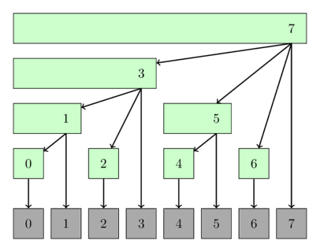

# Fenwick daraxti

$f$ — qandaydir **guruh amali**, ya’ni ayniyat elementi va teskari elementlari mavjud bo‘lgan to‘plamdagi ikki argumentli assotsiativ funksiya, $A$ esa uzunligi $N$ bo‘lgan butun sonlar massivi bo‘lsin.

$f$ funksiyaning infiks yozuvini $*$ bilan belgilaymiz: ixtiyoriy $x,y$ butun sonlari uchun $f(x,y)=x*y$. Amal assotsiativ bo‘lgani sababli infiks yozuvda amal bajarilish tartibini ko‘rsatuvchi qavslarni tashlab ketamiz.

**Fenwick daraxti** quyidagilarni bajaradigan ma’lumotlar tuzilmasidir:

- berilgan $[l,r]$ oraliqda $f$ qiymatini, ya’ni $A_l*A_{l+1}*\dots*A_r$ ni $O(\log N)$ vaqtda hisoblaydi;
- $A$ massivining bitta elementini $O(\log N)$ vaqtda yangilaydi;
- $O(N)$ xotira talab qiladi — bu $A$ massivining o‘zi egallaydigan xotira bilan bir xil tartibda;
- ayniqsa ko‘p o‘lchamli massivlarda ishlatish va kodlash uchun qulay.

Fenwick daraxtining eng keng tarqalgan qo‘llanishi — **oraliq yig‘indisini hisoblash**. Masalan, butun sonlar to‘plamida qo‘shish guruh amali, ya’ni $f(x,y)=x+y$ deb olinsa, $*$ amali $+$ bo‘ladi va
$A_l*A_{l+1}*\dots*A_r=A_l+A_{l+1}+\dots+A_r$.

Fenwick daraxti **Binary Indexed Tree**, qisqacha **BIT** deb ham ataladi. Uni Peter M. Fenwick 1994-yilda “A new data structure for cumulative frequency tables” nomli maqolasida birinchi bo‘lib tavsiflagan.

## Tavsif

### Umumiy ko‘rinish

Soddalik uchun bundan buyon $f(x,y)=x+y$ deb olamiz.

Bizga $A[0\dots N-1]$ butun sonlar massivi berilgan bo‘lsin. Bu yerda indekslash noldan boshlanadi. Fenwick daraxti aslida $T[0\dots N-1]$ massividir; uning har bir elementi $A$ ning muayyan $[g(i),i]$ oralig‘idagi elementlari yig‘indisiga teng:

$$T_i = \sum_{j = g(i)}^{i}{A_j}$$

Bu yerda $g$ funksiya $0\le g(i)\le i$ shartini qanoatlantiradi. $g$ ning aniq ta’rifi keyinroq beriladi.

Tuzilma “daraxt” deb atalishining sababi — uni chiroyli daraxt ko‘rinishida tasvirlash mumkin. Ammo implementatsiyada haqiqiy tugunlar va qirralardan iborat daraxt yaratish shart emas; barcha so‘rovlar uchun faqat $T$ massivini saqlash yetarli.

**Eslatma.** Ushbu maqoladagi asosiy Fenwick daraxti noldan boshlanuvchi indekslashdan foydalanadi. Amaliyotda birga asoslangan indekslashli variant ham juda mashhur. Implementatsiya bo‘limida uning kodi ham beriladi. Ikki variantning vaqt va xotira murakkabligi bir xil.

Endi yuqorida aytilgan ikki amalning psevdokodini yozishimiz mumkin. Quyidagi funksiyalar $A$ ning $[0,r]$ oralig‘idagi yig‘indisini topadi va $A_i$ elementini ma’lum `delta` qiymatga oshiradi:

```python
def sum(int r):
    res = 0
    while (r >= 0):
        res += t[r]
        r = g(r) - 1
    return res

def increase(int i, int delta):
    for all j with g(j) <= i <= j:
        t[j] += delta
```

`sum` funksiyasi quyidagicha ishlaydi:

1. Avval $[g(r),r]$ oralig‘ining yig‘indisini, ya’ni $T[r]$ ni `res` ga qo‘shadi.
2. So‘ng $[g(g(r)-1),g(r)-1]$ oralig‘iga “sakraydi” va uning yig‘indisini ham javobga qo‘shadi.
3. Jarayon $[0,g(g(\dots g(r)-1\dots)-1)]$ oralig‘idan $[g(-1),-1]$ ga o‘tilguncha davom etadi; shu paytda funksiya to‘xtaydi.

`increase` xuddi shu g‘oyani indekslar o‘sishi yo‘nalishida qo‘llaydi. $g(j)\le i\le j$ bo‘lgan har bir $[g(j),j]$ oralig‘ining yig‘indisi `delta` ga oshiriladi, ya’ni `t[j] += delta` bajariladi. Shunday qilib, $A_i$ kiradigan barcha oraliqlarga mos $T$ elementlari yangilanadi.

`sum` va `increase` ning murakkabligi $g$ funksiyasining tanlanishiga bog‘liq. $0\le g(i)\le i$ shartini qanoatlantiruvchi ko‘plab variantlar mavjud. Masalan, $g(i)=i$ olinsa, $T=A$ bo‘ladi va yangilash tez, ammo yig‘indi so‘rovlari sekin ishlaydi. $g(i)=0$ olinsa, $T$ prefiks yig‘indilari massiviga aylanadi: $[0,i]$ yig‘indisi $O(1)$ da topiladi, ammo yangilash sekinlashadi.

Fenwick daraxtining asosiy hiylasi shundaki, $g$ maxsus tanlanib, ikkala amal ham $O(\log N)$ vaqtda bajariladi.

### $g(i)$ funksiyasining ta’rifi {data-toc-label="Definition of g(i)"}

$g(i)$ ni hisoblash uchun $i$ sonining ikkilik yozuvidagi oxirgi ketma-ket barcha $1$ bitlarni $0$ ga almashtiramiz.

Boshqacha aytganda, $i$ ning eng kichik razryadli biti $0$ bo‘lsa, $g(i)=i$. Aks holda eng oxirgi $1$ va undan keyingi barcha oxirgi $1$ bitlar nolga aylantiriladi.

Masalan:

$$\begin{align}
g(11) = g(1011_2) = 1000_2 &= 8 \\
g(12) = g(1100_2) = 1100_2 &= 12 \\
g(13) = g(1101_2) = 1100_2 &= 12 \\
g(14) = g(1110_2) = 1110_2 &= 14 \\
g(15) = g(1111_2) = 0000_2 &= 0 \\
\end{align}$$

Bu amal bitli operatorlar orqali juda sodda yoziladi:

$$g(i) = i ~\&~ (i+1),$$

bu yerda $\&$ — bitli AND operatori. Ushbu formula yuqoridagi oxirgi $1$ bitlarni nolga aylantirish amalini aynan bajarishini ikkilik yozuvdan ko‘rish qiyin emas.

Endi $g(j)\le i\le j$ bo‘ladigan barcha $j$ larni qanday aylanib chiqishni topish kerak. Buning uchun $i$ dan boshlaymiz va har safar eng oxirgi o‘rnatilmagan bitni $1$ ga aylantiramiz. Bu amalni $h(j)$ deb ataymiz.

Masalan, $i=10$ uchun:

$$\begin{align}
10 &= 0001010_2 \\
h(10) = 11 &= 0001011_2 \\
h(11) = 15 &= 0001111_2 \\
h(15) = 31 &= 0011111_2 \\
h(31) = 63 &= 0111111_2 \\
\vdots &
\end{align}$$

$h$ ham bitli operatorlar orqali sodda hisoblanadi:

$$h(j) = j ~|~ (j+1),$$

bu yerda $|$ — bitli OR operatori.

Quyidagi rasm Fenwick daraxtini daraxt sifatida talqin qilish usullaridan birini ko‘rsatadi. Har bir tugun o‘zi qamrab oladigan oraliqni ifodalaydi.

<div style="text-align: center;">
  
</div>

## Implementatsiya

### Bir o‘lchamli massivda yig‘indini topish

Quyida yig‘indi so‘rovlari va bitta elementni yangilash uchun Fenwick daraxti implementatsiyasi berilgan.

Oddiy Fenwick daraxti `sum(int r)` yordamida bevosita faqat $[0,r]$ turidagi yig‘indilarni hisoblaydi. Ixtiyoriy $[l,r]$ yig‘indisini esa $[0,r]$ va $[0,l-1]$ prefikslarining ayirmasi sifatida topish mumkin. Bu `sum(int l, int r)` metodida bajariladi.

Implementatsiya ikkita konstruktorni qo‘llab-quvvatlaydi: daraxtni nollardan yaratish yoki mavjud massivni Fenwick ko‘rinishiga o‘tkazish mumkin.

```{.cpp file=fenwick_sum}
struct FenwickTree {
    vector<int> bit;  // binary indexed tree
    int n;

    FenwickTree(int n) {
        this->n = n;
        bit.assign(n, 0);
    }

    FenwickTree(vector<int> const &a) : FenwickTree(a.size()) {
        for (size_t i = 0; i < a.size(); i++)
            add(i, a[i]);
    }
    int sum(int r) {
        int ret = 0;
        for (; r >= 0; r = (r & (r + 1)) - 1)
            ret += bit[r];
        return ret;
    }

    int sum(int l, int r) {
        return sum(r) - sum(l - 1);
    }

    void add(int idx, int delta) {
        for (; idx < n; idx = idx | (idx + 1))
            bit[idx] += delta;
    }
};
```

### Chiziqli vaqtda qurish

Yuqoridagi konstruktor $O(N\log N)$ vaqt talab qiladi. Uni $O(N)$ gacha yaxshilash mumkin.

$i$ indeksdagi $a[i]$ soni `bit[i]` da saqlanadigan oraliqqa va $i | (i+1)$ indeks ishtirok etadigan barcha kattaroq oraliqlarga hissa qo‘shadi. Elementlarni indeks tartibida qo‘shsak, joriy yig‘indini faqat keyingi oraliqqa uzatish kifoya; u yerdan bu qiymat keyingi oraliqlarga yana uzatiladi.

```cpp
FenwickTree(vector<int> const &a) : FenwickTree(a.size()){
    for (int i = 0; i < n; i++) {
        bit[i] += a[i];
        int r = i | (i + 1);
        if (r < n) bit[r] += bit[i];
    }
}
```

### Bir o‘lchamli massivda $[0,r]$ minimumini topish {data-toc-label="Finding minimum of [0, r] in one-dimensional array"}

Fenwick daraxti orqali umumiy $[l,r]$ minimumini oddiy usulda topib bo‘lmaydi, chunki ushbu variant faqat $[0,r]$ turidagi so‘rovlarga javob beradi. Bundan tashqari, har bir `update` da yangi qiymat joriy qiymatdan kichik bo‘lishi kerak.

Bu ikki jiddiy cheklovning sababi shuki, butun sonlar to‘plamidagi `min` amali guruh hosil qilmaydi: teskari elementlar mavjud emas. Yig‘indida $[0,r]$ dan $[0,l-1]$ ni ayirish mumkin, minimumda esa bunday teskari amal yo‘q.

```{.cpp file=fenwick_min}
struct FenwickTreeMin {
    vector<int> bit;
    int n;
    const int INF = (int)1e9;

    FenwickTreeMin(int n) {
        this->n = n;
        bit.assign(n, INF);
    }

    FenwickTreeMin(vector<int> a) : FenwickTreeMin(a.size()) {
        for (size_t i = 0; i < a.size(); i++)
            update(i, a[i]);
    }

    int getmin(int r) {
        int ret = INF;
        for (; r >= 0; r = (r & (r + 1)) - 1)
            ret = min(ret, bit[r]);
        return ret;
    }
    void update(int idx, int val) {
        for (; idx < n; idx = idx | (idx + 1))
            bit[idx] = min(bit[idx], val);
    }
};
```

Ixtiyoriy oraliq minimum so‘rovlari va ixtiyoriy yangilashlarni qo‘llab-quvvatlaydigan Fenwick daraxtini ham qurish mumkin. [Efficient Range Minimum Queries using Binary Indexed Trees](http://ioinformatics.org/oi/pdf/v9_2015_39_44.pdf) maqolasida shunday usul tavsiflangan. Unda massiv ustida tuzilishi biroz boshqacha bo‘lgan ikkinchi Binary Indexed Tree ham saqlanadi, chunki bitta daraxt barcha element qiymatlarini yetarli darajada ifodalay olmaydi. Implementatsiya odatiy yig‘indi Fenwick daraxtiga qaraganda ancha murakkab.

### Ikki o‘lchamli massivda yig‘indini topish

Fenwick daraxtini ko‘p o‘lchamli massivlar uchun umumlashtirish juda oson. Ikki o‘lchamli holatda ikkala koordinata bo‘ylab bir xil bitli “sakrashlar” bajariladi.

```cpp
struct FenwickTree2D {
    vector<vector<int>> bit;
    int n, m;

    // init(...) { ... }

    int sum(int x, int y) {
        int ret = 0;
        for (int i = x; i >= 0; i = (i & (i + 1)) - 1)
            for (int j = y; j >= 0; j = (j & (j + 1)) - 1)
                ret += bit[i][j];
        return ret;
    }
    void add(int x, int y, int delta) {
        for (int i = x; i < n; i = i | (i + 1))
            for (int j = y; j < m; j = j | (j + 1))
                bit[i][j] += delta;
    }
};
```

### Birga asoslangan indekslash

Bu yondashuvda $T[]$ va $g()$ ning ta’rifi biroz o‘zgaradi. Endi $T[i]$ $[g(i)+1,i]$ oralig‘ining yig‘indisini saqlasin. Shunda psevdokod quyidagicha ko‘rinadi:

```python
def sum(int r):
    res = 0
    while (r > 0):
        res += t[r]
        r = g(r)
    return res

def increase(int i, int delta):
    for all j with g(j) < i <= j:
        t[j] += delta
```

Bu variantda $g(i)$ — $i$ ning ikkilik yozuvidagi eng oxirgi o‘rnatilgan $1$ bitni o‘chirish amali:

$$\begin{align}
g(7) = g(111_2) = 110_2 &= 6 \\
g(6) = g(110_2) = 100_2 &= 4 \\
g(4) = g(100_2) = 000_2 &= 0 \\
\end{align}$$

Eng oxirgi o‘rnatilgan bitni $i~\&~(-i)$ bilan ajratib olish mumkin. Demak:

$$g(i) = i - (i ~\&~ (-i)).$$

$A[i]$ ni yangilash uchun $T[j]$ qiymatlari $i,h(i),h(h(i)),\dots$ ketma-ketligida o‘zgartiriladi, bu yerda

$$h(i) = i + (i ~\&~ (-i)).$$

Bu yondashuvning asosiy afzalligi — ikkala bitli amal bir-birini juda chiroyli to‘ldiradi.

Quyidagi klass tashqi interfeysda noldan boshlanuvchi indekslarni qabul qiladi, lekin ichkarida birga asoslangan indekslashdan foydalanadi.

```{.cpp file=fenwick_sum_onebased}
struct FenwickTreeOneBasedIndexing {
    vector<int> bit;  // binary indexed tree
    int n;

    FenwickTreeOneBasedIndexing(int n) {
        this->n = n + 1;
        bit.assign(n + 1, 0);
    }

    FenwickTreeOneBasedIndexing(vector<int> a)
        : FenwickTreeOneBasedIndexing(a.size()) {
        for (size_t i = 0; i < a.size(); i++)
            add(i, a[i]);
    }
    int sum(int idx) {
        int ret = 0;
        for (++idx; idx > 0; idx -= idx & -idx)
            ret += bit[idx];
        return ret;
    }

    int sum(int l, int r) {
        return sum(r) - sum(l - 1);
    }

    void add(int idx, int delta) {
        for (++idx; idx < n; idx += idx & -idx)
            bit[idx] += delta;
    }
};
```

## Oraliq amallari

Fenwick daraxti quyidagi uch turdagi oraliq amallarini qo‘llab-quvvatlashi mumkin:

1. nuqtaviy yangilash va oraliq so‘rovi;
2. oraliq yangilashi va nuqtaviy so‘rov;
3. oraliq yangilashi va oraliq so‘rovi.

### 1. Nuqtaviy yangilash va oraliq so‘rovi

Bu yuqorida tushuntirilgan odatiy Fenwick daraxtidir: bitta element o‘zgartiriladi va istalgan oraliq yig‘indisi ikki prefiks yig‘indisining ayirmasi orqali olinadi.

### 2. Oraliq yangilashi va nuqtaviy so‘rov

Sodda hiyla yordamida teskari amallarni ham bajarish mumkin: butun oraliqni oshirish va bitta nuqtadagi qiymatni so‘rash.

Fenwick daraxti dastlab nollardan iborat bo‘lsin. $[l,r]$ oralig‘ini $x$ ga oshirmoqchi bo‘lsak, daraxtda ikkita nuqtaviy yangilash bajaramiz: `add(l, x)` va `add(r+1, -x)`.

$A[i]$ ning qiymatini bilish uchun odatiy prefiks yig‘indisini hisoblaymiz. Nega bu ishlashini bitta yangilash orqali ko‘rish mumkin:

- $i<l$ bo‘lsa, ikkala yangilash ham so‘rovga ta’sir qilmaydi va javob $0$ bo‘ladi;
- $i\in[l,r]$ bo‘lsa, birinchi yangilash sababli javob $x$ bo‘ladi;
- $i>r$ bo‘lsa, ikkinchi yangilash birinchisining ta’sirini bekor qiladi.

Quyidagi implementatsiya ichkarida birga asoslangan indekslashdan foydalanadi.

```cpp
void add(int idx, int val) {
    for (++idx; idx < n; idx += idx & -idx)
        bit[idx] += val;
}

void range_add(int l, int r, int val) {
    add(l, val);
    add(r + 1, -val);
}

int point_query(int idx) {
    int ret = 0;
    for (++idx; idx > 0; idx -= idx & -idx)
        ret += bit[idx];
    return ret;
}
```

Albatta, bitta $A[i]$ nuqtani ham `range_add(i, i, val)` orqali oshirish mumkin.

### 3. Oraliq yangilashi va oraliq so‘rovi

Ham oraliq yangilash, ham oraliq yig‘indi so‘rovini qo‘llab-quvvatlash uchun dastlab nollardan iborat ikkita BIT — $B_1[]$ va $B_2[]$ — saqlaymiz.

$[l,r]$ oralig‘ini $x$ ga oshirmoqchi bo‘laylik. Oldingi usuldagidek $B_1$ da `add(B1, l, x)` va `add(B1, r+1, -x)` nuqtaviy yangilashlarini bajaramiz. Bundan tashqari, quyidagicha $B_2$ ni ham yangilaymiz:

```python
def range_add(l, r, x):
    add(B1, l, x)
    add(B1, r+1, -x)
    add(B2, l, x*(l-1))
    add(B2, r+1, -x*r))
```

Bitta $(l,r,x)$ yangilashidan keyin prefiks yig‘indisi quyidagi qiymatlarni qaytarishi kerak:

$$
sum[0, i]=
\begin{cases}
0 & i < l \\
x \cdot (i-(l-1)) & l \le i \le r \\
x \cdot (r-l+1) & i > r \\
\end{cases}
$$

Oraliq yig‘indisini ikki hadning ayirmasi sifatida yozish mumkin: birinchi had uchun $B_1$, ikkinchisi uchun $B_2$ ishlatiladi. Ularning ayirmasi $[0,i]$ prefiks yig‘indisini beradi:

$$\begin{align}
sum[0, i] &= sum(B_1, i) \cdot i - sum(B_2, i) \\
&= \begin{cases}
0 \cdot i - 0 & i < l\\
x \cdot i - x \cdot (l-1) & l \le i \le r \\
0 \cdot i - (x \cdot (l-1) - x \cdot r) & i > r \\
\end{cases}
\end{align}
$$

Oxirgi ifoda talab qilingan uchta holatga aynan teng. Demak, $B_1[i]\times i$ ni hisoblaganimizda paydo bo‘ladigan ortiqcha hadlarni $B_2$ yordamida olib tashlaymiz.

Ixtiyoriy $[l,r]$ yig‘indisi yana $r$ va $l-1$ prefikslarining ayirmasi sifatida topiladi.

```python
def add(b, idx, x):
    while idx <= N:
        b[idx] += x
        idx += idx & -idx

def range_add(l,r,x):
    add(B1, l, x)
    add(B1, r+1, -x)
    add(B2, l, x*(l-1))
    add(B2, r+1, -x*r)
def sum(b, idx):
    total = 0
    while idx > 0:
        total += b[idx]
        idx -= idx & -idx
    return total

def prefix_sum(idx):
    return sum(B1, idx)*idx -  sum(B2, idx)

def range_sum(l, r):
    return prefix_sum(r) - prefix_sum(l-1)
```

## Amaliy masalalar

- [UVA 12086 — Potentiometers](https://uva.onlinejudge.org/index.php?option=com_onlinejudge&Itemid=8&category=24&page=show_problem&problem=3238)
- [LOJ 1112 — Curious Robin Hood](http://www.lightoj.com/volume_showproblem.php?problem=1112)
- [LOJ 1266 — Points in Rectangle](http://www.lightoj.com/volume_showproblem.php?problem=1266 "2D Fenwick Tree")
- [CodeChef — SPREAD](http://www.codechef.com/problems/SPREAD)
- [SPOJ — CTRICK](http://www.spoj.com/problems/CTRICK/)
- [SPOJ — MATSUM](http://www.spoj.com/problems/MATSUM/)
- [SPOJ — DQUERY](http://www.spoj.com/problems/DQUERY/)
- [SPOJ — NKTEAM](http://www.spoj.com/problems/NKTEAM/)
- [SPOJ — YODANESS](http://www.spoj.com/problems/YODANESS/)
- [SRM 310 — FloatingMedian](https://community.topcoder.com/stat?c=problem_statement&pm=6551&rd=9990)
- [SPOJ — Ada and Behives](http://www.spoj.com/problems/ADABEHIVE/)
- [HackerEarth — Counting in Byteland](https://www.hackerearth.com/practice/data-structures/advanced-data-structures/fenwick-binary-indexed-trees/practice-problems/algorithm/counting-in-byteland/)
- [DevSkill — Shan and String (archive)](http://web.archive.org/web/20210322010617/https://devskill.com/CodingProblems/ViewProblem/300)
- [Codeforces — Little Artem and Time Machine](http://codeforces.com/contest/669/problem/E)
- [Codeforces — Hanoi Factory](http://codeforces.com/contest/777/problem/E)
- [SPOJ — Tulip and Numbers](http://www.spoj.com/problems/TULIPNUM/)
- [SPOJ — SUMSUM](http://www.spoj.com/problems/SUMSUM/)
- [SPOJ — Sabir and Gifts](http://www.spoj.com/problems/SGIFT/)
- [SPOJ — The Permutation Game Again](http://www.spoj.com/problems/TPGA/)
- [SPOJ — Zig when you Zag](http://www.spoj.com/problems/ZIGZAG2/)
- [SPOJ — Cryon](http://www.spoj.com/problems/CRAYON/)
- [SPOJ — Weird Points](http://www.spoj.com/problems/DCEPC705/)
- [SPOJ — Its a Murder](http://www.spoj.com/problems/DCEPC206/)
- [SPOJ — Bored of Suffixes and Prefixes](http://www.spoj.com/problems/KOPC12G/)
- [SPOJ — Mega Inversions](http://www.spoj.com/problems/TRIPINV/)
- [Codeforces — Subsequences](http://codeforces.com/contest/597/problem/C)
- [Codeforces — Ball](http://codeforces.com/contest/12/problem/D)
- [GYM — The Kamphaeng Phet's Chedis](http://codeforces.com/gym/101047/problem/J)
- [Codeforces — Garlands](http://codeforces.com/contest/707/problem/E)
- [Codeforces — Inversions after Shuffle](http://codeforces.com/contest/749/problem/E)
- [GYM — Cairo Market](http://codeforces.com/problemset/gymProblem/101055/D)
- [Codeforces — Goodbye Souvenir](http://codeforces.com/contest/849/problem/E)
- [SPOJ — Ada and Species](http://www.spoj.com/problems/ADACABAA/)
- [Codeforces — Thor](https://codeforces.com/problemset/problem/704/A)
- [CSES — Forest Queries II](https://cses.fi/problemset/task/1739/)
- [Latin American Regionals 2017 — Fundraising](http://matcomgrader.com/problem/9346/fundraising/)

## Boshqa manbalar

- [Wikipedia’dagi Fenwick tree maqolasi](http://en.wikipedia.org/wiki/Fenwick_tree)
- [TopCoder’dagi Binary Indexed Trees qo‘llanmasi](https://www.topcoder.com/community/data-science/data-science-tutorials/binary-indexed-trees/)
- [Fenwick daraxtida oraliq yangilashlar va so‘rovlar](https://programmingcontests.quora.com/Tutorial-Range-Updates-in-Fenwick-Tree)

