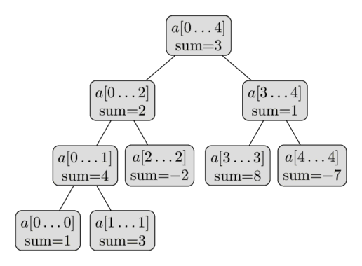
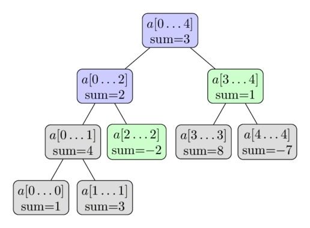
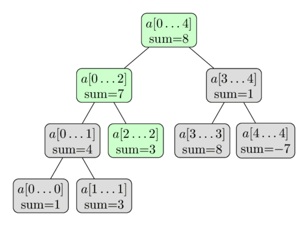

# Segment daraxti

Segment Tree — massiv oraliqlari haqidagi ma’lumotni daraxt ko‘rinishida saqlaydigan ma’lumotlar tuzilmasi. U massivdagi oraliq so‘rovlariga samarali javob berish bilan birga, massivni tez o‘zgartirish imkonini ham saqlab qoladi.
Masalan, ketma-ket joylashgan $a[l \dots r]$ elementlar yig‘indisini yoki shunday oraliqdagi eng kichik elementni $O(\log n)$ vaqtda topish mumkin.
Bunday so‘rovlar orasida Segment Tree massivni bitta elementni almashtirish orqali, hatto butun bir ostkesma elementlarini o‘zgartirish orqali ham yangilashga imkon beradi. Masalan, $a[l \dots r]$ elementlarning barchasiga ixtiyoriy qiymat berish yoki ostkesmadagi barcha elementlarga biror qiymat qo‘shish mumkin.

Umuman olganda, Segment Tree juda moslashuvchan ma’lumotlar tuzilmasi bo‘lib, uning yordamida nihoyatda ko‘p masalalarni yechish mumkin.
Bundan tashqari, murakkabroq amallarni bajarish va murakkabroq so‘rovlarga javob berish ham mumkin; [Segment Tree’ning ilg‘or ko‘rinishlari](segment_tree.md#advanced-versions-of-segment-trees) bo‘limiga qarang.
Xususan, Segment Tree’ni kattaroq o‘lchamlarga oson umumlashtirish mumkin.
Masalan, ikki o‘lchamli Segment Tree yordamida berilgan matritsaning biror to‘g‘ri to‘rtburchak ostqismidagi yig‘indi yoki minimum so‘roviga atigi $O(\log^2 n)$ vaqtda javob berish mumkin.

Segment Tree’ning muhim xususiyatlaridan biri — unga faqat chiziqli miqdorda xotira kerak bo‘lishidir.
Standart Segment Tree o‘lchami $n$ bo‘lgan massiv uchun $4n$ ta tugun talab qiladi.

## Segment Tree’ning eng sodda ko‘rinishi

Avval Segment Tree’ning eng sodda ko‘rinishini ko‘rib chiqamiz.
Yig‘indi so‘rovlariga samarali javob bermoqchimiz.
Masalaning rasmiy ta’rifi quyidagicha:
$a[0 \dots n-1]$ massiv berilgan. Segment Tree indekslari $l$ va $r$ orasidagi elementlar yig‘indisini, ya’ni $\sum_{i=l}^r a[i]$ qiymatni topa olishi, shuningdek massiv elementlari qiymatining o‘zgarishini — $a[i] = x$ ko‘rinishidagi qiymat berish amallarini — qo‘llab-quvvatlashi kerak.
Segment Tree **har ikkala** turdagi so‘rovni $O(\log n)$ vaqtda bajarishi lozim.

Bu sodda yondashuvlarga nisbatan yaxshilanishdir.
Oddiy massivdan foydalanadigan sodda implementatsiya elementni $O(1)$ vaqtda yangilaydi, ammo har bir yig‘indi so‘rovini hisoblash uchun $O(n)$ vaqt talab qiladi.
Oldindan hisoblangan prefiks yig‘indilari esa yig‘indi so‘roviga $O(1)$ vaqtda javob beradi, lekin bitta massiv elementi yangilanganda prefiks yig‘indilarida $O(n)$ ta o‘zgarish qilish kerak bo‘ladi.

### Segment Tree tuzilishi

Massiv kesmalariga “bo‘lib tashla va hukmronlik qil” yondashuvini qo‘llash mumkin.
Avval butun massiv elementlari yig‘indisini, ya’ni $a[0 \dots n-1]$ kesma yig‘indisini hisoblab saqlaymiz.
Keyin massivni $a[0 \dots (n-1)/2]$ va $a[(n+1)/2 \dots n-1]$ yarimlariga ajratib, har bir yarimning yig‘indisini hisoblaymiz va saqlaymiz.
Bu ikki yarimning har birini yana ikkiga bo‘lamiz va barcha kesmalar o‘lchami $1$ bo‘lguncha shu jarayonni davom ettiramiz.

Bu kesmalarni ikkilik daraxt hosil qiladi deb qarash mumkin:
daraxt ildizi $a[0 \dots n-1]$ kesmaga mos keladi, har bir tugunda esa — barg tugunlardan tashqari — aynan ikkita farzand bor.
Shuning uchun ma’lumotlar tuzilmasi “Segment Tree” deb ataladi, garchi ko‘pchilik implementatsiyalarda daraxt oshkora qurilmasa ham; [Implementatsiya](segment_tree.md#implementation) bo‘limiga qarang.

$a = [1, 3, -2, 8, -7]$ massiv ustida qurilgan bunday Segment Tree’ning ko‘rinishi quyidagicha:



Tuzilmaning shu qisqa tavsifidanoq Segment Tree uchun tugunlar soni chiziqli ekanini xulosa qilish mumkin.
Daraxtning birinchi darajasida bitta tugun — ildiz, ikkinchi darajasida ikkita, uchinchi darajasida to‘rtta tugun bo‘ladi va tugunlar soni $n$ ga yetguncha shu tarzda davom etadi.
Demak, eng yomon holatdagi tugunlar sonini $1 + 2 + 4 + \dots + 2^{\lceil\log_2 n\rceil} \lt 2^{\lceil\log_2 n\rceil + 1} \lt 4n$ yig‘indi bilan baholash mumkin.

$n$ ikkilik daraja bo‘lmasa, Segment Tree’ning barcha darajalari to‘liq to‘lmasligini qayd etish kerak.
Rasmda aynan shu holatni ko‘rish mumkin.
Hozircha bu faktni chetga surish mumkin, ammo implementatsiya vaqtida u muhim bo‘ladi.

Segment Tree balandligi $O(\log n)$ ga teng, chunki ildizdan barglarga tushishda kesmalar o‘lchami har safar taxminan ikki baravar kamayadi.

### Qurish

Segment Tree’ni qurishdan oldin ikki narsani aniqlab olish kerak:

1. Segment Tree’ning har bir tugunida saqlanadigan *qiymat*.
   Masalan, yig‘indi Segment Tree’sida tugun o‘zining $[l, r]$ oralig‘idagi elementlar yig‘indisini saqlaydi.
2. Segment Tree’dagi aka-uka ikki tugunni birlashtiradigan *merge* amali.
   Masalan, yig‘indi Segment Tree’sida $a[l_1 \dots r_1]$ va $a[l_2 \dots r_2]$ oraliqlarga mos tugunlar qiymatlarini qo‘shish orqali $a[l_1 \dots r_2]$ oraliqqa mos tugunga birlashtiriladi.

Agar tugunga mos kesma boshlang‘ich massivning faqat bitta qiymatini qoplasa, u **barg tugun** hisoblanadi. Bunday tugun Segment Tree’ning eng quyi darajasida joylashadi va uning qiymati mos $a[i]$ elementga teng bo‘ladi.

Segment Tree’ni qurishda eng quyi darajadan — barg tugunlardan — boshlaymiz va ularga mos qiymatlarni beramiz. Shu qiymatlar asosida `merge` funksiyasi yordamida yuqoridagi daraja qiymatlarini hisoblaymiz.
Keyin shu natijalar asosida navbatdagi yuqori darajani hisoblaymiz va ildizga yetguncha jarayonni takrorlaymiz.

Bu amalni teskari yo‘nalishda, ya’ni ildizdan barglarga qarab rekursiv tasvirlash qulayroq. Barg bo‘lmagan tugunda chaqirilgan qurish amali quyidagilarni bajaradi:

1. ikki farzand tugun qiymatlarini rekursiv quradi;
2. hisoblangan farzand qiymatlarini birlashtiradi.

Qurishni ildiz tugundan boshlaganimiz uchun butun Segment Tree’ni hisoblay olamiz.

Birlashtirish amali o‘zgarmas vaqt olsa, qurishning vaqt murakkabligi $O(n)$ bo‘ladi. Birlashtirish amali Segment Tree’dagi ichki tugunlar soniga teng bo‘lgan $n$ marta chaqiriladi.

### Yig‘indi so‘rovlari

Hozircha yig‘indi so‘rovlariga javob beramiz. Kirishda $l$ va $r$ butun sonlari beriladi, $a[l \dots r]$ kesma yig‘indisini $O(\log n)$ vaqtda hisoblash kerak.

Buning uchun Segment Tree bo‘ylab yuramiz va kesmalarning oldindan hisoblangan yig‘indilaridan foydalanamiz.
Aytaylik, hozir $a[tl \dots tr]$ kesmani qoplaydigan tugundamiz.
Uchta holat bo‘lishi mumkin.

Eng sodda holatda $a[l \dots r]$ so‘rov kesmasi joriy tugun kesmasiga aynan teng, ya’ni $a[l \dots r] = a[tl \dots tr]$ bo‘ladi. Bu holda ish tugaydi va tugunda saqlangan oldindan hisoblangan yig‘indini qaytarish mumkin.

Boshqa holatda so‘rov kesmasi chap yoki o‘ng farzand qamroviga to‘liq tushishi mumkin.
Chap farzand $a[tl \dots tm]$ kesmani, o‘ng farzand esa $a[tm + 1 \dots tr]$ kesmani qoplashini eslang; bunda $tm = (tl + tr) / 2$.
Bu holda so‘rov kesmasini qoplaydigan farzand tugunga o‘tib, shu tugun uchun ayni algoritmni bajarish kifoya.

Oxirgi holatda so‘rov kesmasi ikkala farzand kesmasi bilan ham kesishadi.
Unda har bir farzand uchun bittadan, jami ikkita rekursiv chaqiruv bajarishga to‘g‘ri keladi.
Avval chap farzandga o‘tib, so‘rov kesmasi bilan chap farzand kesmasi kesishmasidagi qiymatlar yig‘indisini — qisman javobni — hisoblaymiz. Keyin o‘ng farzand uchun ikkinchi qisman javobni topamiz va ularni qo‘shamiz.
Boshqacha aytganda, chap farzand $a[tl \dots tm]$, o‘ng farzand esa $a[tm+1 \dots tr]$ kesmani ifodalagani uchun chap farzand yordamida $a[l \dots tm]$ yig‘indi so‘rovini, o‘ng farzand yordamida esa $a[tm+1 \dots r]$ yig‘indi so‘rovini hisoblaymiz.

Demak, yig‘indi so‘rovini qayta ishlaydigan funksiya so‘rov chegaralarini o‘zgartirmasdan chap yoki o‘ng farzandlardan bittasini bir marta rekursiv chaqiradi yoki so‘rovni ikki ostso‘rovga ajratib, chap va o‘ng farzandlarning har birini bir martadan chaqiradi.
Joriy so‘rov kesmasi chegaralari joriy tugun kesmasi chegaralari bilan ustma-ust tushganda rekursiya tugaydi.
Bu holda daraxt tugunida saqlangan, shu kesma uchun oldindan hisoblangan yig‘indi javob bo‘ladi.

Ya’ni so‘rovni hisoblash daraxt bo‘ylab yurishdan iborat: yurish daraxtning barcha zarur shoxlariga tarqaladi va tugunlarda saqlangan oldindan hisoblangan kesma yig‘indilaridan foydalanadi.

Tabiiyki, yurishni Segment Tree ildizidan boshlaymiz.

Jarayon quyidagi rasmda ko‘rsatilgan.
Yana $a = [1, 3, -2, 8, -7]$ massividan foydalanamiz va bu safar $\sum_{i=2}^4 a[i]$ yig‘indini hisoblamoqchimiz.
Rangli tugunlarga tashrif buyuriladi, yashil tugunlarning oldindan hisoblangan qiymatlaridan foydalaniladi.
Natija $-2 + 1 = -1$ bo‘ladi.



Nega bu algoritm murakkabligi $O(\log n)$?
Buni ko‘rsatish uchun daraxtning har bir darajasini alohida ko‘ramiz.
Har bir darajada ko‘pi bilan to‘rtta tugunga tashrif buyurilishi ma’lum bo‘ladi.
Daraxt balandligi $O(\log n)$ bo‘lgani uchun talab qilingan ishlash vaqti kelib chiqadi.

Har bir darajada ko‘pi bilan to‘rtta tugunga tashrif buyurilishi haqidagi da’voni induksiya bilan isbotlash mumkin.
Birinchi darajada faqat bitta tugun — ildizga — tashrif buyuramiz, demak to‘rttadan kam tugun ko‘riladi.
Endi ixtiyoriy darajani ko‘raylik.
Induksiya faraziga ko‘ra, unda ko‘pi bilan to‘rtta tugunga tashrif buyuriladi.
Agar ko‘pi bilan ikkita tugunga tashrif buyurilsa, keyingi darajada ko‘pi bilan to‘rtta tugun bo‘ladi. Bu ravshan, chunki har bir tugun ko‘pi bilan ikkita rekursiv chaqiruv hosil qiladi.
Shuning uchun joriy darajada uchta yoki to‘rtta tugunga tashrif buyurilgan holatni ko‘raylik.
Bu tugunlar orasidagi o‘rta tugunlarni diqqat bilan tahlil qilamiz.
Yig‘indi so‘rovi uzluksiz ostmassiv yig‘indisini so‘ragani sababli tashrif buyurilgan o‘rta tugunlarga mos kesmalar so‘rov kesmasi bilan to‘liq qoplanadi.
Shu bois ular boshqa rekursiv chaqiruv qilmaydi.
Faqat eng chap va eng o‘ng tugun rekursiv chaqiruv qilishi mumkin.
Ular birgalikda ko‘pi bilan to‘rtta rekursiv chaqiruv hosil qiladi, shuning uchun keyingi darajada ham da’vo o‘rinli.
Bitta shox so‘rovning chap chegarasiga, ikkinchi shox esa o‘ng chegarasiga yaqinlashadi, deb aytish mumkin.

Demak, jami ko‘pi bilan $4 \log n$ ta tugunga tashrif buyuriladi va ishlash vaqti $O(\log n)$ bo‘ladi.

Xulosa qilib aytganda, so‘rov kirish kesmasini yig‘indilari daraxtda oldindan hisoblangan va saqlangan bir nechta ostkesmaga ajratadi.
So‘rov kesmasi tugun kesmasiga tenglashgan zahoti ajratishni to‘xtatsak, atigi $O(\log n)$ ta shunday kesma kerak bo‘ladi. Segment Tree samaradorligi shundan kelib chiqadi.

### Yangilash so‘rovlari

Endi massivning muayyan elementini o‘zgartirmoqchimiz; masalan, $a[i] = x$ qiymat berish amalini bajaramiz.
Segment Tree yangi o‘zgartirilgan massivga mos kelishi uchun uni yangilashimiz kerak.

Bu so‘rov yig‘indi so‘rovidan sodda.
Segment Tree’ning har bir darajasi massivni kesmalarga bo‘ladi.
Shuning uchun $a[i]$ element har bir darajadagi faqat bitta kesma qiymatiga hissa qo‘shadi.
Demak, faqat $O(\log n)$ ta tugunni yangilash kerak.

Yangilash so‘rovini rekursiv funksiya bilan implementatsiya qilish oson.
Funksiyaga joriy daraxt tuguni beriladi; u o‘zini ikki farzanddan $a[i]$ elementni o‘z kesmasida saqlaydigan bittasi uchun rekursiv chaqiradi. Shundan keyin `build` usulidagidek, ya’ni ikki farzand yig‘indisi sifatida, joriy tugun yig‘indisini qayta hisoblaydi.

Quyidagi rasmda yana shu massivdan foydalanilgan.
Bu yerda $a[2] = 3$ yangilashini bajaramiz.
Yashil tugunlarga tashrif buyuriladi va ular yangilanadi.



### Implementatsiya ### { #implementation}

Asosiy masala Segment Tree’ni qanday saqlashdir.
Albatta, $\text{Vertex}$ strukturasini ta’riflab, kesma chegaralari, uning yig‘indisi va farzand tugunlarga ko‘rsatkichlarni saqlaydigan obyektlar yaratish mumkin.
Biroq bunday usul ko‘rsatkichlar ko‘rinishida juda ko‘p ortiqcha ma’lumot saqlashni talab qiladi.
Buning o‘rniga ancha samarali oddiy hiyla — **yashirin ma’lumotlar tuzilmasi**dan foydalanamiz: massivda faqat yig‘indilarni saqlaymiz.
Ikkilik uyumlarda ham shunga o‘xshash usul ishlatiladi.
Ildiz tugun yig‘indisi 1-indeksda, uning ikki farzandi yig‘indilari 2- va 3-indekslarda, ularning farzandlari yig‘indilari 4-dan 7-gacha indekslarda va hokazo saqlanadi.
Birlikdan boshlab indekslanganda, $i$ indeksli tugunning chap farzandi qulay tarzda $2i$ indeksda, o‘ng farzandi esa $2i + 1$ indeksda saqlanadi.
Xuddi shunday, $i$ indeksli tugunning ota tuguni $i/2$ indeksda — butun bo‘lish natijasida — joylashadi.

Bu implementatsiyani ancha soddalashtiradi.
Daraxt tuzilishini xotirada alohida saqlash shart emas.
U yashirin ravishda indekslar bilan aniqlanadi.
Bizga barcha kesmalar yig‘indisini saqlaydigan bitta massiv kifoya.

Yuqorida aytilganidek, ko‘pi bilan $4n$ ta tugunni saqlash kerak.
Amaldagi son bundan kam bo‘lishi mumkin, ammo qulaylik uchun har doim $4n$ o‘lchamli massiv ajratamiz.
Yig‘indilar massivining ayrim elementlari haqiqiy daraxtdagi hech bir tugunga mos kelmaydi, lekin bu implementatsiyani murakkablashtirmaydi.

Shunday qilib, Segment Tree’ni kirish o‘lchami $n$ dan to‘rt baravar katta $t[]$ massiv sifatida saqlaymiz:

```{.cpp file=segment_tree_implementation_definition}
int n, t[4*MAXN];
```

Berilgan $a[]$ massivdan Segment Tree qurish amali quyidagicha.
Bu $a[]$ — kirish massivi, $v$ — joriy tugun indeksi, $tl$ va $tr$ esa joriy kesma chegaralari bo‘lgan rekursiv funksiya.
Asosiy dasturda u ildiz tugun parametrlari: $v = 1$, $tl = 0$ va $tr = n - 1$ bilan chaqiriladi.

```{.cpp file=segment_tree_implementation_build}
void build(int a[], int v, int tl, int tr) {
    if (tl == tr) {
        t[v] = a[tl];
    } else {
        int tm = (tl + tr) / 2;
        build(a, v*2, tl, tm);
        build(a, v*2+1, tm+1, tr);
        t[v] = t[v*2] + t[v*2+1];
    }
}
```

Yig‘indi so‘rovlariga javob beruvchi funksiya ham rekursiv. U joriy tugun yoki kesma haqidagi ma’lumotni — $v$ indeks hamda $tl$ va $tr$ chegaralarni — va so‘rovning $l$ hamda $r$ chegaralarini parametr sifatida oladi.
Kodni soddalashtirish uchun bu funksiya faqat bittasi kerak bo‘lgan holatda ham doimo ikki rekursiv chaqiruv bajaradi. Bunday paytda ortiqcha chaqiruvda $l > r$ bo‘ladi va buni funksiya boshidagi qo‘shimcha tekshiruv bilan oson ushlash mumkin.

```{.cpp file=segment_tree_implementation_sum}
int sum(int v, int tl, int tr, int l, int r) {
    if (l > r) 
        return 0;
    if (l == tl && r == tr) {
        return t[v];
    }
    int tm = (tl + tr) / 2;
    return sum(v*2, tl, tm, l, min(r, tm))
           + sum(v*2+1, tm+1, tr, max(l, tm+1), r);
}
```

Nihoyat, yangilash so‘rovi. Funksiya joriy tugun yoki kesma haqidagi ma’lumot bilan birga yangilash parametrlarini — element pozitsiyasi va uning yangi qiymatini — ham oladi.

```{.cpp file=segment_tree_implementation_update}
void update(int v, int tl, int tr, int pos, int new_val) {
    if (tl == tr) {
        t[v] = new_val;
    } else {
        int tm = (tl + tr) / 2;
        if (pos <= tm)
            update(v*2, tl, tm, pos, new_val);
        else
            update(v*2+1, tm+1, tr, pos, new_val);
        t[v] = t[v*2] + t[v*2+1];
    }
}
```

### Xotiradan tejamkor implementatsiya

Ko‘pchilik avvalgi bo‘limdagi implementatsiyadan foydalanadi. `t` massiviga qaralsa, daraxt tugunlari BFS yurishi — darajalar bo‘yicha yurish — tartibida raqamlanganini ko‘rish mumkin.
Bu tartibda $v$ tugunning farzandlari mos ravishda $2v$ va $2v + 1$ bo‘ladi.
Ammo $n$ ikkilik daraja bo‘lmasa, bu usul ayrim indekslarni tashlab ketadi va `t` massivining ba’zi qismlaridan foydalanmaydi.
O‘lchami $n$ bo‘lgan massiv Segment Tree’si aslida atigi $2n - 1$ ta tugun talab qilsa-da, xotira sarfi $4n$ bilan chegaralanadi.

Buni kamaytirish mumkin.
Daraxt tugunlarini Eyler yurishi — preorder yurish — tartibida qayta raqamlab, barcha tugunlarni massivda ketma-ket joylashtiramiz.

$v$ indeksli tugun $[l, r]$ kesma uchun javobgar va $mid = \dfrac{l + r}{2}$ bo‘lsin.
Chap farzand indeksi $v + 1$ bo‘lishi ravshan.
Chap farzand $[l, mid]$ kesma uchun javob beradi, ya’ni uning ost-daraxtida jami $2 * (mid - l + 1) - 1$ ta tugun bo‘ladi.
Shundan $v$ tugunning o‘ng farzandi indeksini hisoblash mumkin: u $v + 2 * (mid - l + 1)$ ga teng.
Bunday raqamlash zarur xotirani $2n$ gacha kamaytiradi.

<a id="advanced-versions-of-segment-trees"></a>

## Segment Tree’ning ilg‘or ko‘rinishlari

Segment Tree juda moslashuvchan ma’lumotlar tuzilmasi bo‘lib, uni turli yo‘nalishlarda o‘zgartirish va kengaytirish mumkin.
Quyida bu variantlarni guruhlarga ajratishga harakat qilamiz.

### Murakkabroq so‘rovlar

Segment Tree’ni yig‘indi o‘rniga minimum yoki maksimum kabi boshqa so‘rovlarni hisoblaydigan qilib o‘zgartirish ba’zan juda oson, ba’zan esa ancha murakkab bo‘lishi mumkin.

#### Maksimumni topish

Yuqoridagi masala shartini biroz o‘zgartiramiz: endi yig‘indi emas, maksimum so‘rovlariga javob beramiz.

Daraxt tuzilishi yuqorida tasvirlangan daraxt bilan aynan bir xil bo‘ladi.
Faqat $\text{build}$ va $\text{update}$ funksiyalarida $t[v]$ qanday hisoblanishini o‘zgartirish kerak.
Endi $t[v]$ mos kesmaning maksimumini saqlaydi.
Shuningdek, $\text{sum}$ funksiyasi qaytaradigan qiymatni hisoblashda qo‘shish o‘rniga maksimum olish kerak.

Tabiiyki, bu masalani maksimum o‘rniga minimum hisoblaydigan ko‘rinishga ham osongina o‘zgartirish mumkin.

Bu sodda variant implementatsiyasini alohida ko‘rsatmaymiz; keyingi bo‘limda uning murakkabroq ko‘rinishi implementatsiya qilinadi.

#### Maksimum va uning uchrashishlar sonini topish

Bu masala oldingisiga juda o‘xshaydi.
Maksimumni topishdan tashqari, uning necha marta uchrashishini ham aniqlash kerak.

Buning uchun daraxtning har bir tugunida sonlar juftligini saqlaymiz:
maksimum bilan birga uning mos kesmada necha marta uchrashganini ham yozamiz.
Farzand tugunlarda saqlangan juftliklar yordamida $t[v]$ da saqlanishi kerak bo‘lgan juftlikni o‘zgarmas vaqtda aniqlash mumkin.
Ikki juftlikni birlashtirishni alohida funksiyaga chiqarish kerak, chunki bu amal daraxtni qurishda, maksimum so‘rovlariga javob berishda va yangilashlarda ishlatiladi.

```{.cpp file=segment_tree_maximum_and_count}
pair<int, int> t[4*MAXN];

pair<int, int> combine(pair<int, int> a, pair<int, int> b) {
    if (a.first > b.first) 
        return a;
    if (b.first > a.first)
        return b;
    return make_pair(a.first, a.second + b.second);
}

void build(int a[], int v, int tl, int tr) {
    if (tl == tr) {
        t[v] = make_pair(a[tl], 1);
    } else {
        int tm = (tl + tr) / 2;
        build(a, v*2, tl, tm);
        build(a, v*2+1, tm+1, tr);
        t[v] = combine(t[v*2], t[v*2+1]);
    }
}

pair<int, int> get_max(int v, int tl, int tr, int l, int r) {
    if (l > r)
        return make_pair(-INF, 0);
    if (l == tl && r == tr)
        return t[v];
    int tm = (tl + tr) / 2;
    return combine(get_max(v*2, tl, tm, l, min(r, tm)), 
                   get_max(v*2+1, tm+1, tr, max(l, tm+1), r));
}

void update(int v, int tl, int tr, int pos, int new_val) {
    if (tl == tr) {
        t[v] = make_pair(new_val, 1);
    } else {
        int tm = (tl + tr) / 2;
        if (pos <= tm)
            update(v*2, tl, tm, pos, new_val);
        else
            update(v*2+1, tm+1, tr, pos, new_val);
        t[v] = combine(t[v*2], t[v*2+1]);
    }
}
```
#### Eng katta umumiy bo‘luvchi yoki eng kichik umumiy karralini hisoblash

Bu masalada massivning berilgan oraliqlaridagi barcha sonlarning EKUB yoki EKUKini hisoblamoqchimiz.

Segment Tree’ning bu qiziqarli varianti yig‘indi, minimum yoki maksimum so‘rovlari uchun qurilgan Segment Tree’lar bilan aynan bir xil usulda yechiladi:
har bir daraxt tugunida mos kesmaning EKUBi yoki EKUKini saqlash kifoya.
Ikki tugun qiymatini ularning EKUBi yoki EKUKini hisoblash orqali birlashtirish mumkin.

<a id="counting-zero-search-kth"></a>

#### Nollar sonini sanash va $k$-nolni qidirish {data-toc-label="Counting the number of zeros, searching for the k-th zero"}

Bu masalada berilgan oraliqdagi nollar sonini topish, ikkinchi funksiya yordamida esa $k$-nol indeksini aniqlash kerak.

Daraxtda saqlanadigan qiymatlarni yana biroz o‘zgartiramiz:
bu safar $t[]$ da har bir kesmadagi nollar sonini saqlaymiz.
$\text{build}$, $\text{update}$ va $\texttt{count\_zero}$ funksiyalarini yig‘indi so‘rovi g‘oyalariga tayangan holda implementatsiya qilish ravshan.
Shu bilan masalaning birinchi qismi yechildi.

Endi $a[]$ massivdagi $k$-nolni topishni o‘rganamiz.
Buning uchun ildizdan boshlab Segment Tree bo‘ylab pastga tushamiz va $k$-nol qaysi kesmada yotishiga qarab har safar chap yoki o‘ng farzandga o‘tamiz.
Qaysi farzandga o‘tishni aniqlash uchun chap farzandga mos kesmadagi nollar soniga qarash yetarli.
Agar oldindan hisoblangan bu son $k$ dan katta yoki unga teng bo‘lsa, chap farzandga tushamiz; aks holda o‘ng farzandga tushamiz.
O‘ng farzand tanlansa, $k$ dan chap farzanddagi nollar sonini ayirish kerakligini unutmang.

Implementatsiyada $a[]$ ichida $k$ tadan kam nol bo‘lgan maxsus holatni -1 qaytarish orqali hisobga olish mumkin.

```{.cpp file=segment_tree_kth_zero}
int find_kth(int v, int tl, int tr, int k) {
    if (k > t[v])
        return -1;
    if (tl == tr)
        return tl;
    int tm = (tl + tr) / 2;
    if (t[v*2] >= k)
        return find_kth(v*2, tl, tm, k);
    else 
        return find_kth(v*2+1, tm+1, tr, k - t[v*2]);
}
```

#### Berilgan yig‘indili massiv prefiksini qidirish

Masala quyidagicha:
berilgan $x$ qiymat uchun $a[]$ massivining dastlabki $i$ elementi yig‘indisi $x$ dan katta yoki unga teng bo‘ladigan eng kichik $i$ indeksni tez topish kerak. Bunda $a[]$ faqat manfiy bo‘lmagan qiymatlardan iborat deb faraz qilinadi.

Bu masalani Segment Tree yordamida prefiks yig‘indilarini hisoblab, ikkilik qidiruv bilan yechish mumkin.
Biroq bunday yechim murakkabligi $O(\log^2 n)$ bo‘ladi.

Buning o‘rniga avvalgi bo‘limdagi kabi daraxt bo‘ylab pastga tushib, chap farzand yig‘indisiga qarab har safar chap yoki o‘ng farzandga o‘tish orqali pozitsiyani topish mumkin.
Shunda javob $O(\log n)$ vaqtda topiladi.

#### Berilgan qiymatdan katta birinchi elementni qidirish

Masala quyidagicha:
berilgan $x$ qiymat va $a[l \dots r]$ oraliq uchun $a[l \dots r]$ ichidagi $a[i]$ qiymati $x$ dan katta bo‘ladigan eng kichik $i$ indeksni topish kerak.

Bu masalani Segment Tree’dagi maksimum prefiks so‘rovlari ustida ikkilik qidiruv bajarib yechish mumkin.
Ammo bu $O(\log^2 n)$ murakkablikli yechim beradi.

Buning o‘rniga avvalgi bo‘limlardagi g‘oyani ishlatib, daraxt bo‘ylab pastga tushish orqali pozitsiyani topamiz:
har safar chap farzanddagi maksimum qiymatga qarab chap yoki o‘ng farzandga o‘tamiz.
Shunda javob $O(\log n)$ vaqtda topiladi.

```{.cpp file=segment_tree_first_greater}
int get_first(int v, int tl, int tr, int l, int r, int x) {
    if(tl > r || tr < l) return -1;
    if(t[v] <= x) return -1;
    
    if (tl== tr) return tl;
    
    int tm = tl + (tr-tl)/2;
    int left = get_first(2*v, tl, tm, l, r, x);
    if(left != -1) return left;
    return get_first(2*v+1, tm+1, tr, l ,r, x);
}
```

#### Maksimal yig‘indili ostkesmalarni topish

Har bir so‘rovda yana $a[l \dots r]$ oraliq beriladi. Bu safar $l \le l^\prime$ va $r^\prime \le r$ shartlarini qanoatlantiradigan, elementlari yig‘indisi maksimal bo‘lgan $a[l^\prime \dots r^\prime]$ ostkesmani topish kerak.
Avvalgidek, massivning alohida elementlarini o‘zgartirish imkonini ham saqlab qolmoqchimiz.
Massiv elementlari manfiy bo‘lishi mumkin; optimal ostkesma bo‘sh ham bo‘lishi mumkin, masalan barcha elementlar manfiy bo‘lsa.

Bu Segment Tree’ning notrivial qo‘llanishidir.
Bu safar har bir tugunda to‘rtta qiymat saqlaymiz:
kesma yig‘indisi, maksimal prefiks yig‘indisi, maksimal suffiks yig‘indisi va shu kesmadagi maksimal ostkesma yig‘indisi.
Boshqacha aytganda, Segment Tree’ning har bir kesmasi uchun javob bilan birga kesmaning chap va o‘ng chegaralariga tegib turadigan ostkesmalar javoblari ham oldindan hisoblanadi.

Bunday ma’lumotli daraxt qanday quriladi?
Yana rekursiv usuldan foydalanamiz:
avval chap va o‘ng farzand uchun barcha to‘rtta qiymatni hisoblab, ulardan joriy tugunning to‘rtta qiymatini hosil qilamiz.
Joriy tugun javobi quyidagi uch holatdan biriga mos keladi:

 * chap farzand javobi — optimal ostkesma to‘liq chap farzand kesmasida yotadi;
 * o‘ng farzand javobi — optimal ostkesma to‘liq o‘ng farzand kesmasida yotadi;
 * chap farzandning maksimal suffiks yig‘indisi bilan o‘ng farzandning maksimal prefiks yig‘indisi yig‘indisi — optimal ostkesma ikkala farzand kesmasini ham kesib o‘tadi.

Demak, joriy tugun javobi shu uch qiymatning maksimumidir.
Maksimal prefiks va suffiks yig‘indilarini hisoblash bundan ham oson.
Quyida faqat chap va o‘ng farzand ma’lumotlarini olib, joriy tugun ma’lumotini qaytaradigan $\text{combine}$ funksiyasi implementatsiyasi berilgan.

```{.cpp file=segment_tree_maximal_sum_subsegments1}
struct data {
    int sum, pref, suff, ans;
};

data combine(data l, data r) {
    data res;
    res.sum = l.sum + r.sum;
    res.pref = max(l.pref, l.sum + r.pref);
    res.suff = max(r.suff, r.sum + l.suff);
    res.ans = max(max(l.ans, r.ans), l.suff + r.pref);
    return res;
}
```

$\text{combine}$ funksiyasi yordamida Segment Tree’ni qurish oson.
Uni avvalgi implementatsiyalar bilan aynan bir xil usulda yozish mumkin.
Barg tugunlarni boshlang‘ich qiymat bilan to‘ldirish uchun bitta qiymat haqidagi ma’lumotni saqlovchi $\text{data}$ obyektini qaytaradigan yordamchi $\texttt{make\_data}$ funksiyasini ham yaratamiz.

```{.cpp file=segment_tree_maximal_sum_subsegments2}
data make_data(int val) {
    data res;
    res.sum = val;
    res.pref = res.suff = res.ans = max(0, val);
    return res;
}

void build(int a[], int v, int tl, int tr) {
    if (tl == tr) {
        t[v] = make_data(a[tl]);
    } else {
        int tm = (tl + tr) / 2;
        build(a, v*2, tl, tm);
        build(a, v*2+1, tm+1, tr);
        t[v] = combine(t[v*2], t[v*2+1]);
    }
}
 
void update(int v, int tl, int tr, int pos, int new_val) {
    if (tl == tr) {
        t[v] = make_data(new_val);
    } else {
        int tm = (tl + tr) / 2;
        if (pos <= tm)
            update(v*2, tl, tm, pos, new_val);
        else
            update(v*2+1, tm+1, tr, pos, new_val);
        t[v] = combine(t[v*2], t[v*2+1]);
    }
}
```

Endi faqat so‘rov javobini hisoblash qoldi.
Avvalgidek daraxt bo‘ylab pastga tushamiz, so‘rovni Segment Tree tugunlari kesmalariga aynan mos keladigan bir nechta ostkesmaga ajratamiz va ulardagi javoblarni so‘rov uchun yagona javobga birlashtiramiz.
Ish oddiy Segment Tree’dagi bilan aynan bir xil, faqat qiymatlarni qo‘shish, minimum yoki maksimum olish o‘rniga $\text{combine}$ funksiyasidan foydalanamiz.

```{.cpp file=segment_tree_maximal_sum_subsegments3}
data query(int v, int tl, int tr, int l, int r) {
    if (l > r) 
        return make_data(0);
    if (l == tl && r == tr) 
        return t[v];
    int tm = (tl + tr) / 2;
    return combine(query(v*2, tl, tm, l, min(r, tm)), 
                   query(v*2+1, tm+1, tr, max(l, tm+1), r));
}
```

<a id="saving-the-entire-subarrays-in-each-vertex"></a>

### Har bir tugunda butun ostmassivni saqlash

Bu kichik bo‘lim boshqalaridan ajralib turadi: Segment Tree’ning har bir tugunida mos kesma haqidagi ma’lumotni siqilgan ko‘rinishda — yig‘indi, minimum, maksimum va hokazo — emas, kesmaning barcha elementlarini saqlaymiz.
Shunday qilib, Segment Tree ildizi massivning barcha elementlarini, chap farzand massivning birinchi yarmini, o‘ng farzand ikkinchi yarmini va shu tarzda davom etib saqlaydi.

Bu texnikaning eng sodda qo‘llanishida elementlar saralangan tartibda saqlanadi.
Murakkabroq variantlarda ular ro‘yxatlarda emas, `set`, `map` kabi ilg‘or ma’lumotlar tuzilmalarida saqlanadi.
Barcha usullarning umumiy jihati shuki, har bir tugun mos kesma uzunligiga mutanosib chiziqli xotira talab qiladi.

Bunday Segment Tree’larni ko‘rganda tug‘iladigan birinchi tabiiy savol xotira sarfi haqidadir.
Intuitiv ravishda $O(n^2)$ xotira kerakdek tuyulishi mumkin, ammo butun daraxtga atigi $O(n \log n)$ xotira yetadi.
Nega?
Chunki massivning har bir elementi $O(\log n)$ ta kesmaga kiradi; daraxt balandligi $O(\log n)$ ekanini eslang.

Demak, bunday Segment Tree tashqi ko‘rinishidan isrofgar tuyulsa ham, odatiy Segment Tree’dan faqat biroz ko‘proq xotira sarflaydi.

Quyida bu ma’lumotlar tuzilmasining bir nechta odatiy qo‘llanishi tasvirlangan.
Bunday Segment Tree’larning ikki o‘lchamli ma’lumotlar tuzilmalariga o‘xshashligini ham qayd etish kerak. Aslida bu imkoniyatlari ancha cheklangan ikki o‘lchamli tuzilmadir.

#### Berilgan sondan katta yoki unga teng eng kichik sonni topish: yangilash so‘rovlari yo‘q

Quyidagi ko‘rinishdagi so‘rovlarga javob bermoqchimiz:
berilgan $(l, r, x)$ uchlik uchun $a[l \dots r]$ kesmada $x$ dan katta yoki unga teng bo‘lgan eng kichik sonni topish kerak.

Segment Tree quramiz.
Yuqorida aytilganidek, har bir tugunda mos kesmada uchraydigan barcha sonlarning saralangan ro‘yxatini saqlaymiz.
Bunday Segment Tree’ni imkon qadar samarali qanday qurish mumkin?
Har doimgidek, masalaga rekursiv yondashamiz: chap va o‘ng farzandlarning ro‘yxatlari allaqachon qurilgan bo‘lsin, joriy tugun ro‘yxatini qurish kerak.
Bu nuqtai nazardan amal juda sodda va chiziqli vaqtda bajariladi:
ikki saralangan ro‘yxatni ikkita ko‘rsatkich bilan yurib bitta ro‘yxatga birlashtirish kifoya.
C++ standart kutubxonasida bu algoritm tayyor implementatsiya qilingan.

Segment Tree’ning ushbu tuzilishi merge sort algoritmiga o‘xshagani uchun ma’lumotlar tuzilmasi ko‘pincha **Merge Sort Tree** deb ham ataladi.

```{.cpp file=segment_tree_smallest_number_greater1}
vector<int> t[4*MAXN];

void build(int a[], int v, int tl, int tr) {
    if (tl == tr) {
        t[v] = vector<int>(1, a[tl]);
    } else { 
        int tm = (tl + tr) / 2;
        build(a, v*2, tl, tm);
        build(a, v*2+1, tm+1, tr);
        merge(t[v*2].begin(), t[v*2].end(), t[v*2+1].begin(), t[v*2+1].end(),
              back_inserter(t[v]));
    }
}
```

Bunday usulda qurilgan Segment Tree $O(n \log n)$ xotira talab qilishini bilamiz.
Ushbu implementatsiya tufayli qurish ham $O(n \log n)$ vaqt oladi, chunki har bir ro‘yxat o‘z o‘lchamiga nisbatan chiziqli vaqtda quriladi.

Endi so‘rovga javob berishni ko‘rib chiqamiz.
Odatiy Segment Tree’dagi kabi daraxt bo‘ylab pastga tushib, $a[l \dots r]$ kesmani bir nechta — ko‘pi bilan $O(\log n)$ ta — ostkesmaga ajratamiz.
Butun so‘rov javobi ostso‘rovlar javoblarining minimumi bo‘lishi ravshan.
Endi daraxtning biror tuguniga aynan mos keladigan bitta ostkesma so‘roviga qanday javob berishni tushunish kifoya.

Segment Tree’ning biror tugunidamiz va berilgan $x$ sondan katta yoki unga teng eng kichik sonni topmoqchimiz.
Tugundagi elementlar ro‘yxati saralangan bo‘lgani uchun unda oddiy ikkilik qidiruv bajarib, $x$ dan katta yoki unga teng birinchi sonni qaytarish mumkin.

Daraxtning bitta kesmasidagi so‘rovga javob $O(\log n)$ vaqt oladi, butun so‘rov esa $O(\log^2 n)$ vaqtda qayta ishlanadi.

```{.cpp file=segment_tree_smallest_number_greater2}
int query(int v, int tl, int tr, int l, int r, int x) {
    if (l > r)
        return INF;
    if (l == tl && r == tr) {
        vector<int>::iterator pos = lower_bound(t[v].begin(), t[v].end(), x);
        if (pos != t[v].end())
            return *pos;
        return INF;
    }
    int tm = (tl + tr) / 2;
    return min(query(v*2, tl, tm, l, min(r, tm), x), 
               query(v*2+1, tm+1, tr, max(l, tm+1), r, x));
}
```

$\text{INF}$ o‘zgarmasi massivdagi barcha sonlardan katta bo‘lgan biror katta songa teng.
Undan foydalanish kesmada $x$ dan katta yoki unga teng son yo‘qligini bildiradi.
Ya’ni uning ma’nosi: “berilgan oraliqda javob yo‘q”.

#### Berilgan sondan katta yoki unga teng eng kichik sonni topish: yangilash so‘rovlari bilan

Bu masala oldingisiga o‘xshaydi.
Avvalgi yondashuvning kamchiligi shuki, so‘rovlarga javob berish orasida massivni o‘zgartirib bo‘lmas edi.
Endi aynan shuni qo‘llab-quvvatlaymiz: yangilash so‘rovi $a[i] = y$ qiymat berish amalini bajaradi.

Yechim avvalgi masala yechimiga o‘xshaydi, ammo Segment Tree’ning har bir tugunida oddiy ro‘yxat o‘rniga sonni tez qidirish, o‘chirish va qo‘shish imkonini beradigan muvozanatlangan tuzilma saqlaymiz.
Massivda bir xil son bir necha marta uchrashi mumkinligi sababli eng maqbul tanlov $\text{multiset}$ ma’lumotlar tuzilmasidir.

Bunday Segment Tree avvalgi masaladagidek quriladi, faqat endi saralangan ro‘yxatlar emas, $\text{multiset}$ lar birlashtiriladi.
Natijada qurish vaqti $O(n \log^2 n)$ bo‘ladi. Umuman olganda, ikkita qizil-qora daraxtni chiziqli vaqtda birlashtirish mumkin, ammo C++ standart kutubxonasi bunday murakkablikni kafolatlamaydi.

$\text{query}$ funksiyasi ham deyarli o‘zgarmaydi, faqat endi $\text{multiset}$ ning $\texttt{lower\_bound}$ funksiyasini chaqirish kerak. $\texttt{std::lower\_bound}$ random-access iteratorlar bilan ishlatilgandagina $O(\log n)$ vaqt ishlaydi.

Nihoyat, yangilash so‘rovini ko‘ramiz.
Uni bajarish uchun daraxt bo‘ylab pastga tushib, o‘zgargan elementni o‘z ichiga oladigan mos kesmalarning barcha $\text{multiset}$ larini yangilash kerak.
Elementning eski qiymatidan faqat bitta nusxani o‘chirib, yangi qiymatini qo‘shamiz.

```cpp
void update(int v, int tl, int tr, int pos, int new_val) {
    t[v].erase(t[v].find(a[pos]));
    t[v].insert(new_val);
    if (tl != tr) {
        int tm = (tl + tr) / 2;
        if (pos <= tm)
            update(v*2, tl, tm, pos, new_val);
        else
            update(v*2+1, tm+1, tr, pos, new_val);
    } else {
        a[pos] = new_val;
    }
}
```

Bu yangilash so‘rovini qayta ishlash ham $O(\log^2 n)$ vaqt oladi.

#### Berilgan sondan katta yoki unga teng eng kichik sonni topish: fractional cascading bilan tezlashtirish

Masala sharti o‘sha-o‘sha: kesmada $x$ dan katta yoki unga teng eng kichik sonni topish kerak, lekin bu safar uni $O(\log n)$ vaqtda bajarishni istaymiz.
Vaqt murakkabligini **fractional cascading** texnikasi yordamida yaxshilaymiz.

Fractional cascading bir vaqtda bajariladigan bir nechta ikkilik qidiruvning umumiy ishlash vaqtini kamaytiradigan sodda texnikadir.
Avvalgi qidiruv yondashuvida vazifa bir nechta ostvazifaga bo‘linar, ularning har biri alohida ikkilik qidiruv bilan yechilardi.
Fractional cascading barcha shu ikkilik qidiruvlarni bittasi bilan almashtirish imkonini beradi.

Fractional cascading’ning eng sodda va ravshan misoli quyidagi masala:
$k$ ta saralangan sonlar ro‘yxati berilgan, har bir ro‘yxatda berilgan sondan katta yoki unga teng birinchi sonni topish kerak.

Har bir ro‘yxatda alohida ikkilik qidiruv bajarish o‘rniga barcha ro‘yxatlarni bitta katta saralangan ro‘yxatga birlashtirish mumkin.
Bundan tashqari, har bir $y$ element uchun $k$ ta ro‘yxatning har birida $y$ ni qidirish natijalari ro‘yxatini saqlaymiz.
Shunda $x$ dan katta yoki unga teng eng kichik sonni topish uchun bitta ikkilik qidiruv bajarish kifoya; indekslar ro‘yxatidan har bir ro‘yxatdagi eng kichik mos son aniqlanadi.
Biroq bu yondashuv $O(n \cdot k)$ xotira talab qiladi; bu yerda $n$ — birlashtirilgan ro‘yxatlar uzunligi. Bu juda samarasiz bo‘lishi mumkin.

Fractional cascading $k$ ta kirish ro‘yxatidan $k$ ta yangi ro‘yxat yaratib, xotira murakkabligini $O(n)$ gacha kamaytiradi. Har bir yangi ro‘yxat o‘ziga mos asl ro‘yxatni va keyingi yangi ro‘yxatning har ikkinchi elementini o‘z ichiga oladi.
Bunday tuzilma uchun faqat ikkita indeksni: elementning asl ro‘yxatdagi indeksini va keyingi yangi ro‘yxatdagi indeksini saqlash kerak.
Natijada yondashuv atigi $O(n)$ xotira sarflaydi va so‘rovlarga hanuz bitta ikkilik qidiruv yordamida javob beradi.

Ammo bizning qo‘llanishimizda fractional cascading’ning barcha imkoniyatlari kerak emas.
Segment Tree tuguni chap yoki o‘ng ost-daraxtda uchraydigan barcha elementlarning saralangan ro‘yxatini saqlaydi — Merge Sort Tree’dagi kabi.
Bu saralangan ro‘yxat bilan birga har bir element uchun ikkita pozitsiyani ham saqlaymiz.
$y$ element uchun chap farzandning saralangan ro‘yxatidagi $i$-element $y$ dan katta yoki unga teng bo‘ladigan eng kichik $i$ indeksni saqlaymiz.
Xuddi shuningdek, o‘ng farzandning saralangan ro‘yxatidagi $j$-element $y$ dan katta yoki unga teng bo‘ladigan eng kichik $j$ indeksni saqlaymiz.
Bu qiymatlarni daraxt qurilishidagi birlashtirish qadami bilan bir vaqtda hisoblash mumkin.

Bu so‘rovlarni qanday tezlashtiradi?

Oddiy yechimda har bir tugunda ikkilik qidiruv bajarganimizni eslang.
Ushbu o‘zgartirish bilan ulardan bittasidan tashqari barchasini chetlab o‘tamiz.

So‘rovga javob berish uchun faqat ildiz tugunda ikkilik qidiruv bajaramiz.
Bu butun massivdagi eng kichik $y \ge x$ elementni beradi va ayni paytda ikkita pozitsiyani ham aniqlaydi:
chap ost-daraxtdagi $x$ dan katta yoki unga teng eng kichik element indeksi hamda o‘ng ost-daraxtdagi eng kichik $y$ element indeksi. Massivda $x$ bilan $y$ orasida hech qanday element yo‘qligi sababli $\ge y$ sharti $\ge x$ sharti bilan bir xil ekanini payqang.
Oddiy Merge Sort Tree yechimida bu indekslar ikkilik qidiruv bilan topilar edi; oldindan hisoblangan qiymatlar yordamida esa ularni $O(1)$ vaqtda olib qo‘yish mumkin.
So‘rov oralig‘ini qoplaydigan barcha tugunlarga tashrif buyurmaguncha shu jarayonni takrorlaymiz.

Xulosa qilib, odatdagidek so‘rov davomida $O(\log n)$ ta tugunga tegamiz. Ildizda bitta ikkilik qidiruv, qolgan barcha tugunlarda esa o‘zgarmas miqdordagi ish bajariladi.
Demak, so‘rovga javob berish murakkabligi $O(\log n)$ bo‘ladi.

Ammo bu usulning xotira sarfi o‘zi ham ko‘p xotira talab qiladigan oddiy Merge Sort Tree’dan uch baravar katta — $O(n \log n)$ ekanini unutmang.

Yangilash so‘rovlari talab qilinmaydigan masalada bu texnikani qo‘llash oson.
Ikki pozitsiya oddiy butun sonlar bo‘lib, ikki saralangan ketma-ketlikni birlashtirish vaqtida sanash orqali osongina hisoblanadi.

Yangilash so‘rovlarini ham qo‘llab-quvvatlash mumkin, lekin bu butun kodni murakkablashtiradi.
Butun sonlar o‘rniga saralangan massivni `multiset` sifatida, indekslar o‘rniga esa iteratorlarni saqlash kerak.
Yangilash vaqtida aynan kerakli iteratorlarni oshirish yoki kamaytirish uchun juda ehtiyotkor ishlash lozim.

#### Boshqa mumkin bo‘lgan variantlar

Bu texnika mumkin bo‘lgan qo‘llanishlarning butunlay yangi sinfini beradi.
Har bir tugunda $\text{vector}$ yoki $\text{multiset}$ saqlash o‘rniga boshqa ma’lumotlar tuzilmalaridan foydalanish mumkin:
boshqa Segment Tree’lar — bu haqda [Katta o‘lchamlarga umumlashtirish](segment_tree.md#generalization-to-higher-dimensions) bo‘limida qisman so‘z yuritiladi — Fenwick Tree’lar, Dekart daraxtlari va hokazo.

### Oraliq yangilashlari: lazy propagation

Yuqoridagi barcha masalalarda yangilash so‘rovi massivning faqat bitta elementiga ta’sir qilardi.
Biroq Segment Tree ketma-ket elementlarning butun kesmasiga yangilash qo‘llash va so‘rovni o‘sha $O(\log n)$ vaqtda bajarish imkonini beradi.

#### Kesmaga qiymat qo‘shish

Eng sodda ko‘rinishdagi masaladan boshlaymiz: yangilash so‘rovi $a[l \dots r]$ kesmadagi barcha sonlarga $x$ sonini qo‘shishi kerak.
Javob beriladigan ikkinchi turdagi so‘rov esa shunchaki $a[i]$ qiymatini so‘raydi.

Qo‘shish so‘rovini samarali bajarish uchun Segment Tree’ning har bir tugunida mos kesmadagi barcha sonlarga qancha qo‘shish kerakligini saqlaymiz.
Masalan, “butun $a[0 \dots n-1]$ massivga 3 qo‘shish” so‘rovi kelsa, daraxt ildiziga 3 sonini yozamiz.
Umumiy holatda bu sonni so‘rov kesmasini bo‘laklaydigan bir nechta tugunga yozish kerak.
Shunday qilib, barcha $O(n)$ ta qiymatni emas, atigi $O(\log n)$ ta tugunni o‘zgartiramiz.

Endi massivning muayyan elementi joriy qiymatini so‘ragan so‘rov kelsa, daraxt bo‘ylab pastga tushib, yo‘lda uchragan barcha qiymatlarni qo‘shish kifoya.

```cpp
void build(int a[], int v, int tl, int tr) {
    if (tl == tr) {
        t[v] = a[tl];
    } else {
        int tm = (tl + tr) / 2;
        build(a, v*2, tl, tm);
        build(a, v*2+1, tm+1, tr);
        t[v] = 0;
    }
}

void update(int v, int tl, int tr, int l, int r, int add) {
    if (l > r)
        return;
    if (l == tl && r == tr) {
        t[v] += add;
    } else {
        int tm = (tl + tr) / 2;
        update(v*2, tl, tm, l, min(r, tm), add);
        update(v*2+1, tm+1, tr, max(l, tm+1), r, add);
    }
}

int get(int v, int tl, int tr, int pos) {
    if (tl == tr)
        return t[v];
    int tm = (tl + tr) / 2;
    if (pos <= tm)
        return t[v] + get(v*2, tl, tm, pos);
    else
        return t[v] + get(v*2+1, tm+1, tr, pos);
}
```

#### Kesmaga qiymat berish

Endi yangilash so‘rovi muayyan $a[l \dots r]$ kesmaning har bir elementiga biror $p$ qiymatni berishini faraz qilaylik.
Ikkinchi turdagi so‘rov sifatida yana $a[i]$ massiv elementi qiymatini o‘qishni ko‘ramiz.

Yangilashni butun kesmaga qo‘llash uchun Segment Tree’ning har bir tugunida mos kesma to‘liq bir xil qiymat bilan qoplangan yoki qoplanmaganini saqlash kerak.
Bu **kechiktirilgan**, ya’ni lazy yangilash bajarish imkonini beradi:
so‘rov kesmasini qoplaydigan daraxtdagi barcha kesmalarni o‘zgartirish o‘rniga faqat ayrimlarini o‘zgartirib, qolganlarini hozircha tegmasdan qoldiramiz.
Belgilangan tugun mos kesmaning har bir elementiga shu qiymat berilganini, aslida uning butun ost-daraxtida ham faqat shu qiymat bo‘lishi kerakligini bildiradi.
Go‘yo erinib, yangi qiymatni barcha shu tugunlarga yozishni keyinga qoldiramiz.
Bu zerikarli ishni zarur bo‘lgandagina bajarish mumkin.

Shu sababli yangilash so‘rovidan keyin daraxtning ayrim qismlaridagi eski ma’lumot bevosita ishlatib bo‘lmaydigan bo‘ladi: ularda ba’zi yangilashlar hali pastga uzatilmagan.

Masalan, “butun $a[0 \dots n-1]$ massivga biror sonni berish” so‘rovi bajarilsa, Segment Tree’da faqat bitta o‘zgarish qilinadi: son ildizga yoziladi va ildiz belgilanadi.
Qolgan kesmalar o‘zgarmaydi, garchi aslida son butun daraxt bo‘ylab yozilishi kerak bo‘lsa ham.

Endi ikkinchi yangilash so‘rovi massivning birinchi yarmi — $a[0 \dots n/2]$ — ga boshqa sonni berishni talab qilsin.
Bu so‘rovni bajarish uchun ildizning butun chap farzandidagi har bir elementga yangi sonni berish kerak.
Ammo undan avval ildiz tugundagi kechiktirilgan ma’lumotni tartibga solish lozim.
Nozik jihat shuki, massivning o‘ng yarmi birinchi so‘rov qiymatini saqlab qolishi kerak, hozir esa o‘ng yarim haqida alohida ma’lumot yozilmagan.

Buni hal qilish uchun ildiz ma’lumotini farzandlariga **suramiz**: agar ildizga biror son berilgan bo‘lsa, chap va o‘ng farzandlarga ham shu sonni berib, ildiz belgisini olib tashlaymiz.
Shundan keyin zarur ma’lumotni yo‘qotmasdan chap farzandga yangi qiymatni berish mumkin.

Xulosa quyidagicha:
har qanday so‘rovda — yangilash yoki o‘qish bo‘lsin — daraxt bo‘ylab pastga tushayotganda joriy tugun ma’lumotini doimo ikki farzandiga surish kerak.
Buni daraxtga tushish vaqtida kechiktirilgan yangilashlarni aynan zarur miqdorda bajarish deb tushunish mumkin; shu sababli $O(\log n)$ murakkablik buzilmaydi.

Implementatsiya uchun joriy tugunni olib, undagi ma’lumotni ikki farzandiga suradigan $\text{push}$ funksiyasi kerak.
Uni so‘rov funksiyalarining boshida chaqiramiz; barglarda esa ma’lumotni pastga surishning hojati yo‘q.

```cpp
void push(int v) {
    if (marked[v]) {
        t[v*2] = t[v*2+1] = t[v];
        marked[v*2] = marked[v*2+1] = true;
        marked[v] = false;
    }
}

void update(int v, int tl, int tr, int l, int r, int new_val) {
    if (l > r) 
        return;
    if (l == tl && tr == r) {
        t[v] = new_val;
        marked[v] = true;
    } else {
        push(v);
        int tm = (tl + tr) / 2;
        update(v*2, tl, tm, l, min(r, tm), new_val);
        update(v*2+1, tm+1, tr, max(l, tm+1), r, new_val);
    }
}

int get(int v, int tl, int tr, int pos) {
    if (tl == tr) {
        return t[v];
    }
    push(v);
    int tm = (tl + tr) / 2;
    if (pos <= tm) 
        return get(v*2, tl, tm, pos);
    else
        return get(v*2+1, tm+1, tr, pos);
}
```

Eslatma: $\text{get}$ funksiyasini boshqacha ham implementatsiya qilish mumkin:
kechiktirilgan yangilashlarni pastga tushirmasdan, $marked[v]$ rost bo‘lsa, darhol $t[v]$ qiymatini qaytarish mumkin.

#### Kesmalarga qo‘shish va maksimum so‘rovi

Endi yangilash so‘rovi oraliqdagi barcha elementlarga son qo‘shadi, o‘qish so‘rovi esa oraliq maksimumini topadi.

Segment Tree’ning har bir tugunida mos ostkesma maksimumini saqlash kerak.
Qiziqarli qism — yangilash so‘rovi vaqtida bu qiymatlarni qanday qayta hisoblashdir.

Buning uchun har bir tugunda yana bir qo‘shimcha qiymat saqlaymiz.
Unda hali farzandlarga uzatilmagan qo‘shiluvchilar yoziladi.
Farzand tugunga o‘tishdan oldin $\text{push}$ ni chaqirib, qiymatni ikkala farzandga uzatamiz.
Buni $\text{update}$ va $\text{query}$ funksiyalarining har ikkisida bajarish kerak.

```cpp
void build(int a[], int v, int tl, int tr) {
    if (tl == tr) {
        t[v] = a[tl];
    } else {
        int tm = (tl + tr) / 2;
        build(a, v*2, tl, tm);
        build(a, v*2+1, tm+1, tr);
        t[v] = max(t[v*2], t[v*2 + 1]);
    }
}

void push(int v) {
    t[v*2] += lazy[v];
    lazy[v*2] += lazy[v];
    t[v*2+1] += lazy[v];
    lazy[v*2+1] += lazy[v];
    lazy[v] = 0;
}

void update(int v, int tl, int tr, int l, int r, int addend) {
    if (l > r) 
        return;
    if (l == tl && tr == r) {
        t[v] += addend;
        lazy[v] += addend;
    } else {
        push(v);
        int tm = (tl + tr) / 2;
        update(v*2, tl, tm, l, min(r, tm), addend);
        update(v*2+1, tm+1, tr, max(l, tm+1), r, addend);
        t[v] = max(t[v*2], t[v*2+1]);
    }
}

int query(int v, int tl, int tr, int l, int r) {
    if (l > r)
        return -INF;
    if (l == tl && tr == r)
        return t[v];
    push(v);
    int tm = (tl + tr) / 2;
    return max(query(v*2, tl, tm, l, min(r, tm)), 
               query(v*2+1, tm+1, tr, max(l, tm+1), r));
}
```

<a id="generalization-to-higher-dimensions"></a>

### Katta o‘lchamlarga umumlashtirish

Segment Tree’ni tabiiy tarzda kattaroq o‘lchamlarga umumlashtirish mumkin.
Bir o‘lchamli holatda massiv indekslarini kesmalarga bo‘lsak, ikki o‘lchamli holatda avval birinchi indekslar bo‘yicha odatiy Segment Tree quramiz, so‘ng uning har bir kesmasi uchun ikkinchi indekslar bo‘yicha yana odatiy Segment Tree quramiz.

#### Sodda ikki o‘lchamli Segment Tree

$a[0 \dots n-1, 0 \dots m-1]$ matritsa berilgan. Biror $a[x_1 \dots x_2, y_1 \dots y_2]$ ostmatritsada yig‘indi — yoki minimum/maksimum — topish, shuningdek matritsaning alohida elementlarini o‘zgartirish, ya’ni $a[x][y] = p$ ko‘rinishidagi so‘rovlarni bajarish kerak.

Ikki o‘lchamli Segment Tree quramiz: avval birinchi koordinata — $x$ — bo‘yicha, keyin ikkinchi koordinata — $y$ — bo‘yicha Segment Tree.

Qurish jarayonini tushunarliroq qilish uchun matritsaning ikki o‘lchamli ekanini vaqtincha unutib, faqat birinchi koordinatani qoldirish mumkin.
Faqat birinchi koordinata bo‘yicha oddiy bir o‘lchamli Segment Tree quramiz.
Ammo kesmada bitta son o‘rniga butun Segment Tree saqlaymiz:
ya’ni ikkinchi koordinata borligini yana hisobga olamiz. Hozir birinchi koordinata $[l \dots r]$ oraliqda mahkamlanganligi sababli aslida $a[l \dots r, 0 \dots m-1]$ tasma bilan ishlaymiz va uning uchun Segment Tree quramiz.

Quyida ikki o‘lchamli Segment Tree’ni qurish implementatsiyasi berilgan.
U aslida ikki alohida qismdan iborat:
$x$ koordinata bo‘yicha Segment Tree qurish — $\text{build}_x$ — va $y$ koordinata bo‘yicha qurish — $\text{build}_y$.
$\text{build}_y$ ichidagi barg tugunlarda ikki holatni ajratish kerak:
birinchi koordinataning joriy $[tlx \dots trx]$ kesmasi uzunligi 1 bo‘lgan holat va uzunligi 1 dan katta bo‘lgan holat. Birinchi holatda matritsadan mos qiymatni olamiz; ikkinchisida esa $x$ koordinata bo‘yicha chap va o‘ng farzandlarning ikki Segment Tree qiymatini birlashtiramiz.

```cpp
void build_y(int vx, int lx, int rx, int vy, int ly, int ry) {
    if (ly == ry) {
        if (lx == rx)
            t[vx][vy] = a[lx][ly];
        else
            t[vx][vy] = t[vx*2][vy] + t[vx*2+1][vy];
    } else {
        int my = (ly + ry) / 2;
        build_y(vx, lx, rx, vy*2, ly, my);
        build_y(vx, lx, rx, vy*2+1, my+1, ry);
        t[vx][vy] = t[vx][vy*2] + t[vx][vy*2+1];
    }
}

void build_x(int vx, int lx, int rx) {
    if (lx != rx) {
        int mx = (lx + rx) / 2;
        build_x(vx*2, lx, mx);
        build_x(vx*2+1, mx+1, rx);
    }
    build_y(vx, lx, rx, 1, 0, m-1);
}
```

Bunday Segment Tree ham chiziqli xotira ishlatadi, lekin kattaroq o‘zgarmas koeffitsiyent bilan: $16 n m$.
Ta’riflangan $\text{build}_x$ amali ham chiziqli vaqtda ishlashi ravshan.

Endi so‘rovlarni qayta ishlashga o‘tamiz. Ikki o‘lchamli so‘rovga ayni tamoyil bilan javob beramiz:
avval so‘rovni birinchi koordinata bo‘yicha ajratamiz, so‘ng erishilgan har bir tugunda ikkinchi koordinataga mos Segment Tree so‘rovini chaqiramiz.

```cpp
int sum_y(int vx, int vy, int tly, int try_, int ly, int ry) {
    if (ly > ry) 
        return 0;
    if (ly == tly && try_ == ry)
        return t[vx][vy];
    int tmy = (tly + try_) / 2;
    return sum_y(vx, vy*2, tly, tmy, ly, min(ry, tmy))
         + sum_y(vx, vy*2+1, tmy+1, try_, max(ly, tmy+1), ry);
}

int sum_x(int vx, int tlx, int trx, int lx, int rx, int ly, int ry) {
    if (lx > rx)
        return 0;
    if (lx == tlx && trx == rx)
        return sum_y(vx, 1, 0, m-1, ly, ry);
    int tmx = (tlx + trx) / 2;
    return sum_x(vx*2, tlx, tmx, lx, min(rx, tmx), ly, ry)
         + sum_x(vx*2+1, tmx+1, trx, max(lx, tmx+1), rx, ly, ry);
}
```

Bu funksiya $O(\log n \log m)$ vaqtda ishlaydi: u avval birinchi koordinata bo‘yicha daraxtdan tushadi va tashrif buyurilgan har bir tugun uchun ikkinchi koordinata bo‘yicha mos Segment Tree’da so‘rov bajaradi.

Nihoyat, yangilash so‘rovini ko‘rib chiqamiz.
Biror $a[x][y] = p$ element qiymati o‘zgarganda Segment Tree’ni qanday yangilashni o‘rganmoqchimiz.
O‘zgarishlar birinchi Segment Tree’da faqat $x$ koordinatani qoplaydigan tugunlarda — bunday tugunlar soni $O(\log n)$ — sodir bo‘ladi. Ularga mos Segment Tree’larda esa faqat $y$ koordinatani qoplaydigan tugunlar — ularning soni $O(\log m)$ — o‘zgaradi.
Shu sababli implementatsiya bir o‘lchamli holatdan keskin farq qilmaydi: faqat avval birinchi koordinata, keyin ikkinchi koordinata bo‘yicha pastga tushamiz.

```cpp
void update_y(int vx, int lx, int rx, int vy, int ly, int ry, int x, int y, int new_val) {
    if (ly == ry) {
        if (lx == rx)
            t[vx][vy] = new_val;
        else
            t[vx][vy] = t[vx*2][vy] + t[vx*2+1][vy];
    } else {
        int my = (ly + ry) / 2;
        if (y <= my)
            update_y(vx, lx, rx, vy*2, ly, my, x, y, new_val);
        else
            update_y(vx, lx, rx, vy*2+1, my+1, ry, x, y, new_val);
        t[vx][vy] = t[vx][vy*2] + t[vx][vy*2+1];
    }
}

void update_x(int vx, int lx, int rx, int x, int y, int new_val) {
    if (lx != rx) {
        int mx = (lx + rx) / 2;
        if (x <= mx)
            update_x(vx*2, lx, mx, x, y, new_val);
        else
            update_x(vx*2+1, mx+1, rx, x, y, new_val);
    }
    update_y(vx, lx, rx, 1, 0, m-1, x, y, new_val);
}
```

#### Ikki o‘lchamli Segment Tree’ni siqish

Quyidagi masala berilgan bo‘lsin: tekislikda koordinatalari $(x_i, y_i)$ bo‘lgan $n$ ta nuqta bor va “$((x_1, y_1), (x_2, y_2))$ to‘g‘ri to‘rtburchak ichida yotgan nuqtalar sonini sanash” ko‘rinishidagi so‘rovlarga javob berish kerak.
Bunday masalada $O(n^2)$ elementli ikki o‘lchamli Segment Tree qurish haddan tashqari isrofgar bo‘lishi ravshan.
Bu xotiraning katta qismi ishlatilmaydi: har bir nuqta birinchi koordinata bo‘yicha daraxtning atigi $O(\log n)$ ta kesmasiga kiradi. Shu bois ikkinchi koordinata bo‘yicha barcha daraxt kesmalarining jami “foydali” o‘lchami $O(n \log n)$ ga teng.

Shuning uchun quyidagicha ish tutamiz:
birinchi koordinata bo‘yicha Segment Tree’ning har bir tugunida faqat joriy birinchi koordinata kesmasida uchraydigan ikkinchi koordinatalardan qurilgan Segment Tree saqlaymiz.
Boshqacha aytganda, $vx$ indeksli, chegaralari $tlx$ va $trx$ bo‘lgan tugun ichida Segment Tree qurayotganda faqat $x \in [tlx, trx]$ oraliqqa tushadigan nuqtalarni ko‘rib, daraxtni faqat ular asosida quramiz.

Shunda ikkinchi koordinata bo‘yicha har bir Segment Tree aynan zarur miqdordagi xotirani egallaydi.
Natijada umumiy xotira sarfi $O(n \log n)$ gacha kamayadi.
Ikkinchi koordinata bo‘yicha ikkilik qidiruv bajarishga to‘g‘ri kelsa ham, so‘rovlarga $O(\log^2 n)$ vaqtda javob berish mumkin; bu umumiy murakkablikni yomonlashtirmaydi.

Ammo bunday tuzilmada yangilash so‘rovlari imkonsiz bo‘ladi:
yangi nuqta paydo bo‘lsa, uni ikkinchi koordinata bo‘yicha biror Segment Tree o‘rtasiga yangi element sifatida qo‘shish kerak, buni esa samarali bajarib bo‘lmaydi.

Xulosa qilib, shu usulda siqilgan ikki o‘lchamli Segment Tree amalda bir o‘lchamli Segment Tree’ning [Har bir tugunda butun ostmassivni saqlash](segment_tree.md#saving-the-entire-subarrays-in-each-vertex) variantiga deyarli teng ekanini qayd etamiz.
Xususan, ikki o‘lchamli Segment Tree har bir daraxt tugunida ostmassiv saqlashning maxsus holatidir.
Shundan kelib chiqadiki, biror so‘rovni bajarib bo‘lmagani sababli ikki o‘lchamli Segment Tree’dan voz kechishga to‘g‘ri kelsa, ichki Segment Tree’ni kuchliroq ma’lumotlar tuzilmasi, masalan Dekart daraxti bilan almashtirishni sinab ko‘rish maqsadga muvofiq.

### Qiymatlar tarixini saqlash: persistent Segment Tree

**Persistent ma’lumotlar tuzilmasi** har bir yangilashdan oldingi holatini eslab qoladigan tuzilmadir.
Bu bizni qiziqtirgan istalgan versiyaga murojaat qilish va unda so‘rov bajarish imkonini beradi.

Segment Tree’ni vaqt va xotira jihatidan samarali tarzda persistent tuzilmaga aylantirish mumkin.
Har bir yangilashdan oldin butun daraxt nusxasini ko‘chirishni istamaymiz, oraliq so‘rovlaridagi $O(\log n)$ vaqt xususiyatini ham yo‘qotmasligimiz kerak.

Aslida Segment Tree’dagi istalgan yangilash ildizdan boshlanadigan yo‘ldagi atigi $O(\log n)$ ta tugun ma’lumotini o‘zgartiradi.
Shuning uchun Segment Tree ko‘rsatkichlar bilan — har bir tugun chap va o‘ng farzandiga ko‘rsatkich saqlaydigan qilib — yozilsa, yangilash vaqtida mavjud tugunlarni o‘zgartirish o‘rniga yangi tugunlar yaratish kifoya.
Yangilash ta’sir qilmagan tugunlarni yangi ko‘rsatkichlardan eski tugunlarga ishora qilish orqali qayta ishlatish mumkin.
Demak, har bir yangilash so‘rovida yangi Segment Tree ildizi bilan birga $O(\log n)$ ta yangi tugun yaratiladi, eski ildizdagi butun avvalgi versiya esa o‘zgarishsiz qoladi.

Eng sodda Segment Tree uchun misol implementatsiya beramiz: unda faqat yig‘indi so‘rovlari va alohida elementlarni yangilash so‘rovlari bor.

```cpp
struct Vertex {
    Vertex *l, *r;
    int sum;

    Vertex(int val) : l(nullptr), r(nullptr), sum(val) {}
    Vertex(Vertex *l, Vertex *r) : l(l), r(r), sum(0) {
        if (l) sum += l->sum;
        if (r) sum += r->sum;
    }
};

Vertex* build(int a[], int tl, int tr) {
    if (tl == tr)
        return new Vertex(a[tl]);
    int tm = (tl + tr) / 2;
    return new Vertex(build(a, tl, tm), build(a, tm+1, tr));
}

int get_sum(Vertex* v, int tl, int tr, int l, int r) {
    if (l > r)
        return 0;
    if (l == tl && tr == r)
        return v->sum;
    int tm = (tl + tr) / 2;
    return get_sum(v->l, tl, tm, l, min(r, tm))
         + get_sum(v->r, tm+1, tr, max(l, tm+1), r);
}

Vertex* update(Vertex* v, int tl, int tr, int pos, int new_val) {
    if (tl == tr)
        return new Vertex(new_val);
    int tm = (tl + tr) / 2;
    if (pos <= tm)
        return new Vertex(update(v->l, tl, tm, pos, new_val), v->r);
    else
        return new Vertex(v->l, update(v->r, tm+1, tr, pos, new_val));
}
```

Segment Tree’ning har bir yangilanishidan yangi ildiz tugun olamiz.
Turli versiyalar orasida tez o‘tish uchun bu ildizlarni massivda saqlash kerak.
Muayyan Segment Tree versiyasidan foydalanish uchun so‘rovni tegishli ildiz tugun bilan chaqiramiz.

Yuqoridagi yondashuv yordamida deyarli istalgan Segment Tree’ni persistent ma’lumotlar tuzilmasiga aylantirish mumkin.

#### Oraliqdagi $k$-kichik sonni topish {data-toc-label="Finding the k-th smallest number in a range"}

Bu safar “$a[l \dots r]$ oraliqdagi $k$-kichik element nima?” ko‘rinishidagi so‘rovlarga javob berish kerak.
Bu so‘rovga Merge Sort Tree va ikkilik qidiruv yordamida javob berish mumkin, lekin bitta so‘rovning vaqt murakkabligi $O(\log^3 n)$ bo‘ladi.
Persistent Segment Tree yordamida ayni vazifani $O(\log n)$ vaqtda bajaramiz.

Avval soddaroq masala yechimini muhokama qilamiz:
faqat elementlari $0 \le a[i] \lt n$ bilan chegaralangan massivlarni ko‘ramiz.
Bundan tashqari, faqat $a$ massivning biror prefiksidagi $k$-kichik elementni topmoqchimiz.
Keyin ishlab chiqilgan g‘oyalarni qiymatlari cheklanmagan massivlar va ixtiyoriy oraliq so‘rovlariga kengaytirish juda oson bo‘ladi.
$a$ uchun birlikdan boshlab indekslash ishlatilishiga e’tibor bering.

Barcha uchragan sonlarni sanaydigan, ya’ni massiv gistogrammasini saqlaydigan Segment Tree’dan foydalanamiz.
Barg tugunlar massivda $0$, $1$, …, $\dots$ qiymatlari necha marta uchrashini saqlaydi, qolgan tugunlar esa muayyan qiymatlar oralig‘iga nechta son tushishini saqlaydi; bu ro‘yxatning oxirgi qiymati $n-1$.
Boshqacha aytganda, massiv gistogrammasi ustida yig‘indi so‘rovlariga javob beradigan odatiy Segment Tree quramiz.
Ammo har bir mumkin bo‘lgan prefiks uchun jami $n$ ta alohida Segment Tree qurish o‘rniga ayni ma’lumotni saqlaydigan bitta persistent daraxt yaratamiz.
Barcha sanoqlar $0$ bo‘lgan, $root_0$ ko‘rsatadigan bo‘sh Segment Tree’dan boshlaymiz va $a[1]$, $a[2]$, …, $\dots$, $a[n]$ elementlarini navbatma-navbat qo‘shamiz.
Har bir o‘zgarishda yangi ildiz tugun hosil bo‘ladi. $a$ massivning dastlabki $i$ ta elementi kiritilgandan keyingi Segment Tree ildizini $root_i$ deb ataymiz.
$root_i$ ildizli Segment Tree $a[1 \dots i]$ prefiks gistogrammasini saqlaydi.
Bu daraxt yordamida [Nollar sonini sanash va $k$-nolni qidirish](segment_tree.md#counting-zero-search-kth) bo‘limidagi ayni texnika orqali $k$-element pozitsiyasini $O(\log n)$ vaqtda topish mumkin.

Endi masalaning cheklovlarsiz variantiga o‘tamiz.

Avval so‘rov cheklovini olib tashlaymiz:
so‘rovlarni faqat $a$ prefikslarida emas, ixtiyoriy $a[l \dots r]$ kesmalarda bajarishni istaymiz.
Buning uchun $a[l \dots r]$ oraliq elementlari gistogrammasini ifodalovchi Segment Tree kerak.
Bunday daraxt $root_{r}$ ildizli Segment Tree bilan $root_{l-1}$ ildizli Segment Tree ayirmasiga teng ekanini ko‘rish oson. Ya’ni $[l \dots r]$ Segment Tree’dagi har bir tugun qiymati $root_{r}$ daraxt tuguni qiymatidan $root_{l-1}$ daraxtning mos tuguni qiymatini ayirish orqali hisoblanadi.

$\texttt{find\_kth}$ funksiyasi implementatsiyasida buning uchun ikkita tugun ko‘rsatkichini uzatib, joriy kesma sanog‘i yoki yig‘indisini shu tugunlardagi ikki sanoq yoki yig‘indi ayirmasi sifatida hisoblash mumkin.

Quyida o‘zgartirilgan $\text{build}$, $\text{update}$ va $\texttt{find\_kth}$ funksiyalari berilgan.

```{.cpp file=kth_smallest_persistent_segment_tree}
Vertex* build(int tl, int tr) {
    if (tl == tr)
        return new Vertex(0);
    int tm = (tl + tr) / 2;
    return new Vertex(build(tl, tm), build(tm+1, tr));
}

Vertex* update(Vertex* v, int tl, int tr, int pos) {
    if (tl == tr)
        return new Vertex(v->sum+1);
    int tm = (tl + tr) / 2;
    if (pos <= tm)
        return new Vertex(update(v->l, tl, tm, pos), v->r);
    else
        return new Vertex(v->l, update(v->r, tm+1, tr, pos));
}

int find_kth(Vertex* vl, Vertex *vr, int tl, int tr, int k) {
    if (tl == tr)
    	return tl;
    int tm = (tl + tr) / 2, left_count = vr->l->sum - vl->l->sum;
    if (left_count >= k)
    	return find_kth(vl->l, vr->l, tl, tm, k);
    return find_kth(vl->r, vr->r, tm+1, tr, k-left_count);
}
```

Yuqorida aytilganidek, boshlang‘ich Segment Tree ildizini ham, har bir yangilashdan keyingi barcha ildizlarni ham saqlash kerak.
Quyidagi kod elementlari `[0, MAX_VALUE]` oraliqda bo‘lgan `a` vektori ustida persistent Segment Tree quradi.

```{.cpp file=kth_smallest_persistent_segment_tree_build}
int tl = 0, tr = MAX_VALUE + 1;
std::vector<Vertex*> roots;
roots.push_back(build(tl, tr));
for (int i = 0; i < a.size(); i++) {
    roots.push_back(update(roots.back(), tl, tr, a[i]));
}

// find the 5th smallest number from the subarray [a[2], a[3], ..., a[19]]
int result = find_kth(roots[2], roots[20], tl, tr, 5);
```

Endi massiv elementlariga qo‘yilgan cheklovni olib tashlaymiz:
indekslarni siqish yordamida istalgan massivni shu ko‘rinishdagi massivga aylantirish mumkin.
Massivdagi eng kichik elementga 0, ikkinchi eng kichik elementga 1 va shu tarzda davom etib qiymatlar beriladi.
Qiymatni uning siqilgan indeksiga va aksincha o‘giradigan qidiruv jadvallarini, masalan $\text{map}$ yordamida, $O(\log n)$ vaqtda oson tuzish mumkin.

### Dinamik Segment Tree

(Uning shakli dinamik va tugunlari odatda dinamik ajratilgani uchun shunday ataladi.
U **implicit Segment Tree** yoki **sparse Segment Tree** nomlari bilan ham ma’lum.)

Yuqorida boshlang‘ich Segment Tree’ni to‘liq qurish mumkin bo‘lgan holatlarni ko‘rdik. Ammo boshlang‘ich oraliq biror standart qiymat bilan to‘ldirilgan bo‘lsa-yu, uning o‘lchami daraxtni oldindan to‘liq qurishga yo‘l qo‘ymasa, nima qilish kerak?

Bu muammoni Segment Tree’ni kechiktirib, ya’ni bosqichma-bosqich yaratish orqali hal qilamiz. Dastlab faqat ildizni yaratamiz, qolgan tugunlarni esa faqat zarur bo‘lganda hosil qilamiz.
Bunda ko‘rsatkichli implementatsiyadan foydalanamiz: tugun farzandlariga o‘tishdan oldin ular yaratilganini tekshiramiz, yaratilmagan bo‘lsa yaratamiz.
Har bir so‘rov murakkabligi hanuz $O(\log n)$ bo‘ladi; bu ko‘pchilik qo‘llanishlar uchun yetarlicha kichik, masalan $\log_2 10^9 \approx 30$.

Ushbu implementatsiyada ikkita so‘rov bor: pozitsiyaga qiymat qo‘shish — dastlab barcha qiymatlar $0$ — va oraliqdagi barcha qiymatlar yig‘indisini hisoblash.
`Vertex(0, n)` implicit daraxtning ildiz tuguni bo‘ladi.

```cpp
struct Vertex {
    int left, right;
    int sum = 0;
    Vertex *left_child = nullptr, *right_child = nullptr;

    Vertex(int lb, int rb) {
        left = lb;
        right = rb;
    }

    void extend() {
        if (!left_child && left + 1 < right) {
            int t = (left + right) / 2;
            left_child = new Vertex(left, t);
            right_child = new Vertex(t, right);
        }
    }

    void add(int k, int x) {
        extend();
        sum += x;
        if (left_child) {
            if (k < left_child->right)
                left_child->add(k, x);
            else
                right_child->add(k, x);
        }
    }

    int get_sum(int lq, int rq) {
        if (lq <= left && right <= rq)
            return sum;
        if (max(left, lq) >= min(right, rq))
            return 0;
        extend();
        return left_child->get_sum(lq, rq) + right_child->get_sum(lq, rq);
    }
};
```

Bu g‘oyani turli yo‘nalishlarda kengaytirish mumkin. Masalan, lazy propagation yordamida oraliq yangilashlarini ham qo‘llab-quvvatlash mumkin.

## Mashq masalalari

* [SPOJ — KQUERY](http://www.spoj.com/problems/KQUERY/) [Persistent Segment Tree / Merge Sort Tree]
* [Codeforces — Xenia and Bit Operations](https://codeforces.com/problemset/problem/339/D)
* [UVA 11402 — Ahoy, Pirates!](https://uva.onlinejudge.org/index.php?option=com_onlinejudge&Itemid=8&page=show_problem&problem=2397)
* [SPOJ — GSS3](http://www.spoj.com/problems/GSS3/)
* [Codeforces — Sereja And Brackets](https://codeforces.com/contest/380/problem/C)
* [Codeforces — Distinct Characters Queries](https://codeforces.com/problemset/problem/1234/D)
* [Codeforces — Knight Tournament](https://codeforces.com/contest/356/problem/A) [Boshlovchilar uchun]
* [Codeforces — Ant colony](https://codeforces.com/contest/474/problem/F)
* [Codeforces — Drazil and Park](https://codeforces.com/contest/515/problem/E)
* [Codeforces — Circular RMQ](https://codeforces.com/problemset/problem/52/C)
* [Codeforces — Lucky Array](https://codeforces.com/contest/121/problem/E)
* [Codeforces — The Child and Sequence](https://codeforces.com/contest/438/problem/D)
* [Codeforces — DZY Loves Fibonacci Numbers](https://codeforces.com/contest/446/problem/C) [Lazy propagation]
* [Codeforces — Alphabet Permutations](https://codeforces.com/problemset/problem/610/E)
* [Codeforces — Eyes Closed](https://codeforces.com/problemset/problem/895/E)
* [Codeforces — Kefa and Watch](https://codeforces.com/problemset/problem/580/E)
* [Codeforces — A Simple Task](https://codeforces.com/problemset/problem/558/E)
* [Codeforces — SUM and REPLACE](https://codeforces.com/problemset/problem/920/F)
* [Codeforces — XOR on Segment](https://codeforces.com/problemset/problem/242/E) [Lazy propagation]
* [Codeforces — Please, another Queries on Array?](https://codeforces.com/problemset/problem/1114/F) [Lazy propagation]
* [COCI — Deda](https://oj.uz/problem/view/COCI17_deda) [x dan kichik yoki unga teng oxirgi element / ikkilik qidiruv]
* [Codeforces — The Untended Antiquity](https://codeforces.com/problemset/problem/869/E) [2D]
* [CSES — Hotel Queries](https://cses.fi/problemset/task/1143)
* [CSES — Polynomial Queries](https://cses.fi/problemset/task/1736)
* [CSES — Range Updates and Sums](https://cses.fi/problemset/task/1735)

