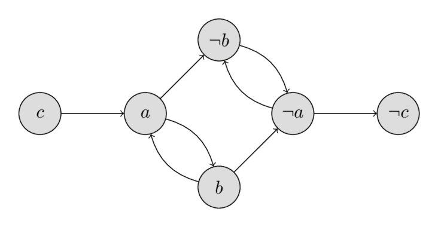
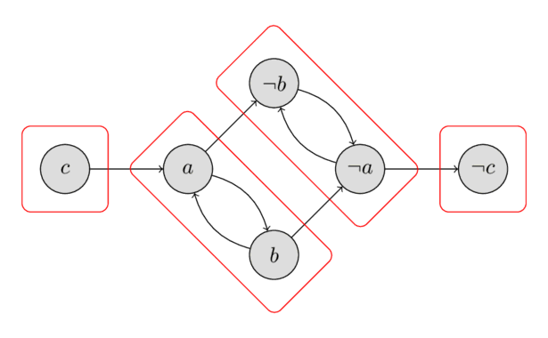

# 2-SAT

SAT (Boolean satisfiability problem — Bul ifodasining qanoatlanuvchanlik masalasi) — berilgan Bul formulasini rost qiladigan tarzda o‘zgaruvchilarga Bul qiymatlarini tayinlash masalasi.
Bul formulasi odatda CNF (conjunctive normal form — kon’yunktiv normal shakl)da beriladi: u bir nechta klauzalarning kon’yunksiyasidan iborat, har bir klauza esa literallarning (o‘zgaruvchilar yoki ularning inkorlari) diz’yunksiyasidir.
2-SAT (2-satisfiability) SAT masalasining cheklangan ko‘rinishi bo‘lib, 2-SAT da har bir klauza aynan ikkita literaldan iborat.
Quyida shunday 2-SAT masalasiga misol keltirilgan.
Quyidagi formula rost bo‘ladigan $a, b, c$ qiymatlarini toping:
$$
(a \lor \lnot b) \land (\lnot a \lor b) \land (\lnot a \lor \lnot b) \land (a \lor \lnot c)
$$

SAT NP-to‘liq masala bo‘lib, uning samarali yechimi ma’lum emas.
Biroq 2-SAT masalasini $O(n + m)$ vaqtda samarali yechish mumkin; bu yerda $n$ — o‘zgaruvchilar soni, $m$ esa klauzalar soni.

## Algoritm

Avval masalani boshqa ko‘rinishga — **implikativ normal shakl** deb ataladigan shaklga — o‘tkazishimiz kerak.
$a \lor b$ ifoda $\lnot a \Rightarrow b \land \lnot b \Rightarrow a$ ifodaga teng kuchli ekaniga e’tibor bering (ikki o‘zgaruvchidan biri yolg‘on bo‘lsa, ikkinchisi rost bo‘lishi shart).

Endi ushbu implikatsiyalarning yo‘naltirilgan grafini quramiz:
har bir $x$ o‘zgaruvchi uchun $v_x$ va $v_{\lnot x}$ nomli ikkita tugun bo‘ladi.
Qirralar implikatsiyalarga mos keladi.

Misolni 2-CNF shaklida yana bir bor qaraymiz:
$$
(a \lor \lnot b) \land (\lnot a \lor b) \land (\lnot a \lor \lnot b) \land (a \lor \lnot c)
$$

Yo‘naltirilgan graf quyidagi tugunlar va qirralarni o‘z ichiga oladi:

$$
\begin{array}{cccc}
\lnot a \Rightarrow \lnot b & a \Rightarrow b & a \Rightarrow \lnot b & \lnot a \Rightarrow \lnot c\\
b \Rightarrow a & \lnot b \Rightarrow \lnot a & b \Rightarrow \lnot a & c \Rightarrow a
\end{array}
$$

Implikatsiyalar grafini quyidagi rasmda ko‘rishingiz mumkin:
<div style="text-align: center;">
  
</div>

Implikatsiyalar grafining quyidagi xossasiga alohida e’tibor berish kerak:
agar $a \Rightarrow b$ qirra mavjud bo‘lsa, $\lnot b \Rightarrow \lnot a$ qirra ham mavjud bo‘ladi.
Shuningdek, agar $x$ ga $\lnot x$ dan erishish mumkin bo‘lsa va $\lnot x$ ga $x$ dan erishish mumkin bo‘lsa, masala yechimga ega emasligini qayd eting.
$x$ o‘zgaruvchi uchun qaysi qiymatni tanlamaylik, doimo qarama-qarshilikka kelamiz: $x$ ga $\text{true}$ tayinlasak, implikatsiya $\lnot x$ ham $\text{true}$ bo‘lishi kerakligini aytadi va aksincha.
Ma’lum bo‘lishicha, bu shart nafaqat zarur, balki yetarlidir ham.
Buni quyidagi bir necha paragrafda isbotlaymiz.

Avval shuni eslaymiz: agar bir tugunga ikkinchisidan erishish mumkin va ikkinchisiga birinchisidan erishish mumkin bo‘lsa, bu ikki tugun bir xil kuchli bog‘langan komponentga kiradi.
Shuning uchun yechim mavjudligi mezonini quyidagicha ifodalash mumkin:
2-SAT masalasi yechimga ega bo‘lishi uchun har qanday $x$ o‘zgaruvchi bo‘yicha $x$ va $\lnot x$ tugunlari implikatsiyalar grafining turli kuchli bog‘langan komponentlarida joylashishi zarur va yetarli.

Bu mezonni barcha kuchli bog‘langan komponentlarni topish orqali $O(n + m)$ vaqtda tekshirish mumkin.
Quyidagi rasm misoldagi barcha kuchli bog‘langan komponentlarni ko‘rsatadi.
Oson tekshirish mumkinki, to‘rtta komponentning hech birida bir vaqtning o‘zida $x$ tugun va uning $\lnot x$ inkori yo‘q; demak, misol yechimga ega.
Keyingi paragraflarda yaroqli tayinlashni qanday hisoblashni o‘rganamiz, hozircha namoyish uchun $a = \text{false}$, $b = \text{false}$, $c = \text{false}$ yechimni keltiramiz.
<div style="text-align: center;">
  
</div>

Endi yechim mavjud deb faraz qilgan holda, 2-SAT masalasining yechimini topish algoritmini quramiz.
Yechim mavjud bo‘lishiga qaramay, implikatsiyalar grafida $\lnot x$ ga $x$ dan erishish mumkin bo‘lishi yoki (ammo ikkalasi bir vaqtda emas) $x$ ga $\lnot x$ dan erishish mumkin bo‘lishi ehtimoli bor.
Bunday holatda $x$ uchun $\text{true}$ yoki $\text{false}$ qiymatlaridan birini tanlash qarama-qarshilikka olib keladi, ikkinchisini tanlash esa olib kelmaydi.
Qarama-qarshilik hosil qilmaydigan qiymatni qanday tanlashni ko‘rib chiqamiz.

Kuchli bog‘langan komponentlarni topologik tartibda saralaymiz (ya’ni, agar $v$ dan $u$ ga yo‘l mavjud bo‘lsa, $\text{comp}[v] \le \text{comp}[u]$ bo‘lsin) va $\text{comp}[v]$ bilan $v$ tugun kiradigan kuchli bog‘langan komponent indeksini belgilaymiz.
Shunda, agar $\text{comp}[x] < \text{comp}[\lnot x]$ bo‘lsa, $x$ ga $\text{false}$, aks holda $\text{true}$ tayinlaymiz.
Bu tayinlashda qarama-qarshilikka kelmasligimizni isbotlaymiz.

Faraz qilaylik, $x$ ga $\text{true}$ tayinlandi.
Ikkinchi holat ham xuddi shunday isbotlanadi.
Avval $x$ tugundan $\lnot x$ tugunga erishib bo‘lmasligini isbotlaymiz.
Biz $\text{true}$ qiymatini tayinlaganimiz sababli, $x$ ning kuchli bog‘langan komponent indeksi $\lnot x$ komponentining indeksidan katta bo‘lishi kerak.
Bu $\lnot x$ komponenti $x$ joylashgan komponentning chapida turishini, keyingi komponentdan oldingisiga esa erishib bo‘lmasligini anglatadi.

Ikkinchidan, implikatsiyalar grafida $x$ dan ham $y$ ga, ham $\lnot y$ ga erishish mumkin bo‘ladigan $y$ o‘zgaruvchi mavjud emasligini isbotlaymiz.
Aks holda qarama-qarshilik kelib chiqadi, chunki $x = \text{true}$ dan $y = \text{true}$ hamda $\lnot y = \text{true}$ kelib chiqadi.
Buni teskarisidan faraz qilish orqali isbotlaymiz.
Faraz qilaylik, $x$ dan $y$ ga ham, $\lnot y$ ga ham erishish mumkin. U holda implikatsiyalar grafining xossasiga ko‘ra, $y$ dan ham, $\lnot y$ dan ham $\lnot x$ ga erishish mumkin.
Tranzitivlik bo‘yicha bundan $x$ dan $\lnot x$ ga erishish mumkinligi kelib chiqadi, bu esa farazga zid.

Demak, har qanday $x$ o‘zgaruvchi uchun $x$ va $\lnot x$ tugunlari turli kuchli bog‘langan komponentlarda joylashadi degan faraz ostida talab qilingan o‘zgaruvchi qiymatlarini topadigan algoritmni qurdik.
Yuqorida ushbu algoritmning to‘g‘riligi ko‘rsatildi.
Shu bilan birga, yechim mavjudligining yuqorida keltirilgan mezonini ham isbotladik.

## Implementatsiya

Endi butun algoritmni implementatsiya qilishimiz mumkin.
Avval implikatsiyalar grafini quramiz va barcha kuchli bog‘langan komponentlarni topamiz.
Buni Kosaraju algoritmi yordamida $O(n + m)$ vaqtda bajarish mumkin.
Kosaraju algoritmining graf bo‘ylab ikkinchi yurishi kuchli bog‘langan komponentlarga topologik tartibda tashrif buyuradi, shu sababli har bir $v$ tugun uchun $\text{comp}[v]$ ni hisoblash oson.
Keyin $\text{comp}[x]$ va $\text{comp}[\lnot x]$ ni taqqoslab, $x$ ning qiymatini tanlaymiz.
Agar $\text{comp}[x] = \text{comp}[\lnot x]$ bo‘lsa, 2-SAT masalasini qanoatlantiradigan yaroqli tayinlash mavjud emasligini bildirish uchun $\text{false}$ qaytaramiz.
Quyida oldindan qurilgan `adj` implikatsiyalar grafi va $adj^{\intercal}$ transponirlangan graf (unda har bir qirraning yo‘nalishi teskariga o‘girilgan) uchun 2-SAT yechimining implementatsiyasi keltirilgan.
Grafda $2k$ va $2k+1$ indeksli tugunlar $k$ o‘zgaruvchiga mos ikkita tugun bo‘lib, $2k+1$ inkor qilingan o‘zgaruvchiga mos keladi.

```{.cpp file=2sat}
struct TwoSatSolver {
    int n_vars;
    int n_vertices;
    vector<vector<int>> adj, adj_t;
    vector<bool> used;
    vector<int> order, comp;
    vector<bool> assignment;
    TwoSatSolver(int _n_vars) : n_vars(_n_vars), n_vertices(2 * n_vars), adj(n_vertices), adj_t(n_vertices), used(n_vertices), order(), comp(n_vertices, -1), assignment(n_vars) {
        order.reserve(n_vertices);
    }
    void dfs1(int v) {
        used[v] = true;
        for (int u : adj[v]) {
            if (!used[u])
                dfs1(u);
        }
        order.push_back(v);
    }
    void dfs2(int v, int cl) {
        comp[v] = cl;
        for (int u : adj_t[v]) {
            if (comp[u] == -1)
                dfs2(u, cl);
        }
    }

    bool solve_2SAT() {
        order.clear();
        used.assign(n_vertices, false);
        for (int i = 0; i < n_vertices; ++i) {
            if (!used[i])
                dfs1(i);
        }
        comp.assign(n_vertices, -1);
        for (int i = 0, j = 0; i < n_vertices; ++i) {
            int v = order[n_vertices - i - 1];
            if (comp[v] == -1)
                dfs2(v, j++);
        }

        assignment.assign(n_vars, false);
        for (int i = 0; i < n_vertices; i += 2) {
            if (comp[i] == comp[i + 1])
                return false;
            assignment[i / 2] = comp[i] > comp[i + 1];
        }
        return true;
    }
    void add_disjunction(int a, bool na, int b, bool nb) {
        // na and nb signify whether a and b are to be negated
        a = 2 * a ^ na;
        b = 2 * b ^ nb;
        int neg_a = a ^ 1;
        int neg_b = b ^ 1;
        adj[neg_a].push_back(b);
        adj[neg_b].push_back(a);
        adj_t[b].push_back(neg_a);
        adj_t[a].push_back(neg_b);
    }
    static void example_usage() {
        TwoSatSolver solver(3); // a, b, c
        solver.add_disjunction(0, false, 1, true);  //     a  v  not b
        solver.add_disjunction(0, true, 1, true);   // not a  v  not b
        solver.add_disjunction(1, false, 2, false); //     b  v      c
        solver.add_disjunction(0, false, 0, false); //     a  v      a
        assert(solver.solve_2SAT() == true);
        auto expected = vector<bool>{{true, false, true}};
        assert(solver.assignment == expected);
    }
};
```

## Mashq masalalari

- [Codeforces: The Door Problem](http://codeforces.com/contest/776/problem/D)
- [Kattis: Illumination](https://open.kattis.com/problems/illumination)
- [UVA: Rectangles](https://uva.onlinejudge.org/index.php?option=com_onlinejudge&Itemid=8&page=show_problem&problem=3081)
- [Codeforces: Radio Stations](https://codeforces.com/problemset/problem/1215/F)
- [CSES: Giant Pizza](https://cses.fi/problemset/task/1684)
- [Codeforces: +-1](https://codeforces.com/contest/1971/problem/H)
- [Gym: (C) Colorful Village](https://codeforces.com/gym/104772/problem/C)
- [POI: Renovation](https://szkopul.edu.pl/problemset/problem/xNjwUvwdHQoQTFBrmyG8vD1O/site/?key=statement)

