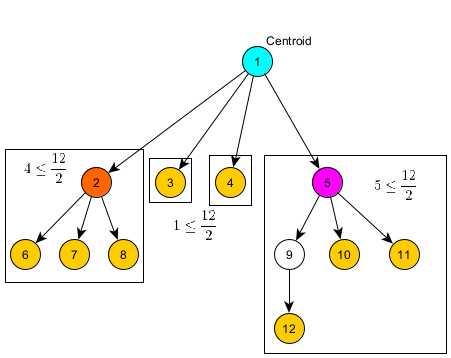
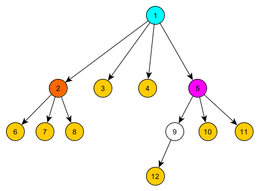

# Centroid dekompozitsiyasi

Oldindan bilish tavsiya etiladi: [chuqurlik bo‘yicha qidiruv (DFS)](./depth-first-search.md), [bo‘lib tashla va hukmronlik qil](https://en.wikipedia.org/wiki/Divide-and-conquer_algorithm), [daraxtlar](<https://en.wikipedia.org/wiki/Tree_(graph_theory)>).

## Kirish

**Centroid dekompozitsiyasi** — daraxtlarda qo‘llanadigan bo‘lib tashla va hukmronlik qil usuli. U daraxtdagi yo‘llar bilan bog‘liq turli masalalarni, masalan, ma’lum xossalarga ega yo‘llarni sanash, masofalarni topish yoki daraxt yo‘llari bo‘yicha so‘rovlarga javob berishni yechishda ishlatiladi.
Asosiy g‘oya — daraxtning **centroid**ini topib, daraxtni rekursiv ravishda ajratish. Ushbu maxsus tugun olib tashlanganda daraxt komponentlarga bo‘linadi va ularning har biri asl daraxt tugunlarining ko‘pi bilan yarmini o‘z ichiga oladi. Bu rekursiya chuqurligining logarifmik bo‘lishini kafolatlaydi va samarali algoritmlarga olib keladi.

## Centroidning ta’rifi va xossalari

Avval centroid nima ekanini tushunib olaylik. Daraxtning **centroidi** — olib tashlanganda hosil bo‘ladigan ost-daraxtlarning hech birida $\frac{N}{2}$ tadan ortiq tugun qolmaydigan tugun; bu yerda $N$ — daraxtdagi tugunlarning umumiy soni.

<div align="center">
    
</div>

$N$ ta tugunli istalgan daraxtda bitta yoki ikkita centroid mavjud. Agar ikkita centroid bo‘lsa, ular o‘zaro qo‘shni bo‘lishi shart.

### Mavjudlik va yagonalik

**Teorema**: Har bir daraxtda kamida bitta va ko‘pi bilan ikkita centroid mavjud. Agar ikkita centroid bo‘lsa, ular o‘zaro qo‘shni bo‘lishi kerak.

??? note "Isbot"
    _Mavjudlik_: Istalgan tugundan boshlang va eng katta ost-daraxtga ega farzand tomon yurishda davom eting. Hech bir farzandda $\frac{N}{2}$ tadan ortiq tugun qolmaganida to‘xtang. Shu paytda joriy $v$ tugun centroid bo‘ladi, chunki (1) to‘xtash shartiga ko‘ra hech bir farzandning ost-daraxtida $\frac{N}{2}$ tadan ortiq tugun yo‘q; (2) “ota-ona tomoni”da ($v$ farzand bo‘lgan paytda $v$ ning ost-daraxtiga kirmagan barcha tugunlar) ham ko‘pi bilan $\frac{N}{2}$ ta tugun bor, aks holda ota-onadan $v$ ga o‘tmagan bo‘lardik.
    Bu jarayon doimo tugashini ko‘rish oson; demak, kamida bitta centroid mavjud.
    _Yagonalik_: Ikkita centroid $u$ va $v$ mavjud deb faraz qilaylik. Ular orasidagi yo‘lni qaraymiz. $u$ olib tashlanganida $v$ ko‘pi bilan $\frac{N}{2}$ ta tugunli komponentda bo‘lishi kerak. Xuddi shunday, $v$ olib tashlanganida $u$ ko‘pi bilan $\frac{N}{2}$ ta tugunli komponentda bo‘lishi kerak. Bu faqat $u$ va $v$ qo‘shni bo‘lgandagina mumkin; aks holda ulardan birini olib tashlash ikkinchisini $\frac{N}{2}$ tadan ortiq tugunli komponentda qoldirardi.

Bu ikkala centroid ham ko‘pi bilan $\frac{N}{2}$ ta tugunli komponentda joylashadi degan boshlang‘ich bayonotimizga zid. Bundan tashqari, agar ikkita centroid mavjud bo‘lsa, ular daraxtni har biri aynan $\frac{N}{2}$ ta tugundan iborat ikkita komponentga ajratishi kerak; bu faqat $N$ juft bo‘lganda mumkin.

## Centroid dekompozitsiyasining ta’rifi va xossalari

Daraxtni “dekompozitsiya qilish” mohiyatan centroidlarni rekursiv topish va centroid hosil qilgan komponentlar asosida daraxtni ost-daraxtlarga ajratishni anglatadi. Daraxtning komponentlariga bunday rekursiv ajratilishi o‘ziga xos xossalar to‘plamini hosil qiladi:

1. **Dekompozitsiya chuqurligi**: chuqurlik $O(\log N)$, chunki har bir sathda komponent o‘lchami kamida ikki baravar kamayadi.
2. **Yo‘llarni qamrab olish**: asl daraxtdagi har bir yo‘l dekompozitsiyadagi biror komponent centroididan o‘tadi.

### Dekompozitsiya chuqurligi

**Teorema**: Istalgan daraxtda centroid dekompozitsiyasidan foydalanilganda chuqurlik, ya’ni qadamlar soni, $O(\log N)$ bo‘ladi.

??? note "Isbot"

    Asl daraxtdagi istalgan $v$ tugunni qaraymiz. Dekompozitsiya jarayonida $v$ necha marta biror komponent tarkibida bo‘lishi mumkinligini kuzatamiz.

    Birinchi sathda $v$ o‘lchami $N$ bo‘lgan komponentda joylashadi. Ushbu komponent centroidini olib tashlaganimizda, muvozanat xossasiga ko‘ra $v$ o‘lchami ko‘pi bilan $\frac{N}{2}$ bo‘lgan komponentga tushadi.
    Ikkinchi sathda $v$ o‘lchami ko‘pi bilan $\frac{N}{2}$ bo‘lgan komponentda joylashadi. Bu komponent centroidini olib tashlash $v$ ni o‘lchami ko‘pi bilan $\frac{N}{4}$ bo‘lgan komponentga joylashtiradi.

    Shu tartibda davom etsak, $k$-sathda $v$ o‘lchami ko‘pi bilan $\frac{N}{2^{k-1}}$ bo‘lgan komponentda joylashadi.

    Komponent o‘lchamlari $1$ ga yetganda dekompozitsiya to‘xtaydi. Bu $\frac{N}{2^{k-1}} \leq 1$ bo‘lganda yuz beradi va bundan $k \leq \log_2 N + 1$ kelib chiqadi.

    Demak, centroid dekompozitsiyasi daraxtining maksimal chuqurligi $O(\log N)$.

**Natija**: Har bir tugun dekompozitsiyaning ko‘pi bilan $O(\log N)$ ta sathida qatnashadi va biz har bir sathda har bir tugunga bir marta ishlov beramiz. Shu sababli centroid dekompozitsiyasidan foydalanuvchi algoritmlarning vaqt murakkabligida odatda har bir sathda har bir tugun uchun bajariladigan ishga ko‘paytirilgan $O(\log N)$ koeffitsient paydo bo‘ladi.

### Yo‘llarni qamrab olish

**Teorema**: Asl daraxtdagi har bir yo‘l dekompozitsiyadagi biror komponent centroididan o‘tadi.

??? note "Isbot"

    Asl daraxtda $u$ tugundan $v$ tugungacha bo‘lgan istalgan $P$ yo‘lni qaraymiz. Bu yo‘l dekompozitsiya jarayonida tanlangan kamida bitta centroiddan o‘tishini ko‘rsatishimiz kerak.

    Buni dekompozitsiya jarayoni bo‘yicha induksiya bilan isbotlaymiz.
    _Baza_: Dekompozitsiyaning birinchi sathida butun daraxtning $c_1$ centroidini tanlaymiz. Agar $P$ yo‘l $c_1$ dan o‘tsa, isbot tugadi.

    _Induktiv qadam_: $P$ yo‘l $c_1$ dan o‘tmaydi deb faraz qilaylik. $c_1$ ni olib tashlaganimizda daraxt bir nechta komponentga bo‘linadi. $P$ bog‘langan yo‘l bo‘lgani sababli, $c_1$ olib tashlangandan keyin $u$ va $v$ bir xil $C$ komponentda qolishi kerak; aks holda ularni ulash uchun $P$ yo‘l $c_1$ dan o‘tishi kerak bo‘lardi, bu farazimizga zid.
    Endi $C$ komponentni rekursiv dekompozitsiya qilamiz. $C$ komponentga qo‘llangan induktiv farazga ko‘ra, to‘liq $C$ ichida joylashgan $P$ yo‘l $C$ dekompozitsiyasidagi biror komponent centroididan o‘tishi shart.

    Bu jarayon $P$ o‘tadigan centroidni topgunimizcha davom etadi. Jarayon albatta tugaydi, chunki har bir sathda $P$ ni o‘z ichiga olgan komponent muvozanat xossasiga ko‘ra qat’iy kichrayadi va oxir-oqibat bitta qirra yoki tugungacha qisqaradi.

**Natija**: Ushbu xossa centroid dekompozitsiyasi algoritmlarining to‘g‘riligi uchun asosiy ahamiyatga ega. U har bir centroiddan o‘tuvchi barcha yo‘llarga ishlov berganimizda daraxtdagi barcha mumkin bo‘lgan yo‘llarni dekompozitsiyaning biror sathida aynan bir marta qamrab olishimizni kafolatlaydi. Centroid dekompozitsiyasi yo‘llar bilan bog‘liq masalalarni aynan shuning uchun samarali yecha oladi: har bir yo‘l centroid bilan birinchi marta uchrashadigan sathda aynan bir marta qaraladi.

## Centroidni topish

Daraxt centroidini samarali topish uchun:

1. Chuqurlik bo‘yicha qidiruv (DFS) yordamida barcha tugunlarning ost-daraxt o‘lchamlarini hisoblang.
2. Istalgan tugundan boshlang.
3. Ost-daraxtida $\frac{N}{2}$ tadan ortiq tugun bo‘lgan $v$ farzandni toping.
4. $v$ ga o‘ting va 3-qadamni takrorlang.
5. Bunday farzand mavjud bo‘lmasa, joriy tugun centroiddir.

Vaqt murakkabligi: $O(N)$.

Xotira murakkabligi: $O(N)$.

## Algoritm tavsifi

Centroid dekompozitsiyasidan foydalanganda umumiy jarayon quyidagicha:

1. Joriy daraxt yoki komponentning **centroidini toping**.
2. Ushbu centroiddan o‘tuvchi barcha yo‘llarga **ishlov bering** va kerakli hisob-kitoblarni bajaring.
3. Centroidni **olib tashlang** (ishlatilgan deb belgilang).
4. Hosil bo‘lgan har bir ost-daraxtni **rekursiv dekompozitsiya qiling**.

Bu **centroid daraxti**ni hosil qiladi. Ushbu daraxtdagi har bir tugun dekompozitsiyaning biror bosqichida topilgan centroidni ifodalaydi. Demak, centroidning, ya’ni istalgan tugunning, ota-onasi uni o‘z ichiga olgan kattaroq komponentda topilgan centroiddir. Yuqorida isbotlanganidek, bu daraxtning balandligi $O(\log N)$.

<div align="center">
    
</div>

Masalan, yuqoridagi rasmda centroid daraxti ko‘rsatilgan. Daraxtning har bir sathidagi har bir tugun tegishli komponentning centroididir (masalan, ildiz butun daraxtning centroidi, ildizning eng chapdagi farzandi esa ildizning eng chap ost-daraxti centroidi va hokazo).

## Implementatsiya

Quyida muayyan masalani — **daraxtdagi uzunligi aynan $K$ bo‘lgan barcha yo‘llarni sanash** masalasini — yechadigan centroid dekompozitsiyasi implementatsiyasi keltirilgan.

Bu masalada $N$ ta tugunli daraxt beriladi va aynan $K$ ta qirraga ega nechta yo‘l borligini sanash kerak. Yo‘l ikki xil tugun bilan aniqlanadi.

```{.cpp file=centroid_decomposition}
const int MAXN = 1e5;
vector<int> adj[MAXN];
bool removed[MAXN];
int subtree_size[MAXN];
int K;  // Target path length
long long answer = 0;  // Count of paths with length K

int get_subtree_size(int v, int p = -1) {
    subtree_size[v] = 1;
    for (int u : adj[v]) {
        if (u == p || removed[u]) continue;
        subtree_size[v] += get_subtree_size(u, v);
    }
    return subtree_size[v];
}
int get_centroid(int v, int tree_size, int p = -1) {
    for (int u : adj[v]) {
        if (u == p || removed[u]) continue;
        if (subtree_size[u] * 2 > tree_size)
            return get_centroid(u, tree_size, v);
    }
    return v;
}

void get_distances(int v, int p, int dist, vector<int>& distances) {
    if (dist > K) return;
    distances.push_back(dist);
    for (int u : adj[v]) {
        if (u == p || removed[u]) continue;
        get_distances(u, v, dist + 1, distances);
    }
}
void process_centroid(int centroid) {
    unordered_map<int, int> all_distances;
    all_distances[0] = 1;

    for (int u : adj[centroid]) {
        if (removed[u])
            continue;

        vector<int> current_distances;
        get_distances(u, centroid, 1, current_distances);

        for (int d : current_distances) {
            if (K - d >= 0) {
                answer += (all_distances[K - d] ? all_distances[K - d] : 0);
            }
        }
        for (int d : current_distances) {
            if (all_distances.find(d) == all_distances.end())
                all_distances[d] = 0;
            all_distances[d]++;
        }
    }
}

void decompose(int v) {
    int tree_size = get_subtree_size(v);
    int centroid = get_centroid(v, tree_size);

    process_centroid(centroid);

    removed[centroid] = true;

    for (int u : adj[centroid]) {
        if (!removed[u]) {
            decompose(u);
        }
    }
}
```

Ushbu shablonni centroid dekompozitsiyasidan foydalanuvchi boshqa masalalarga moslashtirish mumkin. Bu aniq holatda u uzunligi $K$ bo‘lgan barcha yo‘llarni sanash masalasini yechadi. Strategiya quyidagicha: har bir centroid uchun turli ost-daraxtlarda joylashgan va centroidgacha masofalari $d_1$ hamda $d_2$ bo‘lib, yig‘indisi $K$ ga teng tugunlar juftlarini topish orqali centroiddan o‘tuvchi yo‘llarni sanaymiz (ya’ni centroiddan o‘tuvchi yo‘l bir ost-daraxtdagi centroiddan $d_1$ masofadagi tugun va boshqa ost-daraxtdagi centroiddan $d_2$ masofadagi tugundan tuziladi, bunda $d_1+d_2=K$).
Joriy ost-daraxtdagi har bir $d$ masofa uchun kod avvalgi ost-daraxtlarda $K-d$ masofada nechta tugun borligini sanaydi. Optimallashtirish keraksiz rekursiyani oldini olish uchun $K$ dan katta masofalarni tashlab yuboradi.

### Centroid daraxtini qurish

Agar aniq centroid daraxti tuzilmasini qurish kerak bo‘lsa — masalan, so‘rovlarga javob berish uchun — quyidagidan foydalanish mumkin:

```cpp
int centroid_parent[MAXN];

int decompose(int v, int p = -1) {
    int tree_size = get_subtree_size(v);
    int centroid = get_centroid(v, tree_size);

    centroid_parent[centroid] = p;
    removed[centroid] = true;

    for (int u : adj[centroid]) {
        if (!removed[u]) {
            decompose(u, centroid);
        }
    }

    return centroid;
}
```

## Mashq masalalari

- [CSES - Finding a Centroid](https://cses.fi/problemset/task/2079) [qiyinlik: oson]
- [CSES - Fixed-Length Paths II](https://cses.fi/problemset/task/2081) [qiyinlik: oson]
- [Codeforces - Xenia and Tree](http://codeforces.com/problemset/problem/342/E) [qiyinlik: o‘rta]
- [Codeforces - Digit Tree](http://codeforces.com/contest/716/problem/E) [qiyinlik: o‘rta]
- [OJ - Race](https://oj.uz/problem/view/IOI11_race) [qiyinlik: o‘rta]
- [SPOJ - QTREE5](http://www.spoj.com/problems/QTREE5/) [qiyinlik: qiyin]

