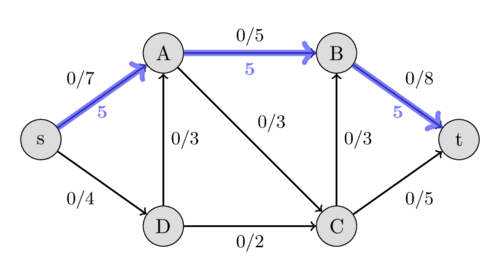
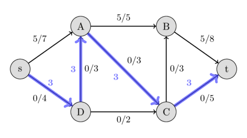
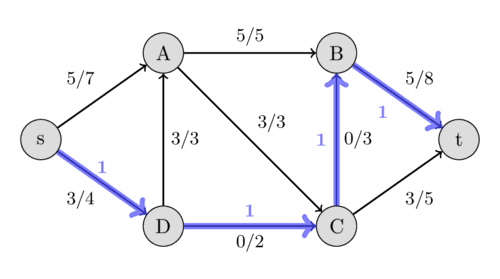
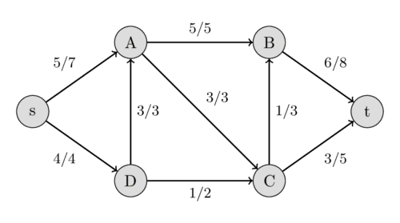
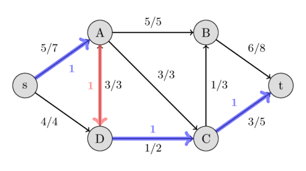
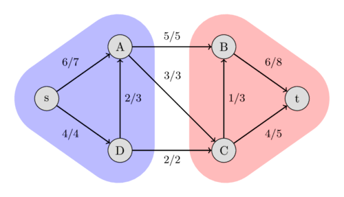

# Maksimal oqim — Ford–Fulkerson va Edmonds–Karp

Edmonds–Karp algoritmi oqim tarmog‘ida maksimal oqimni hisoblash uchun Ford–Fulkerson usulining implementatsiyasidir.

## Oqim tarmog‘i

Avval **oqim tarmog‘i**, **oqim** va **maksimal oqim** nima ekanini ta’riflaymiz.

**Tarmoq** — tugunlari $V$, qirralari $E$ bo‘lgan yo‘naltirilgan $G$ graf va har bir $e \in E$ qirraga manfiy bo‘lmagan butun qiymat, ya’ni $e$ qirraning **sig‘imi**ni mos qo‘yadigan $c$ funksiyasidan iborat.
Agar bunday tarmoqda yana ikkita tugun belgilansa — biri **manba**, ikkinchisi **qabul qiluvchi** — u **oqim tarmog‘i** deb ataladi.
Oqim tarmog‘idagi **oqim** — har bir $e$ qirraga yana manfiy bo‘lmagan butun qiymat, ya’ni oqimni mos qo‘yadigan $f$ funksiyadir.
Bu funksiya quyidagi ikki shartni bajarishi kerak:

Qirradagi oqim uning sig‘imidan oshmasligi kerak.

$$f(e) \le c(e)$$

Manba va qabul qiluvchi tugunlardan tashqari, har bir $u$ tugunga kiruvchi oqimlar yig‘indisi undan chiquvchi oqimlar yig‘indisiga teng bo‘lishi kerak.

$$\sum_{(v, u) \in E} f((v, u)) = \sum_{(u, v) \in E} f((u, v))$$

Manba $s$ tugundan faqat oqim chiqadi, qabul qiluvchi $t$ tugunga esa faqat oqim kiradi.

Quyidagi tenglik bajarilishini ko‘rish oson:

$$\sum_{(s, u) \in E} f((s, u)) = \sum_{(u, t) \in E} f((u, t))$$

Oqim tarmog‘i uchun quyidagi tasavvur yaxshi o‘xshatish bo‘ladi:
qirralarni suv quvurlari deb tasavvur qilamiz; qirra sig‘imi — bir soniyada quvurdan o‘ta oladigan eng katta suv miqdori, qirradagi oqim esa hozir bir soniyada shu quvurdan oqayotgan suv miqdoridir.
Bu birinchi oqim shartining sababini tushuntiradi.
Quvurdan uning sig‘imidan ko‘proq suv o‘ta olmaydi.
Tugunlar ayrim quvurlardan suv kelib, keyin suv boshqa quvurlarga qandaydir tarzda taqsimlanadigan ulanish nuqtalari vazifasini bajaradi.
Bu ikkinchi oqim shartining sababini ham tushuntiradi.
Har bir ulanish nuqtasiga kirgan barcha suv boshqa quvurlarga taqsimlanishi kerak.
U sehrli ravishda yo‘qolib yoki paydo bo‘lib qolmaydi.
Manba $s$ barcha suvning boshlanish joyi, suv esa faqat qabul qiluvchi $t$ da chiqib ketishi mumkin.
Quyidagi rasmda oqim tarmog‘i ko‘rsatilgan.
Har bir qirradagi birinchi qiymat dastlab $0$ bo‘lgan oqimni, ikkinchi qiymat esa sig‘imni bildiradi.
<div style="text-align: center;">
  
</div>
Tarmoq oqimining qiymati manba $s$ da hosil qilinadigan barcha oqimlar yig‘indisiga yoki unga teng kuchli ravishda qabul qiluvchi $t$ da iste’mol qilinadigan barcha oqimlar yig‘indisiga teng.
**Maksimal oqim** — mumkin bo‘lgan eng katta qiymatli oqim.
Oqim tarmog‘idagi shu maksimal oqimni topish biz yechmoqchi bo‘lgan masaladir.

Suv quvurlari tasavvurida masalani quyidagicha ifodalash mumkin:
manbadan qabul qiluvchigacha quvurlar orqali qancha suv o‘tkaza olamiz?
Quyidagi rasmda oqim tarmog‘idagi maksimal oqim ko‘rsatilgan.
<div style="text-align: center;">
  
</div>

## Ford–Fulkerson usuli

Yana bitta tushunchani ta’riflaymiz.
Yo‘naltirilgan qirraning **qoldiq sig‘imi** uning sig‘imidan oqimni ayirish orqali olinadi.
Agar $(u, v)$ yo‘naltirilgan qirra bo‘ylab oqim mavjud bo‘lsa, teskari qirraning sig‘imi $0$ bo‘lishini va undagi oqimni $f((v, u)) = -f((u, v))$ deb aniqlash mumkinligini qayd etish kerak.
Bu barcha teskari qirralar uchun qoldiq sig‘imini ham aniqlaydi.
Shu qirralarning barchasidan **qoldiq tarmoq** yaratish mumkin: u ayni tugunlar va qirralarga ega, ammo sig‘im sifatida qoldiq sig‘imlardan foydalanadigan tarmoqdir.
Ford–Fulkerson usuli quyidagicha ishlaydi.
Avval har bir qirradagi oqimni nolga tenglaymiz.
Keyin $s$ dan $t$ gacha **oshiruvchi yo‘l** qidiramiz.
Oshiruvchi yo‘l — qoldiq grafdagi oddiy yo‘l bo‘lib, undagi barcha qirralarning qoldiq sig‘imi musbat bo‘ladi.
Agar shunday yo‘l topilsa, shu qirralar bo‘ylab oqimni oshira olamiz.
Oshiruvchi yo‘llarni qidirish va oqimni oshirishda davom etamiz.
Oshiruvchi yo‘l qolmaganda oqim maksimal bo‘ladi.
Oshiruvchi yo‘l bo‘ylab oqimni oshirish nimani anglatishini batafsilroq aniqlaymiz.
$C$ yo‘ldagi qirralarning eng kichik qoldiq sig‘imi bo‘lsin.
Shunda oqimni quyidagicha oshiramiz:
yo‘ldagi har bir $(u, v)$ qirra uchun $f((u, v)) ~\text{+=}~ C$ va $f((v, u)) ~\text{-=}~ C$ yangilashlarini bajaramiz.
Usulni ko‘rsatish uchun misol keltiramiz.
Yuqoridagi oqim tarmog‘idan foydalanamiz.
Dastlab oqim $0$ ga teng.
<div style="text-align: center;">
  
</div>
Qoldiq sig‘imlari mos ravishda $7$, $5$ va $8$ bo‘lgan $s - A - B - t$ yo‘lni topishimiz mumkin.
Ularning minimumi $5$, shuning uchun bu yo‘l bo‘ylab oqimni $5$ ga oshira olamiz.
Natijada tarmoq oqimi $5$ ga teng bo‘ladi.
<div style="text-align: center;">
  
  
</div>
Yana oshiruvchi yo‘l qidiramiz; bu safar qoldiq sig‘imlari $4$, $3$, $3$ va $5$ bo‘lgan $s - D - A - C - t$ yo‘lni topamiz.
Demak, oqimni $3$ ga oshirib, tarmoq oqimini $8$ ga yetkazamiz.
<div style="text-align: center;">
  
  
</div>
Bu safar qoldiq sig‘imlari $1$, $2$, $3$ va $3$ bo‘lgan $s - D - C - B - t$ yo‘lni topamiz va shu sabab oqimni $1$ ga oshiramiz.
<div style="text-align: center;">
  
  
</div>
Bu safar qoldiq sig‘imlari $2$, $3$, $1$ va $2$ bo‘lgan $s - A - D - C - t$ oshiruvchi yo‘lni topamiz.
Oqimni $1$ ga oshira olamiz.
Ammo bu yo‘l juda qiziq.
Unda teskari $(A, D)$ qirra bor.
Asl oqim tarmog‘ida $A$ dan $D$ ga hech qanday oqim yuborish mumkin emas.
Biroq $D$ dan $A$ ga allaqachon $3$ birlik oqim yuborganimiz sabab bu mumkin bo‘ladi.
Buning mazmuni quyidagicha:
$D$ dan $A$ ga $3$ birlik oqim yuborish o‘rniga faqat $2$ birlik yuboramiz va buni $s$ dan $A$ ga qo‘shimcha $1$ birlik oqim yuborish bilan qoplaymiz; natijada $D - C - t$ yo‘l bo‘ylab yana $1$ birlik oqim yubora olamiz.
<div style="text-align: center;">
  
  
</div>
Endi $s$ va $t$ orasida oshiruvchi yo‘l topib bo‘lmaydi, shuning uchun qiymati $10$ bo‘lgan bu oqim mumkin bo‘lgan maksimal oqimdir.
Biz maksimal oqimni topdik.
Ford–Fulkerson usuli oshiruvchi yo‘lni topish usulini belgilamasligini qayd etish kerak.
Mumkin bo‘lgan usullar — [DFS](depth-first-search.md) yoki [BFS](breadth-first-search.md); ularning har ikkisi $O(E)$ vaqtda ishlaydi.
Agar tarmoqdagi barcha sig‘imlar butun bo‘lsa, har bir oshiruvchi yo‘lda tarmoq oqimi kamida $1$ ga oshadi (batafsil [butun oqim teoremasi](#integral-theorem) bo‘limiga qarang).
Shuning uchun Ford–Fulkerson murakkabligi $O(E F)$, bu yerda $F$ — tarmoqning maksimal oqimi.
Ratsional sig‘imlar holatida algoritm ham tugaydi, ammo uning murakkabligi chegaralanmagan.
Irratsional sig‘imlar holatida algoritm hech qachon tugamasligi va hatto maksimal oqimga yaqinlashmasligi mumkin.

## Edmonds–Karp algoritmi

Edmonds–Karp algoritmi oshiruvchi yo‘llarni topish uchun [BFS](breadth-first-search.md) ishlatadigan Ford–Fulkerson usulining implementatsiyasidir.
Algoritmni ilk bor 1970-yilda Yefim Dinitz e’lon qilgan, keyin esa 1972-yilda Jack Edmonds va Richard Karp uni mustaqil ravishda e’lon qilgan.
Murakkablikni maksimal oqimdan mustaqil ravishda ifodalash mumkin.
Algoritm hatto irratsional sig‘imlar uchun ham $O(V E^2)$ vaqtda ishlaydi.
Intuitiv tushuntirish shuki, har safar oshiruvchi yo‘l topilganda qirralardan biri to‘yinadi va agar u keyinchalik yana oshiruvchi yo‘lda paydo bo‘lsa, shu qirragacha bo‘lgan $s$ dan masofa kattaroq bo‘ladi.
Oddiy yo‘llarning uzunligi $V$ bilan chegaralangan.

### Implementatsiya

`capacity` matritsasi har bir tugunlar jufti uchun sig‘imni saqlaydi.
`adj` — **yo‘naltirilmagan graf**ning qo‘shnilik ro‘yxati, chunki oshiruvchi yo‘llarni qidirishda yo‘naltirilgan qirralarning teskarisidan ham foydalanishimiz kerak.
`maxflow` funksiyasi maksimal oqim qiymatini qaytaradi.
Algoritm davomida `capacity` matritsasi amalda tarmoqning qoldiq sig‘imini saqlaydi.
Har bir qirradagi oqim qiymatining o‘zi saqlanmaydi, ammo implementatsiyani qo‘shimcha matritsa yordamida oqimni saqlaydigan va qaytaradigan qilib kengaytirish oson.

```{.cpp file=edmondskarp}
int n;
vector<vector<int>> capacity;
vector<vector<int>> adj;
int bfs(int s, int t, vector<int>& parent) {
    fill(parent.begin(), parent.end(), -1);
    parent[s] = -2;
    queue<pair<int, int>> q;
    q.push({s, INF});

    while (!q.empty()) {
        int cur = q.front().first;
        int flow = q.front().second;
        q.pop();
        for (int next : adj[cur]) {
            if (parent[next] == -1 && capacity[cur][next]) {
                parent[next] = cur;
                int new_flow = min(flow, capacity[cur][next]);
                if (next == t)
                    return new_flow;
                q.push({next, new_flow});
            }
        }
    }

    return 0;
}

int maxflow(int s, int t) {
    int flow = 0;
    vector<int> parent(n);
    int new_flow;
    while (new_flow = bfs(s, t, parent)) {
        flow += new_flow;
        int cur = t;
        while (cur != s) {
            int prev = parent[cur];
            capacity[prev][cur] -= new_flow;
            capacity[cur][prev] += new_flow;
            cur = prev;
        }
    }

    return flow;
}
```

## Butun oqim teoremasi ## { #integral-theorem}

Teorema shuni aytadiki, agar tarmoqdagi har bir sig‘im butun bo‘lsa, maksimal oqim miqdori ham butun bo‘ladi va har bir qirradagi oqimi butun bo‘lgan maksimal oqim mavjud. Xususan, Ford–Fulkerson usuli shunday oqimni topadi.

## Maksimal oqim — minimal kesim teoremasi

**$s$-$t$ kesim** — oqim tarmog‘i tugunlarini ikki to‘plamga ajratish bo‘lib, to‘plamlardan biri manba $s$ ni, boshqasi qabul qiluvchi $t$ ni o‘z ichiga oladi.
$s$-$t$ kesimining sig‘imi manba tomondan qabul qiluvchi tomonga yo‘nalgan qirralar sig‘imlari yig‘indisi sifatida aniqlanadi.

Ravshanki, $s$ dan $t$ ga hech bir $s$-$t$ kesimi sig‘imidan ko‘proq oqim yubora olmaymiz.
Shuning uchun maksimal oqim minimal kesim sig‘imi bilan yuqoridan chegaralangan.
Maksimal oqim — minimal kesim teoremasi bundan ham kuchliroq natija beradi.
U maksimal oqim sig‘imi minimal kesim sig‘imiga teng bo‘lishi shartligini aytadi.
Quyidagi rasmda avval ishlatgan oqim tarmog‘imizning minimal kesimini ko‘rish mumkin.
Rasmda $\{s, A, D\}$ va $\{B, C, t\}$ to‘plamlari orasidagi kesim sig‘imi $5 + 3 + 2 = 10$ ekani ko‘rsatilgan; bu biz topgan maksimal oqimga teng.
Boshqa kesimlar kattaroq sig‘imga ega bo‘ladi; masalan, $\{s, A\}$ va $\{B, C, D, t\}$ orasidagi sig‘im $4 + 3 + 5 = 12$.
<div style="text-align: center;">
  
</div>
Ford–Fulkerson usuli bilan maksimal oqim hisoblangandan keyin minimal kesimni topish mumkin.
Mumkin bo‘lgan minimal kesimlardan biri quyidagicha:
qoldiq grafda $s$ dan musbat qoldiq sig‘imli qirralar orqali erishish mumkin bo‘lgan barcha tugunlar to‘plami va qolgan barcha tugunlar to‘plami.
Bu ajratishni $s$ dan boshlanadigan [DFS](depth-first-search.md) yordamida oson topish mumkin.

## Mashq masalalari

- [Codeforces - Array and Operations](https://codeforces.com/contest/498/problem/c)
- [Codeforces - Red-Blue Graph](https://codeforces.com/contest/1288/problem/f)
- [CSES - Download Speed](https://cses.fi/problemset/task/1694)
- [CSES - Police Chase](https://cses.fi/problemset/task/1695)
- [CSES - School Dance](https://cses.fi/problemset/task/1696)
- [CSES - Distinct Routes](https://cses.fi/problemset/task/1711)

