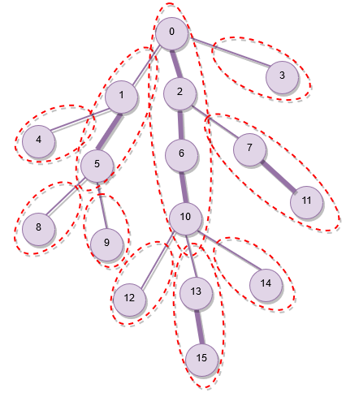

# Og‘ir-yengil dekompozitsiya

**Og‘ir-yengil dekompozitsiya** — **daraxtdagi so‘rovlar**ga kelib taqaladigan ko‘plab masalalarni samarali yechish imkonini beruvchi ancha umumiy usul.

## Tavsif

Ixtiyoriy ildiz tanlangan, $n$ ta tugundan iborat $G$ daraxti berilgan bo‘lsin.

Ushbu daraxt dekompozitsiyasining mohiyati — daraxtni bir nechta **yo‘llarga ajratish**, bunda istalgan $v$ tugundan ildizgacha ko‘pi bilan $\log n$ ta yo‘l bo‘ylab yurib yetish mumkin bo‘ladi. Bundan tashqari, bu yo‘llarning hech biri boshqasi bilan kesishmasligi kerak.
Agar istalgan daraxt uchun shunday dekompozitsiyani topsak, *“$a$ dan $b$ gacha yo‘lda biror narsani hisoblash”* ko‘rinishidagi ayrim so‘rovlarni *“$k$-yo‘lning $[l,r]$ kesmasida biror narsani hisoblash”* ko‘rinishidagi bir nechta so‘rovga keltirishimiz mumkinligi ravshan.

### Qurish algoritmi

Har bir $v$ tugun uchun uning ost-daraxti o‘lchami $s(v)$ ni, ya’ni $v$ tugunning o‘zini ham hisobga olgan holda uning ost-daraxtidagi tugunlar sonini hisoblaymiz.

Endi $v$ tugunning farzandlariga olib boruvchi barcha qirralarni qaraymiz. Agar qirra quyidagi shartni qanoatlantiruvchi $c$ tugunga olib borsa, uni **og‘ir** deb ataymiz:

$$
s(c) \ge \frac{s(v)}{2} \iff \text{$(v,c)$ qirra og‘ir}
$$

Boshqa barcha qirralar **yengil** deb belgilanadi.
Bitta tugundan pastga ko‘pi bilan bitta og‘ir qirra chiqishi ravshan. Aks holda $v$ tugunning o‘lchami $\ge \frac{s(v)}{2}$ bo‘lgan kamida ikkita farzandi bo‘lardi va shuning uchun $v$ ost-daraxtining o‘lchami haddan tashqari katta bo‘lib qolardi: $s(v) \ge 1 + 2\frac{s(v)}{2} > s(v)$; bu qarama-qarshilik.

Endi daraxtni kesishmaydigan yo‘llarga ajratamiz. Pastga qarab hech qanday og‘ir qirra chiqmaydigan barcha tugunlarni qaraymiz. Har bir shunday tugundan daraxt ildiziga yetgunimizcha yoki yengil qirra orqali o‘tgunimizcha yuqoriga yuramiz. Natijada nol yoki undan ortiq og‘ir qirra va bitta yengil qirradan tuzilgan bir nechta yo‘l hosil bo‘ladi. Uchi ildizda bo‘lgan yo‘l bundan mustasno: unda yengil qirra bo‘lmaydi. Ularni **og‘ir yo‘llar** deb ataymiz — bular og‘ir-yengil dekompozitsiyaning kerakli yo‘llaridir.

### To‘g‘rilik isboti

Avvalo, algoritm hosil qilgan og‘ir yo‘llar **kesishmasligi**ni qayd etamiz. Haqiqatan, agar ikki shunday yo‘lning umumiy qirrasi bo‘lsa, bu bitta tugundan ikkita og‘ir qirra chiqishini anglatardi, bu esa mumkin emas.

Ikkinchidan, daraxt ildizidan ixtiyoriy tugunga pastga tushishda yo‘l davomida **og‘ir yo‘lni ko‘pi bilan $\log n$ marta almashtirishimiz**ni ko‘rsatamiz. Yengil qirra bo‘ylab pastga tushish joriy ost-daraxt o‘lchamini yarmigacha yoki undan ham kamroq qiymatga tushiradi:

$$
s(c) < \frac{s(v)}{2} \iff \text{$(v,c)$ qirra yengil}
$$

Shunday qilib, ost-daraxt o‘lchami birga tushgunicha ko‘pi bilan $\log n$ ta yengil qirra orqali o‘tishimiz mumkin.

Bir og‘ir yo‘ldan boshqasiga faqat yengil qirra orqali o‘tish mumkinligi sababli (ildizdan boshlanuvchi yo‘ldan tashqari har bir og‘ir yo‘lda bitta yengil qirra bor), talab qilinganidek, ildizdan istalgan tugungacha bo‘lgan yo‘lda og‘ir yo‘llarni $\log n$ martadan ortiq almashtira olmaymiz.

Quyidagi rasm namunaviy daraxtning dekompozitsiyasini ko‘rsatadi. Og‘ir qirralar yengil qirralarga qaraganda qalinroq chizilgan. Og‘ir yo‘llar nuqtali chegaralar bilan belgilangan.

<div style="text-align: center;">
  
</div>

## Namunaviy masalalar

Masalalarni yechishda ba’zan og‘ir-yengil dekompozitsiyani qirralari kesishmaydigan yo‘llar emas, balki **tugunlari kesishmaydigan** yo‘llar to‘plami sifatida qarash qulayroq. Buning uchun har bir og‘ir yo‘lning oxirgi qirrasi yengil bo‘lsa, uni yo‘ldan chiqarib tashlash kifoya. Hech qanday xossa buzilmaydi va endi har bir tugun aynan bitta og‘ir yo‘lga tegishli bo‘ladi.

Quyida og‘ir-yengil dekompozitsiya yordamida yechish mumkin bo‘lgan bir nechta odatiy masalani ko‘rib chiqamiz.
**Yo‘ldagi sonlar yig‘indisi** masalasiga alohida e’tibor berish kerak, chunki bu soddaroq usullar bilan ham yechish mumkin bo‘lgan masalaga misoldir.

### Ikki tugun orasidagi yo‘lda maksimum qiymat

Daraxt berilgan va har bir tugunga qiymat biriktirilgan. $(a,b)$ ko‘rinishidagi so‘rovlar beriladi, bu yerda $a$ va $b$ — daraxtning ikki tuguni; $a$ va $b$ orasidagi yo‘lda biriktirilgan qiymatlarning maksimumini topish talab qilinadi.

Daraxtning og‘ir-yengil dekompozitsiyasini oldindan quramiz. Har bir og‘ir yo‘l ustida [segment daraxti](../data_structures/segment_tree.md) quramiz; u berilgan og‘ir yo‘lning ko‘rsatilgan kesmasida eng katta qiymat biriktirilgan tugunni $\mathcal{O}(\log n)$ vaqtda topish imkonini beradi.
Og‘ir-yengil dekompozitsiyadagi og‘ir yo‘llar soni $n-1$ gacha yetishi mumkin bo‘lsa-da, barcha yo‘llarning umumiy o‘lchami $\mathcal{O}(n)$ bilan chegaralangan; demak, segment daraxtlarining umumiy o‘lchami ham chiziqli bo‘ladi.

$(a,b)$ so‘roviga javob berish uchun istalgan qulay usul yordamida $a$ va $b$ ning [eng quyi umumiy ajdodi](https://en.wikipedia.org/wiki/Lowest_common_ancestor) $l$ ni topamiz.
Endi masala $(a,l)$ va $(b,l)$ ko‘rinishidagi ikkita so‘rovga keltirildi. Ularning har biri uchun quyidagicha ish tutamiz: pastroq tugun joylashgan og‘ir yo‘lni topamiz, shu yo‘lda so‘rov bajaramiz, yo‘lning yuqori uchiga o‘tamiz, yana qaysi og‘ir yo‘lda turganimizni aniqlab, unda ham so‘rov bajaramiz va $l$ ni o‘z ichiga olgan yo‘lga yetgunimizcha shunday davom etamiz.
Masalan, $a$ va $l$ bir xil og‘ir yo‘lda bo‘ladigan holatda ehtiyot bo‘lish kerak: bu holda ushbu yo‘ldagi maksimum so‘rovi biror prefiksda emas, $a$ va $l$ orasidagi ichki kesmada bajarilishi kerak.

$(a,l)$ va $(b,l)$ qism-so‘rovlarining har biriga javob berish $\mathcal{O}(\log n)$ ta og‘ir yo‘l bo‘ylab o‘tishni talab qiladi; har bir yo‘lda esa yo‘lning biror kesmasi bo‘yicha maksimum so‘rovi bajarilib, u segment daraxtida yana $\mathcal{O}(\log n)$ amal talab qiladi.
Shuning uchun bitta $(a,b)$ so‘rov $\mathcal{O}(\log^2 n)$ vaqt oladi.
Agar har bir og‘ir yo‘lning barcha prefikslari maksimumlarini qo‘shimcha ravishda hisoblab saqlasak, $\mathcal{O}(\log n)$ yechimga ega bo‘lamiz, chunki barcha maksimum so‘rovlari — ajdod $l$ ga yetgandagi ko‘pi bilan bitta so‘rovdan tashqari — prefikslar bo‘yicha bajariladi.

### Ikki tugun orasidagi yo‘ldagi sonlar yig‘indisi

Daraxt berilgan va har bir tugunga qiymat biriktirilgan. $(a,b)$ ko‘rinishidagi so‘rovlar beriladi, bu yerda $a$ va $b$ — daraxtning ikki tuguni; $a$ va $b$ orasidagi yo‘lda joylashgan qiymatlar yig‘indisini topish talab qilinadi. Masalaning bir variantida, bundan tashqari, bir yoki bir nechta tugunga biriktirilgan sonni o‘zgartiradigan yangilash amallari ham bo‘lishi mumkin.

Bu masalani og‘ir yo‘llar ustida segment daraxtlari qurib, maksimum masalasiga o‘xshash tarzda og‘ir-yengil dekompozitsiya yordamida yechish mumkin. Yangilashlar bo‘lmasa, segment daraxtlari o‘rniga prefiks yig‘indilaridan foydalanish mumkin. Biroq bu masala soddaroq usullar bilan ham yechiladi.

Yangilashlar bo‘lmasa, ikki tugun orasidagi yo‘l yig‘indisini ikki tugunning LCA sini [binary lifting](lca_binary_lifting.md) orqali qidirish bilan bir vaqtda topish mumkin. Buning uchun dastlabki ishlov berishda har bir tugunning $2^k$-ajdodlari bilan birga o‘sha ajdodlargacha bo‘lgan yo‘llardagi yig‘indilarni ham saqlash kerak.
Bu masalaga tubdan boshqacha yondashuv ham bor: daraxtning [Euler aylanib chiqishi](https://en.wikipedia.org/wiki/Euler_tour_technique)ni qarash va uning ustida segment daraxti qurish. Ushbu algoritm [o‘xshash masala haqidagi maqola](tree_painting.md)da ko‘rib chiqilgan. Yana bir bor, yangilashlar bo‘lmasa, prefiks yig‘indilarini saqlash kifoya va segment daraxti kerak emas.

Bu ikkala usul ham bitta so‘rov uchun $\mathcal{O}(\log n)$ vaqt oladigan nisbatan sodda yechimlarni beradi.

### Ikki tugun orasidagi yo‘l qirralarini qayta bo‘yash

Daraxt berilgan, dastlab har bir qirra oq rangga bo‘yalgan. $(a,b,c)$ ko‘rinishidagi yangilashlar beriladi, bu yerda $a$ va $b$ — ikkita tugun, $c$ esa rang; yangilash $a$ dan $b$ gacha bo‘lgan yo‘ldagi barcha qirralarni $c$ rangga qayta bo‘yashni buyuradi. Barcha qayta bo‘yashlardan so‘ng har bir rangdagi qirralar sonini chiqarish talab qilinadi.

Yuqoridagi masalalarga o‘xshash ravishda, yechim og‘ir-yengil dekompozitsiyani qo‘llash va har bir og‘ir yo‘l ustida [segment daraxti](../data_structures/segment_tree.md) qurishdan iborat.

$(a,b)$ yo‘lidagi har bir qayta bo‘yash $(a,l)$ va $(b,l)$ ko‘rinishidagi ikkita yangilashga aylanadi; bu yerda $l$ — $a$ va $b$ tugunlarning eng quyi umumiy ajdodi.
$\mathcal{O}(\log n)$ ta yo‘lning har biri uchun $\mathcal{O}(\log n)$ vaqt sarflash bitta yangilash uchun $\mathcal{O}(\log^2 n)$ murakkablikni beradi.

## Implementatsiya

Yuqorida muhokama qilingan yondashuvning ayrim qismlarini samaradorlikni yo‘qotmasdan implementatsiyani soddalashtiradigan tarzda o‘zgartirish mumkin.

- **Og‘ir qirra** ta’rifini **eng katta ost-daraxtli farzandga olib boruvchi qirra** deb o‘zgartirish mumkin; tengliklar ixtiyoriy hal qilinadi. Natijada ayrim yengil qirralar og‘irga aylanishi, ya’ni ayrim og‘ir yo‘llar bitta yo‘lga birlashishi mumkin, ammo barcha og‘ir yo‘llar kesishmay qoladi. Yengil qirra bo‘ylab pastga o‘tishda ost-daraxt o‘lchami yarmigacha yoki undan kamga tushishi hamon kafolatlanadi.
- Har bir og‘ir yo‘l uchun alohida segment daraxti qurish o‘rniga, har bir og‘ir yo‘lga kesishmaydigan kesmalar ajratilgan bitta segment daraxtidan foydalanish mumkin.
- So‘rovlarga javob berish LCA hisoblashni talab qilishi aytildi. LCA ni alohida hisoblash mumkin bo‘lsa-da, uni so‘rovlarga javob berish jarayoniga qo‘shib yuborish ham mumkin.

Og‘ir-yengil dekompozitsiyani bajarish uchun:

```cpp
vector<int> parent, depth, heavy, head, pos;
int cur_pos;

int dfs(int v, vector<vector<int>> const& adj) {
    int size = 1;
    int max_c_size = 0;
    for (int c : adj[v]) {
        if (c != parent[v]) {
            parent[c] = v, depth[c] = depth[v] + 1;
            int c_size = dfs(c, adj);
            size += c_size;
            if (c_size > max_c_size)
                max_c_size = c_size, heavy[v] = c;
        }
    }
    return size;
}
void decompose(int v, int h, vector<vector<int>> const& adj) {
    head[v] = h, pos[v] = cur_pos++;
    if (heavy[v] != -1)
        decompose(heavy[v], h, adj);
    for (int c : adj[v]) {
        if (c != parent[v] && c != heavy[v])
            decompose(c, c, adj);
    }
}

void init(vector<vector<int>> const& adj) {
    int n = adj.size();
    parent = vector<int>(n);
    depth = vector<int>(n);
    heavy = vector<int>(n, -1);
    head = vector<int>(n);
    pos = vector<int>(n);
    cur_pos = 0;
    dfs(0, adj);
    decompose(0, 0, adj);
}
```

Daraxtning qo‘shnilik ro‘yxati `init` funksiyasiga uzatilishi kerak; dekompozitsiya `0` tugunni ildiz deb faraz qilgan holda bajariladi.

`dfs` funksiyasi har bir $v$ tugun uchun `heavy[v]` ni — $v$ dan chiquvchi og‘ir qirraning narigi uchidagi farzandni — hisoblash uchun ishlatiladi. Bundan tashqari, `dfs` har bir tugunning ota-onasi va chuqurligini ham saqlaydi; ular keyinchalik so‘rovlarda foydali bo‘ladi.
`decompose` funksiyasi har bir $v$ tugun uchun mos ravishda `head[v]` va `pos[v]` qiymatlarini tayinlaydi. Ular $v$ tegishli bo‘lgan og‘ir yo‘lning boshi va barcha tugunlarni qamrab oladigan yagona segment daraxtidagi $v$ pozitsiyasidir.

Yo‘llar bo‘yicha so‘rovlarga, masalan yuqorida muhokama qilingan maksimum so‘roviga, taxminan quyidagicha javob berish mumkin:

```cpp
int query(int a, int b) {
    int res = 0;
    for (; head[a] != head[b]; b = parent[head[b]]) {
        if (depth[head[a]] > depth[head[b]])
            swap(a, b);
        int cur_heavy_path_max = segment_tree_query(pos[head[b]], pos[b]);
        res = max(res, cur_heavy_path_max);
    }
    if (depth[a] > depth[b])
        swap(a, b);
    int last_heavy_path_max = segment_tree_query(pos[a], pos[b]);
    res = max(res, last_heavy_path_max);
    return res;
}
```

## Mashq masalalari

- [SPOJ - QTREE - Query on a tree](https://www.spoj.com/problems/QTREE/)
- [CSES - Path Queries II](https://cses.fi/problemset/task/2134)
- [Codeforces - Subway Lines](https://codeforces.com/gym/101908/problem/L)
- [Codeforces - Tree Queries](https://codeforces.com/contest/1254/problem/D)
- [Codeforces - Tree or not Tree](https://codeforces.com/contest/117/problem/E)
- [Codeforces - The Tree](https://codeforces.com/contest/1017/problem/G)
- [Balkan OI 2018 - Min-max tree](https://oj.uz/problem/view/BOI18_minmaxtree)

