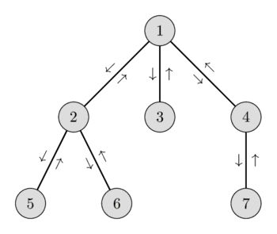

# Eng yaqin umumiy ajdod — $O(N)$ oldindan ishlov bilan $O(\sqrt{N})$ va $O(\log N)$

Bizga $G$ daraxti berilgan. Har bir $(v_1, v_2)$ so‘rov uchun ularning eng yaqin umumiy ajdodini (yoki eng quyi umumiy ajdodini), ya’ni ildizdan $v_1$ gacha yo‘lda ham, ildizdan $v_2$ gacha yo‘lda ham yotadigan va imkon qadar quyida joylashgan $v$ tugunni topish kerak. Boshqacha aytganda, kerakli $v$ tugun $v_1$ va $v_2$ ning eng quyi ajdodidir. Ularning eng yaqin umumiy ajdodi $v_1$ bilan $v_2$ orasidagi eng qisqa yo‘lda yotishi ravshan.

Shuningdek, $v_1$ tugun $v_2$ ning ajdodi bo‘lsa, $v_1$ ularning eng yaqin umumiy ajdodi bo‘ladi.

### Algoritm g‘oyasi

So‘rovlarga javob berishdan oldin daraxtga **oldindan ishlov berish** kerak.

Ildizdan boshlab [DFS](depth-first-search.md) yurishini bajaramiz va tashrif buyurilgan tugunlar tartibini saqlovchi $\text{euler}$ ro‘yxatini quramiz (tugun unga birinchi tashrif buyurilganda hamda uning bolalaridagi DFS yurishlaridan qaytilganda ro‘yxatga qo‘shiladi).

Bu daraxtning Euler turi deb ham ataladi.

Ushbu ro‘yxat o‘lchami $O(N)$ bo‘lishi ravshan.

Shuningdek, har bir $i$ tugunning $\text{euler}$ dagi birinchi uchrashini saqlovchi $\text{first}[0..N-1]$ massivini qurish kerak.

Ya’ni $\text{euler}[\text{first}[i]] = i$ bo‘ladigan $\text{euler}$ dagi eng birinchi pozitsiya.

DFS yordamida har bir tugunning balandligini (ildizdan ungacha masofani) ham topib, $\text{height}[0..N-1]$ massivida saqlashimiz mumkin.

Euler turi va qo‘shimcha ikkita massiv yordamida so‘rovlarga qanday javob beramiz?

So‘rov $v_1$ va $v_2$ juftidan iborat bo‘lsin.

Euler turida $v_1$ ga birinchi tashrif bilan $v_2$ ga birinchi tashrif orasida ko‘rilgan tugunlarni qaraymiz.

$\text{LCA}(v_1, v_2)$ shu yo‘ldagi balandligi eng kichik tugun ekanini oson ko‘rish mumkin.

LCA $v_1$ bilan $v_2$ orasidagi eng qisqa yo‘lga kirishi kerakligini allaqachon qayd etdik.

U, ravshanki, balandligi eng kichik tugun ham bo‘lishi kerak.

Euler turida mohiyatan eng qisqa yo‘ldan foydalanamiz, faqat yo‘l bo‘ylab uchragan barcha qismdaraxtlarga ham qo‘shimcha kirib chiqamiz.

Ammo bu qismdaraxtlardagi barcha tugunlar LCA dan quyiroqda joylashadi, demak ularning balandligi kattaroq.

Shunday qilib, $\text{LCA}(v_1, v_2)$ ni Euler turining $\text{first}(v_1)$ va $\text{first}(v_2)$ orasidagi balandligi eng kichik tugunni topish orqali yagona tarzda aniqlash mumkin.

Bu g‘oyani tasvirlaymiz.

Quyidagi graf va mos balandliklari bilan Euler turini ko‘rib chiqamiz:

<div style="text-align: center;">
  
</div>

$$\begin{array}{|l|c|c|c|c|c|c|c|c|c|c|c|c|c|}
\hline
\text{Tugunlar:}   & 1 & 2 & 5 & 2 & 6 & 2 & 1 & 3 & 1 & 4 & 7 & 4 & 1 \\ \hline
\text{Balandliklar:} & 1 & 2 & 3 & 2 & 3 & 2 & 1 & 2 & 1 & 2 & 3 & 2 & 1 \\ \hline
\end{array}$$

$6$ tugundan boshlanib $4$ tugunda tugaydigan turda $[6, 2, 1, 3, 1, 4]$ tugunlarga tashrif buyuramiz.

Ular orasida $1$ tugun eng kichik balandlikka ega, demak $\text{LCA(6, 4) = 1}$.

Xulosa qilib:

so‘rovga javob berish uchun $\text{euler}$ massivining $\text{first}[v_1]$ dan $\text{first}[v_2]$ gacha oraliqda **balandligi eng kichik tugunni topish** kifoya.

Shunday qilib, **LCA masalasi RMQ masalasiga** (oraliqda minimum topish masalasiga) keltiriladi.

[Sqrt-dekompozitsiya](../data_structures/sqrt_decomposition.md) yordamida $O(N)$ oldindan ishlovdan so‘ng har bir so‘rovga $O(\sqrt{N})$ vaqtda javob beruvchi yechim olish mumkin.

[Segment daraxti](../data_structures/segment_tree.md) yordamida $O(N)$ oldindan ishlovdan so‘ng har bir so‘rovga $O(\log N)$ vaqtda javob berish mumkin.

Saqlangan qiymatlar deyarli hech qachon yangilanmasligi sababli, $O(N\log N)$ qurish vaqti bilan so‘rovlarga $O(1)$ da javob beruvchi [Sparse Table](../data_structures/sparse-table.md) yaxshiroq tanlov bo‘lishi mumkin.

### Implementatsiya

Quyidagi LCA implementatsiyasida segment daraxtidan foydalanilgan.

```{.cpp file=lca}
struct LCA {
    vector<int> height, euler, first, segtree;
    vector<bool> visited;
    int n;
    LCA(vector<vector<int>> &adj, int root = 0) {
        n = adj.size();
        height.resize(n);
        first.resize(n);
        euler.reserve(n * 2);
        visited.assign(n, false);
        dfs(adj, root);
        int m = euler.size();
        segtree.resize(m * 4);
        build(1, 0, m - 1);
    }
    void dfs(vector<vector<int>> &adj, int node, int h = 0) {
        visited[node] = true;
        height[node] = h;
        first[node] = euler.size();
        euler.push_back(node);
        for (auto to : adj[node]) {
            if (!visited[to]) {
                dfs(adj, to, h + 1);
                euler.push_back(node);
            }
        }
    }
    void build(int node, int b, int e) {
        if (b == e) {
            segtree[node] = euler[b];
        } else {
            int mid = (b + e) / 2;
            build(node << 1, b, mid);
            build(node << 1 | 1, mid + 1, e);
            int l = segtree[node << 1], r = segtree[node << 1 | 1];
            segtree[node] = (height[l] < height[r]) ? l : r;
        }
    }
    int query(int node, int b, int e, int L, int R) {
        if (b > R || e < L)
            return -1;
        if (b >= L && e <= R)
            return segtree[node];
        int mid = (b + e) >> 1;

        int left = query(node << 1, b, mid, L, R);
        int right = query(node << 1 | 1, mid + 1, e, L, R);
        if (left == -1) return right;
        if (right == -1) return left;
        return height[left] < height[right] ? left : right;
    }
    int lca(int u, int v) {
        int left = first[u], right = first[v];
        if (left > right)
            swap(left, right);
        return query(1, 0, euler.size() - 1, left, right);
    }
};

```

## Amaliy masalalar

- [SPOJ: LCA](http://www.spoj.com/problems/LCA/)
- [SPOJ: DISQUERY](http://www.spoj.com/problems/DISQUERY/)
- [TIMUS: 1471. Distance in the Tree](http://acm.timus.ru/problem.aspx?space=1&num=1471)
- [CODEFORCES: Design Tutorial: Inverse the Problem](http://codeforces.com/problemset/problem/472/D)
- [CODECHEF: Lowest Common Ancestor](https://www.codechef.com/problems/TALCA)
* [SPOJ - Lowest Common Ancestor](http://www.spoj.com/problems/LCASQ/)
* [SPOJ - Ada and Orange Tree](http://www.spoj.com/problems/ADAORANG/)
* [DevSkill - Motoku (arxivlangan)](http://web.archive.org/web/20200922005503/https://devskill.com/CodingProblems/ViewProblem/141)
* [UVA 12655 - Trucks](https://uva.onlinejudge.org/index.php?option=onlinejudge&page=show_problem&problem=4384)
* [Codechef - Pishty and Tree](https://www.codechef.com/problems/PSHTTR)
* [UVA - 12533 - Joining Couples](https://uva.onlinejudge.org/index.php?option=com_onlinejudge&Itemid=8&category=441&page=show_problem&problem=3978)
* [Codechef - So close yet So Far](https://www.codechef.com/problems/CLOSEFAR)
* [Codeforces - Drivers Dissatisfaction](http://codeforces.com/contest/733/problem/F)
* [UVA 11354 - Bond](https://uva.onlinejudge.org/index.php?option=com_onlinejudge&Itemid=8&page=show_problem&problem=2339)
* [SPOJ - Query on a tree II](http://www.spoj.com/problems/QTREE2/)
* [Codeforces - Best Edge Weight](http://codeforces.com/contest/828/problem/F)
* [Codeforces - Misha, Grisha and Underground](http://codeforces.com/contest/832/problem/D)
* [SPOJ - Nlogonian Tickets](http://www.spoj.com/problems/NTICKETS/)
* [Codeforces - Rowena Rawenclaws Diadem](http://codeforces.com/contest/855/problem/D)

