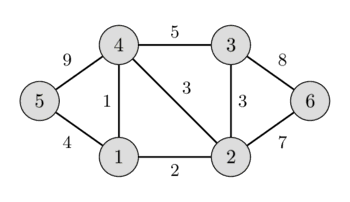
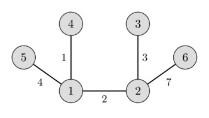

# Minimal ostov daraxt — Kruskal algoritmi

Bizga og‘irlikli yo‘naltirilmagan graf berilgan.

Bu grafning barcha tugunlarini bog‘laydigan (ya’ni ostov daraxt bo‘ladigan) va barcha mumkin bo‘lgan ostov daraxtlar orasida eng kichik og‘irlikka (ya’ni barcha qirralar og‘irliklari yig‘indisi minimal qiymatga) ega qismdaraxtni topmoqchimiz.

Bunday ostov daraxt minimal ostov daraxt deb ataladi.

Chapdagi rasmda og‘irlikli yo‘naltirilmagan graf, o‘ngdagi rasmda esa unga mos minimal ostov daraxt ko‘rsatilgan.

 

Ushbu maqolada minimal ostov daraxtlarga oid bir nechta muhim xossalar ko‘rib chiqiladi, so‘ng minimal ostov daraxtni topish uchun Kruskal algoritmining eng sodda implementatsiyasi beriladi.

## Minimal ostov daraxt xossalari

* Grafdagi barcha qirralarning og‘irliklari turlicha bo‘lsa, uning minimal ostov daraxti yagona bo‘ladi. Aks holda bir nechta minimal ostov daraxt mavjud bo‘lishi mumkin. (Muayyan algoritmlar odatda mumkin bo‘lgan minimal ostov daraxtlardan bittasini chiqaradi.)
* Minimal ostov daraxt qirralar og‘irliklari ko‘paytmasi eng kichik bo‘lgan daraxt hamdir. (Buni barcha qirralar og‘irliklarini ularning logarifmlariga almashtirish orqali oson isbotlash mumkin.)
* Grafning minimal ostov daraxtidagi eng katta qirra og‘irligi shu grafning barcha mumkin bo‘lgan ostov daraxtlari orasida eng kichik mumkin bo‘lgan qiymatdir. (Bu Kruskal algoritmining to‘g‘riligidan kelib chiqadi.)
* Grafning maksimal ostov daraxtini (qirralar og‘irliklari yig‘indisi maksimal bo‘lgan ostov daraxtni) minimal ostov daraxtga o‘xshash usulda topish mumkin: barcha qirralar og‘irliklarining ishorasini teskarisiga almashtirib, minimal ostov daraxt algoritmlaridan birini qo‘llash kifoya.

## Kruskal algoritmi

Bu algoritm Joseph Bernard Kruskal, Jr. tomonidan 1956-yilda tavsiflangan.

Kruskal algoritmi dastlab boshlang‘ich grafning barcha tugunlarini bir-biridan ajratib, bir tugunli daraxtlardan iborat o‘rmon hosil qiladi; keyin bu daraxtlarni bosqichma-bosqich birlashtiradi va har bir iteratsiyada barcha daraxtlardan istalgan ikkitasini boshlang‘ich grafning biror qirrasi bilan qo‘shadi. Algoritm bajarilishidan oldin barcha qirralar og‘irlik bo‘yicha kamaymaydigan tartibda saralanadi.

Keyin birlashtirish jarayoni boshlanadi: qirralarni saralangan tartibda boshidan oxirigacha olamiz va joriy tanlangan qirraning uchlari turli qismdaraxtlarga tegishli bo‘lsa, bu qismdaraxtlarni birlashtirib, qirrani javobga qo‘shamiz. Barcha qirralar ko‘rib chiqilgach, barcha tugunlar bitta qismdaraxtga tegishli bo‘ladi va javobni olamiz.

## Eng sodda implementatsiya

Quyidagi kod yuqorida tavsiflangan algoritmni bevosita implementatsiya qiladi va $O(M \log M + N^2)$ vaqt murakkabligiga ega.

Qirralarni saralash $O(M \log N)$ (bu $O(M \log M)$ bilan bir xil) amal talab qiladi.

Tugun qaysi qismdaraxtga tegishli ekani haqidagi ma’lumot `tree_id[]` massivi yordamida saqlanadi: har bir `v` tugun uchun `tree_id[v]` qiymati `v` tegishli bo‘lgan daraxt raqamini saqlaydi.

Har bir qirra uchlari turli daraxtlarga tegishli yoki yo‘qligini $O(1)$ vaqtda aniqlash mumkin.

Nihoyat, ikkita daraxtni birlashtirish `tree_id[]` massivi bo‘ylab oddiy yurish orqali $O(N)$ vaqtda bajariladi.

Birlashtirish amallarining umumiy soni $N-1$ ekanini hisobga olib, $O(M \log N + N^2)$ asimptotik murakkablikni olamiz.

```cpp
struct Edge {
    int u, v, weight;
    bool operator<(Edge const& other) {
        return weight < other.weight;
    }
};

int n;
vector<Edge> edges;

int cost = 0;
vector<int> tree_id(n);
vector<Edge> result;
for (int i = 0; i < n; i++)
    tree_id[i] = i;

sort(edges.begin(), edges.end());

for (Edge e : edges) {
    if (tree_id[e.u] != tree_id[e.v]) {
        cost += e.weight;
        result.push_back(e);
        int old_id = tree_id[e.u], new_id = tree_id[e.v];
        for (int i = 0; i < n; i++) {
            if (tree_id[i] == old_id)
                tree_id[i] = new_id;
        }
    }
}
```

## To‘g‘rilik isboti

Nima uchun Kruskal algoritmi to‘g‘ri natija beradi?

Boshlang‘ich graf bog‘langan bo‘lsa, natijaviy graf ham bog‘langan bo‘ladi.

Aks holda, kamida bitta qirra bilan bog‘lash mumkin bo‘lgan ikkita komponent mavjud bo‘lardi. Ammo buning imkoni yo‘q, chunki komponentlarning identifikatorlari turlicha bo‘lganidan Kruskal bunday qirralardan birini tanlagan bo‘lardi.

Natijaviy graf sikl ham saqlamaydi, chunki algoritmda bunga aniq ravishda yo‘l qo‘ymaymiz.

Demak, algoritm ostov daraxt hosil qiladi.

Unda nima uchun bu algoritm minimal ostov daraxt beradi?

“Algoritmning istalgan bosqichida $F$ algoritm tanlagan qirralar to‘plami bo‘lsa, $F$ ning barcha qirralarini o‘z ichiga oladigan minimal ostov daraxt mavjud” degan tasdiqni induksiya yordamida isbotlashimiz mumkin.

Tasdiq boshida ravshan: bo‘sh to‘plam istalgan minimal ostov daraxtning qismto‘plami.

Endi algoritmning biror bosqichida $F$ qirralar to‘plami, $F$ ni o‘z ichiga oluvchi $T$ minimal ostov daraxt va Kruskal yordamida qo‘shmoqchi bo‘lgan yangi qirra $e$ bo‘lsin.

Agar $e$ sikl hosil qilsa, uni qo‘shmaymiz va shu qadamdan keyin ham tasdiq to‘g‘riligicha qoladi.

Agar $T$ allaqachon $e$ ni o‘z ichiga olsa, bu qadamdan keyin ham tasdiq to‘g‘ri.

Agar $T$ da $e$ qirra bo‘lmasa, $T + e$ da biror $C$ sikl hosil bo‘ladi.

Bu siklda $F$ ga kirmaydigan kamida bitta $f$ qirra mavjud bo‘ladi.

$T - f + e$ qirralar to‘plami ham ostov daraxt bo‘ladi.

$f$ ning og‘irligi $e$ ning og‘irligidan kichik bo‘la olmasligiga e’tibor bering, aks holda Kruskal $f$ ni oldinroq tanlagan bo‘lardi.

U kattaroq ham bo‘la olmaydi, chunki u holda $T - f + e$ ning umumiy og‘irligi $T$ nikidan kichik bo‘lardi; $T$ allaqachon minimal ostov daraxt bo‘lgani uchun buning imkoni yo‘q.

Demak, $e$ va $f$ bir xil og‘irlikka ega bo‘lishi kerak.

Shuning uchun $T - f + e$ ham minimal ostov daraxt va u $F + e$ dagi barcha qirralarni o‘z ichiga oladi.

Demak, bu holatda ham qadamdan keyin tasdiq bajariladi.

Tasdiq isbotlandi.

Bu esa barcha qirralar ko‘rib chiqilgach, natijaviy qirralar to‘plami bog‘langan bo‘lishini va biror minimal ostov daraxt ichida yotishini anglatadi; demak, uning o‘zi ham minimal ostov daraxt bo‘lishi shart.

## Yaxshilangan implementatsiya

Kruskal algoritmining taxminan $O(M \log N)$ vaqt murakkabligidagi tezroq implementatsiyasini yozish uchun [**kesishmaydigan to‘plamlar birlashmasi** (DSU)](../data_structures/disjoint_set_union.md) ma’lumotlar tuzilmasidan foydalanishimiz mumkin. [Ushbu maqolada](mst_kruskal_with_dsu.md) bu yondashuv batafsil bayon qilingan.

## Amaliy masalalar

* [SPOJ - Koicost](http://www.spoj.com/problems/KOICOST/)
* [SPOJ - MaryBMW](http://www.spoj.com/problems/MARYBMW/)
* [Codechef - Fullmetal Alchemist](https://www.codechef.com/ICL2016/problems/ICL16A)
* [Codeforces - Edges in MST](http://codeforces.com/contest/160/problem/D)
* [UVA 12176 - Bring Your Own Horse](https://uva.onlinejudge.org/index.php?option=com_onlinejudge&Itemid=8&page=show_problem&problem=3328)
* [UVA 10600 - ACM Contest and Blackout](https://uva.onlinejudge.org/index.php?option=com_onlinejudge&Itemid=8&page=show_problem&problem=1541)
* [UVA 10724 - Road Construction](https://uva.onlinejudge.org/index.php?option=onlinejudge&page=show_problem&problem=1665)
* [Hackerrank - Roads in HackerLand](https://www.hackerrank.com/contests/june-world-codesprint/challenges/johnland/problem)
* [UVA 11710 - Expensive subway](https://uva.onlinejudge.org/index.php?option=com_onlinejudge&Itemid=8&page=show_problem&problem=2757)
* [Codechef - Chefland and Electricity](https://www.codechef.com/problems/CHEFELEC)
* [UVA 10307 - Killing Aliens in Borg Maze](https://uva.onlinejudge.org/index.php?option=com_onlinejudge&Itemid=8&page=show_problem&problem=1248)
* [Codeforces - Flea](http://codeforces.com/problemset/problem/32/C)
* [Codeforces - Igon in Museum](http://codeforces.com/problemset/problem/598/D)
* [Codeforces - Hongcow Builds a Nation](http://codeforces.com/problemset/problem/744/A)
* [UVA - 908 - Re-connecting Computer Sites](https://uva.onlinejudge.org/index.php?option=com_onlinejudge&Itemid=8&page=show_problem&problem=849)
* [UVA 1208 - Oreon](https://uva.onlinejudge.org/index.php?option=com_onlinejudge&Itemid=8&page=show_problem&problem=3649)
* [UVA 1235 - Anti Brute Force Lock](https://uva.onlinejudge.org/index.php?option=com_onlinejudge&Itemid=8&page=show_problem&problem=3676)
* [UVA 10034 - Freckles](https://uva.onlinejudge.org/index.php?option=com_onlinejudge&Itemid=8&page=show_problem&problem=975)
* [UVA 11228 - Transportation system](https://uva.onlinejudge.org/index.php?option=onlinejudge&page=show_problem&problem=2169)
* [UVA 11631 - Dark roads](https://uva.onlinejudge.org/index.php?option=com_onlinejudge&Itemid=8&page=show_problem&problem=2678)
* [UVA 11733 - Airports](https://uva.onlinejudge.org/index.php?option=com_onlinejudge&Itemid=8&page=show_problem&problem=2833)
* [UVA 11747 - Heavy Cycle Edges](https://uva.onlinejudge.org/index.php?option=com_onlinejudge&Itemid=8&page=show_problem&problem=2847)
* [SPOJ - Blinet](http://www.spoj.com/problems/BLINNET/)
* [SPOJ - Help the Old King](http://www.spoj.com/problems/IITKWPCG/)
* [Codeforces - Hierarchy](http://codeforces.com/contest/17/problem/B)
* [SPOJ - Modems](https://www.spoj.com/problems/EC_MODE/)
* [CSES - Road Reparation](https://cses.fi/problemset/task/1675)
* [CSES - Road Construction](https://cses.fi/problemset/task/1676)

