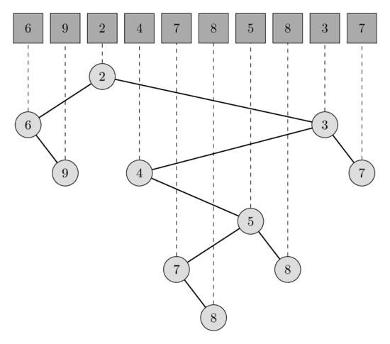
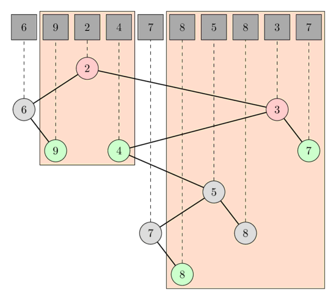

# RMQ masalasini LCA topishga keltirib yechish

Bizga `A[0..N-1]` massiv berilgan.

Har bir `[L, R]` ko‘rinishidagi so‘rov uchun `A` massivining `L` pozitsiyadan boshlanib `R` pozitsiyada tugaydigan qismidagi minimumni topmoqchimiz.

Jarayon davomida `A` massivi o‘zgarmaydi deb faraz qilamiz, ya’ni ushbu maqola statik RMQ masalasi yechimini tavsiflaydi.

Quyida asimptotik jihatdan optimal yechim bayon qilinadi.

U RMQ masalasining boshqa yechimlaridan keskin farq qiladi:

avval RMQ masalasini LCA masalasiga keltiradi, keyin [Farach–Colton va Bender algoritmi](lca_farachcoltonbender.md)dan foydalanadi; bu algoritm LCA masalasini yana maxsus RMQ masalasiga qaytarib, uni yechadi.

## Algoritm

`A` massividan **Dekart daraxti** quramiz.

`A` massivning Dekart daraxti — minimum-heap xossasiga ega (ota tugun qiymati bolalari qiymatlaridan kichik yoki ularga teng bo‘lishi kerak) ikkilik daraxt bo‘lib, daraxtni in-order tartibda yurish tugunlarga `A` massivdagi tartibda tashrif buyuradi.

Boshqacha aytganda, Dekart daraxti rekursiv ma’lumotlar tuzilmasidir.

`A` massivi uch qismga bo‘linadi: minimumgacha bo‘lgan prefiks, minimum element va qolgan suffiks.

Daraxt ildizi `A` massivning minimal elementiga mos tugun, chap qismdaraxt prefiksning Dekart daraxti, o‘ng qismdaraxt esa suffiksning Dekart daraxti bo‘ladi.

Quyidagi rasmda uzunligi 10 bo‘lgan massiv va unga mos Dekart daraxtini ko‘rishingiz mumkin.

<div style="text-align: center;">
  
</div>

`[l, r]` oraliq minimum so‘rovi `[l', r']` eng yaqin umumiy ajdod so‘roviga ekvivalent; bunda `l'` — `A[l]` elementiga mos tugun, `r'` esa `A[r]` elementiga mos tugun.

Darhaqiqat, oraliqdagi eng kichik elementga mos tugun oraliqdagi barcha tugunlarning, demak `l'` va `r'` ning ham ajdodi bo‘lishi kerak.

Bu bevosita minimum-heap xossasidan kelib chiqadi.

U eng quyi ajdod ham bo‘lishi kerak; aks holda `l'` va `r'` ikkalasi ham chap yoki ikkalasi ham o‘ng qismdaraxtda yotar edi, bu esa qarama-qarshilikka olib keladi, chunki bu holda minimum umuman oraliqqa kirmagan bo‘lardi.

Quyidagi rasmda `[1, 3]` va `[5, 9]` RMQ so‘rovlari uchun LCA so‘rovlarini ko‘rishingiz mumkin.

Birinchi so‘rovda `A[1]` va `A[3]` tugunlarining LCA si qiymati 2 bo‘lgan `A[2]` ga mos tugun; ikkinchi so‘rovda esa `A[5]` va `A[9]` tugunlarining LCA si qiymati 3 bo‘lgan `A[8]` ga mos tugundir.

<div style="text-align: center;">
  
</div>

Bunday daraxtni $O(N)$ vaqtda qurish mumkin; Farach–Colton va Bender algoritmi daraxtga $O(N)$ vaqtda oldindan ishlov berib, LCA ni $O(1)$ vaqtda topadi.

## Dekart daraxtini qurish

Dekart daraxtini elementlarni bittadan qo‘shish orqali quramiz.

Har bir qadamda barcha qayta ishlangan elementlar uchun yaroqli Dekart daraxtini saqlab turamiz.

`s[i]` elementini qo‘shish daraxtning faqat eng o‘ng yo‘lidagi — ildizdan boshlanib o‘ng bolani ketma-ket tanlash orqali hosil bo‘ladigan yo‘ldagi — tugunlarni o‘zgartira olishini ko‘rish oson.

Qiymati `s[i]` dan katta yoki unga teng bo‘lgan tugunlar ichida eng kichik qiymatli tugunning qismdaraxti `s[i]` ning chap qismdaraxtiga aylanadi; ildizi `s[i]` bo‘lgan daraxt esa qiymati `s[i]` dan kichik tugunlar orasidagi eng katta qiymatli tugunning yangi o‘ng qismdaraxtiga aylanadi.

Buni eng o‘ng tugunlarning indekslarini stekda saqlash orqali implementatsiya qilish mumkin.

```cpp
vector<int> parent(n, -1);
stack<int> s;
for (int i = 0; i < n; i++) {
    int last = -1;
    while (!s.empty() && A[s.top()] >= A[i]) {
        last = s.top();
        s.pop();
    }
    if (!s.empty())
        parent[i] = s.top();
    if (last >= 0)
        parent[last] = i;
    s.push(i);
}
```

