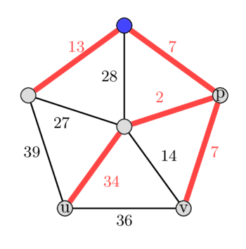
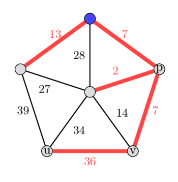

# Ikkinchi eng yaxshi minimal ostov daraxt

Minimal ostov daraxt $T$ — berilgan $G$ grafning barcha tugunlarini qamrab oladigan va barcha mumkin bo‘lgan ostov daraxtlar orasida qirralari og‘irliklari yig‘indisi eng kichik bo‘lgan daraxtdir.

Ikkinchi eng yaxshi minimal ostov daraxt $T'$ — $G$ grafning barcha mumkin bo‘lgan ostov daraxtlari orasida qirralar og‘irliklari yig‘indisi bo‘yicha ikkinchi eng kichik qiymatga ega ostov daraxtdir.

## Kuzatuv

$T$ — $G$ grafning minimal ostov daraxti bo‘lsin.

Ikkinchi eng yaxshi minimal ostov daraxt $T$ dan faqat bitta qirrani almashtirish bilan farq qilishini kuzatish mumkin. (Bu tasdiqning isboti uchun [bu yerdagi](http://www-bcf.usc.edu/~shanghua/teaching/Spring2010/public_html/files/HW2_Solutions_A.pdf) 23-1-masalaga qarang.)

Demak, $T$ ga kirmaydigan biror $e_{new}$ qirrani topib, uni $T$ dagi biror $e_{old}$ qirra bilan shunday almashtirishimiz kerakki, yangi $T' = (T \cup \{e_{new}\}) \setminus \{e_{old}\}$ graf ostov daraxt bo‘lsin va og‘irliklar farqi ($e_{new} - e_{old}$) minimal bo‘lsin.

## Kruskal algoritmidan foydalanish

Avval Kruskal algoritmi yordamida minimal ostov daraxtni topib, keyin undan bittadan qirrani olib tashlab, boshqa qirra bilan almashtirishga urinib ko‘rishimiz mumkin.

1. Qirralarni $O(E \log E)$ vaqtda saralang, keyin Kruskal yordamida $O(E)$ vaqtda minimal ostov daraxtni toping.
2. Minimal ostov daraxtdagi har bir qirrani (unda $V-1$ ta qirra bo‘ladi) vaqtincha qirralar ro‘yxatidan chiqarib tashlang, shunda u tanlana olmaydi.
3. Keyin qolgan qirralar yordamida yana $O(E)$ vaqtda minimal ostov daraxt topishga urinib ko‘ring.
4. Buni minimal ostov daraxtdagi barcha qirralar uchun bajaring va barcha natijalar orasidan eng yaxshisini tanlang.

Eslatma: 3-qadam uchun qirralarni qayta saralash shart emas.

Shunday qilib, umumiy vaqt murakkabligi $O(E \log V + E + V E)$ = $O(V E)$ bo‘ladi.

## Eng yaqin umumiy ajdod (LCA) masalasiga modellashtirish

Avvalgi yondashuvda minimal ostov daraxtdan bitta qirrani olib tashlashning barcha imkoniyatlarini sinadik.

Bu yerda buning aynan teskarisini qilamiz.

Minimal ostov daraxtga hali kirmagan har bir qirrani qo‘shishga urinib ko‘ramiz.

1. Qirralarni $O(E \log E)$ vaqtda saralang, keyin Kruskal yordamida $O(E)$ vaqtda minimal ostov daraxtni toping.
2. Minimal ostov daraxtga kirmaydigan har bir $e$ qirrani unga vaqtincha qo‘shing; natijada sikl hosil bo‘ladi. Bu sikl LCA orqali o‘tadi.
3. $e$ qirraga teng bo‘lmagan sikldagi eng katta og‘irlikli $k$ qirrani toping; buning uchun $e$ qirra uchlarining ajdodlari bo‘ylab LCA gacha ko‘tariling.
4. $k$ qirrani vaqtincha olib tashlab, yangi ostov daraxt hosil qiling.
5. Og‘irliklar farqi $\delta = weight(e) - weight(k)$ ni hisoblang va uni almashtirilgan qirra bilan birga eslab qoling.
6. 2-qadamni boshqa barcha qirralar uchun takrorlang va minimal ostov daraxtdan og‘irlik farqi eng kichik bo‘lgan ostov daraxtni qaytaring.

Algoritmning vaqt murakkabligi 2-qadamdagi siklning maksimal og‘irlikli qirralari bo‘lgan $k$ larni qanday hisoblashimizga bog‘liq.

Ularni $O(E \log V)$ vaqtda samarali hisoblash usullaridan biri masalani eng yaqin umumiy ajdod (LCA) masalasiga aylantirishdir.

Minimal ostov daraxtga ildiz berib, LCA uchun oldindan ishlov beramiz hamda har bir tugun uchun uning ajdodlarigacha bo‘lgan yo‘llardagi maksimal qirra og‘irliklarini ham hisoblaymiz.

Buni LCA uchun [ikkilik ko‘tarilish](lca_binary_lifting.md) yordamida bajarish mumkin.

Bu yondashuvning yakuniy vaqt murakkabligi $O(E \log V)$.

Masalan:

<div style="text-align: center;">
  
  
  <br />

*Chapdagi rasmda minimal ostov daraxt, o‘ngdagi rasmda esa ikkinchi eng yaxshi minimal ostov daraxt ko‘rsatilgan.*
</div>

Berilgan grafda minimal ostov daraxtga yuqoridagi ko‘k tugunda ildiz beramiz va algoritmni minimal ostov daraxtga kirmaydigan qirralarni tanlashdan boshlaymiz, deb faraz qilaylik.

Birinchi tanlangan qirra og‘irligi 36 bo‘lgan $(u, v)$ qirra bo‘lsin.

Bu qirrani daraxtga qo‘shish 36 - 7 - 2 - 34 siklini hosil qiladi.

Endi $\text{LCA}(u, v) = p$ ni topish orqali bu sikldagi maksimal og‘irlikli qirrani topamiz.

$u$ dan $p$ gacha va $v$ dan $p$ gacha yo‘llardagi maksimal og‘irlikli qirrani hisoblaymiz.

Eslatma: ayrim holatlarda $\text{LCA}(u, v)$ ning o‘zi $u$ yoki $v$ ga teng bo‘lishi ham mumkin.

Ushbu misolda sikldagi maksimal qirra og‘irligi sifatida 34 ni olamiz.

Bu qirrani olib tashlab, og‘irlik farqi atigi 2 bo‘lgan yangi ostov daraxt hosil qilamiz.

Boshlang‘ich minimal ostov daraxtga kirmaydigan qolgan barcha qirralar uchun ham buni bajargach, bu ostov daraxt umumiy hisobda ikkinchi eng yaxshi ostov daraxt ekanini ko‘rishimiz mumkin.

Og‘irligi 14 bo‘lgan qirrani tanlash daraxt og‘irligini 7 ga, og‘irligi 27 bo‘lgan qirrani tanlash 14 ga, og‘irligi 28 bo‘lgan qirrani tanlash 21 ga va og‘irligi 39 bo‘lgan qirrani tanlash 5 ga oshiradi.

## Implementatsiya

```cpp
struct edge {
    int s, e, w, id;
    bool operator<(const struct edge& other) { return w < other.w; }
};
typedef struct edge Edge;

const int N = 2e5 + 5;
long long res = 0, ans = 1e18;
int n, m, a, b, w, id, l = 21;
vector<Edge> edges;
vector<int> h(N, 0), parent(N, -1), size(N, 0), present(N, 0);
vector<vector<pair<int, int>>> adj(N), dp(N, vector<pair<int, int>>(l));
vector<vector<int>> up(N, vector<int>(l, -1));
pair<int, int> combine(pair<int, int> a, pair<int, int> b) {
    vector<int> v = {a.first, a.second, b.first, b.second};
    int topTwo = -3, topOne = -2;
    for (int c : v) {
        if (c > topOne) {
            topTwo = topOne;
            topOne = c;
        } else if (c > topTwo && c < topOne) {
            topTwo = c;
        }
    }
    return {topOne, topTwo};
}
void dfs(int u, int par, int d) {
    h[u] = 1 + h[par];
    up[u][0] = par;
    dp[u][0] = {d, -1};
    for (auto v : adj[u]) {
        if (v.first != par) {
            dfs(v.first, u, v.second);
        }
    }
}
pair<int, int> lca(int u, int v) {
    pair<int, int> ans = {-2, -3};
    if (h[u] < h[v]) {
        swap(u, v);
    }
    for (int i = l - 1; i >= 0; i--) {
        if (h[u] - h[v] >= (1 << i)) {
            ans = combine(ans, dp[u][i]);
            u = up[u][i];
        }
    }
    if (u == v) {
        return ans;
    }
    for (int i = l - 1; i >= 0; i--) {
        if (up[u][i] != -1 && up[v][i] != -1 && up[u][i] != up[v][i]) {
            ans = combine(ans, combine(dp[u][i], dp[v][i]));
            u = up[u][i];
            v = up[v][i];
        }
    }
    ans = combine(ans, combine(dp[u][0], dp[v][0]));
    return ans;
}
int main(void) {
    cin >> n >> m;
    for (int i = 1; i <= n; i++) {
        parent[i] = i;
        size[i] = 1;
    }
    for (int i = 1; i <= m; i++) {
        cin >> a >> b >> w; // 1-indexed
        edges.push_back({a, b, w, i - 1});
    }
    sort(edges.begin(), edges.end());
    for (int i = 0; i <= m - 1; i++) {
        a = edges[i].s;
        b = edges[i].e;
        w = edges[i].w;
        id = edges[i].id;
        if (unite_set(a, b)) {
            adj[a].emplace_back(b, w);
            adj[b].emplace_back(a, w);
            present[id] = 1;
            res += w;
        }
    }
    dfs(1, 0, 0);
    for (int i = 1; i <= l - 1; i++) {
        for (int j = 1; j <= n; ++j) {
            if (up[j][i - 1] != -1) {
                int v = up[j][i - 1];
                up[j][i] = up[v][i - 1];
                dp[j][i] = combine(dp[j][i - 1], dp[v][i - 1]);
            }
        }
    }
    for (int i = 0; i <= m - 1; i++) {
        id = edges[i].id;
        w = edges[i].w;
        if (!present[id]) {
            auto rem = lca(edges[i].s, edges[i].e);
            if (rem.first != w) {
                if (ans > res + w - rem.first) {
                    ans = res + w - rem.first;
                }
            } else if (rem.second != -1) {
                if (ans > res + w - rem.second) {
                    ans = res + w - rem.second;
                }
            }
        }
    }
    cout << ans << "\n";
    return 0;
}
```

## Manbalar

1. Steven Halim, *Sport dasturlash — 3*
2. [web.mit.edu](http://web.mit.edu/6.263/www/quiz1-f05-sol.pdf)

## Masalalar

* [Codeforces - Minimum spanning tree for each edge](https://codeforces.com/problemset/problem/609/E)

