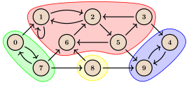
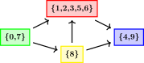

# Kuchli bog‘langan komponentlar va kondensatsiya grafi

## Ta’riflar

$G=(V,E)$ — tugunlari $V$ va qirralari $E\subseteq V\times V$ bo‘lgan yo‘naltirilgan graf bo‘lsin. $G$ dagi tugunlar sonini $n=|V|$, qirralar sonini esa $m=|E|$ bilan belgilaymiz. Ushbu maqoladagi barcha ta’riflarni multigraflarga kengaytirish oson, ammo bu yerda bunga alohida e’tibor qaratmaymiz.

$C\subseteq V$ tugunlar to‘plami quyidagi shartlar bajarilsa **kuchli bog‘langan komponent** deb ataladi:

- barcha $u,v\in C$, $u\ne v$ uchun $u$ dan $v$ ga ham, $v$ dan $u$ ga ham yo‘l mavjud;
- $C$ maksimaldir, ya’ni yuqoridagi shartni buzmasdan unga boshqa tugun qo‘shib bo‘lmaydi.

$G$ grafning kuchli bog‘langan komponentlari to‘plamini $\text{SCC}(G)$ bilan belgilaymiz. Bu komponentlar o‘zaro kesishmaydi va grafning barcha tugunlarini qoplaydi. Demak $\text{SCC}(G)$ to‘plam $V$ ning bo‘linishidir.

Quyidagi $G_\text{example}$ grafda kuchli bog‘langan komponentlar ajratib ko‘rsatilgan:

<center></center>

Bu yerda

$$\text{SCC}(G_\text{example})=\{\{0,7\},\{1,2,3,5,6\},\{4,9\},\{8\}\}.$$

Har bir kuchli bog‘langan komponent ichida barcha tugunlardan bir-biriga yetib borish mumkinligini tekshirish mumkin.

**Kondensatsiya grafi** $G^{\text{SCC}}=(V^{\text{SCC}},E^{\text{SCC}})$ ni quyidagicha ta’riflaymiz:

- $G^{\text{SCC}}$ ning tugunlari $G$ ning kuchli bog‘langan komponentlaridir, ya’ni $V^{\text{SCC}}=\text{SCC}(G)$;
- kondensatsiya grafidagi har bir $C_i,C_j$ tugunlar uchun $C_i$ dan $C_j$ ga qirra bo‘lishi uchun va faqat shundagina $C_i\ne C_j$ bo‘lib, $a\in C_i$ va $b\in C_j$ shunday tugunlar mavjud bo‘lishi kerakki, $G$ da $a$ dan $b$ ga qirra bo‘lsin.

$G_\text{example}$ grafning kondensatsiya grafi quyidagicha:

<center></center>

Kondensatsiya grafning eng muhim xossasi — uning **siklsiz** bo‘lishidir. Ta’rif bo‘yicha kondensatsiya grafda o‘z-o‘ziga qirra yo‘q. Agar unda ikki yoki undan ortiq komponentdan o‘tuvchi sikl bo‘lsa, yetib borish xossasi tufayli shu kuchli bog‘langan komponentlarning birlashmasi aslida bitta kuchli bog‘langan komponent bo‘lishi kerak edi; bu esa qarama-qarshilik.

Keyingi bo‘limdagi algoritmlar berilgan grafning barcha kuchli bog‘langan komponentlarini topadi. Shundan so‘ng kondensatsiya grafini qurish mumkin.

## Kosaraju algoritmi

### Algoritm tavsifi

Bu algoritm taxminan 1980-yilda Kosaraju va Sharir tomonidan bir-biridan mustaqil taklif qilingan. U [chuqurlik bo‘yicha qidiruvning](depth-first-search.md) ikki seriyasiga asoslanadi va $O(n+m)$ vaqtda ishlaydi.

Algoritmning birinchi qadamida butun grafni aylanib chiqadigan chuqurlik bo‘yicha qidiruvlar (`dfs`) ketma-ketligini bajaramiz. Ya’ni hali tashrif buyurilmagan tugun bor ekan, ulardan birini tanlab, undan DFS boshlaymiz. Har bir tugun uchun $t_\text{out}[v]$ **chiqish vaqti**ni saqlaymiz. Bu `dfs(v)` bajarilishi tugaydigan, ya’ni $v$ dan yetib borish mumkin bo‘lgan barcha tugunlarga tashrif buyurilib, algoritm $v$ ga qaytgan vaqt tamg‘asidir.

Ketma-ket `dfs` chaqiruvlari orasida vaqt hisoblagichini qaytadan nolga tushirmaslik kerak. Chiqish vaqtlari algoritmda hal qiluvchi o‘rin tutadi; bu quyidagi teoremadan ko‘rinadi.

Kuchli bog‘langan komponent $C$ ning chiqish vaqti $t_\text{out}[C]$ ni $C$ dagi barcha $v$ tugunlar uchun $t_\text{out}[v]$ qiymatlarining maksimumi sifatida ta’riflaymiz. Isbotda har bir $v\in G$ tugunning $t_\text{in}[v]$ **kirish vaqti**dan ham foydalanamiz. $t_\text{in}[v]$ — algoritmning birinchi qadamida $v$ tugun uchun `dfs` rekursiv funksiyasi chaqirilgan vaqt tamg‘asi. Komponent $C$ uchun $t_\text{in}[C]$ — $C$ dagi barcha $v$ lar orasidagi $t_\text{in}[v]$ qiymatlarining minimumi.

!!! info "Teorema"

    $C$ va $C'$ turli kuchli bog‘langan komponentlar bo‘lsin va kondensatsiya grafida $C$ dan $C'$ ga qirra mavjud bo‘lsin. U holda $t_\text{out}[C]>t_\text{out}[C']$.

??? note "Isbot"

    Chuqurlik bo‘yicha qidiruv ikki komponentdan qaysi biriga avval yetishiga qarab ikki holat mavjud.

    - **1-holat:** avval $C$ komponentiga yetildi, ya’ni $t_\text{in}[C]<t_\text{in}[C']$. DFS biror paytda $v\in C$ tugunga tashrif buyuradi va shu paytda $C$ hamda $C'$ komponentlarining qolgan tugunlari hali tashrif buyurilmagan bo‘ladi. Kondensatsiya grafida $C$ dan $C'$ ga qirra borligi sababli, $G$ da $v$ dan nafaqat $C$ ning barcha boshqa tugunlariga, balki $C'$ ning barcha tugunlariga ham yetib borish mumkin. Demak $v$ dan boshlangan joriy `dfs` kelajakda $C$ va $C'$ ning barcha qolgan tugunlariga tashrif buyuradi; ular DFS daraxtida $v$ ning avlodlari bo‘ladi. Shu sababli har bir $u\in(C\cup C')\setminus\{v\}$ uchun $t_\text{out}[v]>t_\text{out}[u]$. Demak $t_\text{out}[C]>t_\text{out}[C']$.

    - **2-holat:** avval $C'$ komponentiga yetildi, ya’ni $t_\text{in}[C]>t_\text{in}[C']$. DFS biror paytda $v\in C'$ tugunga tashrif buyuradi va shu paytda $C$ hamda $C'$ ning qolgan tugunlari hali tashrif buyurilmagan bo‘ladi. Kondensatsiya grafida $C$ dan $C'$ ga qirra mavjud va u siklsiz bo‘lgani sababli, $C'$ dan $C$ ga yetib borish mumkin emas. Demak $v$ dan ishlayotgan `dfs` $C$ ning hech bir tuguniga yetib bormaydi, ammo $C'$ ning barcha tugunlariga tashrif buyuradi. $C$ tugunlariga ushbu qadamning keyinroq bajariladigan boshqa `dfs` chaqiruvlari tashrif buyuradi. Shuning uchun yana $t_\text{out}[C]>t_\text{out}[C']$.

Isbotlangan teorema kuchli bog‘langan komponentlarni topish uchun juda muhim: kondensatsiya grafidagi har bir qirra kattaroq $t_\text{out}$ qiymatli komponentdan kichikroq $t_\text{out}$ qiymatli komponentga yo‘naladi.

Barcha $v\in V$ tugunlarni $t_\text{out}[v]$ chiqish vaqtining kamayish tartibida saralasak, birinchi $u$ tugun kondensatsiya grafida kiruvchi qirrasi yo‘q «ildiz» kuchli bog‘langan komponentga tegishli bo‘ladi. Endi $u$ dan shunday qidiruv boshlamoqchimizki, u faqat $u$ ning kuchli bog‘langan komponentidagi barcha tugunlarga tashrif buyursin va boshqa komponentlarga o‘tmasin.

Bu ishni takrorlash orqali barcha kuchli bog‘langan komponentlarni bosqichma-bosqich topamiz: avval topilgan komponentning tugunlarini olib tashlaymiz, qolgan tugunlar orasidan eng katta $t_\text{out}$ qiymatli tugunni tanlab, undan yana qidiruv boshlaymiz va hokazo. Kerakli xususiyatga ega qidiruvni topish uchun quyidagi teoremani ko‘ramiz.

!!! info "Teorema"

    $G^T$ — $G$ dagi barcha qirralar yo‘nalishini teskarilash orqali olingan **transpozitsiya graf** bo‘lsin. U holda $\text{SCC}(G)=\text{SCC}(G^T)$. Bundan tashqari, $G^T$ ning kondensatsiya grafi $G$ kondensatsiya grafining transpozitsiyasidir.

Isbot keltirilmaydi, ammo u sodda. Teoremaga ko‘ra, $G^T$ ning kondensatsiya grafida «ildiz» komponentdan boshqa komponentlarga chiquvchi qirra bo‘lmaydi. Demak $v$ tugunni o‘z ichiga olgan butun «ildiz» kuchli bog‘langan komponentga tashrif buyurish uchun transpozitsiya graf $G^T$ da $v$ dan oddiy DFS boshlash kifoya; bu qidiruv aynan shu komponent tugunlariga tashrif buyuradi.

Keyin topilgan tugunlarni olib tashlab, qolgan tugunlardan eng katta $t_\text{out}[v]$ qiymatlisini tanlaymiz va keyingi komponentni topish uchun $G^T$ da undan DFS boshlaymiz. Jarayonni takrorlab, barcha kuchli bog‘langan komponentlarni topamiz.

Xulosa qilib, algoritm quyidagi qadamlardan iborat:

- **1-qadam.** $G$ da chuqurlik bo‘yicha qidiruvlar ketma-ketligini bajaring. Natijada tugunlarning chiqish vaqti $t_\text{out}$ ning o‘sish tartibida saralangan, masalan `order` ro‘yxati olinadi.
- **2-qadam.** $G^T$ transpozitsiya grafni quring va tugunlarda teskari tartibda, ya’ni chiqish vaqtining kamayish tartibida chuqurlik bo‘yicha qidiruvlar seriyasini bajaring. Har bir DFS bitta kuchli bog‘langan komponentni beradi.
- **3-qadam (ixtiyoriy).** Kondensatsiya grafini quring.

Algoritm $O(n+m)$ vaqtda ishlaydi, chunki DFS ikki marta bajariladi. Kondensatsiya grafini qurish ham $O(n+m)$ vaqt talab qiladi.

Bu yerda [topologik tartiblash](topological-sort.md)ni ham eslatish o‘rinli. Birinchi qadamda tugunlar chiqish vaqtining o‘sish tartibida topiladi. Agar $G$ siklsiz bo‘lsa, bu $G$ ning teskari topologik tartibiga mos keladi. Ikkinchi qadamda komponentlar chiqish vaqtining kamayish tartibida topiladi; ya’ni kondensatsiya graf tugunlari uning topologik tartibiga mos tartibda olinadi.

### Implementatsiya

```{.cpp file=strongly_connected_components}
vector<bool> visited; // keeps track of which vertices are already visited

// runs depth first search starting at vertex v.
// each visited vertex is appended to the output vector when dfs leaves it.
void dfs(int v, vector<vector<int>> const& adj, vector<int> &output) {
    visited[v] = true;
    for (auto u : adj[v])
        if (!visited[u])
            dfs(u, adj, output);
    output.push_back(v);
}
// input: adj -- adjacency list of G
// output: components -- the strongy connected components in G
// output: adj_cond -- adjacency list of G^SCC (by root vertices)
void strongly_connected_components(vector<vector<int>> const& adj,
                                  vector<vector<int>> &components,
                                  vector<vector<int>> &adj_cond) {
    int n = adj.size();
    components.clear(), adj_cond.clear();

    vector<int> order; // will be a sorted list of G's vertices by exit time
    visited.assign(n, false);

    // first series of depth first searches
    for (int i = 0; i < n; i++)
        if (!visited[i])
            dfs(i, adj, order);

    // create adjacency list of G^T
    vector<vector<int>> adj_rev(n);
    for (int v = 0; v < n; v++)
        for (int u : adj[v])
            adj_rev[u].push_back(v);

    visited.assign(n, false);
    reverse(order.begin(), order.end());

    vector<int> roots(n, 0); // gives the root vertex of a vertex's SCC
    // second series of depth first searches
    for (auto v : order)
        if (!visited[v]) {
            std::vector<int> component;
            dfs(v, adj_rev, component);
            components.push_back(component);
            int root = *component.begin();
            for (auto u : component)
                roots[u] = root;
        }
    // add edges to condensation graph
    adj_cond.assign(n, {});
    for (int v = 0; v < n; v++)
        for (auto u : adj[v])
            if (roots[v] != roots[u])
                adj_cond[roots[v]].push_back(roots[u]);
}
```

`dfs` funksiyasi chuqurlik bo‘yicha qidiruvni amalga oshiradi. U kirishda qo‘shnilik ro‘yxati va boshlang‘ich tugunni, shuningdek `output` vektoriga havolani oladi. `dfs` tugundan chiqayotganda tashrif buyurilgan har bir tugun `output` ga qo‘shiladi.

`dfs` funksiyasi algoritmning birinchi va ikkinchi qadamida ham ishlatiladi. Birinchi qadamda unga $G$ ning qo‘shnilik ro‘yxati uzatiladi va ketma-ket chaqiruvlarning barchasiga bir xil `order` chiqish vektori beriladi; natijada tugunlarning chiqish vaqtining o‘sish tartibidagi ro‘yxati olinadi. Ikkinchi qadamda $G^T$ ning qo‘shnilik ro‘yxati uzatiladi va har bir chaqiruvga bo‘sh `component` chiqish vektori beriladi; har safar aynan bitta kuchli bog‘langan komponent olinadi.

## Tarjanning kuchli bog‘langan komponentlar algoritmi

### Algoritm tavsifi

Bu algoritmni Tarjan 1972-yilda taklif qilgan. U DFS chaqiruvlari ketma-ketligini bajaradi va DFS tuzilmasiga xos ma’lumotlardan kuchli bog‘langan komponentlarni aniqlash uchun foydalanadi. Ishlash vaqti $O(n+m)$.

Biror tugunda DFS bajarganda uning qo‘shnilik ro‘yxatini ko‘rib chiqamiz; tashrif buyurilmagan tugun topilsa, unga rekursiv DFS qo‘llaymiz. DFS chaqiruvlari ketma-ketligi hosil qilgan daraxtni **DFS daraxti** deb ataymiz.

Biror kuchli bog‘langan komponentning tugunida DFS birinchi marta chaqirilgach, ushbu chaqiruv tugashidan oldin shu komponentdagi barcha tugunlarga tashrif buyuriladi, chunki ular bir-biridan yetib boriladigan tugunlardir. DFS daraxtida birinchi tashrif buyurilgan tugun komponentning barcha boshqa tugunlari uchun umumiy ajdod bo‘ladi; uni **komponent ildizi** deb ataymiz.

!!! info "Teorema"

    Bitta kuchli bog‘langan komponentning barcha tugunlari DFS daraxtida bog‘langan ostgraf hosil qiladi.

??? note "Isbot"

    Kuchli bog‘langan komponentning barcha tugunlari DFS birinchi tashrif buyurgan umumiy ajdodga ega ekanini aniqladik. $v$ tugun va uning $r$ ildizini ko‘raylik. $r$ dan $v$ gacha bo‘lgan yo‘ldagi barcha tugunlar ayni kuchli bog‘langan komponentga tegishli. Ularning barchasi $r$ dan yetib boriladigan, barchasi $v$ ga yetib boradigan tugunlardir; ta’rif bo‘yicha $v$ ham $r$ ga yetib boradi. Demak yo‘ldagi barcha tugunlar bir-biriga yetib boradi. Ildizdan komponentdagi har bir boshqa tugungacha bo‘lgan yo‘llarning barchasi ayni komponentda yotgani uchun hosil bo‘lgan ostgraf bog‘langan.

Kuchli bog‘langan komponentlar DFS daraxtini bog‘langan ostgraflarga aniq bo‘lib tashlaydi.

Algoritm g‘oyasi quyidagicha:

- Qo‘shnilik ro‘yxatlaridagi tugunlarga rekursiv o‘tib, DFS chaqiruvlari ketma-ketligini bajaramiz.
- Tugunning qo‘shnilik ro‘yxatini ko‘rib bo‘lgach, uning ildiz yoki ildiz emasligini qandaydir usulda aniqlaymiz; bu usul quyida tushuntiriladi.
- Agar tugun ildiz bo‘lsa, uning kuchli bog‘langan komponentidagi barcha tugunlarni shu zahoti topib, ushbu komponentga biriktiramiz. Barcha chaqiruvlar tugagach, barcha ildizlar topilgan va har bir tugun biror komponentga biriktirilgan bo‘ladi.

Endi tugunlarni komponentlarga biriktirish jarayoni kiritilganda DFSning xossalarini tahlil qilamiz.

!!! info "Teorema"

    $v$ tugunning qo‘shnilik ro‘yxatini ko‘rib chiqish endigina tugagan bo‘lsin. Uning ost-daraxtidagi hali hech bir komponentga biriktirilmagan barcha tugunlar ayni kuchli bog‘langan komponentga tegishli.

??? note "Isbot"

    Algoritm komponent ildizi topilganda uning tugunlarini biriktiradi. $v$ ning qo‘shnilik ro‘yxati to‘liq ko‘rilgach, uning ost-daraxtidagi barcha DFS chaqiruvlari tugagan, ildizlar aniqlangan va ularga tegishli komponentlarning tugunlari biriktirilgan bo‘ladi. Qolgan biriktirilmagan tugunlarning ildizi hali biriktirish jarayoni bajarilmagan ajdod bo‘ladi; u $v$ ning o‘zi yoki $v$ ning ajdodlaridan biridir. $v$ barcha tugunlardan ularning ildizigacha bo‘lgan yo‘lda yotadi, komponentlar esa daraxtda bog‘langan ostgraf hosil qilishi kerak. Demak $v$ va qolgan barcha tugunlar bitta kuchli bog‘langan komponentga tegishli.

!!! info "Teorema"

    $v$ tugunning qo‘shnilik ro‘yxatini ko‘rayotgan va hozir $(v,u)$ qirrani qayta ishlayotgan bo‘laylik. Agar $u$ ga oldin biror DFS chaqiruvi tashrif buyurgan va u hali komponentga biriktirilmagan bo‘lsa, $v$ va $u$ bitta kuchli bog‘langan komponentga tegishli.

??? note "Isbot"

    Qirra turiga qarab bir nechta holat bor.

    - **Daraxt qirrasi.** Agar qirra daraxt qirrasi bo‘lsa, $u$ tugunni birinchi marta ko‘ryapmiz. Avval $u$ da rekursiv DFS bajarib, u tugagandan keyin natijani ko‘rib chiqish kerak. Agar $u$ hali biriktirilmagan bo‘lsa, uning ildizi $v$ yoki $v$ ning biror ajdodi bo‘ladi; demak ular ayni komponentga tegishli.
    - **Orqa qirra.** Agar $u$ tugun $v$ ning ajdodi bo‘lsa, ular bir-biridan yetib boriladi va ta’rif bo‘yicha bitta komponentga tegishli.
    - **Oldinga qirra.** Ushbu qirra ko‘rilishidan oldin bir qator DFS chaqiruvlari $u$ ning ildizini topmasdan tugab, boshqaruv `dfs(v)` ga qaytgan. $u$ ning ildizi hali biriktirish jarayoni bajarilmagan ajdod bo‘ladi; u $v$ yoki $v$ ning biror ajdodidir. Shuning uchun ular bitta komponentda.
    - **Ko‘ndalang qirra.** Xuddi shunday, qirra ko‘rilishidan oldin DFS chaqiruvlari $u$ ildizini topmasdan tugab, $u$ va $v$ ning umumiy ajdodiga qaytgan; u yerdan yangi chaqiruvlar ketma-ketligi $v$ ga olib kelgan. $u$ ning ildizi hali biriktirish jarayoni bajarilmagan ajdod bo‘ladi va barcha nomzodlar $v$ bilan umumiy ajdodlardir. $u$ ning ildizi $v$ ning ajdodi bo‘lgani uchun u $v$ ga yetadi; $v$ esa joriy qirra orqali $u$ ga yetadi. Demak ular bitta komponentga tegishli.

Ikki tugun bitta komponentga tegishli bo‘lsa, ularning ildizi ikkala tugunning umumiy ajdodi bo‘lishi kerak.

!!! info "Teorema"

    $v$ tugun uchun quyidagi ikki tasdiq teng kuchli:

    1. $v$ ning ost-daraxtidagi biror tugun ost-daraxt tashqarisidagi, hali komponentga biriktirilmagan tugunga yetadi.
    2. $v$ kuchli bog‘langan komponent ildizi emas.

??? note "Isbot"

    - $1\implies2$. $v$ ost-daraxtidagi $u$ tugun tashqaridagi biriktirilmagan $w$ tugunga yetsin. $u$ va $w$ bitta komponentga tegishli, ularning ildizi esa ikkalasining umumiy ajdodi bo‘lishi kerak. Bu umumiy ajdod albatta $v$ ost-daraxtidan tashqarida va $v$ ning ham ajdodidir. $v$ ildizdan $u$ gacha bo‘lgan yo‘lda yotgani sababli ayni komponentga tegishli, ammo uning ildizi $v$ emas.
    - $\neg1\implies\neg2$. $v$ ost-daraxtidagi hech bir tugun tashqaridagi biriktirilmagan tugunga yetmaydi deb faraz qilaylik. Demak ost-daraxtdan $v$ ning ajdodiga ham yetib bo‘lmaydi. Ost-daraxt tashqarisiga boruvchi yagona mumkin qirralar allaqachon biriktirilgan tugunlarga ko‘ndalang qirralardir. Bu tugunlar $v$ ning ajdodiga yeta olmaydi; aks holda ular $v$ bilan bitta komponentga tegishli bo‘lar edi, bu esa ularning komponenti oldin aniqlangani bilan zid. $v$ ning ost-daraxtidan uning hech bir ajdodiga yetib bo‘lmagani uchun $v$ ning ildizi $v$ ning o‘zi bo‘lishi kerak.

Endi tugun ildiz yoki ildiz emasligini aniqlash usulini topamiz. Biriktirish jarayonining yuqoridagi xossalari uning to‘g‘riligi uchun zarur.

Har bir $v\in G$ tugun uchun $t_\text{in}[v]$ kirish vaqtini, ya’ni `dfs(v)` chaqirilgan vaqt tamg‘asini belgilaymiz. Ta’rif bo‘yicha ildiz DFS tashrif buyurgan komponentning birinchi tuguni, shuning uchun uning $t_\text{in}$ qiymati komponent ichida eng kichik bo‘ladi.

$v$ tugun va uning ost-daraxtini ko‘raylik. Qo‘shnilik ro‘yxatini ko‘rib chiqish tugagan paytda, ost-daraxt tashqarisida DFS oldin tashrif buyurgan har bir tugunning $t_\text{in}$ qiymati kichikroq bo‘ladi, chunki DFS ularda $v$ dan oldin boshlangan. Biriktirish jarayonini hisobga olganda, $v$ ost-daraxtidan tashqaridagi barcha hali biriktirilmagan tugunlarning $t_\text{in}$ qiymati $t_\text{in}[v]$ dan kichik.

Endi ildizlarni aniqlash uchun $t_\text{in}$ dan qanday foydalanish mumkinligi ko‘rinadi. Yetib borish mumkin bo‘lgan biriktirilmagan tugunlarning eng kichik $t_\text{in}$ qiymatini ko‘rib, bu ma’lumotni daraxt qirralari orqali ajdodlarga uzatamiz. Uzatiladigan qiymatni $t_\text{low}$ deb ataymiz. Aniqroq aytganda, $t_\text{low}[v]$ — $v$ ning ost-daraxtidagi biror tugun bitta bevosita qirra orqali yetishi mumkin bo‘lgan tugunlarning eng kichik $t_\text{in}$ qiymati.

Shunday qilib, $v$ ildiz emasligini $t_\text{low}[v] < t_\text{in}[v]$ sharti bilan aniqlaymiz. Aksincha, $t_\text{low}[v]=t_\text{in}[v]$ bo‘lsa, $v$ komponent ildizidir.

Komponent tugunlarini biriktirish uchun boshqa graf bo‘ylab yurish kabi ko‘p usullar bor, ammo hali biriktirilmagan tugunlarni oddiy ma’lumotlar tuzilmasida saqlash mumkin. Tuzilma faqat ikki amalni bajarishi kerak:

- tugunga birinchi marta tashrif buyurganda uni tuzilmaga qo‘shish;
- ildiz topilganda uning ost-daraxtidagi barcha qolgan biriktirilmagan tugunlarni topib, tuzilmadan olib tashlash.

$v$ tugunning qo‘shnilik ro‘yxati ko‘rib chiqilgandan so‘ng, tuzilmaga $v$ dan keyin qo‘shilgan barcha tugunlar $v$ ning ost-daraxtiga tegishli. Agar $v$ ildiz bo‘lsa, $v$ dan keyin qo‘shilgan va hali tuzilmada qolgan barcha tugunlarni olib tashlash kerak. Demak ikkinchi amalni «ildiz topilganda undan keyin qo‘shilgan barcha qolgan tugunlarni topib olib tashlash» deb qayta ifodalash mumkin.

Buni stek bilan bajarish mumkin:

- tugunga birinchi marta tashrif buyurganda uni stekka qo‘shamiz;
- ildiz topilganda ildizning o‘zi stekdan olinguncha elementlarni chiqaramiz.

Endi algoritmni amalga oshirish mumkin. DFS chaqiruvlari ketma-ketligining murakkabligi $O(n+m)$. Har bir tugun stekka aynan bir marta qo‘shilib, bir marta chiqarilgani sababli stek amallari amortizatsiyalangan $O(n)$ vaqt oladi. Umumiy murakkablik $O(n+m)$.

Qo‘shimcha ravishda, ildizlar teskari topologik tartibda topiladi. Algoritmda tugun ildiz bo‘lishi uchun uning ost-daraxtidan tashqaridagi hali biriktirilmagan tugunlarga qirra yo‘q. Demak yetib boriladigan boshqa komponentlarning barchasi yo ost-daraxtda joylashgan va ularning ildizlari allaqachon topilgan, yo tashqaridagi avval biriktirilgan tugunlarga ulanadi va ularning ildizlari ham oldin topilgan. Shuning uchun yetib boriladigan barcha komponentlar avval topilgan bo‘lib, ildizlar kondensatsiya grafning to‘g‘ri teskari topologik tartibida kiritiladi.

### Implementatsiya

```{.cpp file=tarjan_scc}
vector<int> st;    // - stack holding the unclaimed vertices
vector<int> roots; // - keeps track of the SCC roots of the vertices
int timer;         // - dfs timestamp counter
vector<int> t_in;  // - keeps track of the dfs timestamp of the vertices
vector<int> t_low; // - keeps track of the lowest t_in of unclaimed vertices
                   // reachable in the subtree
// implements the tarjan algorithm for strongly connected components
void dfs(int v, vector<vector<int>> const &adj, vector<vector<int>> &components) {

  t_low[v] = t_in[v] = timer++;
  st.push_back(v);

  for (auto u : adj[v]) {
    if (t_in[u] == -1) { // tree-edge
      dfs(u, adj, components);
      t_low[v] = min(t_low[v], t_low[u]);
    } else if (roots[u] == -1) { // back-edge, cross-edge or forward-edge to an unclaimed vertex
      t_low[v] = min(t_low[v], t_in[u]);
    }
  }
  if (t_low[v] == t_in[v]) { // vertex is a root
    components.push_back({v}); // initializes a new component with root v
    while (true) {
      int u = st.back();
      st.pop_back();
      roots[u] = v; // claims the vertex
      if (u == v)
        break;
      components.back().push_back(u); // adds vertex u to the component of v
    }
  }
}
// input: adj -- adjacency list of G
// output: components -- the strongy connected components in G
// output: adj_cond -- adjacency list of G^SCC (by root vertices)
void strongly_connected_components(vector<vector<int>> const &adj,
                                   vector<vector<int>> &components,
                                   vector<vector<int>> &adj_cond) {
  components.clear();
  adj_cond.clear();

  int n = adj.size();
  st.clear();
  roots.assign(n, -1);
  timer = 0;
  t_in.assign(n, -1);
  t_low.assign(n, -1);

  // applies the tarjan algorithm to all the vertices
  // adds vertices to the components in reverse topological order
  for (int v = 0; v < n; v++) {
    if (t_in[v] == -1) {
      dfs(v, adj, components);
    }
  }
  // adds edges to the condensation graph
  adj_cond.assign(n, {});
  for (int v = 0; v < n; v++) {
    for (auto u : adj[v])
      if (roots[v] != roots[u])
        adj_cond[roots[v]].push_back(roots[u]);
  }
}
```

Ushbu kodning Library Checkerda [qabul qilingan jo‘natmasi](https://judge.yosupo.jp/submission/334251) mavjud.

Oxirgi eslatma sifatida, qo‘shnilik ro‘yxatini aylanib chiqishning boshqa ko‘rinishi ham bor. Hozir quyidagi koddan foydalanamiz:

```c++
for (auto u : adj[v]) {
  if (t_in[u] == -1) { // tree-edge
    dfs(u, adj);
    t_low[v] = min(t_low[v], t_low[u]);
  } else if (roots[u] == -1) { // back-edge, cross-edge or forward-edge to an unclaimed vertex
    t_low[v] = min(t_low[v], t_in[u]);
  }
}
```

Muqobil ravishda bunday yozish mumkin:

```c++
for (auto u : adj[v]) {
  if (t_in[u] == -1) // vertex is not visited
    dfs(u, adj);
  if (roots[u] == -1) // vertex has not been claimed
    t_low[v] = min(t_low[v], t_low[u]);
}
```

$t_\text{low}$ ma’lumotni ildizga uzatish uchun ishlatiladi. `t_low[v] = min(t_low[v], t_in[u])` bajarilganda $u$ va $v$ bitta kuchli bog‘langan komponentga tegishli ekanini bilamiz. Agar $t_\text{low}[u]$ qiymat $u$ ning ildizigacha uzatilishi mumkin bo‘lsa, ildiz ayni bo‘lgani sababli u $v$ orqali ham uzatilishi mumkin. $t_\text{low}[u]\le t_\text{in}[u]$ bo‘lgani uchun bu hech qanday ziddiyat keltirib chiqarmaydi, faqat $v$ ildizi uchun chegarani yaxshilaydi.

## Kondensatsiya grafini qurish

Kondensatsiya grafning qo‘shnilik ro‘yxatini qurishda har bir komponentning tugunlar ro‘yxatidagi birinchi tugunni uning **ildizi** sifatida tanlaymiz; bu ixtiyoriy tanlov. Ildiz tugun butun komponentni ifodalaydi. Har bir `v` tugun uchun `roots[v]` qiymat `v` tegishli bo‘lgan kuchli bog‘langan komponentning ildiz tugunini ko‘rsatadi.

Endi kondensatsiya grafning tugunlari `components` da, qo‘shnilik ro‘yxati esa `adj_cond` da berilgan; `adj_cond` faqat komponentlarning ildiz tugunlaridan foydalanadi. $G$ da biror $a\in C$ dan biror $b\in C'$ ga qirra mavjud bo‘lgan har bir holat uchun, $C\ne C'$ bo‘lsa, $G^\text{SCC}$ da $C$ dan $C'$ ga qirra hosil qilamiz. Shu sababli ushbu implementatsiyada kondensatsiya grafning ikki komponenti orasida parallel qirralar paydo bo‘lishi mumkin.

## Adabiyotlar

* Thomas Cormen, Charles Leiserson, Ronald Rivest, Clifford Stein. *Introduction to Algorithms* [2005].
* M. Sharir. *A strong-connectivity algorithm and its applications in data-flow analysis* [1979].
* Robert Tarjan. *Depth-first search and linear graph algorithms* [1972].

## Mashq masalalari

* [SPOJ - Good Travels](http://www.spoj.com/problems/GOODA/)
* [SPOJ - Lego](http://www.spoj.com/problems/LEGO/)
* [Codechef - Chef and Round Run](https://www.codechef.com/AUG16/problems/CHEFRRUN)
* [UVA - 11838 - Come and Go](https://uva.onlinejudge.org/index.php?option=com_onlinejudge&Itemid=8&page=show_problem&problem=2938)
* [UVA 247 - Calling Circles](https://uva.onlinejudge.org/index.php?option=onlinejudge&page=show_problem&problem=183)
* [UVA 13057 - Prove Them All](https://uva.onlinejudge.org/index.php?option=com_onlinejudge&Itemid=8&page=show_problem&problem=4955)
* [UVA 12645 - Water Supply](https://uva.onlinejudge.org/index.php?option=com_onlinejudge&Itemid=8&page=show_problem&problem=4393)
* [UVA 11770 - Lighting Away](https://uva.onlinejudge.org/index.php?option=com_onlinejudge&Itemid=8&page=show_problem&problem=2870)
* [UVA 12926 - Trouble in Terrorist Town](https://uva.onlinejudge.org/index.php?option=com_onlinejudge&Itemid=8&category=862&page=show_problem&problem=4805)
* [UVA 11324 - The Largest Clique](https://uva.onlinejudge.org/index.php?option=com_onlinejudge&Itemid=8&page=show_problem&problem=2299)
* [UVA 11709 - Trust groups](https://uva.onlinejudge.org/index.php?option=com_onlinejudge&Itemid=8&page=show_problem&problem=2756)
* [UVA 12745 - Wishmaster](https://uva.onlinejudge.org/index.php?option=com_onlinejudge&Itemid=8&page=show_problem&problem=4598)
* [SPOJ - True Friends](http://www.spoj.com/problems/TFRIENDS/)
* [SPOJ - Capital City](http://www.spoj.com/problems/CAPCITY/)
* [Codeforces - Scheme](http://codeforces.com/contest/22/problem/E)
* [SPOJ - Ada and Panels](http://www.spoj.com/problems/ADAPANEL/)
* [CSES - Flight Routes Check](https://cses.fi/problemset/task/1682)
* [CSES - Planets and Kingdoms](https://cses.fi/problemset/task/1683)
* [CSES - Coin Collector](https://cses.fi/problemset/task/1686)
* [Codeforces - Checkposts](https://codeforces.com/problemset/problem/427/C)

