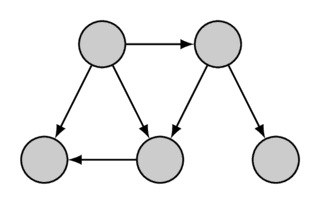
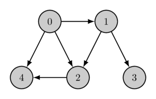

# Topologik saralash

Sizga $n$ ta tugun va $m$ ta qirrali yo‘naltirilgan graf berilgan.
Har bir qirra kichikroq indeksli tugundan kattaroq indeksli tugunga yo‘naladigan qilib tugunlarning **tartibini** topishingiz kerak.

Boshqacha aytganda, grafning barcha qirralari belgilaydigan tartibga mos tugunlar permutatsiyasini (**topologik tartib**ni) topmoqchisiz.

Quyida bir graf va uning topologik tartibi ko‘rsatilgan:
<div style="text-align: center;">
  
  
</div>
Topologik tartib **yagona bo‘lmasligi** mumkin (masalan, $a$, $b$, $c$ tugunlar uchun $a$ dan $b$ ga va $a$ dan $c$ ga yo‘llar mavjud, ammo $b$ dan $c$ ga ham, $c$ dan $b$ ga ham yo‘l mavjud bo‘lmasa).
Misoldagi graf ham bir nechta topologik tartibga ega; ikkinchi topologik tartib quyidagicha:
<div style="text-align: center;">
  
</div>
Topologik tartib umuman **mavjud bo‘lmasligi** ham mumkin.
U faqat yo‘naltirilgan grafda sikl bo‘lmasa mavjud.
Aks holda qarama-qarshilik yuzaga keladi: agar $a$ va $b$ tugunlarni o‘z ichiga olgan sikl mavjud bo‘lsa, $a$ ning indeksi $b$ nikidan kichik bo‘lishi kerak ($a$ dan $b$ ga yetish mumkin), ayni paytda katta ham bo‘lishi kerak ($b$ dan $a$ ga yetish mumkin).
Ushbu maqolada tasvirlangan algoritm har bir yo‘naltirilgan asiklik grafda kamida bitta topologik tartib mavjudligini konstruktiv ravishda ham ko‘rsatadi.
Topologik saralash uchraydigan odatiy masalalardan biri quyidagicha. Qiymatlari noma’lum $n$ ta o‘zgaruvchi bor. Ayrim o‘zgaruvchilar uchun ulardan biri boshqasidan kichikligini bilamiz. Bu cheklovlar qarama-qarshi emasligini tekshirish va agar qarama-qarshi bo‘lmasa, o‘zgaruvchilarni o‘sish tartibida chiqarish kerak (bir nechta javob bo‘lsa, istalganini chiqaring). Bu aynan $n$ tugunli grafning topologik tartibini topish masalasi ekanini payqash oson.

## Algoritm

Bu masalani yechish uchun [chuqurlik bo‘yicha qidiruv](depth-first-search.md)dan foydalanamiz.

Graf asiklik deb faraz qilamiz. Chuqurlik bo‘yicha qidiruv nima qiladi?

Biror $v$ tugundan boshlaganda DFS $v$ dan chiquvchi barcha qirralar bo‘ylab yurishga urinadi.
Oxiri avval tashrif buyurilgan qirralarda to‘xtaydi, qolgan qirralar bo‘ylab o‘tib, ularning oxirida rekursiv davom etadi.
Shunday qilib, $\text{dfs}(v)$ funksiya chaqiruvi tugagan paytga kelib, $v$ dan erishish mumkin bo‘lgan barcha tugunlarga qidiruv bevosita (bitta qirra orqali) yoki bilvosita tashrif buyurgan bo‘ladi.
$\text{dfs}(v)$ ni tugatganimizda $v$ tugunni ro‘yxatga qo‘shamiz. Barcha erishiladigan tugunlarga allaqachon tashrif buyurilgani sababli, $v$ ni qo‘shayotganimizda ular ro‘yxatda oldinroq joylashgan bo‘ladi.
Buni grafdagi har bir tugun uchun bitta yoki bir nechta chuqurlik bo‘yicha qidiruv orqali bajaramiz.
Grafdagi har bir $v \rightarrow u$ yo‘naltirilgan qirra uchun $u$ ro‘yxatda $v$ dan oldin keladi, chunki $u$ ga $v$ dan erishish mumkin.
Demak, ro‘yxatdagi tugunlarga shunchaki $n-1, n-2, \dots, 1, 0$ yorliqlarini bersak, grafning topologik tartibini topgan bo‘lamiz.
Boshqacha aytganda, ro‘yxat teskari topologik tartibni ifodalaydi.
Bu tushuntirishlarni DFS algoritmining chiqish vaqtlari orqali ham ifodalash mumkin.
$v$ tugunning chiqish vaqti — $\text{dfs}(v)$ chaqiruvi tugagan vaqt (vaqtlarni $0$ dan $n-1$ gacha raqamlash mumkin).
Istalgan $v$ tugunning chiqish vaqti undan erishish mumkin bo‘lgan istalgan tugunning chiqish vaqtidan doim katta ekanini tushunish oson (chunki ularga $\text{dfs}(v)$ chaqirilishidan oldin yoki uning davomida tashrif buyurilgan). Demak, kerakli topologik tartib tugunlarni chiqish vaqtlari kamayish tartibida joylashtirish orqali olinadi.

## Implementatsiya

Quyidagi implementatsiya graf asiklik, ya’ni kerakli topologik tartib mavjud deb faraz qiladi. Zarur bo‘lsa, [chuqurlik bo‘yicha qidiruv](depth-first-search.md) maqolasida tasvirlanganidek, graf asiklik ekanini oson tekshirish mumkin.

```cpp
int n; // number of vertices
vector<vector<int>> adj; // adjacency list of graph
vector<bool> visited;
vector<int> ans;
void dfs(int v) {
    visited[v] = true;
    for (int u : adj[v]) {
        if (!visited[u]) {
            dfs(u);
        }
    }
    ans.push_back(v);
}

void topological_sort() {
    visited.assign(n, false);
    ans.clear();
    for (int i = 0; i < n; ++i) {
        if (!visited[i]) {
            dfs(i);
        }
    }
    reverse(ans.begin(), ans.end());
}
```

Yechimning asosiy funksiyasi `topological_sort` bo‘lib, u DFS o‘zgaruvchilarini boshlang‘ich holatga keltiradi, DFS ni ishga tushiradi va javobni `ans` vektorida oladi. Graf asiklik bo‘lmaganida ham `topological_sort` natijasi ma’lum ma’noda foydali bo‘lishini qayd etish kerak: agar $u$ tugunga $v$ dan erishish mumkin bo‘lsa-yu, aksincha erishish mumkin bo‘lmasa, natijaviy massivda $v$ doim oldin keladi.
Berilgan implementatsiyaning bu xossasi siklli yo‘naltirilgan grafda kuchli bog‘langan komponentlar va ularning topologik tartibini ajratish uchun [Kosaraju algoritmi](./strongly-connected-components.md)da ishlatiladi.

## Mashq masalalari

- [SPOJ TOPOSORT - Topological Sorting [difficulty: easy]](http://www.spoj.com/problems/TOPOSORT/)

