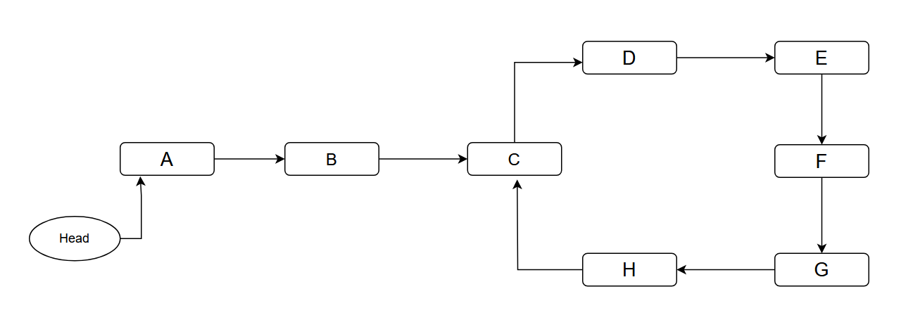
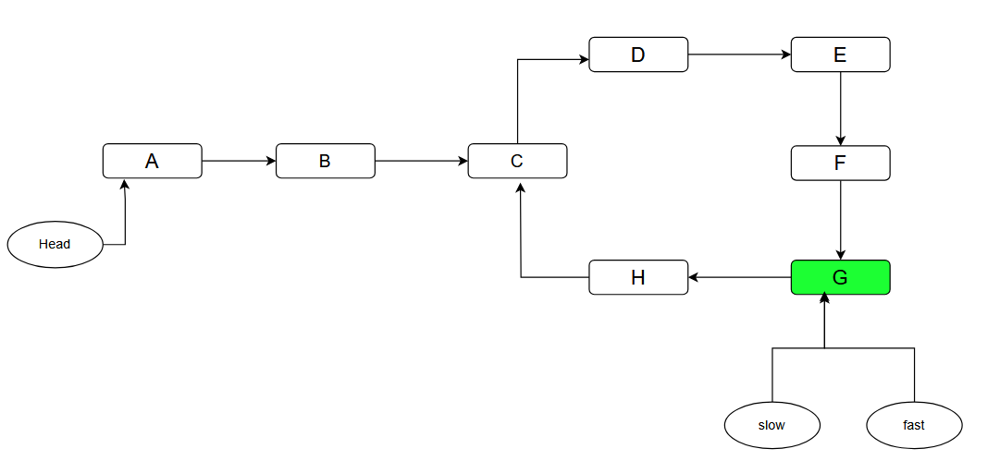
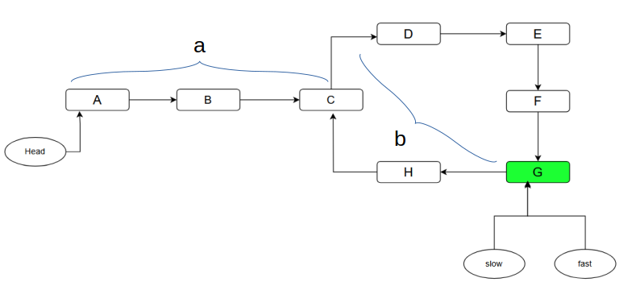

# Bog‘langan ro‘yxatda siklni topish uchun Floyd algoritmi

Boshlanish tuguni **head** bilan belgilangan bog‘langan ro‘yxat berilgan bo‘lsin. Ro‘yxatda sikl bo‘lishi ham, bo‘lmasligi ham mumkin. Masalan:

<div style="text-align: center;">
  
</div>

Biz sikl boshlanadigan **C** nuqtani topishimiz kerak.

## Taklif etilgan algoritm

Algoritm **Floydning sikl topish algoritmi** yoki **Toshbaqa va quyon algoritmi** deb ataladi. Siklning boshlanish nuqtasini topishdan oldin sikl umuman mavjudligini aniqlash kerak. Jarayon ikki bosqichdan iborat:

1. Sikl mavjudligini aniqlash.
2. Siklning boshlanish nuqtasini topish.

### 1-bosqich: sikl mavjudligi

1. $slow$ va $fast$ nomli ikkita ko‘rsatkich olamiz.
2. Dastlab ikkalasi ham bog‘langan ro‘yxatning `head` tugunini ko‘rsatadi.
3. $slow$ har safar bir qadam yuradi.
4. $fast$ har safar ikki qadam, ya’ni $slow$ dan ikki baravar tez yuradi.
5. Ulardan biri yoki ikkalasi `null` ga yetmasidan oldin bir tugunni ko‘rsatib qolishini tekshiramiz.
6. Ko‘rsatkichlar yo‘lning biror joyida uchrashsa, ro‘yxatda sikl mavjud.
7. `null` ga yetib borilsa, bog‘langan ro‘yxatda sikl yo‘q.

<div style="text-align: center;">
  
</div>

Sikl borligi aniqlangach, keyingi bosqichda uning boshlanish nuqtasi **C** topiladi.

### 2-bosqich: siklning boshlanish nuqtasi

1. $slow$ ko‘rsatkichini bog‘langan ro‘yxatning `head` tuguniga qaytaramiz.
2. Endi ikkala ko‘rsatkichni ham bir qadamdan yurgizamiz.
3. Ular uchrashgan nuqta siklning boshlanishi bo‘ladi.

```java
// Sikl mavjudligini tekshirish
public boolean hasCycle(ListNode head) {
    ListNode slow = head;
    ListNode fast = head;

    while(fast != null && fast.next != null){
        slow = slow.next;
        fast = fast.next.next;
        if(slow==fast){
            return true;
        }
    }

    return false;
}
```

```java
// Sikl bor, slow va fast esa uchrashgan nuqtani ko‘rsatmoqda deb olamiz
slow = head;
while(slow!=fast){
    slow = slow.next;
    fast = fast.next;
}

return slow; // siklning boshlanish nuqtasi
```

## Algoritm nega ishlaydi?

### 1-bosqich: sikl mavjudligi

$fast$ ko‘rsatkich $slow$ dan ikki baravar tez yurgani uchun istalgan paytda u bosib o‘tgan masofa $slow$ bosib o‘tgan masofadan ikki baravar katta bo‘ladi. Bundan ikki ko‘rsatkich bosib o‘tgan masofalar farqi har qadamda $1$ ga ortishini ham ko‘rish mumkin:

```
slow: 0 --> 1 --> 2 --> 3 --> 4 (bosib o‘tilgan masofa)
fast: 0 --> 2 --> 4 --> 6 --> 8 (bosib o‘tilgan masofa)
farq: 0 --> 1 --> 2 --> 3 --> 4 (masofalar farqi)
```

Sikl uzunligini $L$, `slow` ko‘rsatkichning sikl kirishiga yetishi uchun kerak bo‘lgan qadamlar sonini $a$ deb belgilaymiz. Shunday musbat $k$ butun son mavjudki, $k \cdot L \geq a$ bo‘ladi. `slow` $k \cdot L$ qadam, `fast` esa $2 \cdot k \cdot L$ qadam yurgan paytda ikkala ko‘rsatkich ham sikl ichida bo‘ladi. Ular orasidagi masofa $k \cdot L$ ga teng, sikl uzunligi esa $L$ bo‘lgani uchun ular sikldagi ayni bir nuqtaga tushib, uchrashadi.

### 2-bosqich: siklning boshlanish nuqtasi

Ko‘rsatkichlar sikl ichida uchrashguncha bosib o‘tgan masofalarni hisoblaymiz.

<div style="text-align: center;">
  
</div>

$slowDist = a + xL + b$, bu yerda $x \ge 0$.

$fastDist = a + yL + b$, bu yerda $y \ge 0$.

- $slowDist$ — `slow` ko‘rsatkich bosib o‘tgan jami masofa;
- $fastDist$ — `fast` ko‘rsatkich bosib o‘tgan jami masofa;
- $a$ — ikkala ko‘rsatkich siklga kirishigacha zarur qadamlar soni;
- $b$ — **C** va **G**, ya’ni sikl boshlanishi bilan uchrashuv nuqtasi orasidagi masofa;
- $x$ — `slow` ko‘rsatkichning **C** dan boshlab yana **C** ga qaytguncha siklni to‘liq aylanishlari soni;
- $y$ — `fast` ko‘rsatkichning shunday to‘liq aylanishlari soni.

$fastDist = 2 \cdot slowDist$ bo‘lgani uchun:

$$a + yL + b = 2(a + xL + b)$$

Ifodani yechsak:

$$a = (y - 2x)L - b$$

bu yerda $y - 2x$ — butun son.

Demak, $a$ qadam siklni bir necha marta to‘liq aylanib, so‘ng $b$ qadam orqaga yurishga teng. `fast` ko‘rsatkich sikl kirishidan allaqachon $b$ qadam oldinda turgani uchun yana $a$ qadam yursa, sikl kirishiga keladi. `slow` ni bog‘langan ro‘yxat boshidan boshlatsak, u ham $a$ qadamdan keyin sikl kirishiga yetadi. Shunday qilib, ikkalasi bir qadamdan yurganda aynan sikl boshida uchrashadi.

## Mashq masalalari

- [Linked List Cycle (oson)](https://leetcode.com/problems/linked-list-cycle/)
- [Happy Number (oson)](https://leetcode.com/problems/happy-number/)
- [Find the Duplicate Number (o‘rta)](https://leetcode.com/problems/find-the-duplicate-number/)
- [Linked List Cycle II](https://leetcode.com/problems/linked-list-cycle-ii/)
