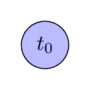
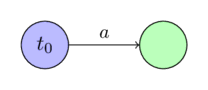
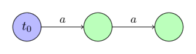
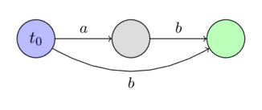
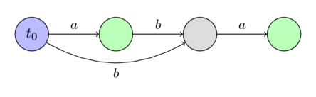
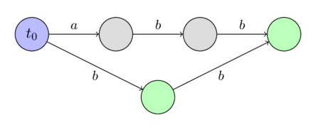
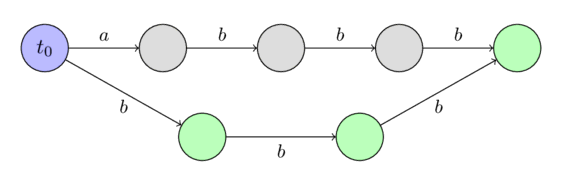
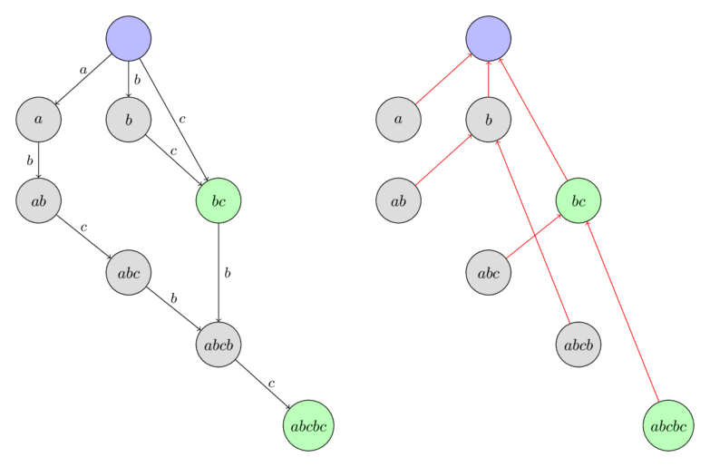

# Suffiks avtomati

**Suffiks avtomati** satrlarga oid ko‘plab masalalarni yechish imkonini beradigan kuchli ma’lumotlar tuzilmasidir.

Masalan, bir satrning ikkinchi satrdagi barcha uchrashuvlarini topish yoki berilgan satrning turli ostsatrlari sonini hisoblash mumkin.
Har ikkala masala ham suffiks avtomati yordamida chiziqli vaqtda yechiladi.

Intuitiv ravishda suffiks avtomatini berilgan satrning **barcha ostsatrlari**ning siqilgan ko‘rinishi deb tushunish mumkin.
Ajablanarlisi shundaki, suffiks avtomati bu ma’lumotlarning barchasini nihoyatda ixcham shaklda saqlaydi.
Uzunligi $n$ bo‘lgan satr uchun faqat $O(n)$ xotira kerak bo‘ladi.
Bundan tashqari, uni $O(n)$ vaqtda ham qurish mumkin (alifbo o‘lchami $k$ ni o‘zgarmas deb olsak); aks holda xotira va vaqt murakkabligi $O(n \log k)$ bo‘ladi.

Suffiks avtomati o‘lchamining chiziqliligi birinchi marta 1983-yilda Blumer va boshqalar tomonidan aniqlangan, 1985-yilda esa Crochemore hamda Blumer uni qurishning birinchi chiziqli algoritmlarini taqdim etgan.

## Suffiks avtomatining ta’rifi

Berilgan $s$ satri uchun suffiks avtomati — $s$ satrining barcha suffikslarini qabul qiladigan minimal **DFA** (deterministik chekli avtomat / deterministik chekli holatlar mashinasi).

Boshqacha aytganda:

 - Suffiks avtomati yo‘naltirilgan asiklik grafdir.
   Uning uchlari **holatlar**, qirralari esa holatlar orasidagi **o‘tishlar** deb ataladi.
 - Holatlardan biri $t_0$ — **boshlang‘ich holat** bo‘ladi va u grafning manbasi bo‘lishi kerak (barcha boshqa holatlarga $t_0$ dan yetib borish mumkin).
 - Har bir **o‘tish** biror belgi bilan belgilangan.
   Bitta holatdan chiquvchi barcha o‘tishlarning belgilari **turlicha** bo‘lishi shart.
 - Bitta yoki bir nechta holat **terminal holatlar** sifatida belgilanadi.
   Boshlang‘ich $t_0$ holatdan boshlab o‘tishlar bo‘ylab terminal holatga borsak, bosib o‘tilgan o‘tishlar belgilari $s$ satrining biror suffiksini hosil qilishi kerak.
   $s$ ning har bir suffiksi $t_0$ dan terminal holatga olib boruvchi biror yo‘l orqali yozilishi kerak.
 - Yuqoridagi shartlarni qanoatlantiradigan barcha avtomatlar orasida suffiks avtomati eng kam sonli uchga ega.

### Ostsatr xossasi

Suffiks avtomatining eng sodda va eng muhim xossasi shundaki, u $s$ satrining barcha ostsatrlari haqidagi ma’lumotni saqlaydi.
Boshlang‘ich $t_0$ holatdan boshlanadigan istalgan yo‘ldagi o‘tishlar belgilarini yozsak, $s$ ning biror **ostsatri** hosil bo‘ladi.
Aksincha, $s$ ning har bir ostsatriga $t_0$ dan boshlanadigan muayyan yo‘l mos keladi.

Izohlarni soddalashtirish uchun ostsatr shu yo‘lga **mos keladi** deymiz (yo‘l $t_0$ dan boshlanadi va uning belgilari ostsatrni yozadi).
Aksincha, istalgan yo‘l uning o‘tishlari belgilari yozadigan satrga **mos keladi** deymiz.

Bir holatga bitta yoki bir nechta yo‘l olib kelishi mumkin.
Shuning uchun holat shu yo‘llarga mos satrlar to‘plamiga **mos keladi** deymiz.

### Qurilgan suffiks avtomatlariga misollar

Quyida bir nechta sodda satr uchun suffiks avtomatlariga misollar keltiriladi.

Boshlang‘ich holat ko‘k, terminal holatlar yashil rang bilan ko‘rsatiladi.

$s =~ \text{""}$ satri uchun:



$s =~ \text{"a"}$ satri uchun:



$s =~ \text{"aa"}$ satri uchun:



$s =~ \text{"ab"}$ satri uchun:



$s =~ \text{"aba"}$ satri uchun:



$s =~ \text{"abb"}$ satri uchun:



$s =~ \text{"abbb"}$ satri uchun:



## Chiziqli vaqtda qurish

Suffiks avtomatini chiziqli vaqtda qurish algoritmini tasvirlashdan oldin bir nechta yangi tushuncha va sodda isbotlarni kiritishimiz kerak. Ular qurilish algoritmini tushunishda juda muhim bo‘ladi.

### Tugash pozitsiyalari $endpos$ {data-toc-label="End positions"}

$s$ satrining istalgan bo‘sh bo‘lmagan $t$ ostsatrini ko‘rib chiqamiz.
$t$ uchrashuvlari tugaydigan $s$ satridagi barcha pozitsiyalar to‘plamini $endpos(t)$ bilan belgilaymiz. Masalan, $\text{"abcbc"}$ satri uchun $endpos(\text{"bc"}) = \{2, 4\}$.

Ikki $t_1$ va $t_2$ ostsatrning tugash to‘plamlari teng, ya’ni $endpos(t_1) = endpos(t_2)$ bo‘lsa, ular $endpos$ bo‘yicha ekvivalent deyiladi.
Demak, $s$ satrining barcha bo‘sh bo‘lmagan ostsatrlarini ularning $endpos$ to‘plamlariga qarab bir nechta **ekvivalentlik sinflari**ga ajratish mumkin.

Ma’lum bo‘lishicha, suffiks avtomatida $endpos$ bo‘yicha ekvivalent ostsatrlar **bir xil holatga mos keladi**.
Boshqacha aytganda, suffiks avtomatidagi holatlar soni barcha ostsatrlar orasidagi ekvivalentlik sinflari soniga boshlang‘ich holatni qo‘shganimizga teng.
Suffiks avtomatining har bir holati $endpos$ qiymati bir xil bo‘lgan bitta yoki bir nechta ostsatrga mos keladi.

Keyinroq qurish algoritmini aynan shu tasdiqdan foydalanib tavsiflaymiz.
Shunda minimallikdan tashqari suffiks avtomatiga qo‘yilgan barcha talablar bajarilishini ko‘ramiz.
Minimallik esa Nerode teoremasidan kelib chiqadi (bu maqolada uning isboti keltirilmaydi).

$endpos$ qiymatlari haqida bir nechta muhim kuzatuv qilish mumkin.

**1-lemma**:
Bo‘sh bo‘lmagan $u$ va $w$ ostsatrlar ($length(u) \le length(w)$) $endpos$ bo‘yicha ekvivalent bo‘lishi uchun va faqat shundagina $u$ satri $s$ ichida faqat $w$ ning suffiksi ko‘rinishida uchraydi.

Isbot ravshan.
Agar $u$ va $w$ ning $endpos$ qiymatlari bir xil bo‘lsa, $u$ — $w$ ning suffiksi va $s$ da faqat $w$ ning suffiksi ko‘rinishida paydo bo‘ladi.
Agar $u$ — $w$ ning suffiksi bo‘lib, $s$ da faqat shu ko‘rinishda paydo bo‘lsa, ta’rifga ko‘ra ularning $endpos$ qiymatlari teng.

**2-lemma**:
Bo‘sh bo‘lmagan $u$ va $w$ ostsatrlarni ($length(u) \le length(w)$) ko‘rib chiqamiz.
Ularning $endpos$ to‘plamlari yo umuman kesishmaydi, yoki $endpos(w)$ to‘plami $endpos(u)$ ning qism to‘plami bo‘ladi.
Qaysi holat yuz berishi $u$ satri $w$ ning suffiksi ekaniga bog‘liq:

$$\begin{cases}
endpos(w) \subseteq endpos(u) & \text{if } u \text{ is a suffix of } w \\\\
endpos(w) \cap endpos(u) = \emptyset & \text{otherwise}
\end{cases}$$

Isbot:
Agar $endpos(u)$ va $endpos(w)$ to‘plamlari kamida bitta umumiy elementga ega bo‘lsa, $u$ va $w$ satrlarining ikkalasi ham shu pozitsiyada tugaydi, ya’ni $u$ — $w$ ning suffiksi.
Ammo $w$ ning har bir uchrashuvida $u$ ostsatri ham uchraydi, demak $endpos(w)$ — $endpos(u)$ ning qism to‘plami.

**3-lemma**:
Biror $endpos$ ekvivalentlik sinfini ko‘rib chiqamiz.
Bu sinfdagi barcha ostsatrlarni uzunligi kamayish tartibida saralaymiz.
Hosil bo‘lgan ketma-ketlikda har bir ostsatr oldingisidan bir belgi qisqa bo‘ladi va bir vaqtning o‘zida oldingisining suffiksi bo‘ladi.
Boshqacha aytganda, bitta ekvivalentlik sinfidagi qisqaroq ostsatrlar uzunroqlarining suffiksi bo‘lib, ular ma’lum $[x; y]$ oraliqdagi barcha uzunliklarni egallaydi.

Isbot:
Biror $endpos$ ekvivalentlik sinfini belgilab olamiz.
Agar u faqat bitta satrdan iborat bo‘lsa, lemma ravshan.
Endi sinfdagi satrlar soni bittadan ko‘p bo‘lsin.

1-lemmaga ko‘ra, $endpos$ bo‘yicha ekvivalent ikki turli satr orasida qisqaroq satr doimo uzunroq satrning proper suffiksi bo‘ladi.
Shuning uchun ekvivalentlik sinfida bir xil uzunlikdagi ikkita satr bo‘lishi mumkin emas.

Sinfdagi eng uzun satrni $w$, eng qisqasini $u$ bilan belgilaymiz.
1-lemmaga ko‘ra, $u$ — $w$ ning proper suffiksi.
Endi $w$ ning uzunligi $[length(u); length(w)]$ oraliqda bo‘lgan istalgan suffiksini ko‘rib chiqamiz.
Bu suffiks ham ayni ekvivalentlik sinfiga kirishini ko‘rish oson.
Chunki bu suffiks $s$ satrida faqat $w$ ning suffiksi ko‘rinishida uchrashi mumkin (sababi undan ham qisqa $u$ suffiksi $s$ da faqat $w$ ning suffiksi ko‘rinishida uchraydi).
Demak, 1-lemmaga ko‘ra, bu suffiks $w$ bilan $endpos$ bo‘yicha ekvivalent.

### Suffiks havolalari $link$ {data-toc-label="Suffix links"}

Avtomatdagi biror $v \ne t_0$ holatni ko‘rib chiqamiz.
Ma’lumki, $v$ holat $endpos$ qiymatlari teng bo‘lgan satrlar sinfiga mos keladi.
Ularning eng uzunini $w$ bilan belgilasak, boshqa barcha satrlar $w$ ning suffikslaridir.

Yana bilamizki, $w$ satrining dastlabki bir nechta suffiksi (ularni uzunligi kamayish tartibida ko‘rsak) shu ekvivalentlik sinfiga kiradi, qolgan barcha suffikslar esa (ulardan kamida bittasi — bo‘sh suffiks) boshqa sinflarga kiradi.
Shunday suffikslarning eng kattasini $t$ bilan belgilab, unga suffiks havolasi o‘tkazamiz.

Boshqacha aytganda, **suffiks havolasi** $link(v)$ $w$ ning boshqa $endpos$ ekvivalentlik sinfiga kiradigan **eng uzun suffiksi**ga mos holatga olib boradi.

Bu yerda boshlang‘ich $t_0$ holat faqat bo‘sh satrni saqlovchi alohida ekvivalentlik sinfiga mos deb olamiz va qulaylik uchun $endpos(t_0) = \{-1, 0, \dots, length(s)-1\}$ deb belgilaymiz.

**4-lemma**:
Suffiks havolalari ildizi $t_0$ bo‘lgan **daraxt** hosil qiladi.

Isbot:
Istalgan $v \ne t_0$ holatni olaylik.
$link(v)$ suffiks havolasi uzunligi qat’iy kichik satrlarga mos holatga olib boradi (bu suffiks havolalari ta’rifi va 3-lemmadan kelib chiqadi).
Shuning uchun suffiks havolalari bo‘ylab yurib, ertami-kechmi bo‘sh satrga mos boshlang‘ich $t_0$ holatga yetamiz.

**5-lemma**:
$endpos$ to‘plamlaridan foydalanib (ota tugun to‘plami barcha farzand to‘plamlarini qism to‘plam sifatida saqlaydi degan qoida bilan) daraxt qursak, uning tuzilishi suffiks havolalari daraxti bilan bir xil bo‘ladi.

Isbot:
$endpos$ to‘plamlari yordamida daraxt qurish mumkinligi 2-lemmadan bevosita kelib chiqadi (har qanday ikki to‘plam yo kesishmaydi, yo ulardan biri ikkinchisining ichida yotadi).

Endi istalgan $v \ne t_0$ holat va uning $link(v)$ suffiks havolasini ko‘rib chiqamiz.
Suffiks havolasi ta’rifi va 2-lemmadan

$$endpos(v) \subseteq endpos(link(v)),$$

kelib chiqadi; bu esa oldingi lemma bilan birga tasdiqni isbotlaydi:
suffiks havolalari daraxti mohiyatan $endpos$ to‘plamlar daraxtidir.

Quyida $\text{"abcbc"}$ satri uchun qurilgan suffiks avtomatining suffiks havolalari daraxtiga **misol** keltirilgan.
Tugunlar tegishli ekvivalentlik sinfidagi eng uzun ostsatr bilan belgilangan.



### Xulosa

Algoritmning o‘ziga o‘tishdan oldin to‘plangan bilimlarni jamlaymiz va bir nechta yordamchi belgilash kiritamiz.

- $s$ satrining ostsatrlari tugash pozitsiyalari $endpos$ ga ko‘ra ekvivalentlik sinflariga ajratilishi mumkin.
- Suffiks avtomati boshlang‘ich $t_0$ holatdan va har bir $endpos$ ekvivalentlik sinfi uchun bittadan holatdan iborat.
- Har bir $v$ holatga bitta yoki bir nechta ostsatr mos keladi.
  Ularning eng uzunini $longest(v)$, uning uzunligini $len(v)$ bilan belgilaymiz.
  Eng qisqa ostsatrni $shortest(v)$, uning uzunligini $minlen(v)$ bilan belgilaymiz.
  Bu holatga mos barcha satrlar $longest(v)$ satrining turli suffikslari bo‘lib, $[minlen(v); len(v)]$ oraliqdagi barcha mumkin bo‘lgan uzunliklarga ega.
- Har bir $v \ne t_0$ holat uchun $longest(v)$ satrining uzunligi $minlen(v) - 1$ bo‘lgan suffiksiga mos holatga olib boruvchi suffiks havolasi aniqlangan.
  Suffiks havolalari ildizi $t_0$ da bo‘lgan daraxt hosil qiladi; shu bilan birga bu daraxt $endpos$ to‘plamlarining ichma-ichlik munosabatini ifodalaydi.
- $v \ne t_0$ uchun $minlen(v)$ ni $link(v)$ suffiks havolasi orqali quyidagicha ifodalash mumkin:

$$minlen(v) = len(link(v)) + 1$$

- Istalgan $v_0$ holatdan boshlab suffiks havolalari bo‘ylab yursak, ertami-kechmi boshlang‘ich $t_0$ holatga yetamiz.
  Bunda o‘zaro kesishmaydigan $[minlen(v_i); len(v_i)]$ oraliqlar ketma-ketligi hosil bo‘ladi va ularning birlashmasi uzluksiz $[0; len(v_0)]$ oraliqni beradi.

### Algoritm

Endi algoritmning o‘ziga o‘tishimiz mumkin.
Algoritm **online** ishlaydi: satr belgilarini bittadan qo‘shamiz va har bir qadamda avtomatni mos ravishda o‘zgartiramiz.

Xotira sarfini chiziqli saqlash uchun har bir holatda faqat $len$, $link$ qiymatlari va o‘tishlar ro‘yxatini saqlaymiz.
Terminal holatlarni hozircha belgilamaymiz (ammo suffiks avtomati qurilgach, ularni qanday belgilashni keyin ko‘rsatamiz).

Dastlab avtomat faqat bitta $t_0$ holatdan iborat bo‘lib, uning indeksi $0$ bo‘ladi (qolgan holatlar $1, 2, \dots$ indekslarini oladi).
Qulaylik uchun unga $len = 0$ va $link = -1$ qiymatlarini beramiz ($-1$ — mavjud bo‘lmagan soxta holat).

Endi butun masala joriy satr oxiriga bitta $c$ belgisini **qo‘shish** jarayonini amalga oshirishga keltiriladi.
Bu jarayonni tasvirlaymiz:

  - $last$ — $c$ belgisi qo‘shilishidan oldingi butun satrga mos holat bo‘lsin.
    (Dastlab $last = 0$ deb olamiz va algoritmning oxirgi qadamida $last$ ni mos ravishda o‘zgartiramiz.)
  - Yangi $cur$ holat yaratib, $len(cur) = len(last) + 1$ deb belgilaymiz.
    Hozircha $link(cur)$ qiymati noma’lum.
  - Endi quyidagi jarayonni bajaramiz:
    $last$ holatdan boshlaymiz.
    $c$ belgisi bo‘yicha o‘tish mavjud bo‘lmagan paytda $cur$ holatga o‘tish qo‘shib, suffiks havolasi bo‘ylab yuramiz.
    Biror paytda $c$ belgisi bo‘yicha o‘tish allaqachon mavjud bo‘lsa, to‘xtaymiz va shu holatni $p$ bilan belgilaymiz.
  - Agar bunday $p$ holat topilmasa, demak soxta $-1$ holatga yetganmiz; bu holda shunchaki $link(cur) = 0$ deb belgilab, jarayonni tugatamiz.
  - Endi $c$ belgisi bo‘yicha o‘tish mavjud bo‘lgan $p$ holat topilgan deb faraz qilamiz.
    O‘tish olib boradigan holatni $q$ bilan belgilaymiz.
  - Endi ikki holatdan biri yuz beradi: $len(p) + 1 = len(q)$ yoki aksincha.
  - Agar $len(p) + 1 = len(q)$ bo‘lsa, shunchaki $link(cur) = q$ deb belgilab, tugatamiz.
  - Aks holda vaziyat biroz murakkabroq.
    $q$ holatni **klonlash** kerak:
    yangi $clone$ holat yaratamiz va $len$ qiymatidan tashqari $q$ dagi barcha ma’lumotni (suffiks havolasi va o‘tishlar) unga ko‘chiramiz.
    $len(clone) = len(p) + 1$ deb belgilaymiz.

    Klonlashdan so‘ng $cur$ dan ham, $q$ dan ham suffiks havolasini $clone$ ga yo‘naltiramiz.

    Oxirida $p$ holatdan boshlab suffiks havolalari orqali orqaga yuramiz; $c$ orqali o‘tish $q$ holatga olib borib turgan ekan, ularning barchasini $clone$ holatga qayta yo‘naltiramiz.

  - Uchala holatning istalganida jarayon tugagach, $last$ qiymatini $cur$ holat bilan yangilaymiz.

Qaysi holatlar **terminal**, qaysilari terminal emasligini bilmoqchi bo‘lsak, butun $s$ satri uchun suffiks avtomati qurilgach, barcha terminal holatlarni topishimiz mumkin.
Buning uchun butun satrga mos holatni (`last` o‘zgaruvchisida saqlanadi) olamiz va boshlang‘ich holatga yetguncha uning suffiks havolalari bo‘ylab yuramiz.
Tashrif buyurilgan barcha holatlarni terminal deb belgilaymiz.
Shu tariqa aynan $s$ ning barcha suffikslariga mos holatlar, ya’ni terminal holatlar belgilanishini tushunish oson.

Keyingi bo‘limda har bir qadamni batafsil ko‘rib, uning **to‘g‘riligini** ko‘rsatamiz.

Hozircha faqat shuni qayd etamizki, $s$ ning har bir belgisi uchun faqat bitta yoki ikkita yangi holat yaratganimiz sababli suffiks avtomati **chiziqli sondagi holat**ga ega.

O‘tishlar sonining chiziqliligi va umuman algoritm ishlash vaqtining chiziqliligi unchalik ravshan emas; ular to‘g‘rilik isbotidan keyin isbotlanadi.

### To‘g‘rilik

  - Agar $len(p) + 1 = len(q)$ bo‘lsa, $(p, q)$ o‘tishni **uzluksiz** deb ataymiz.
    Aks holda, ya’ni $len(p) + 1 < len(q)$ bo‘lsa, o‘tish **uzluksiz bo‘lmagan** deb ataladi.

    Algoritm tavsifidan ko‘rinadiki, uzluksiz va uzluksiz bo‘lmagan o‘tishlar algoritmning turli holatlariga olib keladi.
    Uzluksiz o‘tishlar qat’iy belgilangan bo‘lib, keyinchalik hech qachon o‘zgarmaydi.
    Uzluksiz bo‘lmagan o‘tish esa satrga yangi belgilar qo‘shilganda o‘zgarishi mumkin (o‘tish qirrasining oxirgi holati o‘zgaradi).

  - Noaniqlik bo‘lmasligi uchun joriy $c$ belgisi qo‘shilishidan oldin suffiks avtomati qurilgan satrni $s$ bilan belgilaymiz.

  - Algoritm $s + c$ butun satriga mos keladigan yangi $cur$ holatni yaratishdan boshlanadi.
    Nega yangi holat kerakligi ravshan.
    Yangi belgi bilan birga yangi ekvivalentlik sinfi paydo bo‘ladi.

  - Yangi holat yaratilgach, butun $s$ satriga mos holatdan boshlab suffiks havolalari bo‘ylab yuramiz.
    Har bir holat uchun $c$ belgisi bilan $cur$ yangi holatga o‘tish qo‘shishga harakat qilamiz.
    Shu tariqa $s$ ning har bir suffiksiga $c$ belgisini qo‘shamiz.
    Ammo yangi o‘tishlarni faqat ular avvaldan mavjud o‘tish bilan ziddiyatga kirmasa qo‘shishimiz mumkin.
    Shuning uchun $c$ bo‘yicha mavjud o‘tishni topishimiz bilan to‘xtashimiz kerak.

  - Eng sodda holatda soxta $-1$ holatga yetamiz.
    Bu $s$ ning barcha suffikslariga $c$ bo‘yicha o‘tish qo‘shganimizni anglatadi.
    Bundan tashqari, $c$ belgisi $s$ satrida avval uchramaganini ham anglatadi.
    Shuning uchun $cur$ ning suffiks havolasi $0$ holatga olib borishi kerak.

  - Ikkinchi holatda mavjud $(p, q)$ o‘tishga duch kelamiz.
    Bu mashinaga $x + c$ satrini ($x$ — $s$ ning suffiksi) qo‘shishga uringanimizda u mashinada **allaqachon mavjud** ekanini anglatadi ($x + c$ satri $s$ ning ostsatri sifatida avval uchragan).
    $s$ uchun avtomat to‘g‘ri qurilgan deb faraz qilganimiz sababli bu yerda yangi o‘tish qo‘shmasligimiz kerak.

    Ammo bir qiyinchilik bor.
    $cur$ holatning suffiks havolasi qaysi holatga olib borishi kerak?
    Eng uzun satri aynan $x + c$ bo‘lgan holatga, ya’ni $len$ qiymati $len(p) + 1$ ga teng holatga suffiks havolasi o‘tkazishimiz kerak.
    Biroq bunday holat hali mavjud bo‘lmasligi, ya’ni $len(q) > len(p) + 1$ bo‘lishi mumkin.
    Bu holda $q$ holatni **bo‘lish** orqali kerakli holatni yaratishimiz kerak.

  - Agar $(p, q)$ o‘tish uzluksiz bo‘lsa, $len(q) = len(p) + 1$.
    Bu holda hammasi sodda.
    $cur$ dan suffiks havolasini $q$ holatga yo‘naltiramiz.

  - Aks holda o‘tish uzluksiz emas, ya’ni $len(q) > len(p) + 1$.
    Bu $q$ holat uzunligi $len(p) + 1$ bo‘lgan $s + c$ suffiksigagina emas, $s$ ning uzunroq ostsatrlariga ham mos kelishini anglatadi.
    $q$ holatni ikkita ostholatga **bo‘lish**dan boshqa yo‘l yo‘q; birinchi holatning uzunligi $len(p) + 1$ bo‘lishi kerak.

    Holatni qanday bo‘lamiz?
    $q$ holatni **klonlab**, $clone$ holatni hosil qilamiz va $len(clone) = len(p) + 1$ deb belgilaymiz.
    $q$ orqali o‘tadigan yo‘llarni o‘zgartirmaslik uchun $q$ ning barcha o‘tishlarini $clone$ ga ko‘chiramiz.
    Bundan tashqari, $clone$ ning suffiks havolasini $q$ ning oldingi suffiks havolasi olib borgan holatga yo‘naltiramiz, $q$ ning suffiks havolasini esa $clone$ ga o‘zgartiramiz.

    Holat bo‘lingach, $cur$ ning suffiks havolasini ham $clone$ ga yo‘naltiramiz.

    So‘nggi qadamda $q$ ga olib boruvchi ayrim o‘tishlarni $clone$ ga qayta yo‘naltiramiz.
    Qaysi o‘tishlarni o‘zgartirish kerak?
    Faqat $w + c$ satrining barcha suffikslariga mos o‘tishlarni ($w$ — $p$ ga mos eng uzun satr) qayta yo‘naltirish yetarli. Ya’ni $p$ uchidan boshlab suffiks havolalari bo‘ylab soxta $-1$ holatga yoki $q$ dan boshqa holatga olib boruvchi o‘tishga yetguncha yurishda davom etamiz.

### Amallar sonining chiziqliligi

Avvalo alifbo o‘lchami **o‘zgarmas** deb faraz qilamiz.
Aks holda chiziqli vaqt murakkabligi haqida gapirib bo‘lmaydi.
Bitta uchdan chiquvchi o‘tishlar ro‘yxati muvozanatlangan daraxtda saqlanadi; bu kalitni qidirish va kalit qo‘shish amallarini tez bajarishga imkon beradi.
Shuning uchun alifbo o‘lchamini $k$ bilan belgilasak, algoritmning asimptotikasi $O(n \log k)$ vaqt va $O(n)$ xotira bo‘ladi.
Biroq alifbo yetarlicha kichik bo‘lsa, muvozanatlangan daraxtlardan voz kechib, har bir uchdagi o‘tishlarni uzunligi $k$ bo‘lgan massivda (kalit bo‘yicha tez qidirish uchun) va dinamik ro‘yxatda (mavjud barcha kalitlar bo‘ylab tez yurish uchun) saqlab, xotira hisobiga vaqtni tejash mumkin.
Shunda algoritm $O(n)$ vaqtda ishlaydi, ammo xotira murakkabligi $O(n k)$ bo‘ladi.

Demak, alifbo o‘lchamini o‘zgarmas deb olamiz: belgi bo‘yicha o‘tishni qidirish, o‘tish qo‘shish va keyingi o‘tishni izlash kabi har bir amal $O(1)$ vaqtda bajariladi.

Algoritmning barcha qismlarini ko‘rsak, chiziqli murakkabligi darhol ravshan bo‘lmagan uchta joy mavjud:

  - Birinchi joy — $last$ holatdan suffiks havolalari bo‘ylab yurib, $c$ belgisi bilan o‘tishlar qo‘shish.
  - Ikkinchi joy — $q$ holat $clone$ holatga klonlanganda o‘tishlarni nusxalash.
  - Uchinchi joy — $q$ ga olib boruvchi o‘tishlarni $clone$ ga qayta yo‘naltirish.

Suffiks avtomatining o‘lchami (holatlar soni ham, o‘tishlar soni ham) **chiziqli** ekanidan foydalanamiz.
(Holatlar sonining chiziqliligi algoritmning o‘zidan kelib chiqadi; o‘tishlar sonining chiziqliligi algoritm implementatsiyasidan keyin isbotlanadi.)

Shunday qilib, **birinchi va ikkinchi joylar**ning umumiy murakkabligi ravshan: har bir amal avtomatga amortizatsiyalangan ma’noda faqat bitta yangi o‘tish qo‘shadi.

$q$ ga yo‘naltirilgan o‘tishlarni $clone$ ga qayta yo‘naltiradigan **uchinchi joy**ning umumiy murakkabligini baholash qoladi.
$v = longest(p)$ deb belgilaymiz.
Bu $s$ satrining suffiksi bo‘lib, har bir iteratsiyada uning uzunligi kamayadi; demak, $v$ ning $s$ suffiksi sifatidagi pozitsiyasi har bir iteratsiyada monoton oshadi.
Agar siklning birinchi iteratsiyasidan oldin tegishli $v$ satr $last$ dan $k$ chuqurlikda ($k \ge 2$, chuqurlik suffiks havolalari soni bilan o‘lchanadi) bo‘lsa, so‘nggi iteratsiyadan keyin $v + c$ satri $cur$ dan boshlanadigan yo‘ldagi ikkinchi suffiks havolasiga mos bo‘ladi ($cur$ yangi $last$ qiymatiga aylanadi).

Demak, ushbu siklning har bir iteratsiyasi joriy satrning suffiksi sifatida $longest(link(link(last)))$ satr pozitsiyasini monoton oshiradi.
Shuning uchun bu sikl $n$ martadan ko‘p bajarilmaydi; isbotlash talab qilingan narsa ham shu edi.

### Implementatsiya

Avval muayyan holat haqidagi barcha ma’lumotlarni ($len$, $link$ va o‘tishlar ro‘yxatini) saqlaydigan ma’lumotlar tuzilmasini tasvirlaymiz.
Zarur bo‘lsa, unga terminal bayroq va boshqa ma’lumotlarni ham qo‘shish mumkin.
O‘tishlar ro‘yxatini `map` ko‘rinishida saqlaymiz; bu butun satrni qayta ishlashda jami $O(n)$ xotira va $O(n \log k)$ vaqtga erishish imkonini beradi.

```{.cpp file=suffix_automaton_struct}
struct state {
    int len, link;
    map<char, int> next;
};
```

Suffiks avtomatining o‘zi shu `state` tuzilmalar massivi ko‘rinishida saqlanadi.
Joriy o‘lchamni $sz$ da, ayni paytdagi butun satrga mos holatni esa $last$ o‘zgaruvchisida saqlaymiz.

```{.cpp file=suffix_automaton_def}
const int MAXLEN = 100000;
state st[MAXLEN * 2];
int sz, last;
```

Suffiks avtomatini boshlang‘ich qiymatlarga keltiruvchi (bitta holatli suffiks avtomatini yaratuvchi) funksiyani beramiz.

```{.cpp file=suffix_automaton_init}
void sa_init() {
    st[0].len = 0;
    st[0].link = -1;
    sz++;
    last = 0;
}
```

Nihoyat, asosiy funksiyaning implementatsiyasini keltiramiz: u joriy satr oxiriga navbatdagi belgini qo‘shadi va avtomatni mos ravishda qayta quradi.

```{.cpp file=suffix_automaton_extend}
void sa_extend(char c) {
    int cur = sz++;
    st[cur].len = st[last].len + 1;
    int p = last;
    while (p != -1 && !st[p].next.count(c)) {
        st[p].next[c] = cur;
        p = st[p].link;
    }
    if (p == -1) {
        st[cur].link = 0;
    } else {
        int q = st[p].next[c];
        if (st[p].len + 1 == st[q].len) {
            st[cur].link = q;
        } else {
            int clone = sz++;
            st[clone].len = st[p].len + 1;
            st[clone].next = st[q].next;
            st[clone].link = st[q].link;
            while (p != -1 && st[p].next[c] == q) {
                st[p].next[c] = clone;
                p = st[p].link;
            }
            st[q].link = st[cur].link = clone;
        }
    }
    last = cur;
}
```

Yuqorida aytilganidek, xotirani qurbon qilsak ($O(n k)$, bu yerda $k$ — alifbo o‘lchami), istalgan $k$ uchun avtomatni $O(n)$ vaqtda qurish mumkin.
Buning uchun har bir holatda uzunligi $k$ bo‘lgan massivni (belgi bo‘yicha o‘tishga tez sakrash uchun) va qo‘shimcha ravishda barcha o‘tishlar ro‘yxatini (ular bo‘ylab tez yurish uchun) saqlash kerak.

## Qo‘shimcha xossalar

### Holatlar soni

Uzunligi $n$ bo‘lgan $s$ satrining suffiks avtomatidagi holatlar soni $2n - 1$ dan **oshmaydi** ($n \ge 2$ uchun).

Buni qurish algoritmining o‘zi isbotlaydi: dastlab avtomat bitta holatdan iborat, birinchi va ikkinchi iteratsiyalarda faqat bittadan yangi holat yaratiladi, qolgan $n-2$ qadamning har birida esa ko‘pi bilan ikkita holat yaratiladi.

Biroq bu bahoni algoritmni bilmasdan ham **ko‘rsatish** mumkin.
Holatlar soni turli $endpos$ to‘plamlari soniga tengligini eslaymiz.
Bundan tashqari, bu $endpos$ to‘plamlari daraxt hosil qiladi (ota tugun to‘plami barcha farzand tugun to‘plamlarini o‘z ichida saqlaydi).
Shu daraxtni olib, biroz o‘zgartiramiz:
unda faqat bitta farzandli ichki tugun bor ekan (bu farzand to‘plamida ota to‘plamning kamida bitta pozitsiyasi yo‘qligini anglatadi), yetishmayotgan pozitsiyalar to‘plami bilan yangi farzand yaratamiz.
Oxirida har bir ichki tugunning darajasi bittadan katta va barglar soni $n$ dan oshmaydigan daraxt hosil bo‘ladi.
Demak, bunday daraxtda $2n - 1$ tadan ko‘p uch bo‘la olmaydi.

Holatlar soni uchun bu chegara har bir $n$ da haqiqatan ham erishilishi mumkin.
Masalan, quyidagi satr mos keladi:

$$\text{"abbb}\dots \text{bbb"}$$

Uchinchi iteratsiyadan boshlab algoritm har safar bitta holatni bo‘ladi va natijada aynan $2n - 1$ ta holat hosil bo‘ladi.

### O‘tishlar soni

Uzunligi $n$ bo‘lgan $s$ satrining suffiks avtomatidagi o‘tishlar soni $3n - 4$ dan **oshmaydi** ($n \ge 3$ uchun).

Buni isbotlaymiz.

Avval uzluksiz o‘tishlar sonini baholaymiz.
$t_0$ holatdan boshlanadigan avtomatdagi eng uzun yo‘llarning ostov daraxtini ko‘rib chiqamiz.
Bu karkas faqat uzluksiz qirralardan iborat bo‘ladi, shuning uchun ularning soni holatlar sonidan kichik, ya’ni $2n - 2$ dan oshmaydi.

Endi uzluksiz bo‘lmagan o‘tishlar sonini baholaymiz.
Joriy uzluksiz bo‘lmagan o‘tish $(p, q)$ bo‘lib, uning belgisi $c$ bo‘lsin.
Tegishli $u + c + w$ satrini olamiz; bunda $u$ boshlang‘ich holatdan $p$ gacha bo‘lgan eng uzun yo‘lga, $w$ esa $q$ dan biror terminal holatgacha bo‘lgan eng uzun yo‘lga mos keladi.
Bir tomondan, har bir uzluksiz bo‘lmagan o‘tish uchun bunday $u + c + w$ satrlar turlicha bo‘ladi (chunki $u$ va $w$ satrlari faqat uzluksiz o‘tishlardan tuzilgan).
Ikkinchi tomondan, terminal holatlar ta’rifiga ko‘ra har bir $u + c + w$ satr butun $s$ satrining suffiksi bo‘ladi.
$s$ ning atigi $n$ ta bo‘sh bo‘lmagan suffiksi bor va $u + c + w$ satrlarning hech biri butun $s$ ga teng bo‘la olmaydi (chunki butun satrga mos yo‘l faqat uzluksiz o‘tishlardan iborat). Demak, uzluksiz bo‘lmagan o‘tishlar soni $n - 1$ dan oshmaydi.

Ikki bahoni birlashtirsak, $3n - 3$ chegarani olamiz.
Ammo holatlarning maksimal soniga faqat $\text{"abbb\dots bbb"}$ sinov satrida erishiladi va bu satrda o‘tishlar soni aniq $3n - 3$ dan kichik. Shuning uchun suffiks avtomatidagi o‘tishlar soni uchun yanada aniq $3n - 4$ chegarani olamiz.

Bu chegaraga quyidagi satrda ham erishish mumkin:

$$\text{"abbb}\dots \text{bbbc"}$$

## Qo‘llanishlar

Quyida suffiks avtomati yordamida yechiladigan ayrim masalalarni ko‘rib chiqamiz.
Soddalik uchun alifbo o‘lchami $k$ o‘zgarmas deb olamiz; bu belgi qo‘shish va o‘tish bo‘ylab yurish murakkabligini o‘zgarmas deb hisoblash imkonini beradi.

### Uchrashuv mavjudligini tekshirish

$T$ matn va bir nechta $P$ andoza berilgan.
Har bir $P$ satr $T$ ning ostsatri sifatida uchrash-uchramasligini tekshirish kerak.

$T$ matn uchun suffiks avtomatini $O(length(T))$ vaqtda quramiz.
$P$ andoza $T$ da uchrashini tekshirish uchun $t_0$ holatdan boshlab $P$ belgilariga mos o‘tishlar bo‘ylab yuramiz.
Biror nuqtada kerakli o‘tish mavjud bo‘lmasa, $P$ andoza $T$ ning ostsatri emas.
Agar butun $P$ satrni shu tarzda qayta ishlay olsak, u $T$ da uchraydi.

Bu har bir $P$ satr uchun $O(length(P))$ vaqt olishi ravshan.
Bundan tashqari, algoritm amalda $P$ ning matnda uchraydigan eng uzun prefiksi uzunligini ham topadi.

### Turli ostsatrlar soni

$S$ satri berilgan.
Uning turli ostsatrlari sonini hisoblash kerak.

$S$ satri uchun suffiks avtomatini quramiz.

$S$ ning har bir ostsatri avtomatdagi biror yo‘lga mos keladi.
Shuning uchun turli ostsatrlar soni avtomatdagi $t_0$ dan boshlanadigan turli yo‘llar soniga teng.

Suffiks avtomati yo‘naltirilgan asiklik graf bo‘lgani sababli turli yo‘llar sonini dinamik dasturlash yordamida hisoblash mumkin.

$v$ holatdan boshlanadigan yo‘llar sonini (uzunligi nol bo‘lgan yo‘lni ham qo‘shib) $d[v]$ bilan belgilaymiz.
U holda quyidagi rekurrent formula o‘rinli:

$$d[v] = 1 + \sum_{w : (v, w, c) \in DAWG} d[w]$$

Ya’ni $d[v]$ ni $v$ dan chiquvchi barcha o‘tishlar oxiridagi holatlar javoblari yig‘indisi orqali ifodalash mumkin.

Turli ostsatrlar soni $d[t_0] - 1$ ga teng (bo‘sh ostsatrni hisoblamaymiz).

Umumiy vaqt murakkabligi: $O(length(S))$.

Muqobil ravishda, har bir $v$ holat uzunligi $[minlen(v),len(v)]$ oraliqdagi ostsatrlarga mos kelishidan foydalanish mumkin.
$minlen(v) = 1 + len(link(v))$ ekan, $v$ holatdagi turli ostsatrlar soni
$len(v) - minlen(v) + 1 = len(v) - (1 + len(link(v))) + 1 = len(v) - len(link(v))$ ga teng.

Bu quyidagi ixcham kodda ko‘rsatilgan:

```cpp
long long get_diff_strings(){
    long long tot = 0;
    for(int i = 1; i < sz; i++) {
        tot += st[i].len - st[st[i].link].len;
    }
    return tot;
}
```

Bu usul ham $O(length(S))$ vaqtda ishlaydi, ammo qo‘shimcha xotira ham, rekursiv chaqiruvlar ham talab qilmaydi; shu sababli amalda tezroq ishlaydi.

### Barcha turli ostsatrlar uzunliklari yig‘indisi

$S$ satri berilgan.
Uning barcha turli ostsatrlari uzunliklari yig‘indisini hisoblash kerak.

Yechim oldingi masalaga o‘xshaydi, faqat endi dinamik dasturlashda ikkita miqdorni ko‘rib chiqish kerak:
turli ostsatrlar soni $d[v]$ va ularning umumiy uzunligi $ans[v]$.

$d[v]$ ni qanday hisoblashni oldingi masalada tasvirladik.
$ans[v]$ qiymatini quyidagi rekurrent formula bilan hisoblash mumkin:

$$ans[v] = \sum_{w : (v, w, c) \in DAWG} d[w] + ans[w]$$

Har bir qo‘shni $w$ uchning javobini olamiz va unga $d[w]$ ni qo‘shamiz (chunki $v$ holatdan boshlangan har bir ostsatr bitta belgiga uzunroq bo‘ladi).

Bu masala ham $O(length(S))$ vaqtda yechiladi.

Muqobil usulda yana har bir $v$ holat uzunligi $[minlen(v),len(v)]$ oraliqdagi ostsatrlarga mos kelishidan foydalanamiz.
$minlen(v) = 1 + len(link(v))$ va arifmetik progressiya yig‘indisi formulasi $S_n = n \cdot \frac{a_1+a_n}{2}$ ekanidan (bu yerda $S_n$ — $n$ ta had yig‘indisi, $a_1$ — birinchi, $a_n$ — oxirgi had) bir holatdagi ostsatrlar uzunliklari yig‘indisini o‘zgarmas vaqtda hisoblash mumkin. Keyin avtomatdagi har bir $v \neq t_0$ holat uchun bu yig‘indilarni qo‘shamiz. Quyidagi kod shuni ko‘rsatadi:

```cpp
long long get_tot_len_diff_substings() {
    long long tot = 0;
    for(int i = 1; i < sz; i++) {
        long long shortest = st[st[i].link].len + 1;
        long long longest = st[i].len;
        
        long long num_strings = longest - shortest + 1;
        long long cur = num_strings * (longest + shortest) / 2;
        tot += cur;
    }
    return tot;
}
```

Bu yondashuv $O(length(S))$ vaqtda ishlaydi, ammo tajribalarda tasodifiy satrlarda memoizatsiyali dinamik dasturlash variantidan 20 baravar tezroq ishlagan. U qo‘shimcha xotira ham, rekursiya ham talab qilmaydi.

### Leksikografik tartibdagi $k$-ostsatr {data-toc-label="Lexicographically k-th substring"}

$S$ satri berilgan.
Bir nechta so‘rovga javob berish kerak.
Har bir berilgan $K_i$ soni uchun barcha ostsatrlarning leksikografik tartiblangan ro‘yxatidagi $K_i$-satrni topish talab qilinadi.

Bu masalaning yechimi oldingi ikki masala g‘oyasiga asoslanadi.
Leksikografik tartibdagi $k$-ostsatr suffiks avtomatidagi leksikografik tartibdagi $k$-yo‘lga mos keladi.
Shuning uchun har bir holatdan boshlanadigan yo‘llar sonini hisoblagach, avtomat ildizidan boshlanadigan $k$-yo‘lni oson topish mumkin.

Oldindan hisoblash $O(length(S))$ vaqt oladi, har bir so‘rov esa $O(length(ans) \cdot k)$ vaqtda ishlaydi (bu yerda $ans$ — so‘rov javobi, $k$ — alifbo o‘lchami).

### Eng kichik siklik siljitish

$S$ satri berilgan.
Uning leksikografik jihatdan eng kichik siklik siljitishini topish kerak.

$S + S$ satri uchun suffiks avtomatini quramiz.
Shunda avtomatdagi yo‘llar orasida $S$ satrining barcha siklik siljitishlari mavjud bo‘ladi.

Demak, masala uzunligi $length(S)$ bo‘lgan leksikografik jihatdan eng kichik yo‘lni topishga keltiriladi. Buni sodda tarzda bajarish mumkin: boshlang‘ich holatdan boshlaymiz va har safar eng kichik belgili o‘tishni ochko‘z tanlaymiz.

Umumiy vaqt murakkabligi $O(length(S))$.

### Uchrashuvlar soni

$T$ matn berilgan.
Bir nechta so‘rovga javob berish kerak.
Har bir $P$ andoza $T$ satrida ostsatr sifatida necha marta uchrashini topish talab qilinadi.

$T$ matn uchun suffiks avtomatini quramiz.

Keyin quyidagi oldindan hisoblashni bajaramiz:
avtomatdagi har bir $v$ holat uchun $endpos(v)$ to‘plami o‘lchamiga teng $cnt[v]$ sonini hisoblaymiz.
Aslida bir xil $v$ holatga mos barcha satrlar $T$ matnida bir xil marta, ya’ni $endpos$ to‘plamidagi pozitsiyalar sonicha uchraydi.

Ammo $endpos$ to‘plamlarini bevosita qurish mumkin emas, shuning uchun faqat ularning $cnt$ o‘lchamlarini hisoblaymiz.

Buni quyidagicha qilamiz.
Klonlash orqali yaratilmagan (va boshlang‘ich $t_0$ holat bo‘lmagan) har bir holat uchun dastlab $cnt = 1$ deb olamiz.
So‘ng barcha holatlarni $len$ uzunligi kamayish tartibida ko‘rib chiqib, joriy $cnt[v]$ qiymatini suffiks havolasi bo‘yicha qo‘shamiz:

$$cnt[link(v)] \text{ += } cnt[v]$$

Bu har bir holat uchun to‘g‘ri qiymat beradi.

Nega bu to‘g‘ri?
Klonlash orqali olinmagan holatlar soni aynan $length(T)$ ga teng va ularning dastlabki $i$ tasi birinchi $i$ ta belgi qo‘shilganda paydo bo‘lgan.
Shuning uchun bu holatlarning har biri uchun u qayta ishlangan tegishli pozitsiyani hisobga olamiz.
Demak, dastlab bunday har bir holat uchun $cnt = 1$, qolganlari uchun $cnt = 0$ bo‘ladi.

Keyin har bir $v$ uchun $cnt[link(v)] \text{ += } cnt[v]$ amalini bajaramiz.
Buning ma’nosi shuki, agar $v$ ga mos satr $cnt[v]$ marta uchrasa, uning barcha suffikslari ham aynan shu tugash pozitsiyalarida, demak kamida shu $cnt[v]$ marta uchraydi.

Nega bunda ortiqcha sanamaymiz (bir pozitsiyani ikki marta hisoblamaymiz)?
Chunki bir holat pozitsiyalarini faqat bitta boshqa holatga qo‘shamiz; shu sababli bir holat bir xil pozitsiyalarni boshqa holatga ikki xil yo‘l bilan yuborishi mumkin emas.

Shu tariqa avtomatdagi barcha holatlar uchun $cnt$ qiymatlarini $O(length(T))$ vaqtda hisoblash mumkin.

Shundan keyin so‘rovga javob berish uchun, andozaga mos $t$ holat mavjud bo‘lsa, $cnt[t]$ qiymatini olamiz.
Aks holda javob $0$.
Har bir so‘rovga javob berish $O(length(P))$ vaqt oladi.

### Birinchi uchrashuv pozitsiyasi

$T$ matn va bir nechta so‘rov berilgan.
Har bir $P$ so‘rov satri uchun uning $T$ dagi birinchi uchrashuvi boshlanish pozitsiyasini topish kerak.

Yana suffiks avtomatini quramiz.
Bundan tashqari, avtomatdagi barcha holatlar uchun $firstpos$ pozitsiyasini oldindan hisoblaymiz: har bir $v$ holat uchun uning birinchi uchrashuvi tugaydigan $firstpos[v]$ pozitsiyani topmoqchimiz.
Boshqacha aytganda, har bir $endpos$ to‘plamining minimal elementini oldindan topmoqchimiz (chunki $endpos$ to‘plamlarini aniq saqlab bo‘lmaydi).

$firstpos$ qiymatlarini saqlash uchun `sa_extend()` funksiyasini kengaytiramiz.
Yangi $cur$ holat yaratganda quyidagicha belgilaymiz:

$$firstpos(cur) = len(cur) - 1$$

$q$ uchni $clone$ sifatida klonlaganda esa:

$$firstpos(clone) = firstpos(q)$$

deb olamiz (boshqa mumkin bo‘lgan qiymat $firstpos(cur)$ bo‘lardi, ammo u albatta juda katta).

Shu sababli so‘rov javobi shunchaki $firstpos(t) - length(P) + 1$ bo‘ladi; bu yerda $t$ — $P$ satriga mos holat.
Har bir so‘rovga javob berish yana $O(length(P))$ vaqt oladi.

### Barcha uchrashuv pozitsiyalari

Bu safar $T$ satridagi barcha uchrashuv pozitsiyalarini chiqarish kerak.

Yana $T$ matn uchun suffiks avtomatini quramiz.
Oldingi masaladagidek barcha holatlar uchun $firstpos$ pozitsiyasini hisoblaymiz.

Agar $t$ — $P$ so‘rov satriga mos holat bo‘lsa, $firstpos(t)$ javobning bir qismi ekani ravshan.
Shu bilan $P$ ni saqlovchi avtomat holatini hisobga oldik.
Yana qaysi holatlarni hisobga olish kerak?
$P$ satri suffiks bo‘ladigan satrlarga mos barcha holatlarni.
Boshqacha aytganda, suffiks havolalari orqali $t$ holatga yetib bora oladigan barcha holatlarni topishimiz kerak.

Shuning uchun masalani yechish uchun har bir holatda unga olib keluvchi teskari suffiks havolalari ro‘yxatini saqlash lozim.
So‘rov javobi $t$ holatdan boshlab faqat teskari suffiks havolalari bo‘yicha DFS yoki BFS orqali topilgan har bir holatning $firstpos$ qiymatlarini o‘z ichiga oladi.

Umumiy holda oldindan hisoblash $O(length(T))$, har bir so‘rov esa $O(length(P) + answer(P))$ vaqt talab qiladi; bu yerda $answer(P)$ — javob o‘lchami.

Avval andozadagi har bir belgi bo‘yicha avtomatda yurib, boshlang‘ich tugunni $O(length(P))$ vaqtda topamiz. Keyin yechimimiz $O(answer(P))$ vaqtda ishlaydi, chunki bir holatga ikki marta tashrif buyurmaymiz (har bir holatdan faqat bitta suffiks havolasi chiqadi, demak bitta holatga olib boruvchi ikki xil yo‘l bo‘la olmaydi).

Faqat ikki xil holatning $firstpos$ qiymati bir xil bo‘lishi mumkinligini hisobga olish kerak.
Bu bir holat ikkinchisini klonlash orqali olinganda yuz beradi.
Ammo bu murakkablikni buzmaydi, chunki har bir holatning ko‘pi bilan bitta kloni bo‘lishi mumkin.

Bundan tashqari, klonlangan holatlardagi pozitsiyalarni chiqarmasak, takroriy pozitsiyalardan ham qutulamiz.
Haqiqatan, klonlangan holat yetib bora oladigan istalgan holatga asl holatdan ham yetib borish mumkin.
Shuning uchun har bir holatda `is_cloned` bayrog‘ini saqlab, klonlangan holatlarni e’tiborsiz qoldirish va faqat qolgan holatlarning $firstpos$ qiymatlarini chiqarish mumkin.

Quyida implementatsiyaning ayrim qismlari keltirilgan:

```cpp
struct state {
    ...
    bool is_clone;
    int first_pos;
    vector<int> inv_link;
};

// after constructing the automaton
for (int v = 1; v < sz; v++) {
    st[st[v].link].inv_link.push_back(v);
}

// output all positions of occurrences
void output_all_occurrences(int v, int P_length) {
    if (!st[v].is_clone)
        cout << st[v].first_pos - P_length + 1 << endl;
    for (int u : st[v].inv_link)
        output_all_occurrences(u, P_length);
}
```

### Uchrashmaydigan eng qisqa satr

$S$ satri va ma’lum alifbo berilgan.
$S$ da uchramaydigan eng qisqa satrni topish kerak.

$S$ satri uchun qurilgan suffiks avtomatida dinamik dasturlashni qo‘llaymiz.

$d[v]$ — $v$ tugun uchun javob bo‘lsin: ostsatrning bir qismini qayta ishlaganmiz, ayni paytda $v$ holatdamiz va mavjud bo‘lmagan o‘tishni topish uchun qo‘shilishi kerak bo‘lgan eng kam belgilar sonini bilmoqchimiz.
$d[v]$ ni hisoblash juda sodda.
Alifboning kamida bitta belgisi bo‘yicha o‘tish mavjud bo‘lmasa, $d[v] = 1$.
Aks holda bitta belgi yetarli emas, shuning uchun barcha o‘tishlarning javoblari orasidan minimumni olish kerak:

$$d[v] = 1 + \min_{w:(v,w,c) \in SA} d[w].$$

Masala javobi $d[t_0]$ bo‘ladi, haqiqiy satrni esa hisoblangan $d[]$ massivi yordamida tiklash mumkin.

### Ikki satrning eng uzun umumiy ostsatri

$S$ va $T$ satrlari berilgan.
Ikkalasida ham ostsatr sifatida uchraydigan eng uzun $X$ satrni, ya’ni eng uzun umumiy ostsatrni topish kerak.

$S$ satri uchun suffiks avtomatini quramiz.

Endi $T$ satrini olamiz va uning har bir prefiksi uchun shu prefiksning $S$ da uchraydigan eng uzun suffiksini qidiramiz.
Boshqacha aytganda, $T$ satrining har bir pozitsiyasi uchun shu pozitsiyada tugaydigan $S$ va $T$ ning eng uzun umumiy ostsatrini topmoqchimiz.

Buning uchun ikkita o‘zgaruvchidan foydalanamiz: **joriy holat** $v$ va **joriy uzunlik** $l$.
Ular joriy mos tushgan qismni — uning uzunligi va unga mos holatni — ifodalaydi.

Dastlab $v = t_0$ va $l = 0$, ya’ni mos tushgan qism bo‘sh.

Endi $T[i]$ belgisini qanday qo‘shish va javobni qayta hisoblashni tasvirlaymiz.

  - Agar $v$ dan $T[i]$ belgisi bo‘yicha o‘tish mavjud bo‘lsa, shu o‘tish bo‘ylab yurib, $l$ ni bittaga oshiramiz.
  - Bunday o‘tish mavjud bo‘lmasa, joriy mos tushgan qismni qisqartirishimiz kerak; buning uchun suffiks havolasi bo‘ylab yuramiz: $v = link(v)$.
    Shu bilan birga joriy uzunlik ham kamayishi kerak.
    Ravshanki, $l = len(v)$ deb olish kerak, chunki suffiks havolasidan o‘tgach, eng uzun mos satri ostsatr bo‘lgan holatga kelamiz.
  - Kerakli belgi bo‘yicha o‘tish hali ham mavjud bo‘lmasa, o‘tish topilguncha yoki soxta $-1$ holatga yetguncha (bu $T[i]$ belgisi $S$ da umuman uchramasligini anglatadi va $v = l = 0$ deb olamiz) suffiks havolalari bo‘ylab yurib, $l$ ni kamaytirishni takrorlaymiz.

Masala javobi barcha $l$ qiymatlarining maksimumi bo‘ladi.

Bu qismning murakkabligi $O(length(T))$: bir qadamda yo $l$ ni bittaga oshiramiz, yo suffiks havolalari bo‘ylab bir necha marta o‘tamiz; har bir bunday o‘tish $l$ qiymatini kamaytiradi.

Implementatsiya:

```cpp
string lcs (string S, string T) {
    sa_init();
    for (int i = 0; i < S.size(); i++)
        sa_extend(S[i]);
 
    int v = 0, l = 0, best = 0, bestpos = 0;
    for (int i = 0; i < T.size(); i++) {
        while (v && !st[v].next.count(T[i])) {
            v = st[v].link ;
            l = st[v].len;
        }
        if (st[v].next.count(T[i])) {
            v = st [v].next[T[i]];
            l++;
        }
        if (l > best) {
            best = l;
            bestpos = i;
        }
    }
    return T.substr(bestpos - best + 1, best);
} 
```

### Bir nechta satrning eng uzun umumiy ostsatri

$k$ ta $S_i$ satr berilgan.
Har bir $S_i$ satrda ostsatr sifatida uchraydigan eng uzun $X$ satrni, ya’ni eng uzun umumiy ostsatrni topish kerak.

Barcha satrlarni bitta katta $T$ satrga birlashtiramiz va ularni maxsus $D_i$ belgilar (har bir satr uchun bittadan) bilan ajratamiz:

$$T = S_1 + D_1 + S_2 + D_2 + \dots + S_k + D_k.$$

Keyin $T$ satri uchun suffiks avtomatini quramiz.

Endi avtomatda barcha $S_i$ satrlarda uchraydigan satrni topish kerak; buning uchun qo‘shilgan maxsus belgilardan foydalanish mumkin.
E’tibor bering, agar biror ostsatr $S_j$ satrida mavjud bo‘lsa, suffiks avtomatida shu ostsatrdan boshlanib, $D_j$ belgisini o‘z ichiga oladigan va boshqa $D_1, \dots, D_{j-1}, D_{j+1}, \dots, D_k$ belgilarni o‘z ichiga olmaydigan yo‘l mavjud bo‘ladi.

Demak, yetib borish mumkinligini hisoblash kerak: avtomatning har bir holati va har bir $D_i$ belgisi uchun shunday yo‘l mavjud yoki yo‘qligini bilamiz.
Buni DFS yoki BFS va dinamik dasturlash yordamida oson hisoblash mumkin.
Shundan keyin barcha maxsus belgilar uchun tegishli yo‘llar mavjud bo‘lgan $v$ holatlarning $longest(v)$ satrlari orasidagi eng uzuni masala javobi bo‘ladi.

## Masalalar

  - [CSES - Finding Patterns](https://cses.fi/problemset/task/2102)
  - [CSES - Counting Patterns](https://cses.fi/problemset/task/2103)
  - [CSES - String Matching](https://cses.fi/problemset/task/1753)
  - [CSES - Patterns Positions](https://cses.fi/problemset/task/2104)
  - [CSES - Distinct Substrings](https://cses.fi/problemset/task/2105)
  - [CSES - Word Combinations](https://cses.fi/problemset/task/1731)
  - [CSES - String Distribution](https://cses.fi/problemset/task/2110)
  - [AtCoder - K-th Substring](https://atcoder.jp/contests/abc097/tasks/arc097_a)
  - [SPOJ - SUBLEX](https://www.spoj.com/problems/SUBLEX/)
  - [Codeforces - Cyclical Quest](https://codeforces.com/problemset/problem/235/C)
  - [Codeforces - String](https://codeforces.com/contest/128/problem/B)

